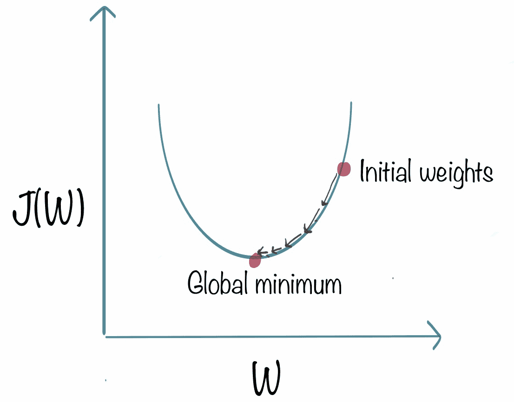

# 梯度下降的直观介绍

> 原文：[`www.kdnuggets.com/2018/06/intuitive-introduction-gradient-descent.html`](https://www.kdnuggets.com/2018/06/intuitive-introduction-gradient-descent.html)

 评论

**作者 [Keshav Dhandhania](https://www.linkedin.com/in/keshav-dhandhania-b3246028/) 和 [Savan Visalpara](https://www.linkedin.com/in/savanvisalpara/)**

**梯度下降** 是最受欢迎和广泛使用的 **优化算法** 之一。给定一个具有参数（权重和偏差）和用于评估特定模型好坏的成本函数的 [机器学习](https://www.commonlounge.com/discussion/9325cf512f514e21815ec4c2e2e6e0e3) 模型，我们的学习问题就变成了找到一组好的权重，以最小化成本函数。

* * *

## 我们的前三大课程推荐

 1\. [Google 网络安全证书](https://www.kdnuggets.com/google-cybersecurity) - 快速开启网络安全职业生涯

 2\. [Google 数据分析专业证书](https://www.kdnuggets.com/google-data-analytics) - 提升你的数据分析技能

 3\. [Google IT 支持专业证书](https://www.kdnuggets.com/google-itsupport) - 支持你的组织的 IT 需求

* * *

梯度下降是一种 **迭代方法**。我们从一组模型参数（权重和偏差）开始，并逐渐改进它们。为了改进给定的权重，我们尝试了解类似于当前权重的权重的成本函数值（通过计算梯度），然后沿着成本函数减少的方向移动。通过重复这个步骤数千次，我们将持续最小化我们的成本函数。

### 梯度下降的伪代码

梯度下降用于最小化由模型参数 ***w*** 参数化的成本函数 *J(w)*。梯度（或导数）告诉我们成本函数的斜率或坡度。因此，为了最小化成本函数，我们沿着与梯度相反的方向移动。

1.  **随机初始化** 权重 *w*

1.  **计算梯度** G，相对于参数的成本函数 [1]

1.  **通过与 G 成比例的量更新权重**，即 *w* = *w - ηG*

1.  重复直到成本 *J*(*w*) 不再降低或满足其他预定义的 **终止标准**

在第 3 步中，η 是 **学习率**，它决定了我们达到最小值的步伐大小。我们需要对这个参数非常小心，因为η 的高值可能会超越最小值，而非常低的值则会非常缓慢地达到最小值。

一个流行的合理选择作为终止标准是成本 *J*(*w*) 在 *验证* 数据集上停止降低。

### 梯度下降的直观理解

想象一下你被蒙上眼睛在崎岖地形中行走，你的目标是到达**最低点**。你可以使用的一个简单策略是感觉地面在各个方向上的倾斜，并朝着地面下降最快的方向迈出一步。如果你不断重复这个过程，你可能会到达湖泊，甚至更好的是，某个巨大山谷中的位置。

崎岖地形类似于成本函数。最小化成本函数类似于试图到达更低的高度。你被蒙上眼睛，因为我们没有条件评估（查看）每一组参数的函数值。感觉你周围地形的坡度类似于计算梯度，而迈出一步类似于对参数进行一次更新迭代。

顺便提一下——作为一个小插曲——本教程是[免费数据科学课程](https://www.commonlounge.com/discussion/367fb21455e04c7c896e9cac25b11b47)和[免费机器学习课程](https://www.commonlounge.com/discussion/33a9cce246d343dd85acce5c3c505009%2Fmain)的一部分，均在[Commonlounge](https://www.commonlounge.com/)平台上提供。这些课程包括许多动手作业和项目。如果你有兴趣学习数据科学/机器学习，强烈推荐查看一下。

### 梯度下降的变体

梯度下降有多种变体，具体取决于计算梯度时使用了多少数据。这些变体的主要原因是计算效率。一个数据集可能有数百万个数据点，计算整个数据集的梯度可能非常耗费计算资源。

+   **批量梯度下降**计算成本函数相对于参数 w 的梯度，基于**整个训练数据**。由于我们需要计算整个数据集的梯度以进行一次参数更新，因此批量梯度下降可能非常慢。

+   **随机梯度下降（SGD）**使用**单个训练数据点**`*x_i*`（随机选择）计算每次更新的梯度。其思想是，这种方式计算的梯度是对使用整个训练数据计算的梯度的*随机逼近*。每次更新的计算速度比批量梯度下降要快得多，经过多次更新，我们将朝着相同的大致方向前进。

+   在**小批量梯度下降**中，我们计算每个小批量训练数据的梯度。也就是说，我们首先将训练数据分成小批量（例如每批次 M 个样本）。我们对每个小批量执行一次更新。M 通常在 30 到 500 的范围内，具体取决于问题。通常使用小批量梯度下降，因为计算基础设施——编译器、CPU、GPU——通常针对向量加法和向量乘法进行了优化。

其中，SGD 和小批量 GD 最为流行。在典型的情况下，我们会在训练数据上进行若干次遍历，直到满足终止标准。每次遍历称为*epoch*。另请注意，由于 SGD 和小批量 GD 的更新步骤计算效率更高，我们通常会在检查终止标准是否满足时执行 100 到 1000 次更新。

### 选择学习率

通常，学习率的值是手动选择的。我们通常从一个较小的值开始，例如 0.1、0.01 或 0.001，并根据成本函数的变化情况来调整它，如果成本函数减少非常缓慢（增加学习率），或是爆炸/不稳定（降低学习率）。

尽管手动选择学习率仍然是最常见的做法，但已经提出了多种方法，如 Adam 优化器、AdaGrad 和 RMSProp，用于自动选择合适的学习率。

### 脚注

1.  梯度 G 的值取决于输入、模型参数的当前值和成本函数。如果你是手动计算梯度，你可能需要重新学习微分的相关知识。

原文首次发布于[免费机器学习课程](https://www.commonlounge.com/discussion/33a9cce246d343dd85acce5c3c505009/main)和[免费数据科学课程](https://www.commonlounge.com/discussion/367fb21455e04c7c896e9cac25b11b47)的[www.commonlounge.com](https://www.commonlounge.com/discussion/69a34ad6029549f39087d00d052607ab/main)。经许可重新发布。

**相关：**

+   [在 H2O 中使用 R 进行深度学习](https://www.kdnuggets.com/2018/01/deep-learning-h2o-using-r.html)

+   [AI 从业者需要掌握的 10 种深度学习方法](https://www.kdnuggets.com/2017/12/10-deep-learning-methods-ai-practitioners-need-apply.html)

+   [理解神经网络中的目标函数](https://www.kdnuggets.com/2017/11/understanding-objective-functions-neural-networks.html)

### 更多相关内容

+   [你应该了解的 5 个梯度下降和成本函数的概念](https://www.kdnuggets.com/2020/05/5-concepts-gradient-descent-cost-function.html)

+   [回到基础，第二部分：梯度下降](https://www.kdnuggets.com/2023/03/back-basics-part-dos-gradient-descent.html)

+   [梯度下降：山地徒步旅行者的优化指南](https://www.kdnuggets.com/gradient-descent-the-mountain-trekker-guide-to-optimization-with-mathematics)

+   [支持向量机：直观的方法](https://www.kdnuggets.com/2022/08/support-vector-machines-intuitive-approach.html)

+   [协同过滤的直观解释](https://www.kdnuggets.com/2022/09/intuitive-explanation-collaborative-filtering.html)

+   [消失梯度问题：原因、后果和解决方案](https://www.kdnuggets.com/2022/02/vanishing-gradient-problem.html)
