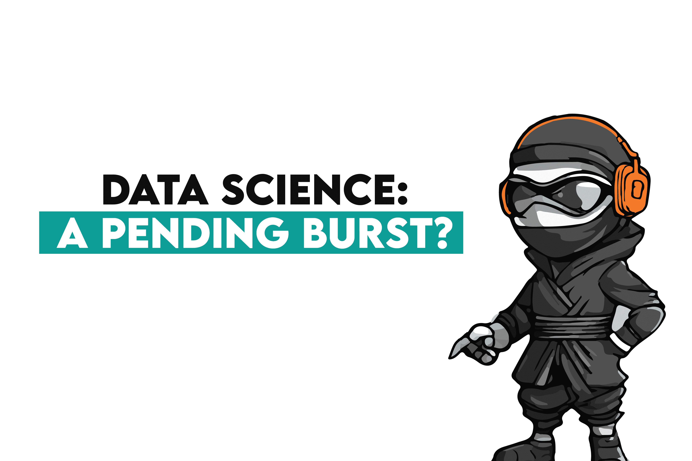
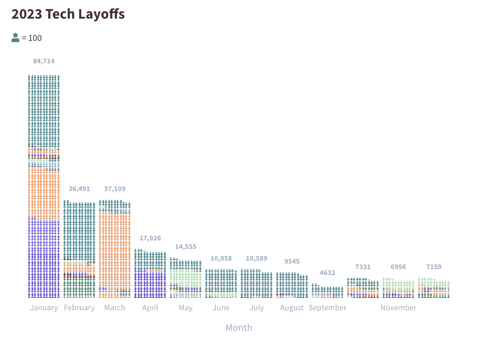
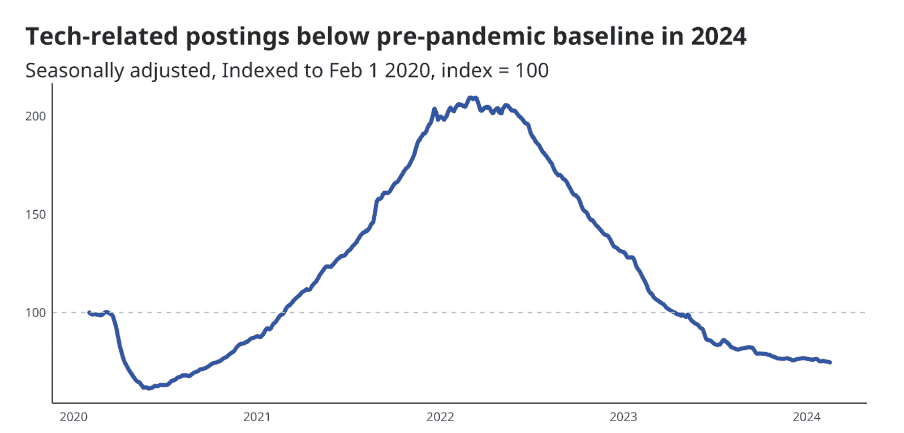

# 数据科学是一个即将破裂的泡沫吗？

> 原文：[`www.kdnuggets.com/is-data-science-a-bubble-waiting-to-burst`](https://www.kdnuggets.com/is-data-science-a-bubble-waiting-to-burst)

图片由作者提供

* * *

## 我们的三大课程推荐

 1\. [Google 网络安全证书](https://www.kdnuggets.com/google-cybersecurity) - 快速进入网络安全领域的职业。

 2\. [Google 数据分析专业证书](https://www.kdnuggets.com/google-data-analytics) - 提升您的数据分析技能

 3\. [Google IT 支持专业证书](https://www.kdnuggets.com/google-itsupport) - 支持您的组织的 IT 工作

* * *

我曾与一个人交谈，他吹嘘说，仅凭一些免费的 LinkedIn 课程和一门过时的大学 SQL 入门课程，他就成功获得了一份六位数的数据显示工作。现在，大多数在争取良好数据科学职位的人会同意这种情况不太可能发生。这是否意味着数据科学职位类别是一个已经破裂的泡沫——或者更糟的是，还未破裂，但即将破裂？

简而言之，不是。发生的情况是，数据科学曾经是一个*饱和度较低*的领域，如果在简历上使用正确的关键词，很容易进入。现在，雇主们变得更加挑剔，通常会有具体的技能要求。

现在仅靠培训营、免费课程和“Hello World”项目已经不够了。你需要证明具体的专业知识，并在数据科学面试中表现出色，而不仅仅是丢出流行词。更重要的是，“数据科学家”的光环已经稍微褪色了。曾几何时，它是最吸引人的职业。现在呢？其他领域，比如 AI 和机器学习，更加吸引人。

话虽如此，数据科学领域的职位空缺仍然多于申请者，而且可靠的指标表明该领域在增长，而非缩减。

还不信服？让我们来看看数据。

## **大局观**

在本文中，我将详细分析多个图表、图形和百分比。但让我们先从一个非常权威的来源给出的百分比开始：劳工统计局。

劳工统计局[预测](https://www.bls.gov/ooh/math/data-scientists.htm)从 2022 年到 2032 年，数据科学家的就业将发生 35% 的变化。简而言之，到 2032 年，数据科学领域的职位将比 2022 年多出大约三分之一。相比之下，所有职位的平均增长率为 3%。在阅读本文的其余部分时，请记住这个数字。

劳工统计局不认为数据科学是一个即将破裂的泡沫。

## **裁员情况**

现在我们可以开始深入探讨一些细节。人们指出的泡沫破裂或即将破裂的最初迹象是数据科学领域的大规模裁员。

确实，数据看起来不太乐观。从 2022 年开始，直到 2024 年，技术领域总体上[经历了](https://techcrunch.com/2024/03/27/tech-layoffs-2023-list/) 430,000 次裁员。很难从这些数据中分离出数据科学特定的数据，但最佳估计是约 30%的裁员发生在数据科学和工程领域。

来源：[`techcrunch.com/2024/04/05/tech-layoffs-2023-list/`](https://techcrunch.com/2024/04/05/tech-layoffs-2023-list/)

然而，这并不是数据科学的泡沫破裂。它的范围稍微小一些——这是一个*疫情*泡沫破裂。在 2020 年，随着更多人待在家中，利润上升，资金便宜，FAANG 及其相关公司吸纳了创纪录数量的技术工人，但仅仅几年后就裁掉了其中许多人。

如果你缩小视角，看看招聘和裁员的整体情况，你会发现后疫情时期的低迷是整体上升趋势中的一个下滑，现在甚至开始恢复：

来源：[`www.statista.com/`](https://www.statista.com/statistics/199999/worldwide-tech-layoffs-covid-19/#:~:text=The%20technology%20sector%20experienced%20a%20record%20high,rounds%20of%20layoffs%20within%20the%20same%20period)

你可以清楚地看到，2020 年市场紧缩时技术裁员大幅减少，然后从 2022 年第一季度开始裁员急剧上升。现在，到 2024 年，裁员数量比 2023 年要少。

## **职位空缺**

另一个常被提及的令人担忧的数据是 FAANG 公司将职位空缺减少了 90%或更多。再次，这主要是对疫情期间职位空缺数量激增的反应。

尽管如此，技术领域的职位空缺仍低于疫情前水平。下面，你可以看到一张调整后的图表，显示了相对于 2020 年 2 月的技术职位需求。可以明显看出，技术领域遭受了一个打击，短期内难以恢复。

来源：[`www.hiringlab.org/2024/02/20/labor-market-update-tech-jobs-below-pre-pandemic-levels/`](https://www.hiringlab.org/2024/02/20/labor-market-update-tech-jobs-below-pre-pandemic-levels/)

然而，让我们更详细地查看一些实际数据。查看下面的图表，尽管职位空缺明显低于 2022 年的高峰，但整体职位空缺数量实际上在增加——比最低点增长了 32.4%。

来源：[`www.trueup.io/job-trend`](https://www.trueup.io/job-trend)

## **叙事**

如果你查看任何在线的劳动力和新闻报告，你会看到目前正发生一些反对远程工作和反对技术的逆流。Meta、谷歌以及其他 FAANG 公司，由于害怕员工在疫情高峰期间享有的谈判权力，现在推动办公室复工命令（数据科学职位和其他技术职位通常是远程的），并根据他们的收入和利润报告，裁员数量有些不必要。

举个例子，谷歌母公司 Alphabet [裁员](https://www.theverge.com/2024/1/30/24056132/google-spent-two-billion-on-layoffs-severance-fourth-quarter-earnings-2023)了超过 12,000 名员工，尽管其广告、云计算和服务部门都有增长。

这只是审视数据的一个方面，但公司进行裁员的部分原因更多是为了让董事会满意，而不是因为对数据科学家的需求减少。

## **需求**

我发现，那些认为我们处于数据科学泡沫中的人，往往是不真正了解数据科学家工作的人。想想那个 BLS 统计数据，问问自己：为什么这个信息充分的政府机构相信这个行业有强劲的增长？

因为*数据科学家*的需求无法消失。虽然职位名称可能会改变——例如 AI 专家或 ML 云专家而非数据科学家——但数据科学家执行的技能和任务无法外包、删除、减少或自动化。

例如，预测模型对企业预测销售、预测客户行为、管理库存和预见市场趋势至关重要。这使得公司能够做出明智的决策，战略性地规划未来，并保持竞争优势。

在金融领域，数据科学在识别可疑活动、预防欺诈和降低风险方面发挥着至关重要的作用。高级算法分析交易模式，以检测可能表明欺诈的异常现象，从而帮助保护企业和消费者。

NLP 使机器能够理解和解释人类语言，推动了像聊天机器人、情感分析和语言翻译服务这样的应用。这对于改善客户服务、分析社交媒体情感和促进全球沟通至关重要。

我可以列出更多的例子来证明数据科学不是一种时尚，数据科学家的需求将永远存在。

## **为什么感觉我们处于泡沫中？**

回到我之前的例子，感觉我们正处于一个泡沫中，泡沫要么正在破裂，要么即将破裂的部分原因是对数据科学作为职业的看法。

早在 2011 年，《哈佛商业评论》曾著名地称之为十年来最性感的职业。在此后的几年里，公司雇用了比他们知道如何处理的更多的“数据科学家”，经常对数据科学家实际的工作内容感到不确定。

现在，时隔十五年，这个领域变得更加成熟。雇主们明白数据科学是一个广泛的领域，更加关注聘用机器学习专家、数据管道工程师、云计算工程师、统计学家以及其他广泛归于数据科学范畴但更为专业的职位。

这也有助于解释为什么从本科毕业后直接进入六位数薪资的想法曾经是可能的——因为雇主不了解情况——但现在已不再可能。缺乏“简单”的数据科学职位让人觉得市场变得紧张。其实并非如此；数据显示职位空缺仍然很高，需求仍然大于拥有相关学位的毕业生。但雇主变得更加挑剔，不愿意冒险雇用没有实际经验的大学毕业生。

## **数据科学的需求并没有减少或被取代**

最后，你可以看看数据科学家所做的任务，并问问自己，如果这些任务没有完成，公司会怎么办。

如果你对数据科学了解不多，你可能会猜测公司可以简单地“自动化”这些工作，甚至可以不去做。但如果你了解数据科学家实际的工作内容，你会明白，这份工作现在是不可替代的。

想象一下 2010 年代的情况：我谈到的那个人，凭借对数据工具的基本了解，迅速进入了一个高薪的职业。现在情况不再如此，但这种重新校准并不是一些人认为的泡沫破裂的迹象。相反，这是数据科学领域的成熟。虽然初级数据科学领域可能已经饱和，但对于那些具备专业技能、深厚知识和实际经验的人来说，这个领域依然广阔。

此外，关于“泡沫”的叙述源于对泡沫实际含义的误解。泡沫发生在某物的价值（在这种情况下，是职业领域）由投机驱动而非实际内在价值。然而，正如我们所讨论的，数据科学的价值主张是实在且可衡量的。公司需要数据科学家，简单明了。这里没有投机成分。

关于大型科技公司裁员的媒体炒作也不少。虽然这些裁员很重要，但它们反映的是更广泛的市场力量，而不是数据科学学科的根本缺陷。不要被头条新闻所迷惑。

最后，还值得注意的是，对泡沫的感知可能源于数据科学自身的变化。随着该领域的成熟，角色之间的区别变得更加明显。像数据工程、数据分析、商业智能、机器学习工程和数据科学这样的[职位名称](https://www.stratascratch.com/blog/14-different-data-science-job-titles/?utm_source=blog&utm_medium=click&utm_campaign=kdn+ds+a+bubble+waiting+to+burst)变得更加具体，需要更为专业的技能。这种演变可能使数据科学职位市场看起来比实际更为波动，但实际上，公司对其数据科学需求有了更好的理解，并能招聘到相应的专业人才。

## **最后的想法**

如果你想从事数据科学工作，就去做吧。我们实际上处于泡沫中的机会非常小。你可以做的最好的事情是，如我所示，选择你的专业领域并在该领域发展你的技能。数据科学是一个广泛的领域，涉及不同的行业、语言、职位名称、职责和资历。选择一个专业领域，训练技能，为面试做准备，并确保获得工作。

****[内特·罗西迪](https://twitter.com/StrataScratch)****是一名数据科学家和产品策略专家。他还是一位兼职教授，教授分析学，并且是 StrataScratch 的创始人，这个平台帮助数据科学家通过顶级公司的真实面试问题准备面试。内特撰写关于职业市场最新趋势的文章，提供面试建议，分享数据科学项目，并涵盖所有与 SQL 相关的内容。

### 更多相关话题

+   [生成性 AI 泡沫即将破裂](https://www.kdnuggets.com/the-generative-ai-bubble-will-burst-soon)

+   [从 Dot com 到 Dot AI：新的科技泡沫？](https://www.kdnuggets.com/dot-com-to-dot-ai-new-tech-bubble)

+   [停止学习数据科学以寻找目标，并寻找目标来…](https://www.kdnuggets.com/2021/12/stop-learning-data-science-find-purpose.html)

+   [数据科学最基础：你需要知道的 10 项基本技能…](https://www.kdnuggets.com/2020/10/data-science-minimum-10-essential-skills.html)

+   [KDnuggets™ 新闻 22:n06, 2 月 9 日：数据科学编程…](https://www.kdnuggets.com/2022/n06.html)

+   [数据科学定义幽默：一系列古怪的名言…](https://www.kdnuggets.com/2022/02/data-science-definition-humor.html)
