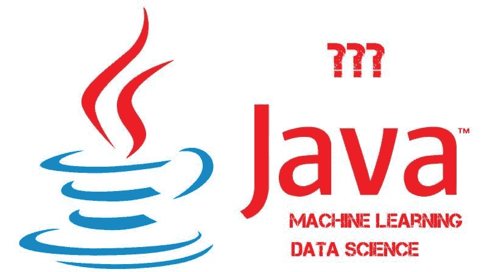

# Java 可以用于机器学习和数据科学吗？

> 原文：[`www.kdnuggets.com/2020/04/java-used-machine-learning-data-science.html`](https://www.kdnuggets.com/2020/04/java-used-machine-learning-data-science.html)

评论

**由 Malcom Ridgers, [BairesDev](https://www.bairesdev.com/)**

* * *

## 我们的前三课程推荐

 1\. [谷歌网络安全证书](https://www.kdnuggets.com/google-cybersecurity) - 快速进入网络安全职业。

 2\. [谷歌数据分析专业证书](https://www.kdnuggets.com/google-data-analytics) - 提升你的数据分析技能

 3\. [谷歌 IT 支持专业证书](https://www.kdnuggets.com/google-itsupport) - 支持你组织的 IT 工作

* * *

近年来，机器学习、数据科学和人工智能一直是最受关注的技术，这也是理所应当的。这些技术的进步将自动化和业务流程提升到了一个新的水平。各种规模的组织正在投入数百万美元用于研究和人员，以构建这些极其强大的数据驱动应用程序。

有许多不同的编程语言适用于开发机器学习和数据科学应用。虽然 Python 和 [R](https://www.r-project.org/about.html) 已成为构建这些程序的热门选择，但许多组织正在转向 [Java 应用开发](https://www.bairesdev.com/insights/java-development-services/?utm_source=kdnuggets&utm_medium=link&utm_campaign=content&utm_content=middle) 来满足他们的需求。从企业级业务解决方案和导航系统到手机和应用程序，Java 几乎适用于所有技术领域。

在 90 年代初，一位名叫[詹姆斯·戈斯林及其团队](https://www.oracle.com/technetwork/java/javase/overview/javahistory-index-198355.html)的加拿大计算机科学家在太阳微系统公司（现为甲骨文公司所有）创建了 Java。二十多年后，Java 仍然是当今排名靠前且[最有利可图](https://blog.edx.org/the-4-most-lucrative-programming-skills-you-can-learn-online/)的编程语言之一。

### 为什么选择 Java 用于数据科学和机器学习？

Java 是许多日常使用的设备和应用程序背后的无形力量，驱动着我们的日常生活。Java 不仅可以用于机器学习和数据科学应用开发，而且由于许多原因，它也是许多开发者的首选，包括：

+   Java 是一种用于企业开发的最古老的语言之一。通常，在开发和技术领域，古老意味着过时。然而，情况并非如此。Java 的历史意味着许多公司可能已经在使用大量的编程语言而自己并未意识到。基础设施、软件、应用程序以及公司技术的许多其他工作部分可能已经建立在 Java 之上，这有助于简化集成并减少兼容性问题。

+   数据科学与大数据息息相关。大多数用于大数据的流行框架和工具通常是用 Java 编写的。这包括 Fink、Hadoop、Hive 和 Spark。

+   Java 在数据科学领域和数据分析中的多个过程中都是可用的，包括数据清洗、数据导入和导出、统计分析、深度学习、自然语言处理（NLP）和数据可视化。

+   开发人员认为 Java 虚拟机是机器学习和数据科学的最佳平台之一，因为它使得开发人员能够编写在多个平台上完全相同的代码。它还允许他们更快地创建自定义工具，并拥有许多帮助提高整体生产力水平的 IDE。

+   Java 8 的发布引入了 Lambdas。 [Lambda 表达式](https://docs.oracle.com/javase/tutorial/java/javaOO/lambdaexpressions.html) 赋予开发人员管理 Java 语言巨大功能的能力。这显著简化了大型数据科学或企业项目的开发。

+   作为一种强类型编程语言，Java 确保程序员对处理的变量和数据类型明确具体。有时与静态类型混淆，强类型使得管理大型数据应用程序变得更容易，同时简化了代码库维护。它还帮助开发人员避免编写单元测试的需求。

+   可扩展性是开发人员在开始项目之前必须考虑的编程语言的重要方面。Java 使应用程序的扩展过程对数据科学家和程序员都变得更加简单。这使得它成为构建更大或更复杂的人工智能和机器学习应用程序的绝佳选择，尤其是在从零开始构建时。

+   许多今天广泛使用的数据科学和机器学习编程语言并不是最快的选择。Java 非常适合这些速度关键的项目，因为它执行速度快。许多今天最流行的网站和社交应用程序依赖于 Java 来满足他们的数据工程需求，包括 LinkedIn、Facebook 和 Twitter。

+   生产代码库通常用 Java 编写。了解 Java 帮助开发人员搞清楚数据是如何生成的，提交合并请求到生产代码库，并将机器学习解决方案部署到生产环境中。

+   Java 拥有许多适用于数据科学和机器学习的库和工具。例如，Weka 3 是一个完全基于 Java 的工作台，广泛用于机器学习、数据挖掘、数据分析和预测建模中的算法。大规模在线分析是一个开源软件，专门用于实时数据流的数据挖掘。

Java 是一种极其有用、快速且可靠的编程语言，帮助开发团队构建各种项目。从数据挖掘和数据分析到机器学习应用的构建，Java 在数据科学领域有着广泛的应用。它是这些任务中最受欢迎的语言之一，原因有很多。如果你正准备进行机器学习项目，考虑使用它。你会惊讶于你能从中获得多少。

**简介：马尔科姆·里杰斯**是一位专注于软件外包行业的技术专家。他能够获取最新的市场动态，并对创新和科技企业的未来趋势有敏锐的洞察力。

**相关：**

+   Kubeflow 如何为你的 Kubernetes 部署添加 AI

+   人工智能、机器学习、深度学习和 Java 的两年生活

+   为什么 Python 是数据科学中最受欢迎的语言之一？

### 更多相关话题

+   [成为优秀数据科学家所需的 5 项关键技能](https://www.kdnuggets.com/2021/12/5-key-skills-needed-become-great-data-scientist.html)

+   [每位初学者数据科学家应掌握的 6 个预测模型](https://www.kdnuggets.com/2021/12/6-predictive-models-every-beginner-data-scientist-master.html)

+   [2021 年最佳 ETL 工具](https://www.kdnuggets.com/2021/12/mozart-best-etl-tools-2021.html)

+   [停止学习数据科学，寻找目的，然后……](https://www.kdnuggets.com/2021/12/stop-learning-data-science-find-purpose.html)

+   [学习数据科学统计的最佳资源](https://www.kdnuggets.com/2021/12/springboard-top-resources-learn-data-science-statistics.html)

+   [建立一个稳固的数据团队](https://www.kdnuggets.com/2021/12/build-solid-data-team.html)
