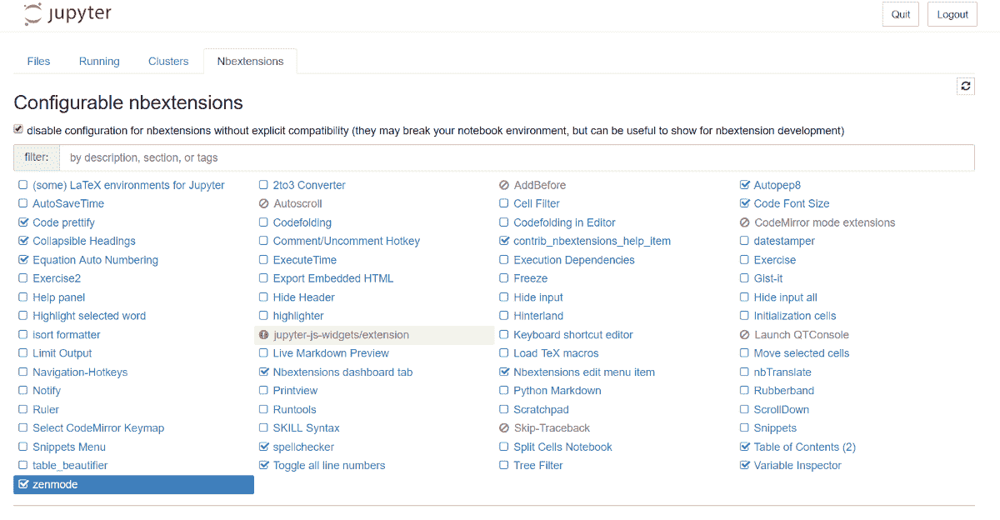
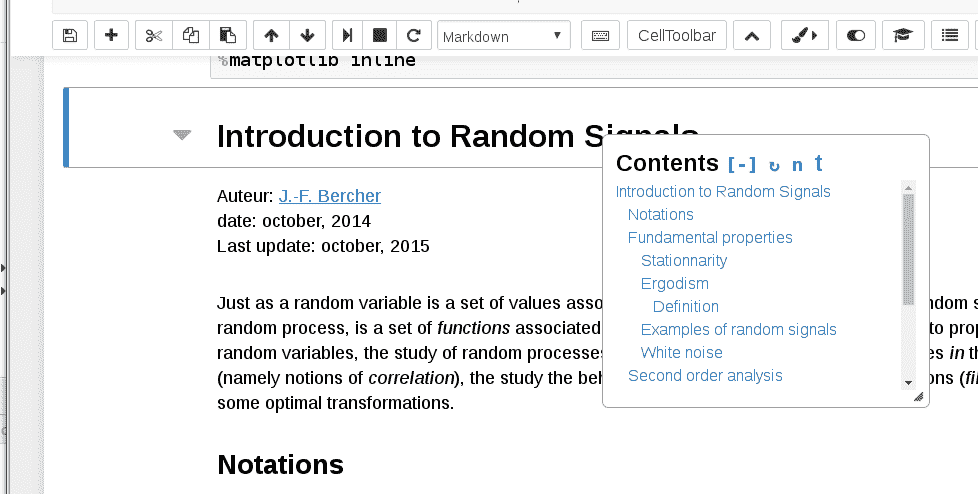
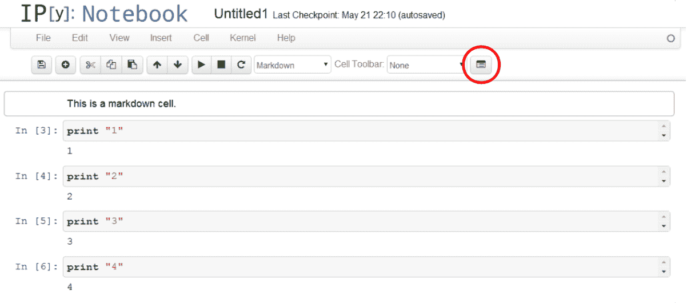

# Jupyter Notebooks: 数据科学报告

> 原文：[`www.kdnuggets.com/2019/06/jupyter-notebooks-data-science-reporting.html`](https://www.kdnuggets.com/2019/06/jupyter-notebooks-data-science-reporting.html)

 评论

由于其简单的设计、交互性好和跨语言支持，Jupyter 已成为我们中的许多人默认的平台。虽然还有其他方式可以使用笔记本环境，但目前为止我还没有看到比 Jupyter 提供更多好处的工具。

我提到 Jupyter 是因为之前只有 Jupyter Notebooks，但现在还有 Jupyter Lab 以及其他基于 Jupyter 的笔记本环境。

* * *

## 我们的前三课程推荐

 1\. [Google 网络安全证书](https://www.kdnuggets.com/google-cybersecurity) - 快速进入网络安全职业道路

 2\. [Google 数据分析专业证书](https://www.kdnuggets.com/google-data-analytics) - 提升你的数据分析能力

 3\. [Google IT 支持专业证书](https://www.kdnuggets.com/google-itsupport) - 支持你的组织在 IT 领域

* * *

这里有一些简单的方法来组织你的项目（这基于我的个人经验）。

### 1\. 安装 nb-extensions

**这是在 Jupyter 中高效报告的基础**

我推荐通过 Anaconda 安装，因为它还会自动安装所需的 Javascript 和 CSS 文件。

```py

conda install -c conda-forge jupyter_contrib_nbextensions
conda install -c conda-forge jupyter_nbextensions_configurator

```

*如果你在通过 Anaconda 安装时遇到问题，可以改用 pip*

```py

pip install jupyter_nbextensions_configurator jupyter_contrib_nbextensions
jupyter contrib nbextension install --user
jupyter nbextensions_configurator enable --user

```

一旦你完成了 nbextensions 的安装，你可以启动你的 Jupyter notebook 环境并导航到选项卡。



一旦你有了这个，只需启用你想要的扩展，并进行实验，以查看哪些扩展可以帮助你提高工作效率。

*如果你在使用 Jupyter notebooks 时没有看到这个选项卡，只需打开一个新的内核并前往 Edit -> nbextensions config*

### 2\. 目录

你可以启用一个交互式目录，这个目录会出现在你的笔记本顶部。默认情况下，交互式版本会出现在屏幕的左侧，但如果你愿意，可以将其移动到笔记本的其他部分。



### 3\. 使用 Markdown

对于已经使用它的人来说，这一点或多或少是显而易见的。一些基本命令包括：

+   **Esc + m** 将代码块转换为 Markdown 单元格

+   **Ctrl + Enter** 执行 Markdown 块并将其转换为纯文本。

+   **Esc + m** 再次按下如果你想编辑 Markdown 块

这里是一般 Markdown 命令的列表：[`www.markdownguide.org/basic-syntax/`](https://www.markdownguide.org/basic-syntax/)

**使用标题**

这与 markdown 和目录密切相关。如上图所示，在 Jupyter 中添加 markdown 标题会自动将其分节并添加到目录列表中，使用户更容易滚动和查找所需内容。

**使用 Latex**

这当然取决于用户，因为并不是每个人都需要在笔记本中渲染数学公式。

更多关于在 [Jupyter 中使用 markdown](https://jupyter-notebook.readthedocs.io/en/stable/examples/Notebook/Working%20With%20Markdown%20Cells.html)的信息，请查看这里

### 4\. 使用 Scratchpad

使用此扩展可以减少笔记本中不必要的代码。如果你需要验证以前的输出，可以直接在 Scratchpad 中输入，它不会出现在笔记本中。


了解更多信息请访问：[Jupyter Notebooks 的 Scratchpad](https://github.com/minrk/nbextension-scratchpad)

### 5\. 隐藏代码

**隐藏选定的单元格**

如果你只想隐藏某些代码/输入单元格而保留一些可见，请使用以下扩展：


**隐藏所有代码 / 输入单元格**

如果你希望隐藏所有代码，只显示输出，可以使用以下扩展：



### 6\. 渲染/转换笔记本为 PDF/HTML 等

Jupyter Notebook 使我们能够将笔记本渲染成多种格式。以下是可用选项的列表。

我发现这比去“文件”->“另存为”更可靠。

```py

 The simplest way to use nbconvert is

    > jupyter nbconvert mynotebook.ipynb

    which will convert mynotebook.ipynb to the default format (probably HTML).

    You can specify the export format with `--to`.
    Options include ['asciidoc', 'custom', 'hide_code_html', 'hide_code_latex', 'hide_code_pdf', 'hide_code_slides', 'html', 'html_ch', 'html_embed', 'html_toc', 'html_with_lenvs', 'html_with_toclenvs', 'latex', 'latex_with_lenvs', 'markdown', 'notebook', 'pdf', 'python', 'rst', 'script', 'selectLanguage', 'slides', 'slides_with_lenvs']

    > jupyter nbconvert --to latex mynotebook.ipynb

    Both HTML and LaTeX support multiple output templates. LaTeX includes
    'base', 'article' and 'report'.  HTML includes 'basic' and 'full'. You
    can specify the flavor of the format used.

    > jupyter nbconvert --to html --template basic mynotebook.ipynb

    You can also pipe the output to stdout, rather than a file

    > jupyter nbconvert mynotebook.ipynb --stdout

    PDF is generated via latex

    > jupyter nbconvert mynotebook.ipynb --to pdf

    You can get (and serve) a Reveal.js-powered slideshow

    > jupyter nbconvert myslides.ipynb --to slides --post serve

    Multiple notebooks can be given at the command line in a couple of
    different ways:

    > jupyter nbconvert notebook*.ipynb
    > jupyter nbconvert notebook1.ipynb notebook2.ipynb

    or you can specify the notebooks list in a config file, containing::

        c.NbConvertApp.notebooks = ["my_notebook.ipynb"]

    > jupyter nbconvert --config mycfg.py

```

*你可能需要安装外部依赖项，如 latex 或 pandoc 等。有关渲染的更多信息，请查阅文档。*

**最后，你可能没听说过但应该立即下载的扩展（特别是如果你是初学者的话）**

### 7\. 设置

**查看 Will Koehrsen 提供的这个实用扩展**

[使用此扩展正确设置你的 Jupyter Notebook](https://towardsdatascience.com/set-your-jupyter-notebook-up-right-with-this-extension-24921838a332)

Will 创建了这个出色的扩展，为任何想要组织笔记本以获得更轻松工作流程的人提供了极好的设置。


还有一些实用的技巧：

+   **Esc+a** 在上方添加单元格

+   **Esc+b** 在下方添加单元格

+   **Esc+m** 激活 markdown 单元格，**Ctrl+Enter** 执行。

+   **Esc+d** 删除单元格

**相关**：

+   数据科学笔记本最佳实践

+   Jupyter Notebook 初学者教程

+   在 Jupyter 中运行 R 和 Python

### 更多相关主题

+   [停止学习数据科学以寻找目标，并以寻找目标来…](https://www.kdnuggets.com/2021/12/stop-learning-data-science-find-purpose.html)

+   [学习数据科学统计的顶级资源](https://www.kdnuggets.com/2021/12/springboard-top-resources-learn-data-science-statistics.html)

+   [成功数据科学家的 5 个特征](https://www.kdnuggets.com/2021/12/5-characteristics-successful-data-scientist.html)

+   [每个数据科学家都应该了解的三个 R 语言库（即使你使用 Python）](https://www.kdnuggets.com/2021/12/three-r-libraries-every-data-scientist-know-even-python.html)

+   [一个 90 亿美元的 AI 失败案例分析](https://www.kdnuggets.com/2021/12/9b-ai-failure-examined.html)

+   [为什么 Python 是初创公司理想的编程语言](https://www.kdnuggets.com/2021/12/makes-python-ideal-programming-language-startups.html)
