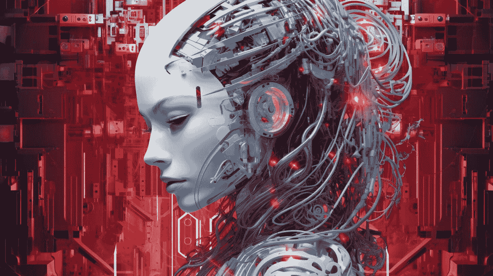

# 人工智能发生在哪里？

> 原文：[`www.kdnuggets.com/2023/07/kdd-where-does-ai-happen.html`](https://www.kdnuggets.com/2023/07/kdd-where-does-ai-happen.html)

合作伙伴文章

**由康纳·李（Connor Lee）撰写，纽约大学计算机科学新生**

图像由编辑使用 Midjourney 创建

自 2022 年 11 月以来，人工智能进展的飞跃在主流媒体中引起了震撼，许多人猜测他们的工作将被人工智能取代。然而，有一种职业是无法被替代的：推动深度神经网络和其他机器学习模型的研究人员——即人工智能背后的人类。尽管研究传统上是在大学墙内进行的，但人工智能绝非传统的研究领域。相当一部分人工智能研究是在工业实验室中进行的。那么，有志的研究人员应当向哪个领域聚集呢？学术界还是工业界？

“学术界更倾向于基础研究，而工业界则倾向于由大数据驱动的面向用户的研究，”诺特丹大学计算机科学与工程系教授**尼特什·乔拉**（Nitesh Chawla）说道。乔拉教授指出，知识追求是工业界和学术界人工智能研究之间的分界线。在工业界，研究与产品挂钩，推动社会进步——而在学术界，纯粹的发现追求推动着研究突破。据乔拉教授说，表面上无尽的学术自由并非没有缺陷，“学术界没有可用的数据或计算资源。”

对于有志的年轻研究人员来说，选择似乎很简单：私营部门拥有他们所需的一切。庞大、自治的商业组织致力于创新，同时得到随时可用的数据、计算能力和资金的支持。这导致了一个看法，即行业在“挖走”学术界的人才。学术界自然对此有所抱怨。2021 年，由奥尔堡大学团队发布的一项研究指出，“私营部门在人工智能研究中的参与增加伴随着越来越多的研究人员从学术界转向工业界，尤其是技术公司如谷歌、微软和 Facebook。”

正如预期的那样，工业研究人员存在分歧。“当我为我的团队招聘时，我希望招募顶尖人才，因此我不会挖掘学术人才，而是帮助他们获得行业奖项、行业资助，并让他们的学生担任实习生，”Meta 的首席科学家董博士解释道，她是 Meta 智能眼镜项目的首席科学家。她认为工业和学术界之间有着显著的差异，这可能归因于研究方法的根本差异。根据董博士的说法，行业内的 AI 研究是通过了解最终产品应该是什么样子，并向其反向工程。而学术界则在拥有一个有前景的想法后，持续构建各种路径，却不知道这些路径会通向哪里。

然而，尽管存在这些差异，董博士认为行业帮助学术界，反之亦然，“许多行业突破是通过将学术界的研究应用于实际用例而获得灵感的。”同样，华盛顿大学塔科马分校的计算机科学教授安库尔·特雷德赛（Ankur Teredesai）将行业和学术界之间的关系描述为相互支持，“我想到的词是共生的。”在他看来，研究实践已经发展为学术界将其议程转向帮助行业产品——这种转变的一个好例子就是一些知名教授在主要公司担任的联合职位。

无论其隶属关系如何，数据科学界每年会在几次会议上汇聚在一起。查乌拉教授将这些会议描述为“美妙的熔炉”。有些会议传统上更偏学术，有些纯粹是工业性质，但也有些则是二者的完美结合。查乌拉教授提到 KDD，即知识发现与数据挖掘特别兴趣小组，这个会议因这种联系而闻名。KDD 维持两个平行的同行评审轨道：研究轨道和应用数据科学（ADS）轨道。正如 2022 年 KDD-2022 年 ADS 程序联合主席董博士所说，“KDD 通过为研究人员和从业者提供一个论坛，使他们能够聚在一起听讲座和讨论技术，同时相互启发。KDD 是一个打破沟通和协作障碍的地方，在这里我们展示了数据科学和机器学习如何随着行业需求而进步。”

这就是推动 KDD 从早期发展到现在的思维方式。东北大学体验 AI 研究所执行主任、前 Yahoo 首席数据官 Usama Fayyad 教授称赞道：“我们从一开始就希望创建一个应用得到充分代表的会议。”Fayyad 教授和 Gregory Piatetsky-Shapiro 博士于 1995 年共同创办了 KDD 会议。Fayyad 教授认为，如果 AI 会议仅专注于学术领域，那么将会错失证明现实问题研究成果和基于新兴数据集推动新研究的集体愿望。

然而，将 KDD 开放给工业界也面临着挑战。尽管研究轨道被学术界主导是合理的，但 ADS 轨道本应主要致力于来自工业研究实验室的应用研究。实际上，超过一半的 ADS 出版物都起源于学术界，或是强有力的学术-工业合作的结果。十年前，Fayyad 教授意识到，许多有趣的 AI 应用是由那些忙于其他事务的团队开发的，这些团队根本没有时间撰写论文。他将 KDD 引领到了现在的阶段，在这里，KDD 组织者探索并策划了由顶尖工业实践者所做的杰出邀请演讲。ADS 邀请演讲很快成为了会议的亮点。

每年与 KDD 会议同时举行的 KDD Cup 竞赛是连接学术界和工业界的另一种方式。“KDD Cup 是吸引行业和学术参与者的方式，公司带来一些他们乐于分享的挑战，而学术界则可以处理他们通常无法获得的数据。” Teredesai 教授说，他也是健康科技公司 CueZen 的首席执行官。每年，都会介绍一个新的任务并发布一个新的数据集。数百支团队全力以赴寻求最有效的解决方案，争夺奖品和声誉。Fayyad 教授同意，“这对领域而言是一件非常健康的事情，因为我们看到来自学术界的参与，学生们的投入，甚至是公司之间的合作。”

回到行业与学术之间的选择，这种区分很快将变得无关紧要。随着实践者教授的学术课程、领导工业实验室的教授、全球云计算资源的主导地位以及更多数据的可用，学术与工业的界限在 AI 领域正迅速模糊。无需拘泥于任何一个领域，只需选择你最感兴趣的项目！

**康纳·李**是 2023 年从湾区的 Saratoga 高中毕业的学生。他将在秋季加入 NYU 的计算机科学项目。无论如何，康纳将成为 KDD 历史上最年轻的与会者之一！

### 更多相关内容

+   [数据科学家做什么？](https://www.kdnuggets.com/2021/12/what-does-a-data-scientist-do.html)

+   [机器学习没有为我的业务带来价值。为什么？](https://www.kdnuggets.com/2021/12/machine-learning-produce-value-business.html)

+   [随机森林算法需要归一化吗？](https://www.kdnuggets.com/2022/07/random-forest-algorithm-need-normalization.html)

+   [数据来源于哪里？](https://www.kdnuggets.com/2022/08/data-come.html)

+   [ETL 与机器学习有何关系？](https://www.kdnuggets.com/2022/08/etl-machine-learning.html)

+   [KDnuggets 新闻，11 月 30 日：什么是切比雪夫定理及其应用…](https://www.kdnuggets.com/2022/n46.html)
