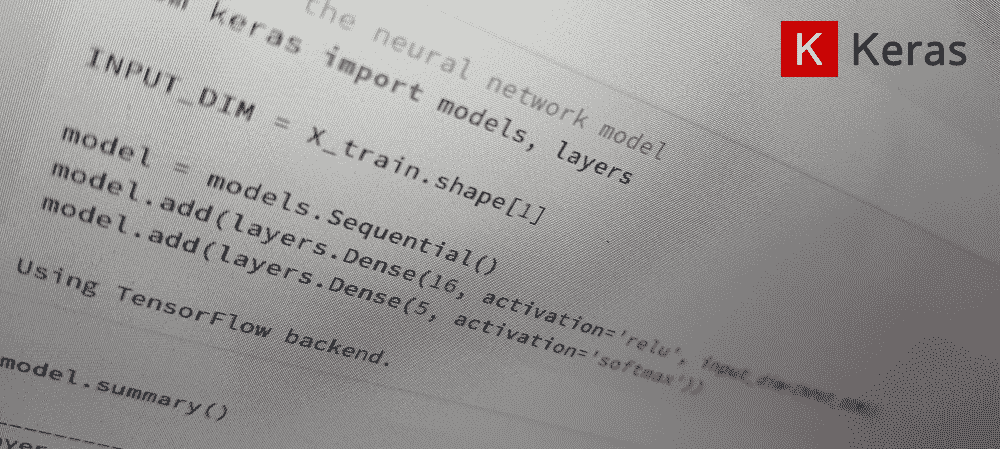
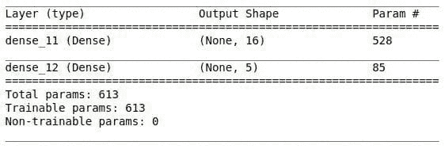
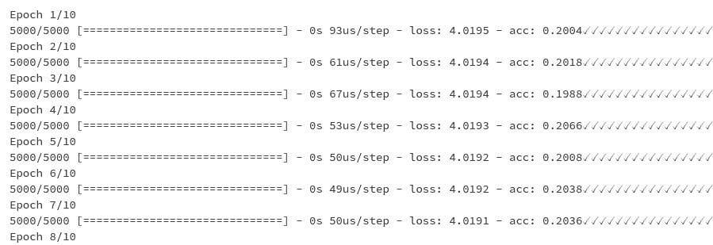

# Keras 4 步骤工作流程

> 原文：[`www.kdnuggets.com/2018/06/keras-4-step-workflow.html`](https://www.kdnuggets.com/2018/06/keras-4-step-workflow.html)

 评论

Francois Chollet 在他的书《[使用 Python 的深度学习](https://www.amazon.com/Deep-Learning-Python-Francois-Chollet/dp/1617294438)》中，早早地概述了使用 Keras 开发神经网络的总体概况。从书中早期的一个简单的 MNIST 示例出发，Chollet 简化了与 Keras 直接相关的网络构建过程，将其总结为 4 个主要步骤。



这不是一个机器学习工作流程，也不是一个完整的深度学习问题解决框架。这四个步骤仅涉及你整体神经网络机器学习工作流程中 Keras 相关的部分。这些步骤如下：

1.  定义训练数据

1.  定义一个神经网络模型

1.  配置学习过程

1.  训练模型


虽然 Chollet 接下来花费了他书中的其余部分来充分填充使用这些数据所需的详细信息，但让我们通过一个示例初步了解工作流程。

**1\. 定义训练数据**

第一步很简单：你必须定义你的输入和目标张量。更困难的数据相关方面——这超出了 Keras 特定的工作流程——实际上是寻找或策划数据，然后进行清理和其他预处理，这对于**任何**机器学习任务来说都是一个问题。这是模型中的一个步骤，通常不涉及调整模型超参数。

尽管我们构造的示例随机生成了一些数据供使用，但它捕捉了此步骤的一个独特方面：定义你的输入（X_train）和目标（y_train）张量。

```py
# Define the training data
import numpy as np

X_train = np.random.random((5000, 32))
y_train = np.random.random((5000, 5))

```

**2\. 定义一个神经网络模型**

Keras 有两种定义神经网络的方法：Sequential 模型类和 Functional API。两者的目标都是定义一个神经网络，但采用了不同的方法。

[Sequential 类](https://keras.io/getting-started/sequential-model-guide/)用于定义一系列网络层，这些层共同构成一个模型。在下面的示例中，我们将使用 Sequential 构造函数创建一个模型，然后使用 `add()` 方法向其添加层。

创建模型的另一种方式是通过 [Functional API](https://keras.io/getting-started/functional-api-guide/)。与 Sequential 模型只能定义由层线性堆叠构成的网络的限制不同，Functional API 提供了更多灵活性，适用于更复杂的模型。这种复杂性在多输入模型、多输出模型以及图状模型的定义使用中得到了最佳体现。

我们示例中的代码使用了 Sequential 类。首先调用构造函数，然后调用 `add()` 方法将层添加到模型中。第一次调用添加了一个类型为 [Dense](https://keras.io/layers/core/#dense) 的层（“只是你常规的密集连接 NN 层”）。Dense 层的输出大小为 16，输入大小为 INPUT_DIM，在我们的例子中为 32（请检查上面的代码片段以确认）。请注意，只有模型的第一层需要明确说明输入维度；后续层可以从前面的线性堆叠层中推断。按照标准做法，此层使用修正线性单元激活函数。

下一行代码定义了我们模型的下一个 Dense 层。请注意，此处未指定输入大小。然而，输出大小为 5，这与我们假设的多类分类问题中的类别数量相匹配（请再次查看上面的代码片段以确认）。由于我们正在解决的是一个多类分类问题，因此这一层的激活函数设置为 softmax。

```py
# Define the neural network model
from keras import models
from keras import layers

INPUT_DIM = X_train.shape[1]

model = models.Sequential()
model.add(layers.Dense(16, activation='relu', input_dim=INPUT_DIM))
model.add(layers.Dense(5, activation='softmax'))

```

通过这些几行代码，我们的 Keras 模型已定义。Sequential 类的 `summary()` 方法提供了对我们模型的以下洞察：



**3\. 配置学习过程**

在定义了训练数据和模型之后，是时候配置学习过程了。这通过调用 Sequential 模型类的 `[compile()](https://keras.io/getting-started/sequential-model-guide/#compilation)` 方法来完成。编译需要 3 个参数：一个 [优化器](https://keras.io/optimizers/)、一个 [损失函数](https://keras.io/losses/)，以及一个 [指标](https://keras.io/metrics/) 列表。

在我们的示例中，设定为多类分类问题，我们将使用 Adam 优化器、类别交叉熵损失函数，并仅包括准确率指标。

```py
# Configure the learning process
from keras import optimizers
from keras import metrics

model.compile(optimizer='adam', 
              loss='categorical_crossentropy', 
              metrics=['accuracy'])

```

使用这些参数调用 `compile()` 后，我们的模型现在已经配置好了学习过程。

**4\. 训练模型**

此时我们有了训练数据和一个完全配置的神经网络用于训练这些数据。剩下的就是将数据传递给模型以开始训练过程，该过程通过对训练数据的迭代完成。训练从调用 `fit()` 方法开始。

最少情况下，`fit()` 需要 2 个参数：输入和目标张量。如果没有提供更多参数，则只会执行一次训练数据的迭代，这通常没有什么用。因此，更常见的做法是，至少定义一对额外的参数：batch_size 和 epochs。我们的示例包括这 4 个总参数。

```py
# Train the model
model.fit(X_train, y_train, 
          batch_size=128, 
          epochs=10)

```



请注意，epoch 准确率并不特别令人满意，这也很合理，因为使用了随机数据。

希望这能帮助你了解 Keras 如何通过库作者规定的简单 4 步过程解决传统分类问题。

**相关：**

+   接近机器学习过程的框架

+   掌握 Keras 深度学习的 7 个步骤

+   使用遗传算法优化递归神经网络

* * *

## 我们的前三大课程推荐

 1\. [Google 网络安全证书](https://www.kdnuggets.com/google-cybersecurity) - 快速进入网络安全职业道路

 2\. [Google 数据分析专业证书](https://www.kdnuggets.com/google-data-analytics) - 提升你的数据分析技能

 3\. [Google IT 支持专业证书](https://www.kdnuggets.com/google-itsupport) - 支持组织的 IT 工作

* * *

### 更多相关话题

+   [停止学习数据科学以寻找目的，然后找到目的去…](https://www.kdnuggets.com/2021/12/stop-learning-data-science-find-purpose.html)

+   [9 亿美元 AI 失败的审视](https://www.kdnuggets.com/2021/12/9b-ai-failure-examined.html)

+   [数据科学学习统计学的顶级资源](https://www.kdnuggets.com/2021/12/springboard-top-resources-learn-data-science-statistics.html)

+   [成功数据科学家的 5 个特征](https://www.kdnuggets.com/2021/12/5-characteristics-successful-data-scientist.html)

+   [是什么让 Python 成为初创公司的理想编程语言](https://www.kdnuggets.com/2021/12/makes-python-ideal-programming-language-startups.html)

+   [每个数据科学家都应该了解的三个 R 库（即使你使用 Python）](https://www.kdnuggets.com/2021/12/three-r-libraries-every-data-scientist-know-even-python.html)
