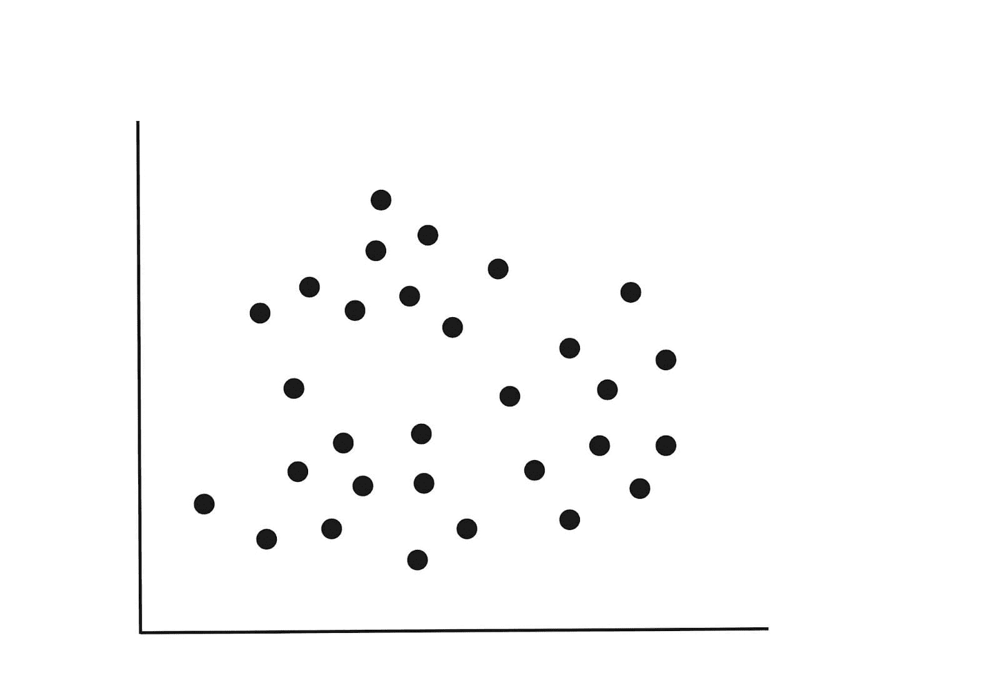
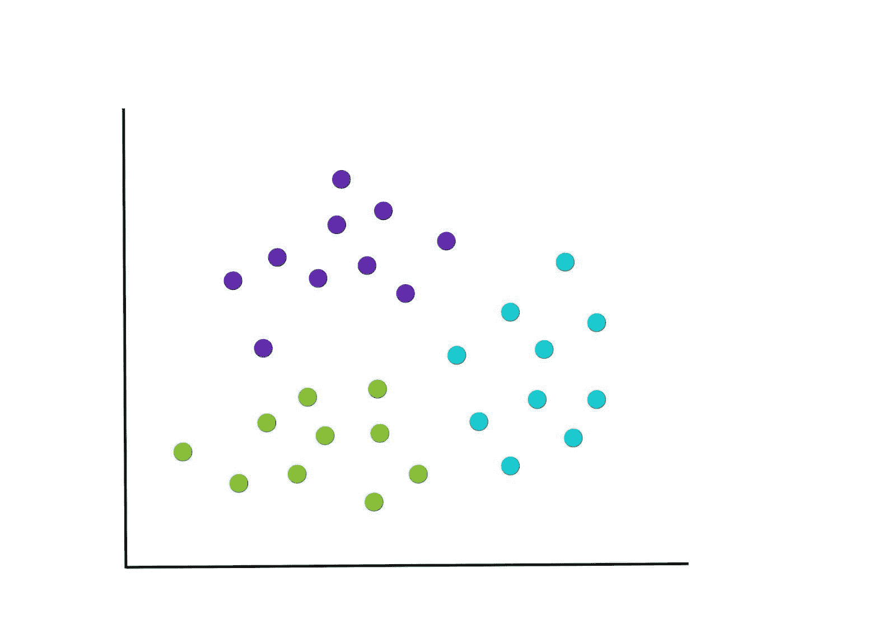

# 什么是 K-Means 聚类及其算法如何工作？

> 原文：[`www.kdnuggets.com/2023/05/kmeans-clustering-algorithm-work.html`](https://www.kdnuggets.com/2023/05/kmeans-clustering-algorithm-work.html)

图片来自 Bing 图像生成器

# 介绍

* * *

## 我们的前三大课程推荐

 1\. [谷歌网络安全证书](https://www.kdnuggets.com/google-cybersecurity) - 快速进入网络安全职业生涯。

 2\. [谷歌数据分析专业证书](https://www.kdnuggets.com/google-data-analytics) - 提升你的数据分析技能

 3\. [谷歌 IT 支持专业证书](https://www.kdnuggets.com/google-itsupport) - 支持你组织的 IT

* * *

从根本上说，机器学习算法有四种类型；监督算法、半监督算法、无监督算法和强化学习算法。监督算法是那些在具有标签的数据上工作的算法。半监督算法是数据的一部分有标签，另一部分没有标签。无监督算法是数据没有标签的情况。强化学习是一种机器学习类型，其中有一个代理通过试错来实现特定目标。当代理做对时会获得奖励，做错时会受到惩罚。

我们的重点是无监督的机器学习算法，特别是 K-Means 聚类算法。

# K-Means 聚类

K-Means 是一种无监督的机器学习算法，它将数据点分配到 K 个簇之一。如前所述，无监督意味着数据没有像监督学习中那样的组标签。该算法观察数据中的模式，并利用这些模式将每个数据点放入具有相似特征的组中。当然，还有其他解决聚类问题的算法，如 DBSCAN、层次聚类、KNN 等，但与其他方法相比，K-Means 相对更受欢迎。

K 代表将数据点划分为的不同分组。如果 K 是 3，那么数据点将被分为 3 个簇。如果是 5，那么我们将有 5 个簇。稍后会详细介绍。

# K-Means 的应用

我们可以通过多种方式应用聚类来解决现实世界的问题。以下是一些应用示例：

+   **客户聚类**：公司可以使用聚类来将客户分组，以便更好地进行目标营销和了解客户基础。

+   **文档分类**：根据内容中的主题或关键词对文档进行分组。

+   **图像分割**：在进行图像识别之前，对图像像素进行聚类。

+   **根据学生表现进行分组**：你可以将他们分为顶尖表现者、平均表现者，并利用这些分组来改善学习体验。

# K-Means 算法如何工作

算法首先进行初始迭代，其中数据点被随机分配到各组，计算出每组的中心点（称为质心）。计算每个数据点到质心的欧氏距离，如果某点到某个质心的距离大于到另一个质心的距离，则该点会被重新分配到“另一个”质心。当这种情况发生时，算法将进行另一轮迭代，直到所有分组的组内方差达到最小。

我们所说的“组内最小变异性”是指组内观察值的特征应尽可能相似。

想象一个包含两个变量的数据集，如下所示。这些变量可以是个人的身高和体重。如果我们有一个第三个变量，如年龄，那我们就会有一个 3-D 图，但现在我们还是用下面的 2-D 图。

## 步骤 1：初始化

从上面的图中我们可以看到三个簇。在拟合模型时，我们可以随机选择 k=3。这意味着我们寻求将数据点分为三个分组。

在初始迭代中，下面的示例中 K 个质心是随机选择的。

你可以指定算法将数据点分组为的 K 个簇的数量，但还有一种更好的方法。我们稍后会详细讲解如何选择 K。

## 步骤 2：将点分配给 K 个质心中的一个

一旦选择了质心，每个数据点将基于该点到最近质心的欧氏距离被分配到最近的质心。这可能会导致下图所示的分组。

注意，除了欧氏距离外，还可以使用其他类型的距离测量方法，如曼哈顿距离、斯皮尔曼相关距离和皮尔逊相关距离，但经典的距离测量方法是欧氏距离和曼哈顿距离。

## 步骤 3：重新计算质心

在第一次分组后，新的中心点会重新计算，这会要求重新分配点。下面的图示例显示了新的分组可能是什么样的，并注意到一些点已经移动到新的簇中。

## 迭代

步骤 2 和 3 的过程会重复，直到数据点不再重新分配或达到最大迭代次数。最终的分组结果如下。

## K 的选择

作为数据科学家，你将处理的数据在绘制图表时不会总是有明显的界限，就像你在鸢尾花数据集中看到的那样。通常，你会处理具有更高维度的数据，这些数据无法绘制，或者即使可以绘制，也无法确定最佳的分组数量。以下图表是一个很好的例子。

你能确定分组的数量吗？不清楚。那么，我们如何找到上述数据点可以分组的最佳集群数量呢？

有不同的方法用于找到最佳的 K，将给定数据集的数据点分组，包括肘部法和轮廓系数法。让我们简要地看一下这两种方法的工作原理。

## 肘部法

这种方法使用聚类内的总变异，通常称为 WCSS（聚类内平方和）。其目的是使聚类内的方差（WCSS）最小。

这种方法的工作原理如下：

+   它取一系列 K 值，例如 1 - 8，并计算每个 K 值的 WSS。

+   得到的数据将具有一个 K 值及其对应的 WSS。然后使用这些数据绘制 WCSS 对 K 值的图表。

+   最佳的 K 数量是肘部点，即曲线开始加速的地方。这个点的名称来源于此。想象一下你手臂的肘部。

## 轮廓系数法

这种方法测量相似性和不相似性。它量化了一个点与其分配的聚类中其他成员的距离，以及与其他聚类中成员的距离。它的工作原理如下：

+   它从 K 值的范围开始，初始值为 2。

+   对于每个 K 值，它计算聚类相似度，即一个数据点与同一聚类中所有其他组成员的平均距离。

+   接下来，通过计算数据点与最近聚类中所有其他成员的平均距离来计算聚类不相似度。

+   轮廓系数将是聚类相似度值和聚类不相似度值之间的差值，除以两个值中的较大者。

最佳的 K 值是具有最高系数的值。这个系数的值范围在 -1 到 1 之间。

# 结论

这是介绍 K-Means 聚类算法的文章，我们已经涵盖了它是什么、如何工作以及如何选择 K。在下一篇文章中，我们将介绍如何使用 Python 的 scikit-learn 库解决实际的聚类问题。

**[克林顿·奥约戈](https://www.linkedin.com/in/oyogo-clinton-53359198/)** 是 [Saturn Cloud](https://saturncloud.io/) 的作家，他认为分析数据以获取可操作的洞察是他日常工作的重要部分。凭借在数据可视化、数据整理和机器学习方面的技能，他为自己作为数据科学家的工作感到自豪。

[原创](https://saturncloud.io/blog/what-is-k-means-clustering-and-how-does-its-algorithm-work/)。经许可转载。

### 更多相关话题

+   [聚类大解密：理解 K-Means 聚类](https://www.kdnuggets.com/2023/07/clustering-unleashed-understanding-kmeans-clustering.html)

+   [K-means 聚类的质心初始化方法](https://www.kdnuggets.com/2020/06/centroid-initialization-k-means-clustering.html)

+   [动手实践无监督学习：K-Means 聚类](https://www.kdnuggets.com/handson-with-unsupervised-learning-kmeans-clustering)

+   [AI 会有自己的蝙蝠侠吗？](https://www.kdnuggets.com/2022/05/ai-get-batman.html)

+   [为你的数据集选择合适的聚类算法](https://www.kdnuggets.com/2019/10/right-clustering-algorithm.html)

+   [机器学习中的 DBSCAN 聚类算法](https://www.kdnuggets.com/2020/04/dbscan-clustering-algorithm-machine-learning.html)
