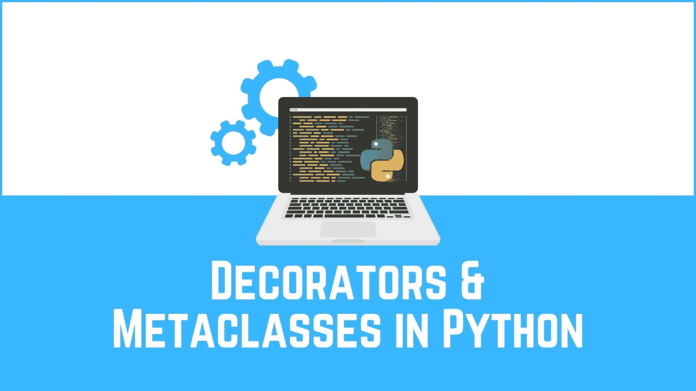
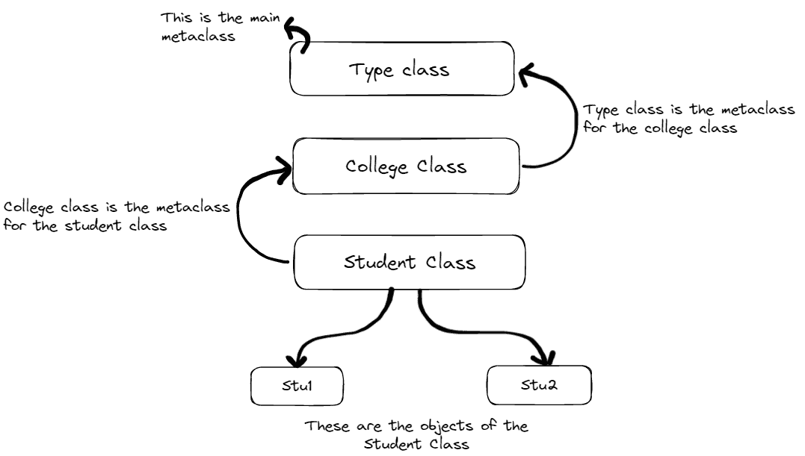
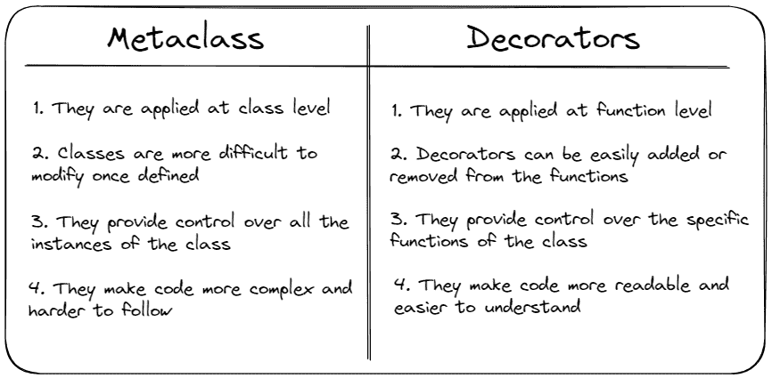

# 关于 Python 装饰器和元类你应该知道的事

> 原文：[`www.kdnuggets.com/2023/03/know-python-decorators-metaclasses.html`](https://www.kdnuggets.com/2023/03/know-python-decorators-metaclasses.html)



作者提供的图片

# 什么是 Python 装饰器？

* * *

## 我们的前三大课程推荐

 1\. [谷歌网络安全证书](https://www.kdnuggets.com/google-cybersecurity) - 快速进入网络安全职业轨道

 2\. [谷歌数据分析专业证书](https://www.kdnuggets.com/google-data-analytics) - 提升你的数据分析技能

 3\. [谷歌 IT 支持专业证书](https://www.kdnuggets.com/google-itsupport) - 支持你的组织 IT

* * *

听到“装饰器”这个词，大多数人可能会猜测它是用来装饰的东西。你猜对了。在节日如圣诞节或新年时，我们用各种灯光和材料装饰房子。但在 Python 中，装饰器用于修改或增强 Python 函数或方法的功能。

装饰器是包裹在原始函数周围的函数，能够在不直接修改原始代码的情况下添加一些额外的功能。

举个例子，假设你是一个面包店的老板，并且在制作蛋糕方面是一位专家。你制作不同的蛋糕，如巧克力蛋糕、草莓蛋糕和菠萝蛋糕。所有蛋糕都是用不同的原料制作的，但一些步骤对于所有蛋糕都是相同的，比如准备烤盘、预热烤箱、烘焙蛋糕或从烤箱中取出蛋糕。因此，我们可以创建一个通用的装饰器函数来执行所有通用步骤，为不同类型的蛋糕制作单独的函数，并使用装饰器为这些函数添加通用功能。

请看下面的代码。

```py
def common_steps(func):
    def wrapper():
        print("Preparing baking pans...")
        print("Pre-heating the oven...")
        result = func()
        print("Baking the cake...")
        print("Removing the cake from the oven...")
        return result

    return wrapper

@common_steps
def chocolate_cake():
    print("Mixing the chocolate...")
    return "Chocolate cake is ready!"

@common_steps
def strawberry_cake():
    print("Mixing the strawberries...")
    return "Strawberry cake is ready!"

@common_steps
def pineapple_cake():
    print("Mixing the pineapples...")
    return "Pineapple cake is ready!"

print(pineapple_cake())
```

**输出：**

```py
Preparing baking pans...
Pre-heating the oven...
Mixing the pineapples...
Baking the cake...
Removing the cake from the oven...
Pineapple cake is ready!
```

函数 `comman_steps` 被定义为装饰器，并包含所有的通用步骤，如烘焙或预热。而函数 `chocolate_cake`、`strawberry_cake` 和 `pineapple_cake` 则定义了不同类型蛋糕的不同步骤。

装饰器使用 `@` 符号定义，后面跟着装饰器函数的名称。

每当定义一个带有装饰器的函数时，原始函数会与装饰器一起被调用，而装饰器函数会返回一个新的函数来替代原始函数。

新函数在调用原始函数之前和之后执行附加功能。

除了 `@` 符号外，你还可以以另一种方式定义装饰器，这种方式能够提供相同的结果。例如，

```py
def pineapple_cake():
    print("Mixing the pineapples...")
    return "Pineapple cake is ready!"

pineapple_cake = common_steps(pineapple_cake)

print(pineapple_cake())
```

## 使用装饰器的好处：

1.  你可以重复使用相同的代码而不会造成冗余，从而避免“不要重复自己”（DRY）原则的违背。

1.  这使得你的代码更具可读性，也更容易维护。

1.  你可以使你的代码组织得更清晰，这有助于处理输入验证、错误处理或优化问题等方面的关注。

1.  使用装饰器，你可以在不修改代码的情况下，为现有函数或类添加新的功能。这允许你根据业务需求扩展代码。

# 什么是元类？

它是类的类，定义了类如何表现。一个类本身是一个元类的实例。

在理解元类的定义之前，首先了解 Python 类和对象的基本定义。类就像一个构造函数，用于创建对象。我们创建类来创建对象。对象也被称为类的实例，用于访问类的属性。属性可以是任何数据类型，如整数、字符串、元组、列表、函数，甚至是类。因此，为了使用这些属性，我们必须在类中创建实例（对象），创建这些实例的方法称为实例化。

Python 中的一切都被视为对象。即使是类也被视为对象。这意味着一个类是从另一个类实例化的。所有其他类实例化的类被称为**元类**。类定义了它所属对象的行为。同样，类的行为由其元类定义，默认情况下是**Type**类。简单来说，所有类在 Python 中都是元类的实例。

## 什么是类型类？

在 Python 中，**Type**类是所有类的元类。每次你定义一个新类时，默认情况下，它是从 Type 类实例化的，除非你定义了另一个元类。

类型类还负责动态创建 Python 类。当我们定义一个新类时，Python 将类定义发送给类型类，然后这个类根据类定义创建一个新的类对象。

让我们考虑一个例子。

```py
class College:
    pass

obj = College()
print(type(obj))
print(type(College))
```

**输出：**

```py
<class '__main__.College>
<class 'type'>
```

创建了一个名为`College`的新类，并实例化了一个该类的对象`obj`。但是，当我们打印对象类型时，它输出为`<class '__main__.College'>`，这意味着一个特定的对象是从`College`类创建的。但另一方面，当我们打印`College`类的类型时，它输出为`<class 'type'>`，这意味着该类默认是从**type 类**（元类）创建的。

我们还可以更改这些用户定义类的默认元类。考虑下面的例子。

```py
class College(type):
    pass

class Student(metaclass=College):
    pass

print(type(Student))
print(type(College))
```

**输出：**

```py
<class '__main__.College'>
<class 'type'>
```

当我们打印`Student`类的类型时，它会引用`College`作为元类，但当我们打印`College`类的类型时，它会引用**type**类作为元类。所以这形成了一个层级，如下所示。



作者提供的图片

我们还可以使用**type**类来动态创建新类。让我们通过以下示例进一步了解这一点。

```py
# This is the basic way of defining a class.
class MyClass:
    pass

# Dynamic creation of classes.
myclass = type("MyClass", (), {})
```

定义类的两种方法是等效的。在这个例子中使用了 type()函数来创建一个新类。它接受三个参数。第一个参数是类名，第二个是父类的元组（在这种情况下为空），第三个参数是一个字典，包含该类的属性（在这种情况下也为空）。

考虑另一个使用继承概念的例子。

```py
College = type("College", (), {"clgName": "MIT University"})
Student = type("Student", (College,), {"stuName": "Kevin Peterson"})
obj = Student()
print(obj.stuName, "-", obj.clgName)
```

**输出：**

```py
Kevin Peterson - MIT University
```

创建了一个名为`College`的类，参数`clgName`为`MIT University`。另一个类`Student`被创建，并从`College`类继承，并创建了一个属性`stuName`为`Kevin Peterson`。

当我们创建`Student`类的对象时，可以看到它能够访问两个类的属性。这意味着在这个例子中继承工作得非常完美。

# 结论

在这篇文章中，我们讨论了 Python 中的装饰器和元类。元类和装饰器都修改类和函数的行为，但使用不同的机制。

元类在较低级别操作，允许你改变类的结构或行为，如类方法、属性和继承。而装饰器则用于修改函数的行为。它们允许你在不改变代码的情况下为现有函数添加功能。与元类相比，装饰器操作的级别较高，因此它们比元类更容易理解，也更不复杂。



元类与装饰器的区别 | 图片由作者提供

今天就到这里了。我希望你喜欢阅读这篇文章。如果你有任何评论或建议，请通过[Linkedin](https://www.linkedin.com/in/aryan-garg-1bbb791a3/)与我联系。

**[Aryan Garg](https://www.linkedin.com/in/aryan-garg-1bbb791a3/)** 是一名 B.Tech 电气工程专业的学生，目前在本科最后一年。他的兴趣在于 Web 开发和机器学习。他已经追求了这个兴趣，并渴望在这些方向上做更多的工作。

### 相关主题

+   [8 个内置 Python 装饰器来编写优雅的代码](https://www.kdnuggets.com/8-built-in-python-decorators-to-write-elegant-code)

+   [KDnuggets 新闻，4 月 13 日：数据科学家应该了解的 Python 库…](https://www.kdnuggets.com/2022/n15.html)

+   [每位数据科学家都应该知道的三个 R 库（即使你使用 Python）](https://www.kdnuggets.com/2021/12/three-r-libraries-every-data-scientist-know-even-python.html)

+   [你应该了解的关于梯度下降和代价函数的 5 个概念](https://www.kdnuggets.com/2020/05/5-concepts-gradient-descent-cost-function.html)

+   [KDnuggets™ 新闻 22:n03, 1 月 19 日：深入了解 13 个数据…](https://www.kdnuggets.com/2022/n03.html)

+   [更多分类问题的性能评估指标](https://www.kdnuggets.com/2020/04/performance-evaluation-metrics-classification.html)
