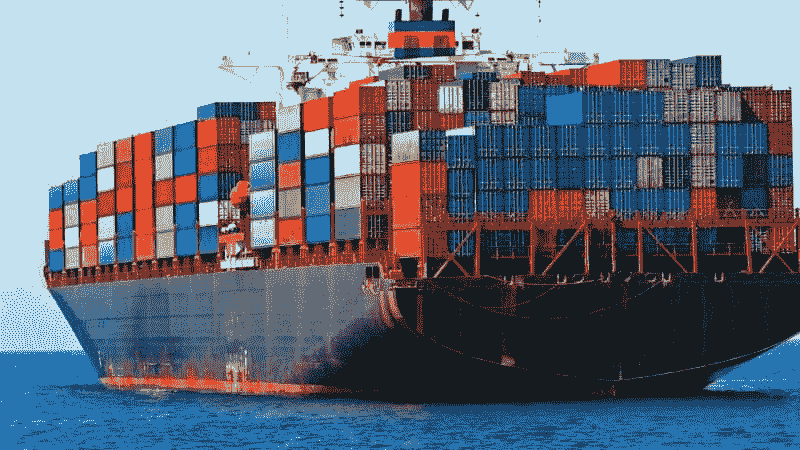

# Kubernetes 与 Amazon ECS 对数据科学家的比较

> 原文：[`www.kdnuggets.com/2020/11/kubernetes-amazon-ecs-data-scientists.html`](https://www.kdnuggets.com/2020/11/kubernetes-amazon-ecs-data-scientists.html)

comments

图片来源：[容器技术公司](http://containertech.com/about-containers/)

* * *

## 我们的三大课程推荐

 1\. [Google 网络安全证书](https://www.kdnuggets.com/google-cybersecurity) - 快速进入网络安全职业的捷径。

 2\. [Google 数据分析专业证书](https://www.kdnuggets.com/google-data-analytics) - 提升你的数据分析技能

 3\. [Google IT 支持专业证书](https://www.kdnuggets.com/google-itsupport) - 支持你组织的 IT 需求

* * *

当你踏上数据科学职业的道路时，你无疑会遇到使用容器管理解决方案的机会。在这里，我们将从对有志和现任数据科学家有意义的角度来看待两种解决方案 —— [Kubernetes](https://kubernetes.io/) 和 [Amazon Elastic Container Service (ECS)](https://aws.amazon.com/ecs/)。

### 两种选项都支持部署机器学习模型

如果你有兴趣在作为数据科学家的工作中构建和使用机器学习模型，可以找到一些教程来指导你在这两个平台上进行操作。亚马逊提供了 [针对数据科学家的逐步操作指南](https://aws.amazon.com/blogs/machine-learning/deploy-deep-learning-models-on-amazon-ecs/)。

另外，有一个名为 Kubeflow 的机器学习 [工具包](https://ubuntu.com/blog/kubernetes-for-data-science-meet-kubeflow)，专为 Kubernetes 用户设计。它是一个开源、可移植且可扩展的解决方案。人们可以将其应用于任何新的或现有的 Kubernetes 部署。

### 两者都是可靠的选择

在比较 Kubernetes 和 ECS 时，不要惊讶于发现有关可用区和整体可靠性的细节。选择一个可靠的服务可以帮助你避免可能暂时中断数据科学项目的故障。

ECS 运行在 69 个可用区和 22 个区域。此外，ECS 属于亚马逊网络服务（AWS）旗下。这意味着它 [保证至少 99.99% 的正常运行时间](https://towardsdatascience.com/stuck-between-ecs-and-kubernetes-6b5d42c000b5)。

Kubernetes 强调通过将 Kubernetes pod 分布在节点之间的方式来提高可靠性，使其对应用程序故障具有更高的容错能力。此外，Kubernetes 的高可用性扩展到基础设施和应用程序层面。

此外，随着 Kubernetes 1.2 的发布，[支持在多个可用区运行单个集群](https://unofficial-kubernetes.readthedocs.io/en/latest/admin/multiple-zones/)也被引入。然而，所选的区域必须在同一区域内，并由相同的云服务提供。

那个 Kubernetes 版本为 AWS 和 Google Compute Engine (GCE) 用户提供了多个区域选择。然而，给节点和卷应用适当的标签可以支持额外的云服务。

### Amazon ECS 是现有生态系统的一部分。

Amazon ECS 是 AWS 生态系统的一部分。这在某些情况下带来了优势，而在其他情况下则带来了缺点。例如，与 Kubernetes 相比，初始设置更容易和更快速，因为你可以通过 AWS 管理控制台进行设置，而不需要设置 Kubernetes 所需的控制面板。

然而，ECS [也有较高的供应商锁定](https://bluesentryit.com/kubernetes-versus-amazon-ecs-a-peculiar-comparison/)，这会阻止你将容器化应用程序迁移到其他提供商或平台。相比之下，Kubernetes 是一个开源解决方案，允许将容器迁移到其他地方，包括混合云和多云提供商。

AWS 定期发布对数据科学家感兴趣的新产品。例如，在 2018 年，该公司推出了 [一个机器学习市场](https://press.aboutamazon.com/news-releases/news-release-details/amazon-web-services-announces-13-new-machine-learning-services)，其中包含了 150 多个新的模型和算法供尝试。你还可以找到 [详细的 AWS 产品分解](https://www.marktechpost.com/2019/09/28/ai-and-data-science-tools-on-amazon-web-services/)，这些产品可以支持你的数据科学项目。

如果你已经使用了许多 AWS 提供的产品或计划很快使用它们，选择 ECS 可能比选择 Kubernetes 更有意义。否则，你可能会觉得 ECS 过于限制。

### 数据科学中心的 Kubernetes 教程 readily available。

数据科学家很容易找到有关使用 ECS 的一般信息，但关于如何在工作中使用 ECS 的具体信息则不太常见。这种现象可能意味着人们在学习如何将 ECS 应用于数据科学项目时，特别是在使用的早期阶段，花费的时间比预期的要多。

尽管一些针对数据科学家的课程 [涵盖了如何使用 ECS](https://www.educative.io/courses/data-science-in-production-building-scalable-model-pipelines/7DQxPXQnN8y)，但内容通常只包括涉及数据科学课程中更广泛主题的单个模块。

另一方面，你可以[快速找到面向数据科学家的 Kubernetes 解释器](https://mlinproduction.com/intro-to-kubernetes/)。这些解释器使你更容易想象为什么你可能希望使用它而不是其他服务。同样，内容创作者提供了[将 Kubernetes 应用于数据科学项目](https://opensource.com/article/19/1/why-data-scientists-love-kubernetes)的实际例子，例如预测客户流失率。

### ECS 成本可能更为简单

一些数据科学家可能希望使用 ECS 或 Kubernetes，同时自己承担费用，而不是依赖雇主。在这种情况下，计算与 ECS 相关的费用可能会更简单，因为 AWS 提供了价格计算器来避免惊讶。

AWS 产品也有免费的层级。起初，这听起来似乎是件好事。然而，用户报告说在他们的[免费服务资格过期](https://www.infoq.com/news/2020/09/aws-free-tier/)后收到了大额账单，而他们并未意识到这一点。

计算 Kubernetes 定价的主要原因之一是[认证服务提供商的网络不断增长](https://www.cncf.io/certification/kcsp/)，这些提供商可以帮助人们开始使用 Kubernetes。其中一些实体也提供内置 Kubernetes 支持的产品。

这意味着你通过这些供应商使用 Kubernetes 的价格会有所不同。理想的做法是创建一个感兴趣的产品或公司列表，这些公司提供 Kubernetes 支持。然后，花时间研究他们的定价结构，看看哪些最适合你的预算和你希望在 Kubernetes 上进行的数据科学工作量。

### 没有普遍正确的选项

本概述强调了为什么数据科学家在选择 Kubernetes 和 ECS 时不应草率决策。两者都有优缺点，这可能最终影响数据科学项目。

然而，允许足够的时间来了解每种解决方案是明智的。考虑一下你管道中的任何项目，这些项目可能涉及到你使用容器化解决方案。然后，审查每个产品的特性，并确定哪些最适合你的情况和期望。以这种方式仔细审查每个选项将导致明智的决策。

**简介：Devin Partida** 是一位大数据和技术作家，同时也是 [**ReHack.com**](https://rehack.com/) 的主编。

**相关：**

+   你不必再使用 Docker 了

+   5 个容器将统治数据科学的理由

+   使用 Kubernetes 对 PySpark 进行容器化

### 更多相关内容

+   [Kubernetes 实战：第二版](https://www.kdnuggets.com/2022/03/manning-kubernetes-action-second-edition.html)

+   [在 Kubernetes 中实现高可用性的 SQL Server Docker 容器](https://www.kdnuggets.com/2022/04/high-availability-sql-server-docker-containers-kubernetes.html)

+   [用 Python 为亚马逊产品构建推荐系统](https://www.kdnuggets.com/2023/02/building-recommender-system-amazon-products-python.html)

+   [了解如何设计、测量和实施可靠的 A/B 测试…](https://www.kdnuggets.com/2023/01/sphere-design-measure-implement-trustworthy-ab-tests-ronny-kohavi.html)

+   [免费的亚马逊课程来学习生成式 AI：适合所有水平](https://www.kdnuggets.com/free-amazon-courses-to-learn-generative-ai-for-all-levels)

+   [为数据工程师和数据科学家提供高保真合成数据](https://www.kdnuggets.com/2022/tonic-high-fidelity-synthetic-data-engineers-scientists-alike.html)
