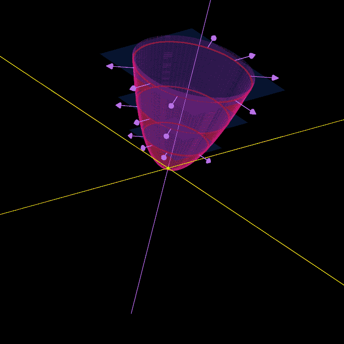
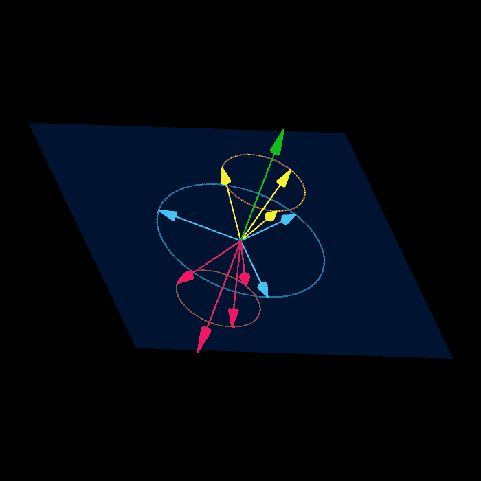
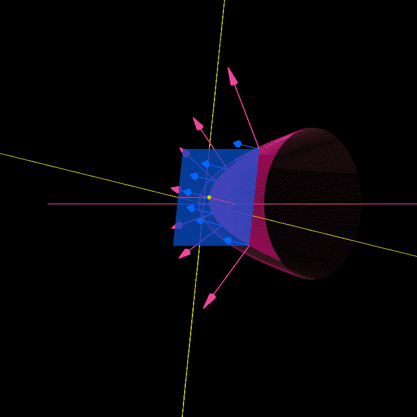
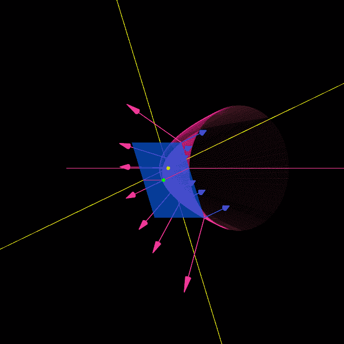
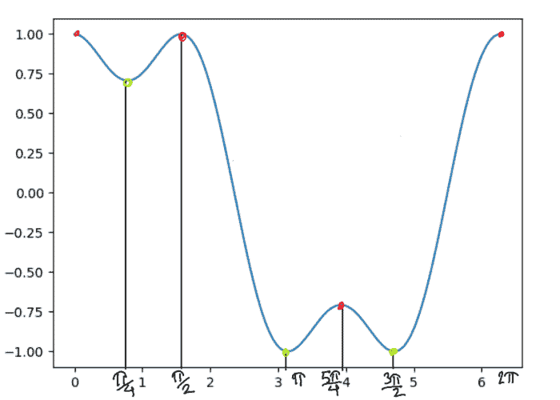
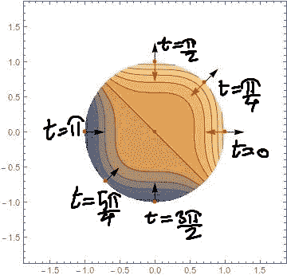
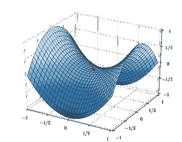
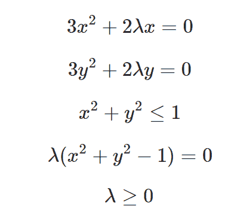

# 拉格朗日乘子法的可视化和代码

> 原文：[`www.kdnuggets.com/2019/08/lagrange-multipliers-visualizations-code.html`](https://www.kdnuggets.com/2019/08/lagrange-multipliers-visualizations-code.html)

 评论

**作者 [Rohit Pandey](https://www.linkedin.com/in/ropandey576)，LinkedIn 高级数据科学家**

在这个故事中，我们将进行一次关于拉格朗日乘子法的空中游览。我们什么时候需要它？每当我们有一个带有约束的优化问题时。以下是一些例子：

1.  一家对冲基金想决定在其投资组合中包括哪些比例的股票，以获得尽可能高的预期回报，同时保持在某个风险承受范围内（风险可以通过回报的方差来衡量等）。

1.  一个学区希望确定他们的午餐菜单上各种项目的分配。他们想要在确保孩子们获得所需的所有营养素的同时，最小化每顿午餐的成本。

1.  一家货运公司想将货物从源仓库运送到目的城市。给定每个仓库-城市对的运输成本、每个仓库的总供应量和每个城市的总需求量，决定从每个仓库到每个城市的运输量，以便在满足需求的同时最小化整体成本（约束条件）。

* * *

## 我们的前 3 个课程推荐

 1\. [Google 网络安全证书](https://www.kdnuggets.com/google-cybersecurity) - 快速进入网络安全职业领域。

 2\. [Google 数据分析专业证书](https://www.kdnuggets.com/google-data-analytics) - 提升你的数据分析技能

 3\. [Google IT 支持专业证书](https://www.kdnuggets.com/google-itsupport) - 支持你组织的 IT 部门

* * *

我们可以看到，受限优化可以解决从物流到金融等领域的许多实际问题。在接下来的博客中，我们将从无约束优化开始。然后，我们将添加等式约束。接着，我们将描述完全通用的受限优化问题的解决方案，包括等式和不等式约束（这些条件称为 KKT——Karush、Kuhn、Tucker 条件）。最后，我们展示这些条件在一些玩具问题上的力量。许多人认为 Nocedal 和 Wright 的书是数值优化的经典之作，我们将大致遵循第十三章，略过严格的证明（可以从文本中阅读）而更多关注于直观理解。

### 无约束优化

在这种情况下，我们控制了一些变量，并且目标函数依赖于这些变量。变量没有约束，目标函数需要被最小化（如果是最大化问题，我们可以简单地将目标函数取负值，那么它就变成了一个最小化问题）。

在任何点，对于一维函数，函数的导数指向增加它的方向（至少对于小步而言）。这意味着如果我们有一个函数 \( f(x) \) 并且导数 *\( f'(x) \)* 为正，那么增加 \( x \) 会增加 \( f(x) \)，减少 \( x \) 会减少 \( f(x) \)。如果我们在最小化 \( f(x) \)，我们只需沿着 *\( f'(x) \)* 符号相反的方向迈出小步来减少 \( f(x) \)。如果我们在 *\( f'(x) \)* = 0 的点上怎么办？那么，我们可能已经达到了 \( f(x) \) 的最优点，因为没有其他地方可去。

如果有多个变量（比如 \( x \) 和 \( y \)），我们可以分别计算它们的导数。如果我们取这两个数字并构造一个二维向量，就得到了函数的梯度。现在，沿着梯度的方向移动会增加函数值，而沿着相反的方向移动会减少函数值（对于小步而言）。

这意味着只要梯度不为零，我们就不能处于极小值，因为我们可以沿着梯度的相反方向迈出小步，从而进一步减少函数值。这意味着，一个点成为函数极小值的必要（但不充分）条件是该点的梯度必须为零。

让我们举一个具体的例子，以便可视化它的样子。考虑函数 \( f(x, y) = x² + y² \)。这是一个抛物面，当 \( x = 0 \) 和 \( y = 0 \) 时达到最小值。对于 \( x \) 和 \( y \) 的导数分别是 \( 2x \) 和 \( 2y \)。因此，梯度变成了向量 ∇f = [2x, 2y]。我们可以看到，当 \( x = 0 \) 和 \( y = 0 \) 时梯度为零。否则，梯度指向的方向会使 \( f(x, y) \) 增加。因此，梯度的相反方向会减少 \( f(x, y) \)。这在下面的图中展示了。粉色曲线是目标函数 \( f(x, y) \)，在绿色点 (0,0) 处最小化。紫色箭头是梯度，它们指向 \( f(x, y) \) 增加的方向。因此，为了减少 \( f(x, y) \)，我们需要朝着相反的方向移动，直到到达绿色点。

图 1：带梯度的抛物面。使用 [`github.com/ryu577/pyray`](https://github.com/ryu577/pyray) 制作

总结一下，在优化一个函数 \( f \) 的无约束优化问题时，成为局部最优点的必要（但不充分）条件是：

**∇f = 0**

这就像你站在山顶（这就是一个极大值）。你怎么知道你在山顶？无论你沿哪个方向迈步，你都会*降低*你的高度。所以你肯定在你所在的局部邻域内达到了一个最优解。现在，可能在你旁边还有另一座更高的山。所以，你可能没有达到*全局*最优解。实际上，如果我们把地球的表面作为我们的领域（海拔高度作为我们的目标函数），那么你如果在任何一座山（或建筑物）的顶端，都是局部最优解，但只有当那座山是珠穆朗玛峰时，你才会达到全局最优解。在这篇文章中，我们将满足于寻找局部最优解。

现在，如果我们想要保持在一个国家的范围内呢？这意味着要限制我们可以搜索最优解的空间，这就成了一个约束优化的例子。在某种程度上，无约束优化只是约束优化的一个特例。

### 等式约束

对于无约束的最小化/最大化问题，我们简单地寻找梯度为零向量的点。如果梯度不为零，我们只需朝着与梯度相反的方向（如果我们在最小化；如果我们在最大化则沿梯度方向）迈出一小步，并不断重复这个过程，直到我们找到一个梯度*为*零的点，这样就没有其他方向可以移动了（这种优化方法称为梯度下降）。注意，我们不必完全沿梯度方向移动。只要我们沿着在梯度方向上有正投影（影子）的方向移动，我们最终会增加目标函数（如果我们在负梯度方向上有正投影则会减少目标函数）。下图对此进行了说明。绿色箭头是蓝色平面的梯度（因此与之垂直），红色箭头是负梯度。由于浅蓝色箭头位于平面上，如果我们沿着这些箭头迈出一步，平面的方程将会得到 0。黄色箭头在绿色箭头方向上有正影子（投影）。因此，沿着这些箭头移动会得到在平面方程中代入后会得到正数的点（即“增加”它）。类似地，粉色箭头在红色箭头（反梯度）方向上有正影子。因此，沿这些箭头移动会得到在平面方程中代入后会得到负数的点（即“减少”它）。

图 2：平面两侧的向量。具体解释见正文。使用 [`github.com/ryu577/pyray`](https://github.com/ryu577/pyray) 制作。

对于无约束最小化问题，我们寻找梯度为零的点。这是因为如果梯度不为零，我们可以通过沿梯度的反方向来降低目标函数。

相同的想法可以扩展到我们有等式约束的情况。像之前一样，我们需要找到一个无法找到任何*可能*移动方向的点，其中目标函数减少。对于无约束优化，这仅意味着不存在这样的方向。当我们有约束时，还有另一种可能性。如果存在一个减少目标函数的方向，但约束条件禁止我们沿着它迈出任何一步怎么办？

假设你想最大化银行账户中的资金。一种立即增加收入的方法是卖掉一个肾脏。但你可能有一个约束条件，表示你不会失去一个重要的器官。因此，即使存在一种简单的方法来增加你的收入，你的约束条件也阻止了你访问它。

这意味着等式约束的存在实际上减少了对梯度的条件的严格性。在没有等式约束的情况下，它需要为零才能获得局部最优解，而现在只要朝着有正投影的任何方向移动会导致我们违反约束，它非零也是可以的。这只有在约束平面与梯度垂直时才会发生（如图 2 中的平面和绿色箭头）。

让我们回到目标函数 f(x,y)=x²+y²。我们增加一个等式约束，y=1。这是一个平面。在下面的图 3 中，目标函数是粉色的，平面是蓝色的。由于我们被限制在平面上，我们不能沿平面的梯度（下图中的蓝色箭头）朝任何方向移动，因为那会增加或减少约束方程，而我们希望保持它不变。平面与目标函数方程（粉色抛物面）相交形成一条抛物线。下图中的粉色箭头是沿这条抛物线的目标函数的梯度。如果粉色箭头在蓝色平面上有一个投影，我们可以朝着与该投影对应的向量的相反方向移动。这将保持我们在平面上，确保我们不违反约束，同时减少目标函数。然而，在下图 3 中的绿色点，粉色箭头（目标函数的梯度）在蓝色平面上没有任何投影。换句话说，粉色箭头与蓝色箭头（即约束平面梯度）平行。

图 3：约束梯度在最优点与目标函数梯度对齐。制作使用了 [`github.com/ryu577/pyray`](https://github.com/ryu577/pyray)

为了减少目标函数，我们需要朝着具有负梯度分量的方向移动。但一旦我们这样做，就会离开约束平面。因此，约束使得在绿色点进一步减少目标函数变得不可能。这意味着它必须是局部极小值。检查这个条件的简单方法是要求目标函数的粉色梯度与约束平面的蓝色梯度平行。如果两个向量平行，我们可以将一个写作另一个的倍数。我们将这个倍数称为 λ。如果目标函数的梯度是 ∇f，约束的梯度是 ∇c，上述条件是：

**∇f = λ ∇c**

上述 λ 称为拉格朗日乘子。因此，我们现在有了一个具体的条件，用来检查约束优化问题的局部最优解。

### 不等式约束

不等式约束意味着你必须保持在定义约束函数的边界的一侧，而不是在边界上（这在等式约束的情况下）。例如，保持在栅栏的边界内。如果我们知道如何处理不等式约束，我们就可以解决任何约束优化问题。这是因为等式约束可以转换为不等式约束。假设我们要求：c(x) = 0\. 另一种表达方式是：c(x)≥0 和 c(x)≤0\. 因此，每个等式约束总是可以替换为两个不等式约束。

就像前一节中描述的那样，使用拉格朗日乘子处理等式约束的优化问题，不等式约束的优化问题也可以用拉格朗日乘子来处理。不等式约束条件与等式约束条件的区别在于，不等式约束的拉格朗日乘子必须是正值。为什么呢？我们可以考虑在梯度方向上取一个小步。如果我们能在这个方向上（如果我们是在最大化；如果我们是在最小化，则方向相反）迈出一步，那我们就不能处于极大值/极小值点。对于不等式约束来说，这意味着拉格朗日乘子必须是正值。为了理解这一点，我们可以回顾一下之前考虑的约束优化问题（图 3）。

最小化：f(x,y) = x²+y²

约束条件：c(x,y)=y-1=0

现在，我们将等式约束改为不等式约束。这可以通过两种完全不同的方式完成。我们可以要求：

c(x,y) = y-1 ≥0。在这种情况下，约束允许在图 3 中蓝色平面的前方的任何位置。很容易看出，图 3 中的绿色点仍然是局部最优点。此外，由于表示约束梯度的蓝色箭头和表示目标函数梯度的粉色箭头指向相同的方向，我们有：

**∇f = λ ∇c**

其中 λ>0。

另一种可能性是，c(x,y) = y-1≤0。现在，可行区域变为 *蓝色平面* 后面的所有区域。约束梯度将翻转。因此，图 3 将变成这样：

图 4: 翻转图 3 中的不等式约束符号。

请注意，现在，

1.  绿色点不再是局部最优点，因为我们可以自由移动到 (0,0)；这是图 4 中的黄色点。

1.  在绿色点，我们仍然有 ∇f=λ ∇c。由于蓝色向量指向与粉色向量相反的方向，我们有 λ<0。

因此，对于不等式约束，条件 ∇f=λ ∇c 仅当 λ>0 时表明我们在局部最优点。

综合这些，对于一般优化问题：

最小化 f(**x**)

受限于：

c_i(**x**)=0 对于 i ∈ 等式

c_i(**x**)≥0 对于 i ∈ 不等式

我们得到了成为局部最优点所需的完整条件：

拉格朗日乘子条件：

**∇f =∑_i λ_i ∇c_i(x) +∑_j λ_j ∇c_j(x);** Eq(1)

其中 i ∈ 等式约束，j ∈ 不等式约束。

c_i(**x**)=0 对所有 i; Eq(2)

c_j(**x**)≥0 对所有 j; Eq(3)

λ_j ≥ 0; Eq(4)

同样注意，对于我们考虑的两个不等式约束问题，当我们有 y-1≥0 时，图 3 中的绿色点是解。此时，我们在约束平面 (y-1=0) 上。因此，我们实际上有 c(**x**)=0 和 λ>0。

当我们考虑 y-1≤0 时，图 4 中的黄色点 (x=0,y=0) 成为局部最小值。这个点也是无约束问题的解。因此，我们这里有 ∇f=0。由于拉格朗日条件要求 ∇f = λ ∇c，我们得到 λ ∇c = 0。现在，∇c ≠0，这意味着我们必须有：λ=0。

这意味着如果约束是活跃的 (c(**x**)=0)，我们应该有 λ≥0，而如果它不是 (c(**x**)≠ 0)，我们应该有 λ=0。因此，在所有情况下，其中一个应该是零。这导致最终条件（互补条件）：

λ_j c_j(**x**) = 0 对所有 j ∈ 不等式; Eq(5)

方程（1）至（5）被称为 KKT 条件。请注意，我们实际上没有提供严格的证明，仅仅是基于简单示例进行构造。要获得证明，读者应参阅 Nocedal 和 Wright 的书第十三章。

许多人看到这五个方程时，觉得问题变得更加复杂。这些方程如何实际帮助我们解决约束优化问题呢？最好的方法是通过一些具体的例子来感受这一点。在下一节中，我们将用一个我们已知答案的样本问题来看看 KKT 条件如何帮助我们正确识别所有局部最优点。

### 带代码的示例

一般化优化问题的特例涉及线性目标函数和线性约束。这被称为线性约束线性规划（LCLP）。目标函数和约束也可以是二次的，这样的优化问题称为二次约束二次规划（QCQP）。有些软件包能够解决这些优化问题，即使约束数量极大（达百万级）。然而，对于约束数量较少的简单问题，我们可以利用能够解决大多数（更一般的）多项式约束多项式规划的算法。这意味着目标函数和约束可以是任意的多项式函数。这是因为存在一种通用的框架来解决多项式方程组，称为“布赫伯格算法”，而上述 KKT 条件可以简化为一个多项式方程组。我在[这里](https://medium.com/@rohitpandey576/solving-systems-of-polynomial-equations-with-object-oriented-programming-797eb8add0fc)写了一篇关于布赫伯格算法解决多项式方程组的详细博客。还有一个名为“sympy”的 Python 库在后台使用类似的算法来解决通用的多项式方程组。因此，事不宜迟，让我们开始构建第一个约束优化问题。

### 等式约束

```py

Minimize: x³+y³
Subject to: x²+y²=1

```

注意到约束（x²+y²=1）意味着我们在单位半径圆的边界上。因此，我们可以说：x=cos(t)，y=sin(t)。目标函数变为：sin³(t)+cos³(t)。如果我们以 t 绘制这个函数，我们会得到以下图像：

图 5：目标函数 sin³(t)+cos³(t) 绘制在约束边界上。

我们可以看到，t=0、π/2 和 5π/4 对应局部最大值，而 t=π/4、π 和 3π/2 对应局部最小值。既然我们已经提前知道答案了，让我们看看上面描述的 KKT 条件是否也能找到这些答案。

方程（1）给出（对目标函数和约束条件进行求导）：

[3x², 3y²] = λ[2x, 2y]

将两个向量两边的分量进行等式比较得到两个方程：

3x²-2λx=0

3y²-2λy=0

方程（2）只要求满足等式约束：

x²+y²=1

由于没有不等式约束，我们不需要方程（3）到（6）。现在，我们可以将上述三个方程输入到 Python 库 sympy 提供的符号方程求解器中。

这导致了以下结果（上述系统中 x、y 和λ的所有可能解，按此顺序）：

```py
[(-1, 0, -3/2),
 (0, -1, -3/2),
 (0, 1, 3/2),
 (1, 0, 3/2),
 (-sqrt(2)/2, -sqrt(2)/2, -3*sqrt(2)/4),
 (sqrt(2)/2, sqrt(2)/2, 3*sqrt(2)/4)]
```

(-1,0) 对应 t=π；(0,-1) 对应 t=3π/2；(-sqrt(2)/2,-sqrt(2)/2) 对应 t=5π/4，而 (sqrt(2)/2,sqrt(2)/2) 对应 t=π/4。因此，我们可以看到，上述识别的所有局部极大值和局部极小值都已被 KKT 条件识别。现在，我们可以简单地在这些候选点处找到目标函数的最大值和最小值。

### 不等式约束

现在，让我们将上述问题的等式约束改为不等式约束，看看这如何改变我们的解。

```py
Minimize: x³+y³
Subject to: x²+y²≤1
```

在之前的情况下，约束表明我们只能位于单位圆的边界上，而现在我们可以在圆盘内部的任何地方。

约束圆盘内目标函数的完整热图如下绘制（看起来像一个行星，星星位于右上角附近）。红色箭头是约束边界的梯度，而黑色箭头是目标函数的梯度。

图 6: x³+y³ 在圆盘 x²+y²≤1 内的绘制

虽然等式约束问题是一个一维问题，但这个不等式约束优化问题是二维的。在一维中，只有两种方式接近一个点（从左或右）；而在二维中，有无数种方式接近它。这意味着我们需要警惕鞍点。这些点符合最优点的条件，但实际上并不是最优点，因为从一个方向接近它时它是极大值，而从另一个方向接近时它是极小值。下图展示了鞍点的样子。

图 7: 一个鞍点。从一个方向接近时是极大值，从另一个方向接近时是极小值。

因此，我们需要重新评估在等式约束情况下的所有局部极小值或极大值点，并确保其中没有变成鞍点的点。

图 5 告诉我们，当沿边界接近 t=0 (x=1,y=0) 时，它是局部极大值。而当我们从圆盘内部接近该点时（例如沿着 x=0,y=0 到该点的直线），目标函数的值在接近时增加。因此，无论从哪个方向接近，t=0 都是局部极大值。类似的论证（或注意 x 和 y 的对称性）适用于 t=π/2。

同样地，我们可以认为 t=π 和 t=3π/2 是局部极小值，无论从可行区域内部的哪个方向接近它们。

然而，当观察 t=π/4 时，我们从图 5 中可以看到，沿边界接近它会使其成为局部极小值。然而，从圆盘内部接近它（例如沿着连接原点到这个点的直线）则使其成为局部极大值。因此，它总体上既不是局部极大值也不是局部极小值。这样的点称为鞍点。类似地，t=5π/4 也是一个鞍点。

现在，让我们看看 KKT 条件对我们的问题有什么说法。将目标函数和约束代入 KKT 方程（1）至（5），我们得到：

方程 6 (a)至(e)。

为了利用多项式方程求解器，我们需要将这些方程转换为一个多项式方程系统。前两个条件（6-(a)和(b)）已经是方程。第三个，x²+y²≤1（6-(c)）是一个不等式。但我们可以通过引入一个松弛变量 k 将其转换为等式；x²+y²+k²=1。最后一个方程，λ≥0 也是不等式，但如果我们将λ替换为λ²，就可以省略它。现在，我们演示如何将这些输入到 Python 提供的符号方程求解库中。

*解决上述提到的优化问题的 KKT 条件的代码。*

这会产生如下结果（按顺序给出系统的各种解，其中包含变量 x, y, λ, k）：

```py
[(-1, 0, -sqrt(6)/2, 0),
 (-1, 0, sqrt(6)/2, 0),
 (0, -1, -sqrt(6)/2, 0),
 (0, -1, sqrt(6)/2, 0),
 (0, 0, 0, -1),
 (0, 0, 0, 1),
 (0, 1, -sqrt(6)*I/2, 0),
 (0, 1, sqrt(6)*I/2, 0),
 (1, 0, -sqrt(6)*I/2, 0),
 (1, 0, sqrt(6)*I/2, 0),
 (-sqrt(2)/2, -sqrt(2)/2, -2**(1/4)*sqrt(3)/2, 0),
 (-sqrt(2)/2, -sqrt(2)/2, 2**(1/4)*sqrt(3)/2, 0),
 (sqrt(2)/2, sqrt(2)/2, -2**(1/4)*sqrt(3)*I/2, 0),
 (sqrt(2)/2, sqrt(2)/2, 2**(1/4)*sqrt(3)*I/2, 0)]
```

上述解中的大写‘I’指的是单位根。我们想要排除这些解，因为我们要求λ²≥0。这意味着满足 KKT 条件的点是：(-1,0)；(0,-1)；(0,0)；(-1/sqrt(2),-1/sqrt(2))。如前所述，点(-1,0)（对应 t=π）和(0,-1)（对应 t=3π/2）是极小值。(0,0)和(-1/sqrt(2),-1/sqrt(2))是也被网捕获的鞍点。但请注意，没有局部极大值被捕获。我留给你一个小挑战。改变上述代码，使其捕获极大值而不是极小值。

**个人简介：[Rohit Pandey](https://www.linkedin.com/in/ropandey576)** 是 LinkedIn 的高级数据科学家

[原文](https://towardsdatascience.com/lagrange-multipliers-with-pictures-and-code-ace8018dac5e)。经许可转载。

**相关：**

+   使用 Python 优化：如何用最少的风险获得最多的收益？

+   使用 PuLP 进行线性规划和离散优化

+   优化如何运作

### 了解更多

+   [用 Pandas 制作美丽的交互式可视化的最简单方法](https://www.kdnuggets.com/2021/12/easiest-way-make-beautiful-interactive-visualizations-pandas.html)

+   [了解不同数据可视化的工作原理](https://www.kdnuggets.com/2022/09/datacamp-learn-different-data-visualizations-work.html)

+   [2023 年你应该了解的 10 个惊人的机器学习可视化](https://www.kdnuggets.com/2022/11/10-amazing-machine-learning-visualizations-know-2023.html)

+   [用 Python 图表库制作惊人的可视化](https://www.kdnuggets.com/2022/12/make-amazing-visualizations-python-graph-gallery.html)

+   [跟踪和可视化 Python 代码执行的 3 个工具](https://www.kdnuggets.com/2021/12/3-tools-track-visualize-execution-python-code.html)

+   [KDnuggets™ 新闻 22:n01, 1 月 5 日: 3 个跟踪和可视化工具…](https://www.kdnuggets.com/2022/n01.html)
