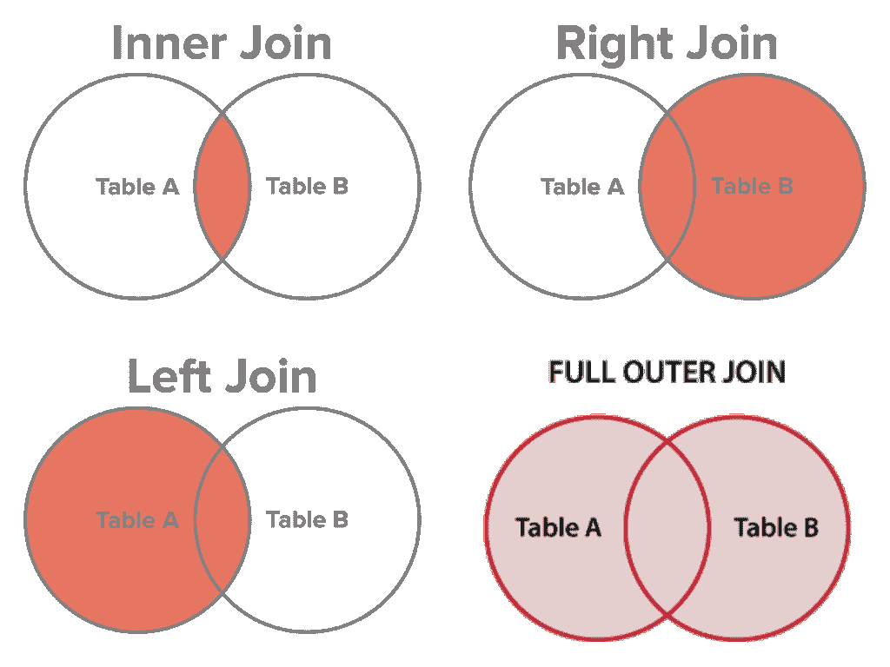

# 你所需的最后一本 SQL 数据分析指南

> 原文：[`www.kdnuggets.com/2019/10/last-sql-guide-data-analysis-ever-need.html`](https://www.kdnuggets.com/2019/10/last-sql-guide-data-analysis-ever-need.html)

评论

**由 [Muhsin Warfa](https://www.linkedin.com/in/muhsinwarfa/)，系统开发员/技术写作人**


照片由 [Tobias Fischer](https://unsplash.com/@tofi?utm_source=unsplash&utm_medium=referral&utm_content=creditCopyText) 提供，来自 [Unsplash](https://unsplash.com/s/photos/database?utm_source=unsplash&utm_medium=referral&utm_content=creditCopyText)

* * *

## 我们的前三名课程推荐

 1\. [谷歌网络安全证书](https://www.kdnuggets.com/google-cybersecurity) - 快速进入网络安全职业轨道

 2\. [谷歌数据分析专业证书](https://www.kdnuggets.com/google-data-analytics) - 提升你的数据分析技能

 3\. [谷歌 IT 支持专业证书](https://www.kdnuggets.com/google-itsupport) - 支持你的组织进行 IT 工作

* * *

到 2020 年，预计每秒将为地球上的每个人创造 1.7 MB 的数据。真是荒谬！数据将成为我们数字时代的新石油。数据的增长带来了从中提取意义的需求。这催生了许多职业，这些职业管理和分析数据以做出更明智的商业决策。许多这些职业要求你熟练管理数据库中的数据。

### 介绍

管理数据的一种常见方式是使用关系型数据库管理系统。关系型数据库以表格形式存储数据，由行和列组成。这些数据库通常包括数据和元数据。数据是存储在表中的信息，而元数据是描述数据库中数据结构或数据类型的数据。

为了能直接与这些数据库沟通，我们使用 SQL，它是结构化查询语言（Structured Query Language）的缩写。SQL 用于执行如创建、读取、更新和删除数据库中的表等任务。

SQL 是一种声明式且特定领域的语言，主要由商业分析师、软件工程师、数据分析师以及许多其他利用数据的职业使用。你不需要成为程序员或了解如 Python 等编程语言才能掌握 SQL。SQL 的语法类似于英语。只需记住一些简单的语法，你就能舒适地使用数据库系统。

> “声明式编程是你说出你想要的结果，而无需说明如何做到这一点。与过程式编程相比，你必须指定获得结果的确切步骤。” — Stack Overflow

我在这篇文章中的目标是让你熟悉 SQL，并逐一介绍 SQL 概念，同时提出处理数据库的查询。

### 数据库设置

在本教程中，我们不会使用关系数据库管理系统（RDBMS），而是使用测试数据库来编写我们自己的查询。我们将使用 W3school 的 SQL 编辑器编辑测试数据库，链接见[这里](https://www.w3schools.com/sql/trysql.asp?filename=trysql_select_all)。它无需安装，因此我们可以专注于编写查询。

**备忘单**

由于 SQL 是一种声明性语言，记住 SQL 语句将大有帮助。随时保持一份参考指南，将有助于快速掌握查询表格时使用的关键字。[这里](https://docs.google.com/spreadsheets/d/1_HkCVTOpkaDPzg4dmFLJRYQhODKiVBRdX7F3GUI6O3s/edit?usp=sharing)是我创建的关键字电子表格，供参考。记住，掌握这只 SQL 猛兽的一半战斗就是记住/了解关键字。

**数据定义语言（DDL）**

我们的大多数查询将涉及对表格执行某种形式的*操作*。操作分为四类：创建、插入、更新和删除表格。

**创建表格**

当我们想在数据库中创建表格时，使用`CREATE TABLE`语句。将以下代码输入编辑器：

```py
CREATE TABLE Countries(
    Country_id int,
    Country_name varchar(255),
    Continent varchar(255),
    Population int
);
```

这将创建一个名为`countries`的表格，其中包含四列。创建 SQL 表格的最低要求是指定列名、数据类型和长度。当然，你还可以拥有更多特性，如`Not Null`，意味着表格中不会输入空值，但这些是可选属性。

### 与表格一起工作

**插入表格**

创建表格后，我们可以使用`INSERT INTO`方法语句插入行。输入以下代码：

```py
INSERT INTO countries(Country_id,Country_name, Continent,Population)
VALUES (1,'Somalia','Africa',14000000);
```

该语句将`Somali`作为新国家添加到`countries`表格中。在插入行时，指定列名和值是一个好习惯。

**读取表格**

当我们想查找存储在数据库中的数据时，使用`Select`语句。

```py
Select * from Countries;
```

该语句返回一个表格，显示我们刚刚使用插入语句插入的行。`*`通配符表示“显示表格中的所有行”。如果你只想显示`Population`列，可以去掉星号，替换为其列名。

```py
Select Population from Countries;
```

**更新表格**

如果我们想修改表格中的现有记录，可以使用`UPDATE`语句来做到这一点。

```py
UPDATE Countries
SET Country_name ='Kenya'
WHERE Country_id=1;
```

该语句将`country_id`为`1`的行中的`country_name`列更新为`Kenya`。我们必须指定国家 ID，因为我们只想更改那一行。如果我们去掉`WHERE`语句，SQL 会认为我们想更新表格中的所有行。

**删除表格中的记录**

如果我们想删除表格中的所有行，则使用`DELETE FROM`语句。

```py
DELETE FROM Countries;
```

如果你想删除表格而不是所有记录，可以使用`DROP TABLE`语句。

```py
DROP TABLE Countries;
```

**注意：** 这会从数据库中删除整个表格，可能导致数据丢失！

### 过滤器

如果我们只对表格中的部分数据感兴趣，我们可以筛选表格。我们有多个语句可以用来筛选表格。过滤器基本上选择符合某些标准的行，并将结果作为过滤后的数据集返回。筛选表格不会更改原始表格。

**WHERE**

`WHERE` 子句用于筛选记录。在我们的编辑器中有一个名为 `Customers` 的表。如果我们想筛选来自 `“USA”` 的客户，我们使用 `WHERE` 语句。

```py
SELECT * from Customers WHERE country = "USA";
```

**AND, OR 和 NOT**

在我们之前的例子中，只有一个条件，即“国家是美国”。我们还可以使用 `AND`、`OR` 和 `NOT` 组合多个条件。例如，如果你想要来自美国或巴西的客户，你可以使用 `OR` 语句。

```py
SELECT * from Customers WHERE country = "USA" OR country = "Brazil";
```

**ORDER BY**

大多数时候，当我们筛选表格时，返回的数据集是未排序的。我们可以使用 `ORDER BY` 语句对这个筛选后的未排序数据集进行排序。

```py
SELECT * from Customers WHERE country = "USA" OR country = "Brazil" 
ORDER BY CustomerName ASC;
```

这将按字母顺序对筛选结果进行排序。如果我们想要降序排序，可以将 `ASC` 替换为 `DESC`。

**BETWEEN**

有时我们希望选择值满足特定范围的行。我们使用 `BETWEEN` 语句来选择并定义范围。

```py
SELECT * from Products
WHERE Price BETWEEN 10 AND 20;
```

上述语句筛选了价格在 10 到 20 之间的产品。

**注意：** 在 `BETWEEN` 操作中，下限和上限都是包含在内的。

**LIKE**

有时我们想根据特定模式筛选表格。为此，我们使用 `LIKE` 语句。

```py
SELECT * from Customers
WHERE CustomerName LIKE 'A%';
```

上述 SQL 语句筛选了表格，只显示名字以字母 A 开头的客户。如果你将百分号向前移动，它会筛选名字以字母 A 结尾的客户。

**GROUP BY**

`GROUP BY` 将筛选后的结果集分组。可以将其视为每列数据集的汇总组。

```py
SELECT COUNT(CustomerID), Country
FROM Customers
GROUP BY Country;
```

该语句统计了每个国家的客户数量，然后按国家分组。`GROUP BY` 通常与聚合函数一起使用，后者我们将在文章的后面详细讨论。

**HAVING**

`HAVING` 的引入是因为 `WHERE` 语句不能与聚合函数一起使用，它只处理数据库中的直接值。

```py
SELECT COUNT(CustomerID), Country
FROM Customers
GROUP BY Country
HAVING COUNT(CustomerID) > 3;
```

这个语句与上一个例子做的事情一样。唯一的区别是我们只包括客户数量超过三人的国家。

### 连接

想象一下你想知道哪个客户订购了哪些产品。如果数据库遵循正确的数据库规范化技术，那么产品、客户和订单将被存储在不同的表中。如果我们想查看哪个客户订购了哪些产品，我们需要在订单表中查找客户 ID，然后去客户表查看产品购买情况，再使用产品 ID 查找产品表。正如你所看到的，如果需要重复多次，这将是一个巨大的麻烦。为了更轻松地完成这个操作，SQL 提供了一个名为 `JOIN` 的语句。这个子句用于基于共享的相关列将两个或更多的表行合并。



**内连接**

`INNER JOIN`，通常简称为 "`JOIN`"，用于在共享列上将相关表合并成一个表。

```py
SELECT Orders.OrderID, Customers.CustomerName
FROM Orders
INNER JOIN Customers ON Orders.CustomerID = Customers.CustomerID;
```

上述语句返回列的订单 ID 和客户姓名。我们将订单表（左）和客户表（右）连接，但仅包括那些具有匹配客户 ID 的行。在查看内连接的维恩图时重新阅读这句话，希望这样更容易理解。

**左连接**

```py
SELECT Customers.CustomerName, Orders.OrderID
FROM Customers
LEFT JOIN Orders ON Customers.CustomerID = Orders.CustomerID
ORDER BY Customers.CustomerName;
```

`LEFT JOIN` 语句用于将左表（客户表）和右表（订单表）连接，返回左表中的所有行以及右表中匹配的记录。

**右连接**

```py
SELECT Orders.OrderID, Employees.LastName, Employees.FirstName
FROM Orders
RIGHT JOIN Employees ON Orders.EmployeeID = Employees.EmployeeID
ORDER BY Orders.OrderID;
```

`RIGHT JOIN` 返回右表中的所有行以及左表中匹配的记录。这将返回所有员工及他们可能下的任何订单。

**外连接**

```py
SELECT Customers.CustomerName, Orders.OrderID
FROM Customers
FULL OUTER JOIN Orders ON Customers.CustomerID=Orders.CustomerID
ORDER BY Customers.CustomerName;
```

也被称为 `FULL OUTER JOIN`，用于将一个或多个表中的所有行合并。没有行会被遗漏，所有行都将包含在连接后的表中。

### SQL 聚合函数

函数是一组接受输入并输出结果的过程。SQL 函数基本上是一组 SQL 语句，它接受输入，对输入执行 SQL 操作，然后将结果作为输出返回。

SQL 中有两种类型的函数：*集合函数* 和 *值函数*。任何操作表中数据行并返回单个值的函数称为集合函数。程序员通常称它们为聚合函数，因为它们将表中的行汇总成一个信息聚合。

**最小值**

```py
SELECT MIN(Price) AS LeastPricy
FROM Products;
```

这个 SQL 函数返回产品表中所有产品的最低价格。

**最大值**

```py
SELECT MAX(Price) AS MostExpensive
FROM Products;
```

这个 SQL 函数返回产品表中所有产品的最高价格。

**平均值**

```py
SELECT AVG(Price) AS AveragePrice
FROM Products;
```

这个 SQL 函数返回产品表中所有产品的平均价格。

**计数**

```py
SELECT COUNT(ProductID)
FROM Products;
```

这返回产品表中产品的数量。

### 总和

```py
SELECT SUM(Quantity)
FROM OrderDetails;
```

这返回订单详情表中所有订单的总和。

### 索引

到目前为止，我们所看过的查询都是基本查询。实际上，我们在日常生活中执行的查询通常由多个 SQL 语句或函数的组合构成。当操作复杂时，这将减少查询的执行时间。

幸运的是，SQL 有一种叫做 *索引* 的功能，可以加快查找速度。索引是一种数据结构，它指向表中的数据。如果没有索引，搜索表中的数据将是 *线性的*，意味着会逐行扫描。索引非常适合表格数据。

**创建索引**

```py
CREATE INDEX idx_lastname
ON Persons (LastName);
```

这将创建一个索引以便快速查找列中的数据。需要注意的是，索引不存储在表中，对肉眼不可见。我们通常在有大量数据检索时使用索引。

### 数据库事务

*事务* 是一系列必须执行的 SQL 语句，以确保操作成功。事务是“全有或全无”的操作。如果所有操作中只有一个失败，我们认为整个事务失败了。

事务的一个常见示例是将资金从一个账户转到另一个账户。为了使转账成功，必须从账户 A 中扣除资金并添加到账户 B 中。否则，我们将回滚事务以重新开始。当事务完成时，我们称之为 *提交*。这确保了数据库维护数据的完整性和一致性。

如果你想深入了解数据库事务，我建议你查看 [this](https://www.youtube.com/watch?v=is03uRYFgqc) 这段关于数据库事务的优秀视频讲解。

### 数据库触发器

并非所有 SQL 查询都是单独的和孤立的。有时我们希望在另一表 B 上发生不同事件时，对表 A 执行某个操作。这就是我们使用 *数据库触发器* 的地方。

数据库触发器是一组在数据库内发生特定操作时执行的 SQL 语句。触发器被定义为在对表数据进行更改时运行，主要是在 `DELETE`、`UPDATE` 和 `CREATE` 等操作之前或之后。数据库触发器的最常见用例是验证输入数据。

### 提示

1.  所有 SQL 保留字均为大写。其他所有内容（表、列等）均为小写。

1.  将查询分成多行，而不是在单行中编写一个长语句。

1.  你不能在表中添加特定位置的列，所以在设计表时要小心。

1.  使用 `AS` 别名语句时请注意；列名并没有在表中被重命名。别名仅在数据集结果中出现。

1.  SQL 按以下顺序评估这些子句：`FROM`、`WHERE`、`GROUP BY`、`HAVING`，最后是 `SELECT`。因此，每个子句都接收前一个筛选器的过滤结果。它的样子是这样的：

```py
SELECT(HAVING(GROUP BY(WHERE(FROM...))))
```

### 结论

你可以从我们在本文中看到的 SQL 语句的无尽排列中生成强大的查询。记住，巩固概念并提高 SQL 水平的最佳方式是通过练习和解决 SQL 问题。上面的部分示例灵感来源于[W3School](https://www.w3schools.com/)。你可以在像[hackerrank](http://hackerrank.com/)和[LeetCode](https://leetcode.com/)这样的互动网站上找到更多练习，它们有吸引人的用户界面，帮助你更长时间地学习。

> **你练习得越多，你会变得越好，你训练越严格，他们就会看到你更大的潜力。*** — Alcurtis Turner*

祝愿你平安和繁荣！

**简介：[穆欣·沃尔法](https://www.linkedin.com/in/muhsinwarfa/)** 为您的组织需求构建和设计全栈网络软件应用程序。作为软件产品开发者，他参与了多个项目，从商业应用到学生课程应用，涵盖了从概念化和构思到测试和部署的所有开发生命周期。如果你喜欢这篇文章，请随时[在 LinkedIn 上联系和保持联系](https://www.linkedin.com/in/muhsinwarfa/?locale=de_DE)，并关注更多文章/帖子。

[原文](https://medium.com/better-programming/the-last-sql-guide-for-data-analysis-youll-ever-need-17ae10fa4a6f)。已获许可转载。

**相关：**

+   数据科学家的顶级实用 SQL 功能

+   2019 版掌握数据科学 SQL 的 7 个步骤

+   数据科学家需要 SQL 吗？

### 更多相关主题

+   [成为优秀数据科学家所需的 5 项关键技能](https://www.kdnuggets.com/2021/12/5-key-skills-needed-become-great-data-scientist.html)

+   [每个初学者数据科学家应该掌握的 6 种预测模型](https://www.kdnuggets.com/2021/12/6-predictive-models-every-beginner-data-scientist-master.html)

+   [2021 年最佳 ETL 工具](https://www.kdnuggets.com/2021/12/mozart-best-etl-tools-2021.html)

+   [每个数据科学家都应该了解的三个 R 库（即使你使用 Python）](https://www.kdnuggets.com/2021/12/three-r-libraries-every-data-scientist-know-even-python.html)

+   [停止学习数据科学以寻找目标，并找到目标去…](https://www.kdnuggets.com/2021/12/stop-learning-data-science-find-purpose.html)

+   [建立一个稳固的数据团队](https://www.kdnuggets.com/2021/12/build-solid-data-team.html)
