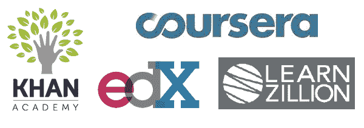
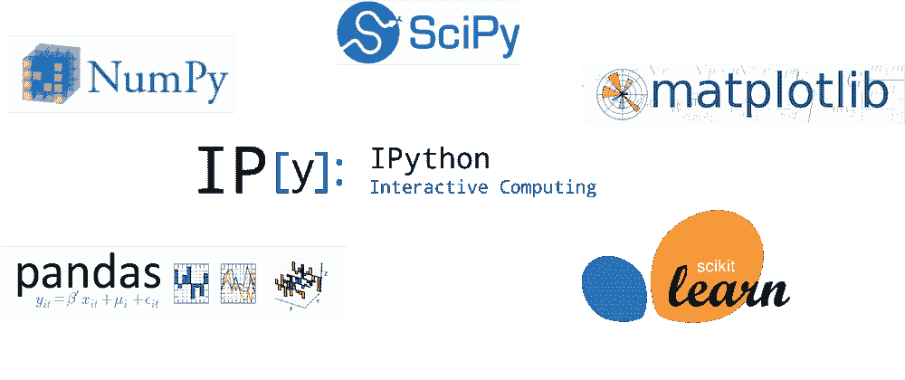
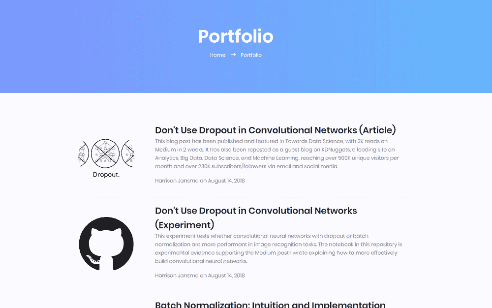

# 如何在破产时学习数据科学

> 原文：[`www.kdnuggets.com/2018/10/learn-data-science-broke.html`](https://www.kdnuggets.com/2018/10/learn-data-science-broke.html)

 评论

**由 [Harrison Jansma](https://www.harrisonjansma.com/)**。

* * *

## 我们的前三大课程推荐

 1\. [Google 网络安全证书](https://www.kdnuggets.com/google-cybersecurity) - 快速进入网络安全职业的快车道。

 2\. [Google 数据分析专业证书](https://www.kdnuggets.com/google-data-analytics) - 提升你的数据分析技能

 3\. [Google IT 支持专业证书](https://www.kdnuggets.com/google-itsupport) - 支持你的组织 IT

* * *

在过去的一年里，我自学了数据科学。我从数百个在线资源中学习，每天学习 6 到 8 小时。同时，我还在一家日托中心以最低工资工作。

**我的目标是开始一份我热爱的职业，尽管资金不足。**

正因为这个选择，我在过去几个月里取得了很多成就。我发布了自己的 [网站](https://harrisonjansma.com/)，被一家主要的在线数据科学 [出版物](https://www.kdnuggets.com/2018/09/dropout-convolutional-networks.html) 刊登，并获得了竞争激烈的计算机科学研究生 [项目](https://cs.utdallas.edu/)的奖学金。

在以下文章中，我提供了指南和建议，以便你可以制定自己的数据科学课程。我希望能为他人提供工具，以开始他们自己的教育旅程，从而开始朝着更具激情的数据科学职业发展。

#### 快速说明

当我说“数据科学”时，我指的是将数据转化为实际行动的工具集合。这些包括机器学习、数据库技术、统计学、编程和领域特定的技术。

### 一些资源来开始你的旅程。

互联网是一个混乱的局面。从中学习往往感觉像是从消防水龙头的喷射端喝水。

[来源](https://unsplash.com/@darwiiiin?utm_source=medium&utm_medium=referral)

有一些更简单的替代方案可以为你整理混乱的局面。

像 [Dataquest](https://www.dataquest.io/subscribe)、 [DataCamp](https://www.datacamp.com/pricing) 和 [Udacity](https://www.class-central.com/pricing-charts/udacity-nanodegrees) 这样的站点都提供数据科学技能的学习机会。每个网站都创建了一个教育程序，引导你从一个主题到另一个主题。每个都需要你花费很少的课程规划时间。

问题是什么？它们成本太高，它们不教你如何在工作环境中应用概念，而且它们阻止你探索自己的兴趣和激情。

有一些免费的替代方案，比如[edX](https://www.edx.org/)和[coursera](https://www.coursera.org/)，它们提供深入特定主题的一次性课程。如果你从视频或课堂环境中学得比较好，这些都是学习数据科学的极佳途径。

免费在线教育平台，查看这个[网站](https://www.class-central.com/subject/data-science)以获取可用的数据科学课程列表。你还可以使用一些免费的课程大纲。看看[David Venturi](https://medium.com/@davidventuri/i-dropped-out-of-school-to-create-my-own-data-science-master-s-here-s-my-curriculum-1b400dcee412)的文章，或者[开放源代码数据科学硕士](http://datasciencemasters.org/)（一个更传统的教育计划）。

如果你通过阅读学习得比较好，可以看看[从零开始的数据科学](http://shop.oreilly.com/product/0636920033400.do)这本书。这本教科书是一个完整的学习计划，可以通过在线资源进行补充。你可以在[pdf](http://math.ecnu.edu.cn/~lfzhou/seminar/%5bJoel_Grus%5d_Data_Science_from_Scratch_First_Princ.pdf)格式（免费）找到整本书，或者从[亚马逊](https://www.amazon.com/Data-Science-Scratch-Principles-Python/dp/149190142X)($27)获得一本实体书。

**这些只是提供详细数据科学学习路径的一些免费资源，还有很多其他的。**

为了更好地理解你在教育旅程中需要获得的技能，在下一部分我将详细介绍一个更广泛的课程指南。这旨在提供高层次的指导，而不仅仅是课程或书籍的列表。

### 课程指南

数据科学课程指南

#### **Python 编程**

编程是数据科学家的基本技能。熟练掌握 Python 的语法。了解如何以多种不同方式运行 Python 程序。（Jupyter notebook vs. 命令行 vs IDE）

我花了大约一个月的时间复习[Python 文档](https://docs.python.org/3/tutorial/)、[Python 指南](https://docs.python-guide.org/intro/learning/)以及在[CodeSignal](https://codesignal.com/)上的编码挑战。

提示：留意程序员使用的常见问题解决技巧。（发音为“算法”）

#### **统计学和线性代数**

机器学习和数据分析的前提条件。如果你已经对这些有扎实的理解，花一两周时间复习关键概念。

**特别关注描述性统计**。能够理解数据集是一项非常宝贵的技能。

#### **Numpy, Pandas, 和 Matplotlib**

学习如何加载、操作和可视化数据。掌握这些库对你的个人项目至关重要。

小提示：不要觉得你必须记住每个方法或函数名，这需要实践。如果忘记了，可以用 Google 搜索。

查看[Pandas 文档](http://pandas.pydata.org/pandas-docs/stable/)、[Numpy 文档](https://docs.scipy.org/doc/numpy/user/index.html)和[Matplotlib 教程](https://matplotlib.org/tutorials/index.html)。虽然还有更好的资源，但这些是我使用过的。

记住，你唯一能够学习这些库的方法就是使用它们！

#### **机器学习**

学习机器学习算法的理论和应用。然后将你学到的概念应用到你关心的真实数据上。

大多数初学者从使用[UCI ML 数据库](https://archive.ics.uci.edu/ml/index.php)中的玩具数据集开始。玩弄这些数据，并通过指导性机器学习教程进行学习。

[Scikit-learn](http://scikit-learn.org/stable/)文档提供了关于常用算法应用的优秀教程。我还发现这个[podcast](http://ocdevel.com/mlg)是一个很棒（且免费的）机器学习理论教育资源。你可以在通勤或锻炼时收听它。

#### **生产系统**

找到工作意味着能够将真实数据转化为行动。

为了做到这一点，你需要学习如何使用商业计算资源来获取、转换和处理数据。

亚马逊 Web 服务、谷歌云、微软 Azure 这是数据科学课程中最少教授的部分。主要是因为你使用的具体工具取决于你进入的行业。

**然而，数据库操作是一个必要的技能。** 你可以在[ModeAnalytics](https://modeanalytics.com/)或[Codecademy](https://www.codecademy.com/)上学习如何使用代码操作数据库。你也可以在[DigitalOcean](https://www.digitalocean.com/)上便宜地实现自己的数据库。

**另一个（通常）需要的技能是**[**版本控制**](https://git-scm.com/book/en/v2/Getting-Started-About-Version-Control)**。** 你可以通过创建一个[GitHub](https://github.com/)账户并使用命令行每天提交代码，轻松掌握这个技能。

在考虑学习其他技术时，重要的是要考虑你的兴趣和热情。例如，如果你对网页开发感兴趣，那么了解一下该行业公司使用的工具。

### 执行课程的建议。

由[Ugur Akdemir](https://unsplash.com/@ugur?utm_source=medium&utm_medium=referral)在[Unsplash](https://unsplash.com/?utm_source=medium&utm_medium=referral)提供

### 1. 概念会比你学习的速度更快地出现。

事实上，有成千上万的网页和论坛解释常用数据科学工具的使用。因此，在网上学习时很容易被分散注意力。

当你开始研究一个主题时，你需要牢记你的目标。如果不这样做，你可能会被吸引到任何引起你注意的有趣链接上。

解决方案是**获取一个好的存储系统来保存有趣的网络资源**。这样你可以将资料保存以备后用，专注于当前对你有用的主题。

我当前的 Chrome 书签栏 如果你做对了，你可以创建一个有序的学习路径，展示你应该专注的内容。你还会学得更快，避免被分心。

警告，**你的阅读列表会很快增长到数百项**，因为你会探索新的感兴趣的主题。别担心，这引出了我的第二条建议。

### 2\. 不要焦虑。这是一场马拉松，而不是短跑。

自我驱动的教育常常感觉像是在阅读一个永无止境的知识库。

如果你想在数据科学领域获得成功，你需要把你的教育视为一个终身的过程。

只要记住，学习的过程本身就是一种回报。

**在你的教育旅程中，你将探索自己的兴趣，并发现更多驱动你的东西**。你对自己的了解越多，你从学习中获得的乐趣也会越多。

### 3. 学习 -> 应用 -> 重复

不要满足于仅仅学习一个概念然后转到下一个东西。学习的过程不会停止，直到你能够将一个概念应用到现实世界中。

by [Allef Vinicius](https://unsplash.com/@seteales?utm_source=medium&utm_medium=referral) on [Unsplash](https://unsplash.com/?utm_source=medium&utm_medium=referral) 不是每个概念都需要在你的作品集中有一个专门的项目。但重要的是要保持脚踏实地，**记住你在学习是为了在世界上产生影响。**

### 4\. 建立一个作品集，它向他人展示他们可以信任你。

归根结底，**怀疑是你在学习数据科学时将面临的最大困境之一。**

这可能来自他人，也可能来自[你自己](https://en.wikipedia.org/wiki/Impostor_syndrome)。

你的作品集是你向世界展示你自己能力和自信的方式。

因此，建立一个作品集是你在学习数据科学期间最重要的事情。一个好的作品集可以帮你找到工作，并让你成为一个更自信的数据科学家。

**把你引以为傲的项目填充到你的作品集中。**

你是否从零开始构建了自己的网页应用程序？你是否创建了自己的 IMDB 数据库？你是否写过一篇有趣的医疗数据分析？

把它放入你的作品集中。

**只需确保撰写的内容易于阅读，代码有良好的文档，并且作品集本身看起来不错。**

[`harrisonjansma.com/archive`](https://harrisonjansma.com/archive) 这是我的作品集。一个更简单的发布作品集的方法是创建一个包含出色的 ReadMe（摘要页面）以及相关项目文件的 GitHub 仓库。

这是一个美观却简单的[GitHub 作品集](https://github.com/alexhuang1117/Data-Science-Portfolio)。对于更高级的作品集，可以考虑使用 GitHub-IO 来托管你自己的免费网站。（[示例](https://alexisbcook.github.io/#blog)）

### 5\. 数据科学 + _______ = 激情事业

#### 填空。

数据科学是一套旨在改变世界的工具。一些数据科学家建立计算机视觉系统来诊断医学影像，另一些则遍历数十亿的数据条目以找出网站用户偏好的模式。

**数据科学的应用是无限的，这也是为什么找到让你兴奋的应用是很重要的。**

如果你发现你热衷的主题，你会更愿意投入工作以做出一个出色的项目。这引出了我在这篇文章中最喜欢的建议。

**在学习时，要时刻留意那些让你兴奋的项目或创意。**

[Stefan Steinbauer](https://unsplash.com/@usinglight?utm_source=medium&utm_medium=referral)在[Unsplash](https://unsplash.com/?utm_source=medium&utm_medium=referral)上。花时间学习后，尝试连接点滴。找到让你着迷的项目之间的相似性。然后花一些时间研究那些类型项目的行业。

一旦你找到一个你充满热情的行业，将其作为你的目标，获取该行业所需的技能和技术专长。

**如果你能做到这一点，你将有能力将你的努力和对学习的热情转化为一份充满激情和成功的事业。**

### 结论

如果你喜欢发现世界的奥秘。如果你对人工智能着迷。那么，无论你的情况如何，你都可以进入数据科学行业。

这不会很容易。

要激励你自己的教育，你需要毅力和纪律。但是如果你是那种能自我推动以提高自己的人，你完全有能力独立掌握这些技能。

毕竟，这就是数据科学家的全部意义。好奇心、自我驱动，以及对寻找答案的热情。

#### **如果你想要更多高质量的数据科学文章，请关注我。** **????**

[原文](https://towardsdatascience.com/how-to-learn-data-science-if-youre-broke-7ecc408b53c7sk=4df4875d7a4b02be378af9d21503d5c2)。经许可转载。

**个人简介**：[Harrison Jansma](https://www.harrisonjansma.com/) 是一位自学成才的数据科学家。在过去的 9 个月里，Harrison 离开了他的工作，开始全职学习机器学习，并报名攻读计算机科学硕士课程。Harrison 之所以这样做，是因为他的热情和目标是将机器学习应用于现实世界。这意味着对预测建模和生产环境有深入的理解。

**相关：**

+   [为什么数据科学家职业协会是个糟糕的主意](https://www.kdnuggets.com/2018/07/professional-association-data-scientists-bad-idea.html)

+   [打破四年低谷：数据科学中的中期职业成长](https://www.kdnuggets.com/2018/07/mid-career-growth-data-science.html)

+   [数据工程师与数据科学家：激进物种的进化](https://www.kdnuggets.com/2018/05/dsti-data-engineer-vs-data-scientist.html)

### 更多相关主题

+   [成为优秀数据科学家所需的 5 项关键技能](https://www.kdnuggets.com/2021/12/5-key-skills-needed-become-great-data-scientist.html)

+   [每个初学者数据科学家应该掌握的 6 个预测模型](https://www.kdnuggets.com/2021/12/6-predictive-models-every-beginner-data-scientist-master.html)

+   [2021 年最佳 ETL 工具](https://www.kdnuggets.com/2021/12/mozart-best-etl-tools-2021.html)

+   [停止学习数据科学以寻找目标，并寻找目标以…](https://www.kdnuggets.com/2021/12/stop-learning-data-science-find-purpose.html)

+   [每个数据科学家都应该了解的三个 R 库（即使你使用 Python）](https://www.kdnuggets.com/2021/12/three-r-libraries-every-data-scientist-know-even-python.html)

+   [学习数据科学统计的顶级资源](https://www.kdnuggets.com/2021/12/springboard-top-resources-learn-data-science-statistics.html)
