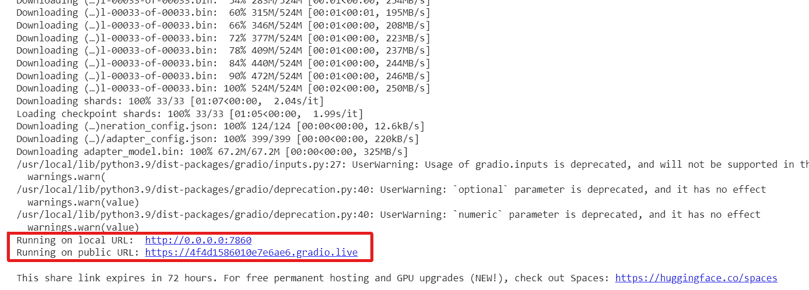

# 了解如何在您的设备上仅需几个步骤运行 Alpaca-LoRA

> 原文：[`www.kdnuggets.com/2023/05/learn-run-alpacalora-device-steps.html`](https://www.kdnuggets.com/2023/05/learn-run-alpacalora-device-steps.html)


作者提供的图片

[ChatGPT](https://openai.com/blog/chatgpt) 是一个 AI 语言模型，并在最近几个月获得了广泛关注。它有两个受欢迎的版本，GPT-3.5 和 GPT-4。GPT-4 是 GPT-3.5 的升级版，提供了更准确的答案。但 ChatGPT 的主要问题在于它不是开源的，即不允许用户查看和修改其源代码。这导致了许多问题，如定制化、隐私和 AI 民主化。

* * *

## 我们的前三个课程推荐

 1\. [谷歌网络安全证书](https://www.kdnuggets.com/google-cybersecurity) - 快速进入网络安全职业道路。

 2\. [谷歌数据分析专业证书](https://www.kdnuggets.com/google-data-analytics) - 提升您的数据分析技能

 3\. [谷歌 IT 支持专业证书](https://www.kdnuggets.com/google-itsupport) - 支持您的组织 IT 需求

* * *

需要这样一些 AI 语言聊天机器人，它们能够像 ChatGPT 一样工作，但免费、开源且对 CPU 的需求较低。其中一个这样的 AI 模型是 Aplaca LoRA，我们将在教程中讨论它。通过这个教程，您将对它有一个良好的了解，并能使用 Python 在本地机器上运行它。但首先，让我们讨论一下 Alpaca LoRA 是什么。

# 什么是 Alpaca LoRA？

`Alpaca` 是由斯坦福大学的研究团队开发的 AI 语言模型。它使用了 Meta 的大规模语言模型 `LLaMA`。它利用 OpenAI 的 GPT (text-davinci-003) 来微调 7B 参数大小的 LLaMA 模型。它对学术和研究用途免费，计算需求较低。

团队从 LLaMA 7B 模型开始，并用 1 万亿个标记进行了预训练。他们从 175 个人工编写的指令-输出对开始，要求 ChatGPT 的 API 使用这些对生成更多对。他们收集了 52000 个样本对话，并用这些对进一步微调了他们的 LLaMA 模型。

`LLaMA` 模型有多个版本，即 7B、13B、30B 和 65B。`Alpaca` 可以扩展到 7B、13B、30B 和 65B 参数模型。


图 1 Aplaca 7B 架构 | 图片来源于[斯坦福大学](https://crfm.stanford.edu/2023/03/13/alpaca.html)

Alpaca-LoRA 是[斯坦福 Alpaca](https://crfm.stanford.edu/2023/03/13/alpaca.html)的一个较小版本，功耗更低，可以在低端设备如树莓派上运行。Alpaca-LoRA 使用[低秩适应(LoRA)](https://arxiv.org/pdf/2106.09685.pdf)来加速大模型的训练，同时消耗更少的内存。

# Alpaca LoRA Python 实现

我们将创建一个 Python 环境来在本地计算机上运行 Alpaca-LoRA。你需要一个 GPU 来运行该模型。它不能在 CPU 上运行（或运行非常缓慢）。如果使用 7B 模型，至少需要 12GB 的 RAM，如果使用 13B 或 30B 模型，则需要更高的内存。

如果你没有 GPU，可以在[Google Colab](https://colab.research.google.com/)中执行相同的步骤。最后，我会与你分享 Colab 链接。

我们将遵循[tloen](https://github.com/tloen/alpaca-lora)提供的 Alpaca-LoRA 的 GitHub 仓库。

## 1\. 创建虚拟环境

我们将在虚拟环境中安装所有库。这不是强制性的，但建议这么做。以下命令适用于 Windows 操作系统。（Google Colab 不需要这一步）

创建虚拟环境的命令

```py
$ py -m venv venv
```

激活虚拟环境的命令

```py
$ .\venv\Scripts\activate
```

关闭虚拟环境的命令

```py
$ deactivate
```

## 2\. 克隆 GitHub 仓库

现在，我们将克隆 Alpaca LoRA 的仓库。

```py
$ git clone https://github.com/tloen/alpaca-lora.git
$ cd .\alpaca-lora\
```

安装库

```py
$ pip install -r .\requirements.txt
```

## 3\. 训练

名为`finetune.py`的 Python 文件包含 LLaMA 模型的超参数，如批量大小、训练轮数、学习率（LR）等，你可以对这些参数进行调整。运行`finetune.py`不是强制性的。否则，执行文件将从`tloen/alpaca-lora-7b`读取基础模型和权重。

```py
$ python finetune.py \
    --base_model 'decapoda-research/llama-7b-hf' \
    --data_path 'yahma/alpaca-cleaned' \
    --output_dir './lora-alpaca' \
    --batch_size 128 \
    --micro_batch_size 4 \
    --num_epochs 3 \
    --learning_rate 1e-4 \
    --cutoff_len 512 \
    --val_set_size 2000 \
    --lora_r 8 \
    --lora_alpha 16 \
    --lora_dropout 0.05 \
    --lora_target_modules '[q_proj,v_proj]' \
    --train_on_inputs \
    --group_by_length
```

## 4\. 运行模型

名为`generate.py`的 Python 文件将从`tloen/alpaca-lora-7b`读取 Hugging Face 模型和 LoRA 权重。它使用 Gradio 运行一个用户界面，用户可以在文本框中输入问题，并在另一个文本框中接收输出。

**注意：** 如果你在 Google Colab 中工作，请在`generate.py`文件的`launch()`函数中标记`share=True`。这将使界面在公共 URL 上运行。否则，它将在本地主机`[`0.0.0.0:7860`](http://0.0.0.0:7860)`上运行。

```py
$ python generate.py --load_8bit --base_model 'decapoda-research/llama-7b-hf' --lora_weights 'tloen/alpaca-lora-7b'
```

**输出：**



它有两个 URL，一个是公开的，一个是在本地主机上运行的。如果你使用 Google Colab，可以访问公共链接。

## 5\. Docker 化应用程序

如果你希望将应用程序导出到某处或遇到一些依赖问题，你可以将应用程序[Docker 化](https://docs.docker.com/get-started/overview/)。Docker 是一个创建应用程序不可变镜像的工具。然后这个镜像可以被分享，并且可以转换回应用程序，这样它就能在一个包含所有必要库、工具、代码和运行时的容器中运行。你可以从[这里](https://docs.docker.com/desktop/install/windows-install/)下载适用于 Windows 的 Docker。

**注意：** 如果你使用 Google Colab，可以跳过这一步。

**构建容器镜像：**

```py
$ docker build -t alpaca-lora .
```

**运行容器：**

```py
$ docker run --gpus=all --shm-size 64g -p 7860:7860 -v ${HOME}/.cache:/root/.cache --rm alpaca-lora generate.py \
    --load_8bit \
    --base_model 'decapoda-research/llama-7b-hf' \
    --lora_weights 'tloen/alpaca-lora-7b'
```

它将在 `https://localhost:7860` 上运行您的应用程序。

# Alpaca-LoRA 用户界面

现在，我们的 Alpaca-LoRA 正在运行。接下来我们将探索它的一些功能，并请它为我们写一些东西。


图 2 Aplaca-LoRA 用户界面 | 图片由作者提供

它提供了类似 ChatGPT 的用户界面，我们可以提出问题，它会相应地回答。它还接受其他参数，如 Temperature、Top p、Top k、Beams 和 Max Tokens。基本上，这些是在评估时使用的生成配置。

有一个复选框 `Stream Output`。如果您勾选该复选框，机器人将一次回复一个标记（即逐行输出，就像 ChatGPT 一样）。如果您不勾选该选项，它将一次性写出全部内容。

让我们问他一些问题。

Q1: 编写一个 Python 代码来查找一个数字的阶乘。

输出：


图 3 输出-1 | 图片由作者提供

Q2: 将“KDnuggets 是一个领先的数据科学、机器学习、人工智能和分析网站。”翻译成法语。

输出：


图 4 输出-2 | 图片由作者提供

与 ChatGPT 不同，它也有一些限制。由于它没有连接互联网，可能不会提供最新的信息。此外，它可能会对社会中脆弱的群体传播仇恨和误信息。尽管如此，它仍然是一个优秀的免费开源工具，计算需求较低。对于从事伦理 AI 和网络安全活动的研究人员和学者来说，它可能是有益的。

Google Colab 链接 – [链接](https://colab.research.google.com/drive/1t3oXBoRYKzeRUkCBaNlN5u3xFvhJNVVM?usp=sharing)

# 资源

1.  GitHub – [tloen/alpaca-lora](https://github.com/tloen/alpaca-lora)

1.  Stanford Alpaca – [一个强大且可复制的指令跟随模型](https://crfm.stanford.edu/2023/03/13/alpaca.html)

在本教程中，我们讨论了 Alpaca-LoRA 的工作原理以及在本地或 Google Colab 上运行的命令。Alpaca-LoRA 并不是唯一一个开源的聊天机器人。还有许多其他开源且免费的聊天机器人，例如 LLaMA、GPT4ALL、Vicuna 等。如果你想要一个简要概述，可以参考 Abid Ali Awan 在 KDnuggets 上的[这篇](https://www.example.com/2023/04/8-opensource-alternative-chatgpt-bard.html)文章。

今天就到这里了。希望您喜欢阅读这篇文章。我们将在其他文章中再见。直到那时，请继续阅读和学习。

**[Aryan Garg](https://www.linkedin.com/in/aryan-garg-1bbb791a3/)** 是一名 B.Tech. 电气工程专业的学生，目前处于本科最后一年。他对网页开发和机器学习领域充满兴趣，并且已经在这方面进行了深入探索，渴望在这些方向上继续工作。

### 相关话题

+   [打破数据壁垒：零样本、单样本和少样本的…](https://www.kdnuggets.com/2023/08/breaking-data-barrier-zeroshot-oneshot-fewshot-learning-transforming-machine-learning.html)

+   [带开发者准备的软件栈的设备内 AI](https://www.kdnuggets.com/2022/03/qualcomm-ondevice-ai-developer-ready-software-stacks.html)

+   [确保 LLMs 的可靠少样本提示选择](https://www.kdnuggets.com/2023/07/ensuring-reliable-fewshot-prompt-selection-llms.html)

+   [用 llamafile 分发和运行 LLMs 的 5 个简单步骤](https://www.kdnuggets.com/distribute-and-run-llms-with-llamafile-in-5-simple-steps)

+   [使用 Jupysql 和 GitHub Actions 安排和运行 ETL](https://www.kdnuggets.com/2023/05/schedule-run-etls-jupysql-github-actions.html)

+   [入门 PyTest：轻松编写和运行 Python 测试](https://www.kdnuggets.com/getting-started-with-pytest-effortlessly-write-and-run-tests-in-python)
