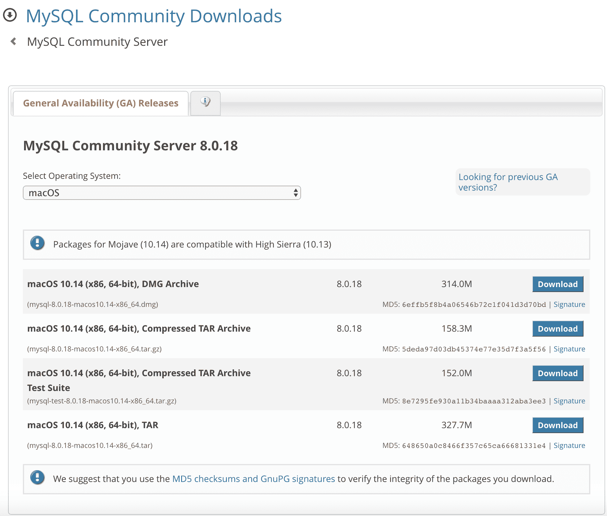
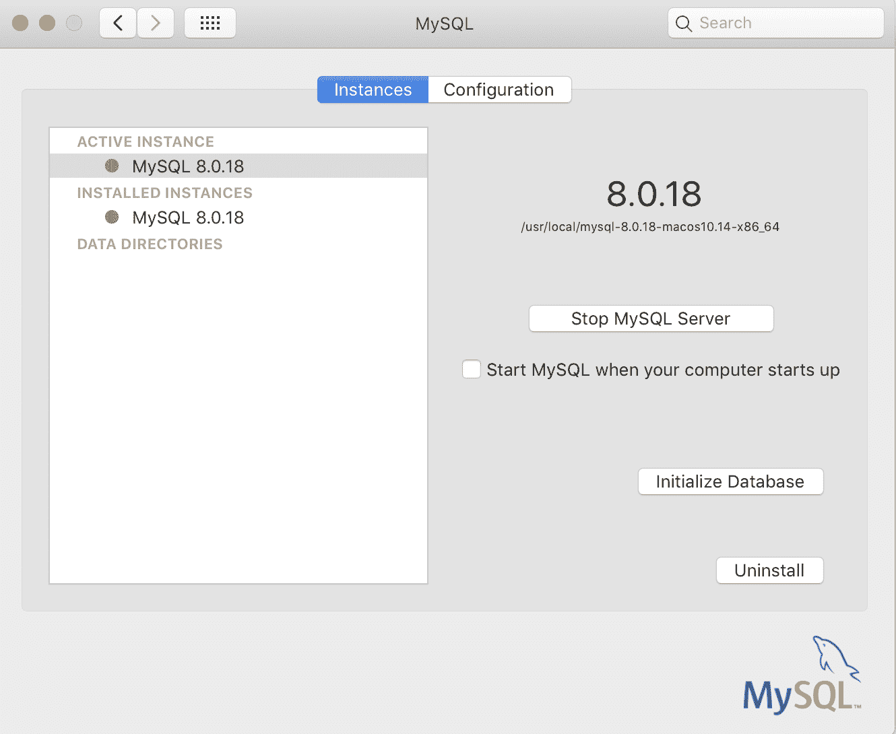
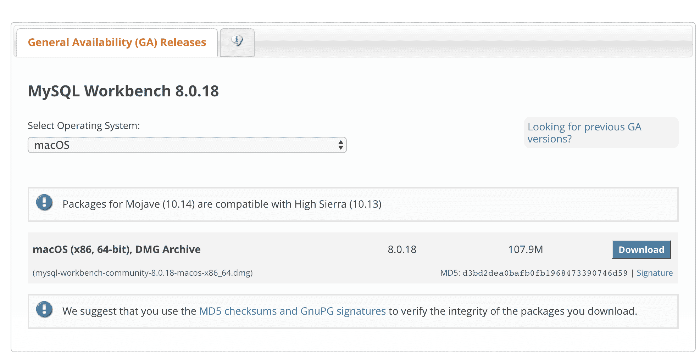
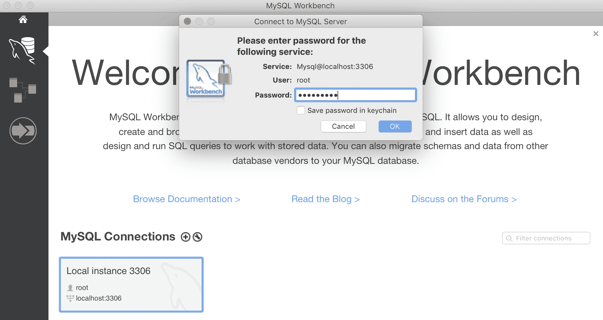
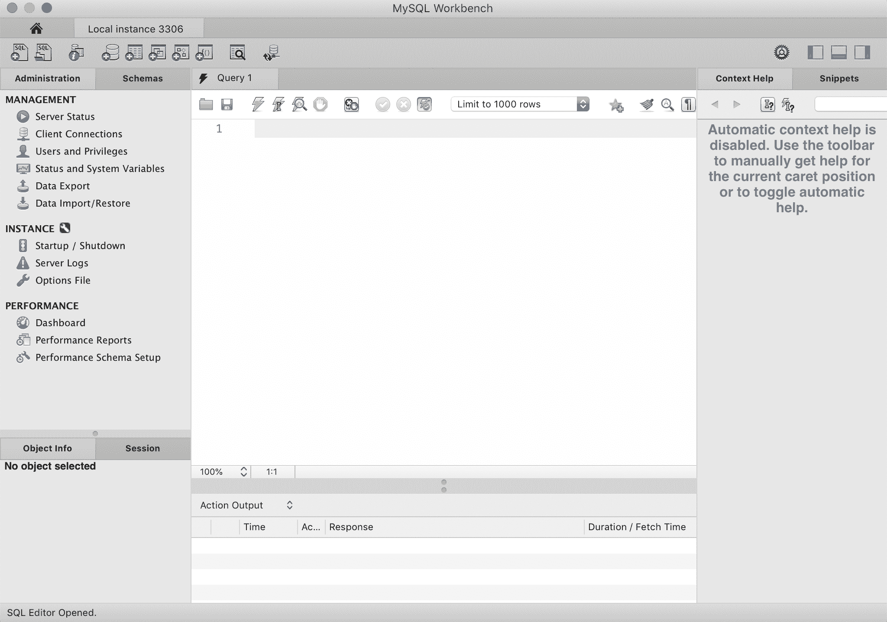
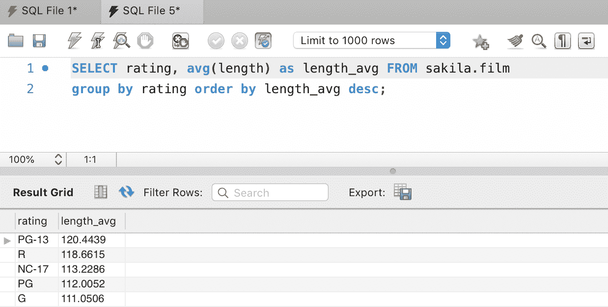
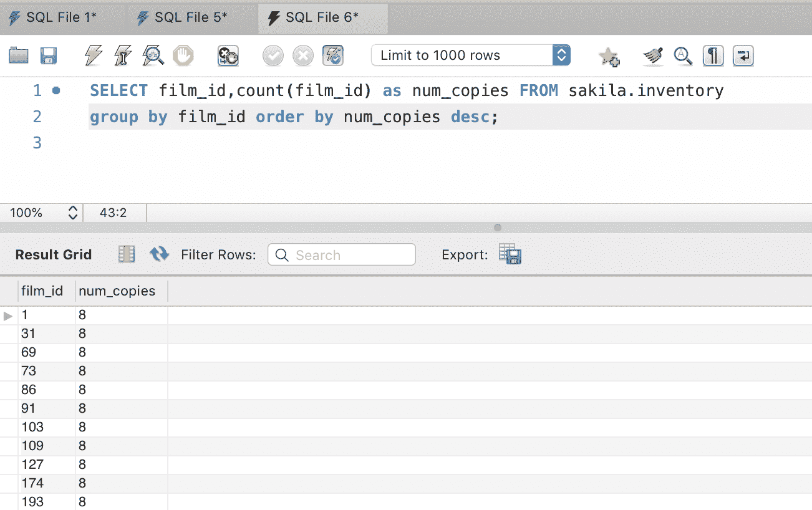
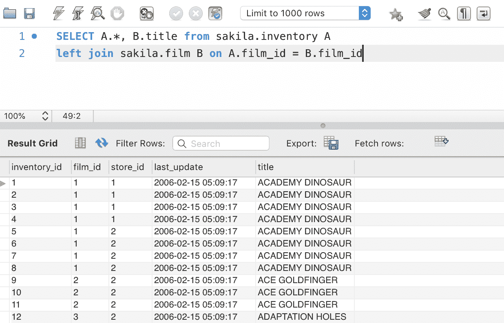
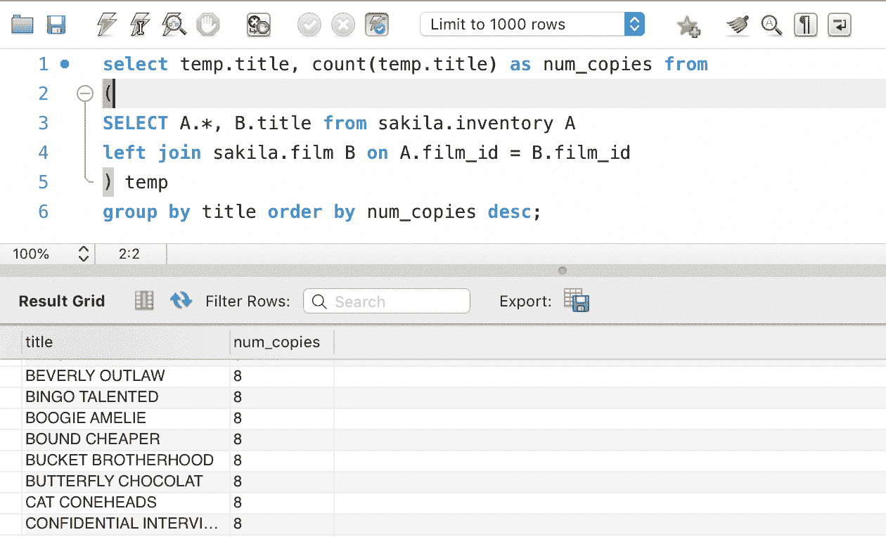
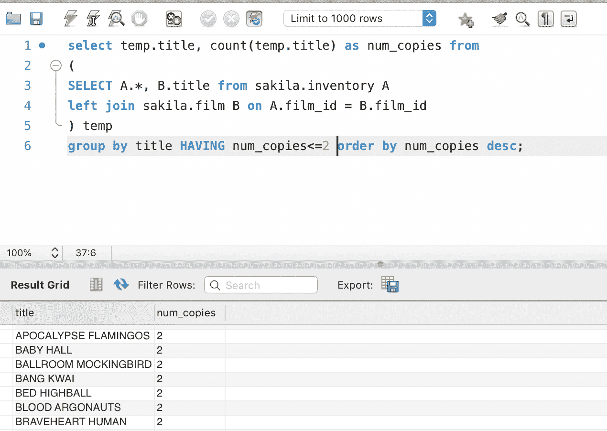

# 学习 SQL 的艰难方式

> 原文：[`www.kdnuggets.com/2020/01/learning-sql-hard-way.html`](https://www.kdnuggets.com/2020/01/learning-sql-hard-way.html)

comments 

[Source](https://pixabay.com/?utm_source=link-attribution&utm_medium=referral&utm_campaign=image&utm_content=1246836)

***一个不懂 SQL 的数据科学家是不值得的。***

在我看来，这在任何意义上都是正确的。虽然我们在创建模型和提出不同假设时感到更有成就，但数据处理的作用不可低估。

由于 SQL 在 ETL 和数据准备任务中的普遍性，每个人都应该了解一点，以便至少能有所帮助。

我仍然记得第一次接触 SQL 的情景。这是我学习的第一个语言（如果可以这么称呼的话）。它给我留下了深刻的影响。我能够自动化很多事情，这是我之前没有想到的。

在使用 SQL 之前，我曾经使用 Excel —— VLOOKUP 和数据透视表。我在创建报告系统，一遍又一遍地做着相同的工作。SQL 使这一切都消失了。现在我可以写一个大脚本，一切都自动化了——所有的交叉表和分析都能即时生成。

这就是 SQL 的威力。尽管你可以使用 [Pandas](https://towardsdatascience.com/minimal-pandas-subset-for-data-scientists-6355059629ae) 做 SQL 能做的任何事情，但你仍然需要学习 SQL，以处理 HIVE、Teradata 和有时 [Spark](https://towardsdatascience.com/the-hitchhikers-guide-to-handle-big-data-using-spark-90b9be0fe89a) 等系统。

***这篇文章是关于安装 SQL、解释 SQL 和运行 SQL 的。***

### 设置 SQL 环境

学习 SQL 的最佳方式是亲自动手实践（我对任何其他你想学的东西也这么说）。

我建议不要使用像 w3schools/tutorialspoint 这样的基于网络的 SQL 资源，因为你无法使用自己的数据。

此外，我建议你学习 MySQL 版本的 SQL，因为它是开源的，易于在你的笔记本电脑上设置，并且有一个名为 MySQL Workbench 的优秀客户端，可以让你的生活更轻松。

既然这些问题都解决了，这里是逐步设置 MySQL 的步骤：

+   你可以从 [Download MySQL Community Server](http://dev.mysql.com/downloads/mysql/) 下载适用于你系统的 MySQL（MACOSX、Linux、Windows）。在我的情况下，我下载了 DMG 压缩包。之后，双击并安装文件。***你可能需要设置一个密码。记住这个密码，因为稍后连接到 MySQL 实例时会用到。***



+   创建一个名为 `my.cnf` 的文件，并在其中放入以下内容。这是为了给你的 SQL 数据库提供本地文件读取权限。

```py
[client]
port= 3306
[mysqld]
port= 3306
secure_file_priv=''
local-infile=1
```

+   打开 `System Preferences>MySQL`。前往 `Configuration` 并使用选择按钮浏览到 `my.cnf` 文件。


+   从 `Instances` 选项卡重新启动服务器，点击停止然后启动。



+   一旦你让服务器运行起来，下载并安装 MySQL Workbench：[下载 MySQL Workbench](https://dev.mysql.com/downloads/workbench/)。Workbench 提供了一个编辑器，用于编写 SQL 查询并以结构化的方式获取结果。



+   现在打开 MySQL Workbench 并连接到 SQL。你将看到如下界面。


+   你可以看到本地实例连接已经为你设置好了。现在，只需点击该连接，使用我们之前为 MySQL 服务器设置的密码开始使用（如果你有地址、端口号、用户名和密码，你也可以创建连接到其他可能不在你机器上的现有 SQL 服务器）。



+   这样你就可以在特定数据库上编写查询。



+   检查左上角的 `Schemas` 选项卡，查看现有的表。这里只有一个 `sys` 模式，包含表 `sys_config`。这不是一个有趣的数据源来学习 SQL。所以，让我们安装一些数据进行练习。

+   如果你有自己的数据进行操作，那很好。你可以创建一个新的模式（数据库）并使用以下命令将其上传到表中。（你可以通过使用 `Cmd+Enter` 或点击 ⚡️闪电按钮运行命令）


在本教程中，我将使用 Sakila 电影数据库，你可以通过以下步骤进行安装：

+   转到 [MySQL 文档](https://dev.mysql.com/doc/index-other.html) 下载 Sakila ZIP 文件。

+   解压缩文件。

+   现在打开 MySQL Workbench，选择 文件 > 运行 SQL 脚本 > 选择位置 `sakila-db/sakila-schema.sql`

+   打开 MySQL Workbench，选择 文件 > 运行 SQL 脚本 > 选择位置 `sakila-db/sakila-data.sql`

一旦完成，你会看到 SCHEMA 列表中添加了一个新数据库。


### 数据操作

现在我们终于有了一些数据。

让我们开始编写一些查询。

你可以尝试通过 [Sakila 示例数据库](https://dev.mysql.com/doc/sakila/en/sakila-structure.html) 文档详细了解 Sakila 数据库的模式。


模式图

现在，任何 SQL 查询的基本语法是：

```py
SELECT col1, SUM(col2) as col2sum, AVG(col3) as col3avg FROM table_name WHERE col4 = 'some_value' GROUP BY col1 ORDER BY col2sum DESC;
```

这个查询包含四个元素：

1.  **SELECT**：选择哪些列？在这里我们选择 `col1` 并对 `col2` 执行 SUM 聚合，对 `col3` 执行 AVG 聚合。我们还使用 `as` 关键字为 `SUM(col2)` 起一个新名称。这称为别名。

1.  **FROM**：我们应该从哪个表中 SELECT？

1.  **WHERE**：我们可以使用 WHERE 语句过滤数据。

1.  **GROUP BY**：所有未进行聚合的选择列应在 GROUP BY 中。

1.  **ORDER BY**：按 `col2sum` 排序

上述查询将帮助你完成大多数简单的数据库查询。

例如，我们可以使用以下方式找出不同审查等级的电影在时间上的差异：

```py
SELECT rating, avg(length) as length_avg FROM sakila.film group by rating order by length_avg desc;
```



### 练习：提出一个问题

你现在应该自己提出一些问题。

例如，你可以尝试找出所有在 2006 年发布的电影。或者尝试找出所有评级为 PG 且长度大于 50 分钟的电影。

你可以通过在 MySQL Workbench 中运行以下操作来完成：

```py
select * from sakila.film where release_year = 2006; 
select * from sakila.film where length>50 and rating="PG";
```

### SQL 中的连接

到目前为止，我们已经学习了如何处理单个表。但在实际应用中，我们需要处理多个表。

所以，我们接下来要学习的是如何进行连接。

现在，连接是 MySQL 数据库中不可或缺且至关重要的部分，理解它们是必要的。下面的视觉图展示了 SQL 中存在的大多数连接。我通常只使用 LEFT JOIN 和 INNER JOIN，因此我将从 LEFT JOIN 开始。


当你想保留左侧表（A）中的所有记录，并在匹配的记录上合并表 B 时，使用 LEFT JOIN。表 A 中未合并表 B 的记录在结果表中将显示为 NULL。MySQL 语法为：

```py
SELECT A.col1, A.col2, B.col3, B.col4 from A LEFT JOIN B on A.col2=B.col3
```

在这里，我们从表 A 中选择 col1 和 col2，从表 B 中选择 col3 和 col4。我们还使用 ON 语句指定连接的共同列。

INNER JOIN 用于当你想合并 A 和 B，并且仅保留 A 和 B 中的共同记录时。

### 示例：

为了给你一个用例，让我们回到我们的 Sakila 数据库。假设我们想找出每部电影在我们的库存中有多少份。你可以通过以下方式获得：

```py
SELECT film_id,count(film_id) as num_copies FROM sakila.inventory group by film_id order by num_copies desc;
```



这个结果看起来有趣吗？不太有趣。ID 对我们人类来说没有意义，如果我们能得到电影的名称，我们将能更好地处理这些信息。所以我们查看 `film` 表，发现它有 `film_id` 以及电影的 `title`。

我们拥有所有的数据，但我们如何将其汇总到一个视图中？

使用连接来拯救我们。我们需要将 `title` 添加到我们的库存表信息中。我们可以通过以下方式做到这一点——

```py
SELECT A.*, B.title from sakila.inventory A left join sakila.film B on A.film_id = B.film_id
```



这将为你的库存表信息添加另一列。正如你可能注意到的那样，一些电影存在于 `film` 表中，而我们在 `inventory` 表中没有。我们使用左连接，因为我们想保留库存表中的所有内容，并将其与 `film` 表中的相应内容连接，而不是 `film` 表中的所有内容。

现在，我们在数据中获得了 `title` 作为另一个字段。这正是我们想要的，但我们还没有解决整个难题。我们想要的是库存中 `title` 和 `num_copies` 的信息。

但在我们进一步之前，我们应该首先理解内查询的概念。

### 内查询：

现在你有一个可以给出上述结果的查询。你可以做的一件事是使用

```py
create table sakila.temp_table as SELECT A.*, B.title from sakila.inventory A left join sakila.film B on A.film_id = B.film_id;
```

然后使用简单的 GROUP BY 操作：

```py
select title, count(title) as num_copies from sakila.temp_table group by title order by num_copies desc;
```


但这多了一步。我们必须创建一个临时表，这会占用系统空间。

SQL 为这些问题提供了内查询的概念。你可以用以下方式将所有内容写成一个查询：

```py
select temp.title, count(temp.title) as num_copies from (SELECT A.*, B.title from sakila.inventory A left join sakila.film B on A.film_id = B.film_id) temp group by title order by num_copies desc;
```



我们在这里做的是将第一个查询用括号括起来，并给这个表一个别名 `temp`。然后我们对 `temp` 执行了 GROUP BY 操作，就像对待任何表一样。正因为内查询的概念，我们才能编写有时跨越多页的 SQL 查询。

### HAVING 子句

HAVING 是另一个有用的 SQL 结构。因此，我们已经得到了结果，现在我们想要获取那些副本数量少于或等于 2 的电影。

我们可以通过使用内查询概念和 WHERE 子句来实现这一点。在这里，我们将一个内查询嵌套在另一个内查询中。相当不错。


或者，我们可以使用 HAVING 子句。



HAVING 子句用于过滤最终的聚合结果。它与 WHERE 不同，因为 WHERE 用于过滤 FROM 语句中使用的表。HAVING 在 GROUP BY 之后过滤最终结果。

如你在上述示例中已经看到的，SQL 有很多种方法可以完成同一件事。我们需要尝试提出最简洁的方法，因此在许多情况下使用 HAVING 是有意义的。

如果你能跟到这里，你已经比大多数人掌握了更多的 SQL 知识。

接下来要做的事：***练习***。

尝试对你的数据集提出问题，并尝试用 SQL 找出答案。

一些可以开始的问题：

1.  ***哪位演员在我们的库存中拥有最多的独特电影？***

1.  ***在我们的库存中，哪种类型的电影租借最多？***

### 继续学习

这只是一个简单的 SQL 使用教程。如果你想学习更多 SQL，我推荐加州大学提供的优秀课程 [SQL for Data Science](https://click.linksynergy.com/link?id=lVarvwc5BD0&offerid=467035.11605513096&type=2&murl=https%3A%2F%2Fwww.coursera.org%2Flearn%2Fsql-for-data-science)。请查看它，它讲解了 UNION、字符串操作、函数、日期处理等其他 SQL 概念。

我将来还会写更多适合初学者的文章。可以关注我的 [**Medium**](https://medium.com/@rahul_agarwal) 或订阅我的 [**博客**](http://eepurl.com/dbQnuX) 以获取最新动态。始终欢迎反馈和建设性批评，可以通过 Twitter [@mlwhiz](https://twitter.com/MLWhiz) 联系我。

另外，附上一点小免责声明——这篇文章中可能包含一些相关资源的推荐链接，分享知识从来不是坏事。

**简介：[Rahul Agarwal](https://www.linkedin.com/in/rahulagwl/)** 是 WalmartLabs 的高级统计分析师。关注他的 Twitter [@mlwhiz](https://twitter.com/MLWhiz)。

[原文](https://towardsdatascience.com/learning-sql-the-hard-way-4173f11b26f1)。经许可转载。

**相关内容：**

+   数据科学 SQL 精通的 7 个步骤 — 2019 年版

+   你将再也不需要的最后 SQL 数据分析指南

+   数据科学家的 6 条建议

* * *

## 我们的三大课程推荐

 1\. [Google 网络安全证书](https://www.kdnuggets.com/google-cybersecurity) - 快速开启网络安全职业生涯

 2\. [Google 数据分析专业证书](https://www.kdnuggets.com/google-data-analytics) - 提升你的数据分析能力

 3\. [Google IT 支持专业证书](https://www.kdnuggets.com/google-itsupport) - 支持你的组织 IT 工作

* * *

### 更多相关话题

+   [停止学习数据科学以寻找目标，并找到目标以…](https://www.kdnuggets.com/2021/12/stop-learning-data-science-find-purpose.html)

+   [数据科学统计学习的顶级资源](https://www.kdnuggets.com/2021/12/springboard-top-resources-learn-data-science-statistics.html)

+   [一个 90 亿美元的 AI 失败，进行检讨](https://www.kdnuggets.com/2021/12/9b-ai-failure-examined.html)

+   [成功数据科学家的 5 个特征](https://www.kdnuggets.com/2021/12/5-characteristics-successful-data-scientist.html)

+   [是什么使 Python 成为初创公司理想的编程语言](https://www.kdnuggets.com/2021/12/makes-python-ideal-programming-language-startups.html)

+   [每个数据科学家都应该了解的三个 R 库（即使你使用 Python）](https://www.kdnuggets.com/2021/12/three-r-libraries-every-data-scientist-know-even-python.html)
