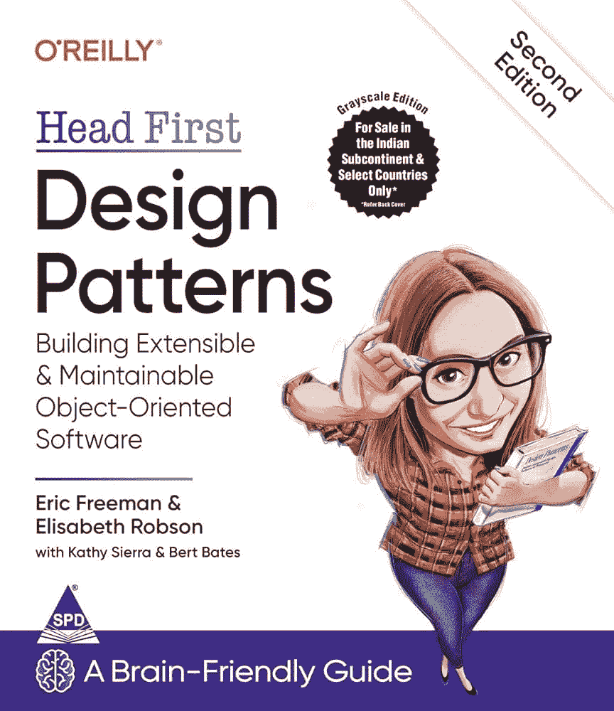
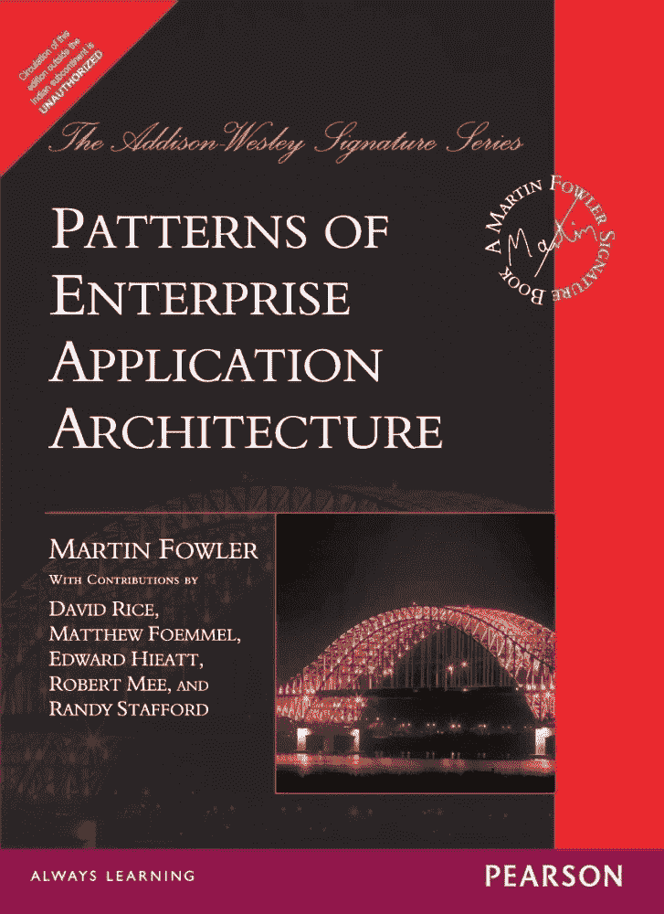
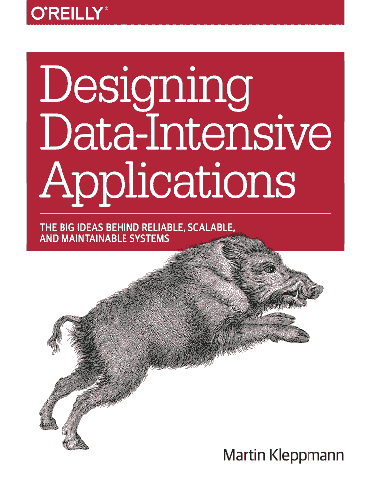
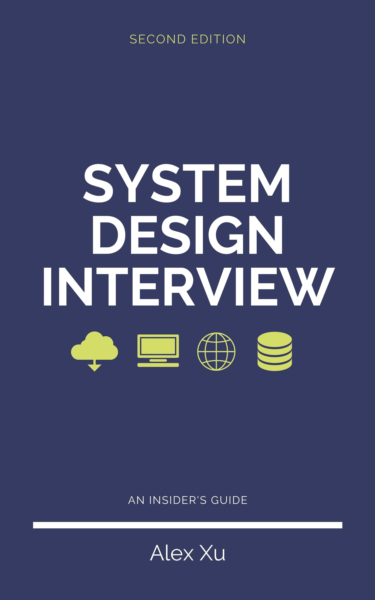

# 学习系统设计：5 本必读书籍

> 原文：[`www.kdnuggets.com/learning-system-design-top-5-essential-reads`](https://www.kdnuggets.com/learning-system-design-top-5-essential-reads)

作者提供的图像 | DALLE-3 & Canva

系统设计可能让人感到望而生畏。至少，我在想要作为初学者学习系统设计时有这种感觉。最新的趋势和流行词使得知道学习什么以及从哪里开始变得更加困难。但不用担心！在这篇文章中，我将建议一个适合初学者的良好起点，并解释为什么学习系统设计至关重要。

* * *

## 我们的前三大课程推荐

 1\. [Google 网络安全证书](https://www.kdnuggets.com/google-cybersecurity) - 快速进入网络安全职业领域。

 2\. [Google 数据分析专业证书](https://www.kdnuggets.com/google-data-analytics) - 提升您的数据分析技能

 3\. [Google IT 支持专业证书](https://www.kdnuggets.com/google-itsupport) - 支持您的组织的 IT 工作

* * *

系统设计是设计大规模应用程序的一个重要组成部分，构成了 Twitter、Facebook、Instagram 等应用程序的基础。设计应用程序时，确保可靠操作、有效扩展以应对不断增长的需求，并保持程序员在系统上工作的可维护性是至关重要的。

要掌握基础系统设计概念并编写高质量代码，我推荐探索这些书籍。它们也作为准备全球顶级公司技术面试的有用资源。这个列表结合了个人推荐和程序员普遍认可的书籍。那我们就开始吧！

## 1\. 《Head First 设计模式》

**作者：** Eric Freeman, Elisabeth Robson, Bert Bates, Kathy Sierra

**链接：** [Head First 设计模式](https://www.oreilly.com/library/view/head-first-design/0596007124/)

个人推荐！这是一本对系统设计模式和架构模式初学者友好的指南。本指南使用视觉辅助工具、流程图和 UML 图，从零开始构建简单的例子。通过 Java 的面向对象原则，这本书让学习常见的设计模式变得简单，如迭代器、观察者、策略和单例，这些模式在生产级代码中常被使用。

### 涵盖的主题：

+   创建模式（单例、工厂方法和抽象工厂方法）

+   结构模式（适配器、外观、代理、装饰器）

+   行为模式（策略、观察者、迭代器、状态、模板方法）

+   组合模式

+   应用架构和 MVC 模式

## 2\. 《企业应用架构模式》

**作者：** 马丁·福勒

**链接：** [企业应用架构模式](https://martinfowler.com/books/eaa.html)

对于那些希望深入了解设计模式的人，本书是一个极好的资源。它以理论的方式探讨复杂的设计模式概念，使其成为你在面临设计选择时的宝贵参考指南。它涵盖了类似于《Head First》书中的主题，但更深入（详细的解释和 UML 图），是寻求对设计模式有全面了解的软件工程师的绝佳资源。

### 涵盖主题：

+   分层架构

+   并发

+   领域逻辑与关系数据库

+   Web 展示

+   分布式系统

+   设计模式

## 3\. 清洁架构

**作者：** 罗伯特·C·马丁

**链接：** [清洁架构](https://www.oreilly.com/library/view/clean-architecture-a/9780134494272/)

本书由著名的“叔本”编写，是他备受好评的清洁代码系列的一部分。他从软件架构师的角度出发，分享了在设计可靠且可扩展系统时做出的决策。他强调了独立性的重要性，将编程选择与特定数据库、工具和语言解耦，使其成为任何希望提升技能的软件开发者必读的书籍。

### 涵盖主题：

+   编程范式（结构化、面向对象、函数式）

+   SOLID 设计原则

+   组件原则（内聚性、耦合性、重用性、封闭性）

+   架构原则

## 4\. 设计数据密集型应用

**作者：** 马丁·克莱普曼

**链接：** [设计数据密集型应用](https://www.oreilly.com/library/view/designing-data-intensive-applications/9781491903063/)

另一个个人推荐的，关于系统设计最详细的书籍之一。它全面覆盖了系统设计的主要原则，并解释了为什么事情会按这种方式工作。该书分为三个主要部分：数据系统基础、分布式数据和派生数据。第一部分探讨了数据存储系统、查询语言和大规模系统的检索方法的基本基础。第二部分重点关注分布式系统的开发，强调一致系统的重要性。最后一部分专注于大规模数据系统的批处理和流处理。

### 涵盖主题：

+   数据模型与查询语言

+   存储与检索

+   复制与事务系统

+   分布式系统

+   一致性

+   批处理

+   流处理

## 5\. 系统设计面试

**作者：** 亚历克斯·徐

**链接：** [系统设计面试](https://www.amazon.com/System-Design-Interview-insiders-Second/dp/B08CMF2CQF)

最后，系统设计是顶级科技公司（包括 MAANG）面试中的一个重要部分。这本书由谷歌工程师 Alex Xu 编写，是一本受欢迎的面试准备材料，涵盖了广泛的主题。它提供了一个解决系统设计面试问题的 4 步框架，并针对 16 个实际应用提供了详细的解决方案，并配有图表。此外，它还解释了 Twitter、Google 和 YouTube 等主要系统的设计决策。

### 涵盖的主题：

+   面试过程概述

+   面试过程框架

+   系统设计基础（缓存、数据库、分区、负载均衡）

+   架构技术（单体架构、微服务、无服务器）

+   案例研究（设计网页爬虫、聊天系统、YouTube、Google Drive 等）

## 总结

如果你是一个初学者，对从何处开始感到困惑，这些书籍是你准备下一次系统设计面试的最佳资源。从涵盖数据系统的基本概念到详细的热门软件系统设计决策，这些书籍应有尽有。如果你对系统设计的炒作感到不知所措，从这里开始将使它变得不那么令人畏惧。

****[Kanwal Mehreen](https://www.linkedin.com/in/kanwal-mehreen1/)**** Kanwal 是一名机器学习工程师和技术作家，对数据科学以及 AI 与医学的交叉领域充满热情。她共同编写了电子书《利用 ChatGPT 最大化生产力》。作为 2022 年 APAC 地区的 Google Generation 学者，她倡导多样性和学术卓越。她还被认定为 Teradata 技术多样性学者、Mitacs Globalink 研究学者和哈佛 WeCode 学者。Kanwal 是变革的热心倡导者，她创办了 FEMCodes，旨在赋能女性在 STEM 领域中的发展。

### 更多相关话题

+   [2024 年阅读书单：5 本关于人工智能的必读书籍](https://www.kdnuggets.com/2024-reading-list-5-essential-reads-on-artificial-intelligence)

+   [机器学习中的设计模式用于 MLOps](https://www.kdnuggets.com/2022/02/design-patterns-machine-learning-mlops.html)

+   [设计高效且可靠的机器学习系统！](https://www.kdnuggets.com/2023/05/manning-design-effective-reliable-machine-learning-systems.html)

+   [使用 Python 为亚马逊产品构建推荐系统](https://www.kdnuggets.com/2023/02/building-recommender-system-amazon-products-python.html)

+   [级别系统如何帮助预测 AI 成本](https://www.kdnuggets.com/2022/03/level-system-help-forecast-ai-costs.html)

+   [使用 Python 的 Watchdog 监控文件系统](https://www.kdnuggets.com/monitor-your-file-system-with-pythons-watchdog)
