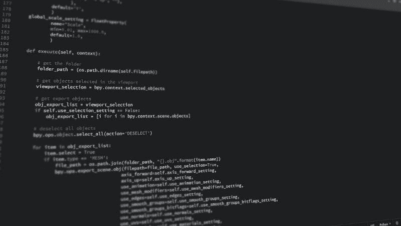

# 从我的第一次 Kaggle 比赛中学到的经验

> 原文：[`www.kdnuggets.com/2020/09/lessons-first-kaggle-competition.html`](https://www.kdnuggets.com/2020/09/lessons-first-kaggle-competition.html)

评论

**作者 [Shruti Turner](https://www.linkedin.com/in/shrutiturner/)，帝国理工学院假肢博士研究员**

图片来源：[Johnson Martin](https://pixabay.com/users/JohnsonMartin-724525/?utm_source=link-attribution&amp;utm_medium=referral&amp;utm_campaign=image&amp;utm_content=1084923) 来自 [Pixabay](https://pixabay.com/?utm_source=link-attribution&amp;utm_medium=referral&amp;utm_campaign=image&amp;utm_content=1084923)

* * *

## 我们的三大课程推荐

 1. [谷歌网络安全证书](https://www.kdnuggets.com/google-cybersecurity) - 快速进入网络安全职业生涯。

 2. [谷歌数据分析专业证书](https://www.kdnuggets.com/google-data-analytics) - 提升你的数据分析水平

 3. [谷歌 IT 支持专业证书](https://www.kdnuggets.com/google-itsupport) - 支持你的组织进行 IT 管理

* * *

### 一点背景

我发现开始进入一个新的编程领域是一种令人畏惧的经历。我已经编程了 8 年，但最近才对数据科学产生了浓厚的兴趣。我想分享我的经验，鼓励你们也勇敢尝试！

我最初通过参加几个 Kaggle 小课程来探索这个广阔主题的海洋。我不需要学习如何编写 Python，但我需要装备自己以进行我想要的编程。第一个是 [机器学习入门](https://www.kaggle.com/learn/intro-to-machine-learning) —— 这似乎是一个很好的起点。在这个课程中，你会参与一个课程内的比赛，但即使完成了它，我仍然感觉自己没有准备好参加公开比赛。接着是 [中级机器学习](https://www.kaggle.com/learn/intermediate-machine-learning)，在这个课程中我学会了使用新模型，并深入思考数据问题。

### 选择比赛

我花了一些时间选择合适的比赛。我不想仅仅是用数据集做点什么，因为我希望看到自己的进步和评估自己的成功，但我也不想因为无法取得任何成就而感到沮丧。有明确的目标感觉就像一个很好的安全保障。

有一个使用与课程比赛相同数据的竞赛，但我想要一些稍微不同的东西，同时利用我学到的技能，这些技能主要集中在通过数值数据预测结果上。那个 [泰坦尼克号：灾难中的机器学习](https://www.kaggle.com/c/titanic) 看起来不错，它标记为“入门”。我在其中表现良好并不会获得任何奖励，这可能会让人感到失望。但你必须评估：你为什么参加竞赛？在我数据科学的旅程中，我希望提升我的知识并应用我所学到的东西。

### 我学到了什么？

*简短的回答：* 颇有收获。不仅对我自己，还有如何思考数据科学问题。

*详细回答：*

1.  **我可以应用我所学到的东西**——这可能是显而易见的，但能够证明自己可以在没有逐步指导的情况下完成任务，还是很令人满意的。

1.  **我可以发现错误并利用我的技能解决它们**——我第一次提交的成绩是 0.0000，即没有正确预测任何结果。我的初步反应是泄气和沮丧。我真的以为我能够取得一些成果。结果发现，我的输出是浮点型而不是整数型。只需一个小的更改，我的成功率就突然达到了约 70%。

1.  **Kaggle 社区充满了知识**——起初我不想查看其他共享的笔记本，我想先自己尝试一下。我仍然认为这是一个不错的做法，但在我提交了几个解决方案后查看这些笔记本，让我学到了我还不知道的内容，包括对数据的处理方法和新算法。我甚至公开分享了 [我的笔记本](https://www.kaggle.com/shrutiturner/titanic-randomforestregressor) ，以便其他人可以使用或者我能收到反馈/建议来改进。

1.  **下一次开始之前进行一些规划可能会有帮助**——我太急于动手了，查看了提供的数据，做了一些快速观察，然后直接开始编写代码。在查看了其他解决方案/教程笔记本后，我更加理解了在数据中寻找什么和解决问题的不同方法（以及原因！）我发现的东西与我做的不是很不同，但它们是更深入的解决方案；是在我所做的基础上的下一步。

1.  **我喜欢解决这些类型的问题，并且想要做更多的这类问题**——如果这是我考虑追求的职业方向，这是一个重要的因素。我原本只打算花一个小时，结果下次抬头时已经过去了 4 小时。

### 下一步

未来，我希望提高我的数据技能，我认为 Kaggle 是一个很好的起点。我还远未完善我对泰坦尼克号竞赛的解决方案，但我从中学到了很多。

我想尝试在 Kaggle 上参加另一个比赛，但步伐要更稳妥。我会先拿出纸和笔，决定每一列数据的相关性，以及如何有效且高效地处理数据中的空白。

我也希望拓展我的知识，不仅在数值数据和预测的方法上更深入，还包括文本分析和图像识别。这将为我打开更多的机会，无论是探索新事物还是尝试更多的比赛。

如果你正在考虑进入数据科学领域，或者已经涉足此领域并想要更多练习，我非常推荐尝试 Kaggle 比赛。

**简介：[Shruti Turner](https://www.linkedin.com/in/shrutiturner/)** 是伦敦帝国学院的假肢博士研究员。她热衷于利用自己的工程和编程技能来提高生活质量。

[原文](https://towardsdatascience.com/lessons-from-my-first-kaggle-competition-f51b61444115)。经许可转载。

**相关：**

+   Kaggle Kernels 初学者指南：逐步教程

+   如果我必须重新开始学习数据科学，我会怎么做？

+   Kaggle Learn 是“更快的数据科学教育”吗？

### 更多相关内容

+   [实施推荐系统的十个关键教训](https://www.kdnuggets.com/2022/07/ten-key-lessons-implementing-recommendation-systems-business.html)

+   [资深数据科学家的经验教训](https://www.kdnuggets.com/2022/09/lessons-senior-data-scientist.html)

+   [KDnuggets 新闻，9 月 28 日：免费 Python 算法课程 •…](https://www.kdnuggets.com/2022/n38.html)

+   [4 个职业教训帮助我应对困难的就业市场](https://www.kdnuggets.com/2023/05/4-lessons-made-difference-navigating-current-job-market.html)

+   [在 Kaggle 上竞争的 4 个顶级技巧以及为什么你应该开始](https://www.kdnuggets.com/2022/05/packt-top-4-tricks-competing-kaggle-start.html)

+   [最全面的 Kaggle 解决方案和创意列表](https://www.kdnuggets.com/2022/11/comprehensive-list-kaggle-solutions-ideas.html)
