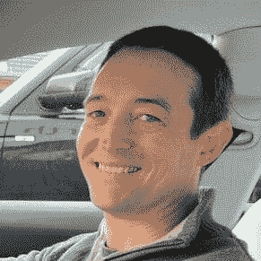

# 高级数据科学家的经验教训

> 原文：[`www.kdnuggets.com/2022/09/lessons-senior-data-scientist.html`](https://www.kdnuggets.com/2022/09/lessons-senior-data-scientist.html)

图片由 [Kindel Media](https://www.pexels.com/photo/people-in-the-office-discussing-a-project-7688336/) 提供

随着数据科学行业的持续增长，我认为进入该行业的人需要对他们所进入的领域有充分的了解。本文的目的是为了深入了解高级数据科学家的生活，以及他们的经验如何为未来的数据科学家提供借鉴。

* * *

## 我们的三大课程推荐

 1\. [Google 网络安全证书](https://www.kdnuggets.com/google-cybersecurity) - 快速进入网络安全职业轨道。

 2\. [Google 数据分析专业证书](https://www.kdnuggets.com/google-data-analytics) - 提升你的数据分析技能

 3\. [Google IT 支持专业证书](https://www.kdnuggets.com/google-itsupport) - 支持你的组织的 IT 工作

* * *

我想介绍一下 [Robin Cole](https://www.linkedin.com/in/robmarkcole/)……

# 简介

[Robin Cole](https://www.linkedin.com/in/robmarkcole/) 是 [Satellite Vu](https://www.satellitevu.com/) 的高级数据科学家。他拥有物理学背景，曾在南安普顿大学学习，然后在帝国学院伦敦攻读光学与光子学硕士学位。一年后，他前往剑桥大学获得物理学博士学位。

来源：采访对象 LinkedIn，已获许可

从那时起，他担任了各种职位，包括研究科学家、NHS 科学家培训计划、光学系统工程师、研究工程师、数据工程师，现在是一名高级数据科学家。他具备数据分析、深度学习、数据工程和亚马逊网络服务（AWS）的技能。

由于他扎实的教育背景和多样的角色，我相信 Robin Cole 能为我们提供更深入的科技和数据领域见解。

这将是一篇访谈风格的文章。那么，让我们开始吧……

# 问题与答案

## 你是如何进入数据科学领域的？

我获得了物理学本科学位，随后获得了光学物理学博士学位。然后我进入了研究与开发领域，这其中包括编程。这时我转向编程，从实验室工作和实验转向数据分析。

我特别使用了机器学习来解决我在卫星领域工作时遇到的许多问题，并且使用了计算机视觉模型。我在研究中使用了深度学习与图像。

## 数据科学对你来说意味着什么？

数据科学领域有各种各样的角色，并且可以有多种用途。例如，在电子商务领域，你可以使用 SQL 和其他传统解决方案，如随机森林，来帮助创建产品推荐引擎。

在我的角色中，我特别关注深度学习，并通过计算机视觉在飞机上捕捉图像。这种深度学习方法使我能够处理这些图像，以识别和定位感兴趣的物品和类别。

我的建议是数据科学对不同的人意味着不同的东西，因此你需要探索数据科学的不同领域和途径，以找到自己感兴趣的方向。

## 你每天的工作是什么？

我的工作流程模仿了软件工程的方法，其中包括两周的冲刺和每日站会。

我在 9 点开始一天的工作，同时处理邮件并查看对我的研究有帮助的论文和博客。我的每日站会在上午 9 点 30 分，我们的中型团队会相互更新任务进展。剩下的时间主要用于执行独立任务。

我们有一个每两周的汇报时间，我们利用这段时间深入了解我们正在做的事情。我们还利用这段时间来管理进度。每个月，团队都会有一次汇报会议，重点关注数据科学培训需求和基础设施，如 AWS。

## 你未来有什么计划？

高级数据科学家通常有两条道路可以选择：要么他们在自己的领域变得更专业，要么转向管理角色。对我来说，如果我的团队中聘用了更多的数据科学家，我可能会转变为首席数据科学家。我不太考虑太远的未来——随着业务的发展，我的职责将自然发生变化。

我目前在早期阶段从事遥感数据工作，因此仍需要大量的基础研究。所以我会暂时专注于这个领域，因为这是我的兴趣所在。

## 有什么帮助你达到现在位置的东西吗？

在成为数据科学家之前，我花了一年时间从事数据工程工作，这帮助我提高了编程技能，特别是 Python。数据科学角色竞争激烈，我意识到我作为数据工程师的那一年在我的数据科学职业生涯中给我带来了帮助。

我还是我现在工作的初创公司里第一个被聘用的人，这意味着我承担了多个技术角色，从而让我能够提升技能，变得更加熟练和有经验。

## 你认为新数据科学家需要具备什么？

真实的项目！作为高级数据科学家，我经常被问到一些关于项目的基本问题，而我认为这些是数据科学家应该了解的。当谈到项目时，很多在线课程让你遵循他们的指南，但这不一定能帮助你在现实世界中。我相信初级数据科学家需要有信心独立处理项目。

## 你能看出大学和训练营数据科学家的区别吗？

缺乏传统教育的数据科学家显然存在一些短板，例如真实世界的项目管理、他们如何处理工作以及选择展示的方式。再一次，区别在于训练营学生缺乏真实世界的项目经验，这一点非常重要。

## 你会给新晋数据科学家提供什么其他建议？

当你看到机会时——就抓住它！我第一次做机器学习项目时，甚至还没有成为数据科学家。我看到一个小机会，可以测试、改进并展示我的数据科学技能。

所以我对新晋数据科学家的建议是，如果你看到一个小机会或者领域可以展示你的编程技能——就去做！这会给你带来真实的经验，并让你从书本上聪明的学生中脱颖而出。

另一条建议是找到一个导师。与经验丰富的人合作可以让你从他们那里获得反馈并交流想法。你也可以利用开源平台，参与 kaggle 竞赛，或者作为志愿者参与项目，这将是一个很好的经历。

我自己通过兼职的激情项目学习并提高了技能，我利用这些真实的项目来建立我的作品集。这些项目也可以在面试中讨论，帮助你脱颖而出！

# 总结

如果你想了解更多关于 Robin Cole 及其工作的内容，你可以在这里找到并了解更多信息：

+   [LinkedIn](http://linkedin.com/in/robmarkcole)

+   [GitHub](https://github.com/robmarkcole)

+   [Blog](http://robmarkcole.com/)

+   [Twitter](https://twitter.com/robmarkcole)

我要对 Robin Cole 表示衷心的感谢，感谢他抽出时间与我坐下来，深入了解成为高级数据科学家是什么样的体验，以及新晋数据科学家应该做些什么来提升他们的职业生涯。

谢谢！

**[Nisha Arya](https://www.linkedin.com/in/nisha-arya-ahmed/)** 是一名数据科学家和自由技术写作人员。她特别感兴趣于提供数据科学职业建议或教程以及数据科学的理论知识。她还希望探索人工智能如何及能否有助于人类寿命的不同方式。她是一个热衷学习的人，寻求拓宽技术知识和写作技能，同时帮助指导他人。

### 更多相关内容

+   [KDnuggets News, September 28: 免费 Python 算法课程 •…](https://www.kdnuggets.com/2022/n38.html)

+   [实施推荐系统在商业中的十个关键经验教训](https://www.kdnuggets.com/2022/07/ten-key-lessons-implementing-recommendation-systems-business.html)

+   [帮助我应对困难就业市场的四个职业教训](https://www.kdnuggets.com/2023/05/4-lessons-made-difference-navigating-current-job-market.html)

+   [初级与高级数据科学家薪资差异：是什么？](https://www.kdnuggets.com/2022/03/junior-senior-data-scientist-salary-difference.html)

+   [如何获得高级数据科学家职位](https://www.kdnuggets.com/2022/12/land-senior-data-scientist-position.html)

+   [数据科学职位导航：数据分析师 vs. 数据科学家…](https://www.kdnuggets.com/navigating-data-science-job-titles-data-analyst-vs-data-scientist-vs-data-engineer)
