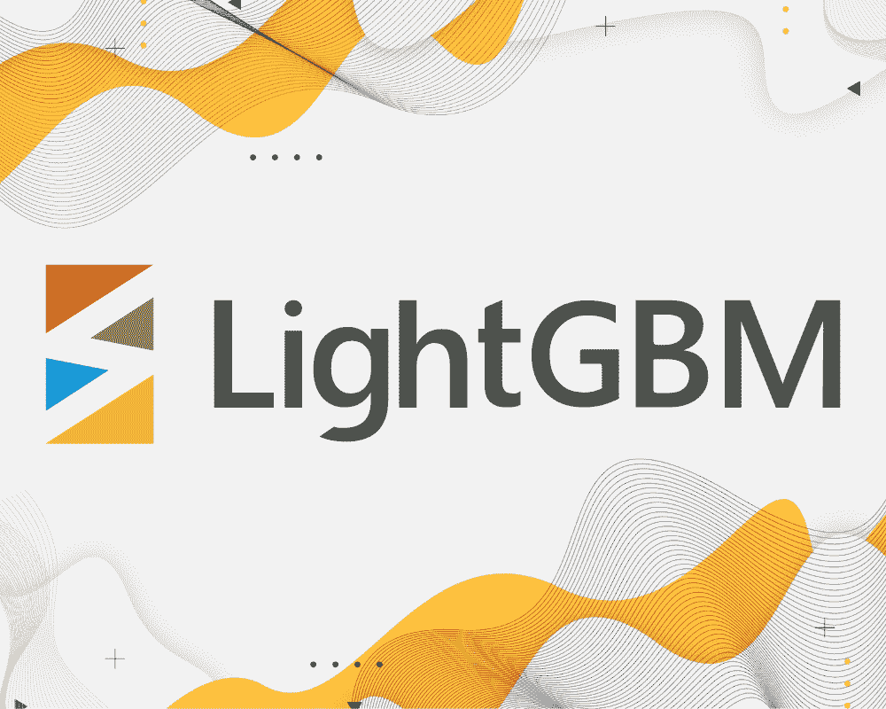

# LGBMClassifier: 入门指南

> 原文：[`www.kdnuggets.com/2023/07/lgbmclassifier-gettingstarted-guide.html`](https://www.kdnuggets.com/2023/07/lgbmclassifier-gettingstarted-guide.html)



编辑者提供的图片

机器学习算法种类繁多，适合于建模特定现象。一些模型利用一组属性来优于其他模型，而另一些模型则包括弱学习者，以利用剩余属性为模型提供额外信息，这就是集成模型。

* * *

## 我们的前三大课程推荐

 1\. [Google 网络安全证书](https://www.kdnuggets.com/google-cybersecurity) - 快速进入网络安全职业生涯。

 2\. [Google 数据分析专业证书](https://www.kdnuggets.com/google-data-analytics) - 提升你的数据分析技能

 3\. [Google IT 支持专业证书](https://www.kdnuggets.com/google-itsupport) - 支持你组织的 IT 工作

* * *

集成模型的前提是通过结合不同模型的预测以减少其误差来提高模型性能。有两种流行的集成技术：bagging 和 boosting。

Bagging，又称为自助聚合，在不同的随机子集上训练多个单独的模型，然后平均它们的预测结果以生成最终预测。而提升（Boosting）则涉及顺序训练单独的模型，每个模型试图纠正前一个模型的错误。

既然我们了解了集成模型的背景，让我们深入探讨一下提升集成模型，特别是微软开发的 Light GBM（LGBM）算法。

# 什么是 LGBMClassifier？

LGBMClassifier 代表 Light Gradient Boosting Machine Classifier。它使用决策树算法进行排序、分类和其他机器学习任务。LGBMClassifier 使用一种新颖的基于梯度的单边采样（GOSS）和独占特征捆绑（EFB）技术，能够准确地处理大规模数据，从而提高速度并减少内存使用。

## 什么是基于梯度的单边采样（GOSS）？

传统的梯度提升算法使用所有数据进行训练，这在处理大型数据集时可能非常耗时。而 LightGBM 的 GOSS 则保留了所有大梯度的实例，并对小梯度的实例进行随机采样。其背后的直觉是，大梯度的实例更难拟合，因此包含更多信息。GOSS 为小梯度的数据实例引入了一个常数乘数，以弥补采样过程中信息的丧失。

## 什么是独占特征捆绑（EFB）？

在稀疏数据集中，大多数特征为零。EFB 是一种近乎无损的算法，它将相互排斥的特征（即不同时为非零的特征）进行捆绑/组合，以减少维度，从而加速训练过程。由于这些特征是“排斥”的，因此保留了原始特征空间，没有显著的信息损失。

# 安装

可以直接使用 pip——Python 的包管理器来安装 LightGBM。在终端或命令提示符中输入以下命令，以下载和安装 LightGBM 库到你的机器上：

```py
pip install lightgbm
```

Anaconda 用户可以使用以下列出的“conda install”命令来安装它。

```py
conda install -c conda-forge lightgbm
```

根据你的操作系统，你可以使用[本指南](https://lightgbm.readthedocs.io/en/latest/Installation-Guide.html)选择安装方法。

# 实践操作！

现在，让我们导入 LightGBM 和其他必要的库：

```py
import numpy as np
import pandas as pd
import seaborn as sns
import lightgbm as lgb
from sklearn.metrics import classification_report
from sklearn.model_selection import train_test_split
```

## 准备数据集

我们使用流行的泰坦尼克号数据集，其中包含关于泰坦尼克号乘客的信息，目标变量表示他们是否幸存。你可以从[Kaggle](https://www.kaggle.com/competitions/titanic/data)下载数据集，或者使用以下代码直接从 Seaborn 加载，如下所示：

```py
titanic = sns.load_dataset('titanic')
```

删除不必要的列，如“deck”、“embark_town”和“alive”，因为它们冗余或不影响船上人员的生存。接下来，我们观察到“age”、“fare”和“embarked”特征有缺失值——注意不同属性用适当的统计措施进行填补。

```py
# Drop unnecessary columns
titanic = titanic.drop(['deck', 'embark_town', 'alive'], axis=1)

# Replace missing values with the median or mode
titanic['age'] = titanic['age'].fillna(titanic['age'].median())
titanic['fare'] = titanic['fare'].fillna(titanic['fare'].mode()[0])
titanic['embarked'] = titanic['embarked'].fillna(titanic['embarked'].mode()[0])
```

最后，我们使用 pandas 的分类代码将分类变量转换为数字变量。现在，数据已准备好开始模型训练过程。

```py
# Convert categorical variables to numerical variables
titanic['sex'] = pd.Categorical(titanic['sex']).codes
titanic['embarked'] = pd.Categorical(titanic['embarked']).codes

# Split the dataset into input features and the target variable
X = titanic.drop('survived', axis=1)
y = titanic['survived']
```

## 训练 LGBMClassifier 模型

要开始训练 LGBMClassifier 模型，我们需要使用 scikit-learn 中的 train_test_split 函数将数据集拆分为输入特征和目标变量，以及训练集和测试集。

```py
# Split the dataset into training and testing sets
X_train, X_test, y_train, y_test = train_test_split(X, y, test_size=0.2, random_state=42)
```

让我们对分类数据（“who”）和序数数据（“class”）进行标签编码，以确保模型接收数字数据，因为 LGBM 不处理非数字数据。

```py
class_dict = {
"Third": 3,
"First": 1,
"Second": 2
}
who_dict = {
"child": 0,
"woman": 1,
"man": 2
}
X_train['class'] = X_train['class'].apply(lambda x: class_dict[x])
X_train['who'] = X_train['who'].apply(lambda x: who_dict[x])
X_test['class'] = X_test['class'].apply(lambda x: class_dict[x])
X_test['who'] = X_test['who'].apply(lambda x: who_dict[x])
```

接下来，我们将模型超参数指定为构造函数的参数，或者可以将它们作为字典传递给 set_params 方法。

启动模型训练的最后一步是通过创建 LGBMClassifier 类的实例并将其拟合到训练数据上来加载数据集。

```py
params = {
'objective': 'binary',
'boosting_type': 'gbdt',
'num_leaves': 31,
'learning_rate': 0.05,
'feature_fraction': 0.9
}
clf = lgb.LGBMClassifier(**params)
clf.fit(X_train, y_train)
```

接下来，让我们评估训练好的分类器在未见或测试数据集上的表现。

```py
predictions = clf.predict(X_test)
print(classification_report(y_test, predictions))
```

```py
 precision    recall  f1-score   support

           0       0.84      0.89      0.86       105
           1       0.82      0.76      0.79        74

    accuracy                           0.83       179
   macro avg       0.83      0.82      0.82       179
weighted avg       0.83      0.83      0.83       179
```

## 超参数调整

LGBMClassifier 通过超参数提供了很大的灵活性，你可以调整这些超参数以获得最佳性能。这里，我们将简要讨论一些关键的超参数：

+   **num_leaves**：这是控制树模型复杂度的主要参数。理想情况下，num_leaves 的值应该小于或等于 2^(max_depth)。

+   **min_data_in_leaf**：这是防止叶子节点树过拟合的重要参数。其最佳值取决于训练样本的数量和 num_leaves。

+   **max_depth**：你可以使用这个参数来明确限制树的深度。如果出现过拟合，最好调整这个参数。

让我们调整这些超参数并训练一个新模型：

```py
model = lgb.LGBMClassifier(num_leaves=31, min_data_in_leaf=20, max_depth=5)
model.fit(X_train, y_train)
```

```py
predictions = model.predict(X_test)
print(classification_report(y_test, predictions))
```

```py
 precision    recall  f1-score   support

           0       0.85      0.89      0.87       105
           1       0.83      0.77      0.80        74

    accuracy                           0.84       179
   macro avg       0.84      0.83      0.83       179
weighted avg       0.84      0.84      0.84       179
```

请注意，超参数的实际调整是一个涉及试验和错误的过程，也可能受到经验以及对提升算法和业务问题（领域知识）的深入理解的指导。

在这篇文章中，你了解了 LightGBM 算法及其 Python 实现。这是一种灵活的技术，适用于各种类型的分类问题，应该成为你机器学习工具包的一部分。

**[Vidhi Chugh](https://vidhi-chugh.medium.com/)** 是一位人工智能战略家和数字化转型领导者，她在产品、科学和工程交汇处工作，致力于构建可扩展的机器学习系统。她是一位屡获殊荣的创新领导者、作者和国际演讲者。她的使命是使机器学习民主化，并打破术语，使每个人都能参与这场转型。

### 相关主题

+   [自动化文本摘要入门](https://www.kdnuggets.com/2019/11/getting-started-automated-text-summarization.html)

+   [数据清理入门](https://www.kdnuggets.com/2022/01/getting-started-cleaning-data.html)

+   [SQL 入门备忘单](https://www.kdnuggets.com/2022/08/getting-started-sql-cheatsheet.html)

+   [使用 spaCy 进行 NLP 入门](https://www.kdnuggets.com/2022/11/getting-started-spacy-nlp.html)

+   [PyCaret 入门指南](https://www.kdnuggets.com/2022/11/getting-started-pycaret.html)

+   [PyTorch Lightning 入门指南](https://www.kdnuggets.com/2022/12/getting-started-pytorch-lightning.html)
