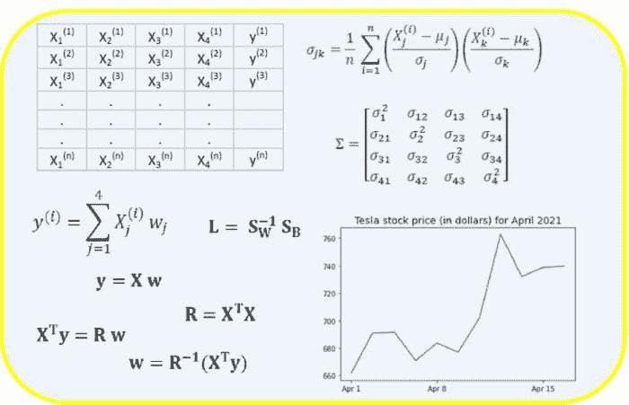
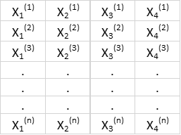

# 数据科学的线性代数

> 原文：[`www.kdnuggets.com/2022/07/linear-algebra-data-science.html`](https://www.kdnuggets.com/2022/07/linear-algebra-data-science.html)

作者提供的图片。

## 关键要点

+   大多数有兴趣进入数据科学领域的初学者总是对数学要求感到担忧。

+   数据科学是一个非常定量的领域，需要高级数学。

+   但要开始，你只需掌握几个数学主题。

+   在本文中，我们讨论了线性代数在数据科学和机器学习中的重要性。

* * *

## 我们的前三大课程推荐

 1\. [谷歌网络安全证书](https://www.kdnuggets.com/google-cybersecurity) - 快速进入网络安全职业生涯

 2\. [谷歌数据分析专业证书](https://www.kdnuggets.com/google-data-analytics) - 提升你的数据分析能力

 3\. [谷歌 IT 支持专业证书](https://www.kdnuggets.com/google-itsupport) - 支持你的组织的 IT 工作

* * *

# 线性代数

线性代数是数学的一个分支，在数据科学和机器学习中极为有用。线性代数是机器学习中最重要的数学技能。大多数机器学习模型可以用矩阵形式表示。数据集本身通常也表示为矩阵。线性代数用于数据预处理、数据转换和模型评估。以下是你需要熟悉的主题：

+   向量

+   矩阵

+   矩阵的转置

+   矩阵的逆

+   矩阵的行列式

+   矩阵的迹

+   点积

+   特征值

+   特征向量

# 线性代数在机器学习中的应用：使用主成分分析进行降维

主成分分析（PCA）是一种用于特征提取的统计方法。PCA 用于高维和高度相关的数据。PCA 的基本思想是将原始特征空间转换为主成分空间，如下图 1 所示：

图 1：PCA 算法将旧特征空间转换为新特征空间，从而去除特征相关性。图片由 Benjamin O. Tayo 提供

PCA 变换实现了以下目标：

1.  a) 通过仅关注数据集中方差大部分的组件，减少最终模型中使用的特征数量。

1.  b) 去除特征之间的相关性。

# PCA 的数学基础

假设我们有一个高度相关的特征矩阵，其中有*4*个特征和*n*个观察值，如下表 1 所示：

表 1\. 具有 4 个变量和 n 个观测值的特征矩阵。

为了可视化特征之间的相关性，我们可以生成一个散点图，如图 1 所示。为了量化特征之间的相关程度，我们可以使用以下方程计算协方差矩阵：

在矩阵形式中，协方差矩阵可以表示为 4 x 4 的对称矩阵：

通过进行单位 ary 变换（PCA 变换），可以对该矩阵进行对角化，得到如下结果：

由于矩阵的迹在单位 ary 变换下保持不变，我们观察到对角矩阵的特征值之和等于特征 *X1*、*X2*、*X3* 和 *X4* 中包含的总方差。因此，我们可以定义以下量：

注意，当*p = 4*时，累计方差如预期变为 1。

# 案例研究：使用鸢尾花数据集实现 PCA

为了说明 PCA 的工作原理，我们通过检查鸢尾花数据集来展示一个例子。R 代码可以从这里下载：[*https://github.com/bot13956/principal_component_analysis_iris_dataset/blob/master/PCA_irisdataset.R*](https://github.com/bot13956/principal_component_analysis_iris_dataset/blob/master/PCA_irisdataset.R)

# 摘要

线性代数是数据科学和机器学习中的一个重要工具。因此，初学者如果对数据科学感兴趣，必须熟悉线性代数中的基本概念。

**[本杰明·O·塔约](https://www.linkedin.com/in/benjamin-o-tayo-ph-d-a2717511/)** 是物理学家、数据科学教育者和作家，同时也是 DataScienceHub 的所有者。此前，本杰明曾在中欧大学、大峡谷大学和匹兹堡州立大学教授工程学和物理学。

### 更多相关主题

+   [KDnuggets 新闻，7 月 13 日：数据科学中的线性代数；10 种现代…](https://www.kdnuggets.com/2022/n28.html)

+   [学习机器学习的线性代数的 3 个顶级免费资源](https://www.kdnuggets.com/2022/03/top-3-free-resources-learn-linear-algebra-machine-learning.html)

+   [掌握线性代数的 5 门免费课程](https://www.kdnuggets.com/2022/10/5-free-courses-master-linear-algebra.html)

+   [KDnuggets 新闻 22:n12，3 月 23 日：最佳数据科学书籍…](https://www.kdnuggets.com/2022/n12.html)

+   [数据科学中的线性回归](https://www.kdnuggets.com/2022/07/linear-regression-data-science.html)

+   [数据科学家的线性规划入门](https://www.kdnuggets.com/2023/02/linear-programming-101-data-scientists.html)
