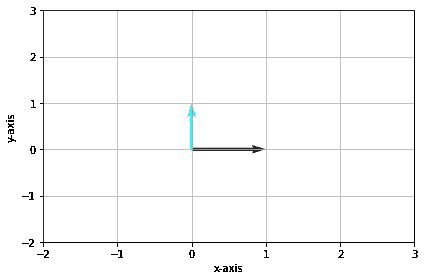
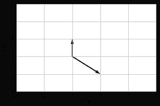
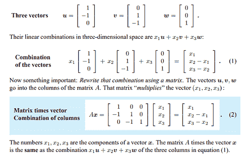
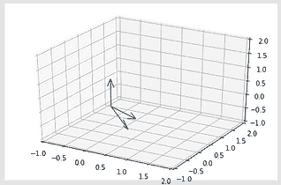
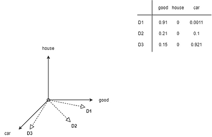

# 自然语言处理的线性代数

> 原文：[`www.kdnuggets.com/2021/08/linear-algebra-natural-language-processing.html`](https://www.kdnuggets.com/2021/08/linear-algebra-natural-language-processing.html)

评论

**由 [Taaniya Arora](https://medium.com/@TaaniyaArora)，数据科学家**


图片由[Michael Dziedzic](https://unsplash.com/@lazycreekimages?utm_source=medium&utm_medium=referral)拍摄，来源于[Unsplash](https://unsplash.com/?utm_source=medium&utm_medium=referral)

自然语言处理领域涉及构建技术，以处理自然语言中的文本，并从中提取见解，以执行各种任务，从解释搜索引擎上的用户查询并返回网页，到作为聊天机器人助手解决客户查询。当依赖于从大规模文本中提取的见解做出重要决策时，例如通过社交媒体预测股票价格变化， 将每个单词表示为捕捉单词意义和整体上下文的形式变得至关重要。

在本文中，我们将从线性代数的基础开始，以了解向量及其在表示特定类型信息中的重要性、在向量空间中表示文本的不同方式，以及这一概念如何发展到我们现在拥有的最先进模型。

我们将逐步介绍以下内容 -

+   我们坐标系统中的单位向量

+   向量的线性组合

+   向量坐标系统中的跨度

+   共线性与多重共线性

+   向量的线性依赖性和独立性

+   基础向量

+   自然语言处理的向量空间模型

+   密集向量

## 我们坐标系统中的单位向量

***i***-> 表示一个单位向量（长度为 1 单位），指向 x 方向

***j***-> 表示 y 方向上的单位向量

它们共同构成了我们坐标向量空间的基础。

我们将在下面的后续部分中进一步讨论**基础**这一术语。



标准单位向量 — 作者图片

+   假设我们有一个向量 3***i***+ 5***j***

+   这个向量的 x，y 坐标分别是：3 和 5

+   这些坐标是将单位向量在 x 和 y 方向上分别缩放 3 和 5 单位的标量


二维 X-Y 空间中的一个向量 — 作者图片

## 两个向量的线性组合

如果***u***和***v***是二维空间中的两个向量，则它们的线性组合生成一个向量***l***，表示为 -

***l*** = *x1.* ***u*** + *x2.* ***v***

+   数字*x1*，*x2*是向量 x 的分量

+   这本质上是在给定向量上进行的缩放和加法操作。

上述线性组合的表达式等同于以下线性系统 -

**B*x*** = ***l***

其中***B***表示一个矩阵，其列为***u***和***v***。

通过下面的示例来理解，在二维空间中的向量***u***和***v*** —

```py
# Vectors u & v
# The vectors are 3D, we'll only use 2 dimensions
u_vec = np.array([1, -1, 0])
v_vec = np.array([0, 1, -1])# Vector x
x_vec = np.array([1.5, 2])# Plotting them
# fetch coords from first 2 dimensions
data = np.vstack((u_vec, v_vec))[:,:2]
origin = np.array([[0, 0, 0], [0, 0, 0]])[:,:2]
plt.ylim(-2,3)
plt.xlim(-2,3)
QV = plt.quiver(origin[:,0],origin[:,1], data[:, 0], data[:, 1], color=['black', 'green'], angles='xy', scale_units='xy', scale=1.)
plt.grid()
plt.xlabel("x-axis")
plt.ylabel("y-axis")
plt.show()
```



向量的线性组合 — 作者提供的图像

我们也可以从教授在他的笔记中给出的类似 3 维示例中理解这一点 -



线性代数，第一章- 向量简介，MIT

从示例中的 3 个向量绘制它们在 3D 空间中的图像（轴的单位与图中的向量不同）

```py
u_vec = np.array([1, -1, 0])
v_vec = np.array([0, 1, -1])
w_vec = np.array([0, 0, 1])data = np.vstack((u_vec, v_vec, w_vec))
origin = np.array([[0, 0, 0], [0, 0, 0], [0, 0, 0]])
fig = plt.figure()
ax = fig.add_subplot(111, projection='3d')
ax.quiver(origin[:,0],origin[:,1], origin[:,2], data[:, 0], data[:, 1], data[:,2])ax.set_xlim([-1, 2])
ax.set_ylim([-1, 2])
ax.set_zlim([-1, 2])
plt.grid()
plt.show()
```



3D 空间中的向量 — 作者提供的图像

## 跨度

+   跨度是通过给定一对向量的线性组合可以达到的所有可能的向量组合的集合。

+   大多数二维向量对的跨度是二维空间中的所有向量。除非它们沿相同方向排列（即共线），在这种情况下，它们的跨度是一条直线。

即 span(***a***, ***b***) = **R²**（二维空间中的所有向量），前提是它们不是共线的。

## 共线性

共线性是指当我们有 p 个不同的预测变量，但其中一些是其他变量的线性组合，因此它们不提供额外的信息时。两个共线向量/变量将具有接近+/-1 的相关性，并且可以通过它们的相关矩阵检测到。

当超过两个向量共线且任何一对向量可能没有高相关性时，就存在**多重共线性**。

**线性独立性**

我们说*v1*、*v2*、...、*vn*是线性独立的，如果它们之间没有

其他向量的线性组合。这等同于说

公式 *x1.v1* + *x2.v2* + ... + *xn.vn* = 0 表示 *x1 = x2 = ... = xn = 0*

由于共线向量可以表示为彼此的线性组合，因此它们是**线性相关的**。

## **基础**

基础是能够表示该空间的线性独立向量集合。

我们称这些向量为基向量

## 自然语言处理中的向量空间模型

**向量空间**是一个向量集合 V，其中定义了两个操作——向量加法和标量乘法。例如，如果两个向量***u***和***v***在空间***V***中，则它们的和***w = u + v***也将位于向量空间***V***中。

一个二维向量空间是一组具有 2 个轴的线性独立的基向量。

每个轴表示向量空间中的一个维度。

再次回顾之前的向量***a*** = (3,5) = 3 ***i*** + 5 ***j***。这个向量在二维空间中用两个线性独立的基向量 — X 和 Y 表示，它们不仅代表 2 个轴，也代表空间的 2 个维度。

这里的 3 和 5 是表示在 X-Y 二维空间中的该向量的 x，y 分量。


二维 X-Y 平面中的向量 — 作者提供的图像

## **自然语言处理中的向量空间模型**

向量空间模型是文本在向量空间中的表示。

在这里，语料库中的每个词是线性独立的基向量，每个基向量表示向量空间中的一个轴。

+   这意味着每个词与其他词/轴是正交的。

+   对于一个词汇语料库***|V|***，**R** 将包含***|V|*** 轴。

+   术语的组合将文档表示为该空间中的点或向量。

对于 3 个词，我们将有一个 3D 向量模型，如下所示 -



3 个词的向量空间模型——作者提供的图像

上面的表格表示 TF-IDF 事件矩阵。

***D1*** = (0.91, 0, 0.0011) 表示在三个轴——好、房子、车子——上的文档向量。同样，我们还有***D2***和***D3***文档向量。

那么，在向量空间中的表示如何帮助我们呢？

+   使用这种表示的一个常见应用是信息检索，用于搜索引擎、问答系统等。

+   通过将文本表示为向量，我们旨在利用向量代数从文本中提取语义，并将其用于不同的应用，如搜索包含与给定搜索查询中包含的相似语义的文档。

例如，对于搜索令牌‘buy’，我们希望获取包含该词不同形式——buying、bought，甚至‘buy’的同义词的所有文档。其他初级方法，如将文档表示为二进制[事件矩阵](https://en.wikipedia.org/wiki/Incidence_matrix)，无法捕捉到这些文档。

这是通过如余弦相似度这样的距离度量实现的，通过文档和查询的向量之间的距离，距离查询更近的文档被排在更高的位置。

+   词汇量/词汇大小可以大到几百万，例如，Google 新闻语料库有 300 万条，这意味着有那么多独立的轴/维度来表示向量。因此，我们希望在向量空间中使用操作来减少维度数量，并将相似的词放在同一个轴上。

## 密集向量

+   上述操作可以在文档向量上进行，这些向量通过将文档的上述向量表示扩展到分布式或密集向量表示的文档来表示。这些表示捕捉了文本的语义，并且也捕捉了词向量的线性组合。

+   以前的向量空间模型中，每个词表示一个单独的维度，导致了稀疏向量。

+   密集向量捕捉了向量表示中的上下文。密集词向量的特点是，在类似上下文中出现的词将具有类似的表示。

+   这些密集向量也称为词嵌入或分布式表示。

+   word2vec 是一个用于**学习** 从大规模语料库中获得词密集向量的框架。它有两个变体——skip-gram 和 CBOW（连续词袋模型）。

+   其他获取稠密向量的框架和技术包括全球向量（GloVe）、fastText、ELMo（语言模型中的嵌入）和最近的最先进 Bert 基于方法，用于在推理过程中获取上下文化的词嵌入。

## 结论

本文介绍了基于线性代数的向量空间概念，并强调了相关概念在自然语言处理中的应用，如文本语义表示和抽取任务。

词嵌入的应用已经扩展到更多先进的广泛应用，其性能比以前有了显著提升。

你还可以通过访问我的 [Git 仓库](https://github.com/Taaniya/linear-algebra-for-ml) 来参考源代码并在 colab 上运行。

希望你喜欢阅读这篇文章。 :)

## 参考资料

+   [线性独立性、基与维度，MIT](https://www.youtube.com/watch?v=eeMJg4uI7o0)

+   [矩阵-向量介绍，MIT](https://math.mit.edu/~gs/linearalgebra/linearalgebra5_1-3.pdf)

+   [NLP 的向量空间模型，NPTEL](https://www.youtube.com/watch?v=6Nz88LHOIdo)

+   Gareth James, Daniela Witten, Trevor Hastie 和 Robert Tibshirani 的统计学习介绍，电子书

**个人简介: [Taaniya Arora](https://medium.com/@TaaniyaArora)** 是一位数据科学家和问题解决者，尤其对 NLP 和强化学习感兴趣。

[原文](https://towardsdatascience.com/from-linear-algebra-to-text-representation-for-natural-language-processing-239cd3ccb12f)。转载授权。

**相关：**

+   最佳 SOTA NLP 课程是免费的!

+   数据科学与机器学习中的基本线性代数

+   如何克服数学恐惧并学习数据科学中的数学

* * *

## 我们的前三个课程推荐

 1\. [Google 网络安全证书](https://www.kdnuggets.com/google-cybersecurity) - 快速进入网络安全职业轨道。

 2\. [Google 数据分析专业证书](https://www.kdnuggets.com/google-data-analytics) - 提升你的数据分析技能

 3\. [Google IT 支持专业证书](https://www.kdnuggets.com/google-itsupport) - 支持你的组织 IT 工作

* * *

### 更多相关话题

+   [自然语言处理中的 N-gram 语言建模](https://www.kdnuggets.com/2022/06/ngram-language-modeling-natural-language-processing.html)

+   [自然语言处理关键术语解释](https://www.kdnuggets.com/2017/02/natural-language-processing-key-terms-explained.html)

+   [自然语言处理任务的数据表示](https://www.kdnuggets.com/2018/11/data-representation-natural-language-processing.html)

+   [图像识别和自然语言处理的迁移学习](https://www.kdnuggets.com/2022/01/transfer-learning-image-recognition-natural-language-processing.html)

+   [如何开始使用 PyTorch 进行自然语言处理](https://www.kdnuggets.com/2022/04/start-natural-language-processing-pytorch.html)

+   [自然语言处理的温和入门](https://www.kdnuggets.com/2022/06/gentle-introduction-natural-language-processing.html)
