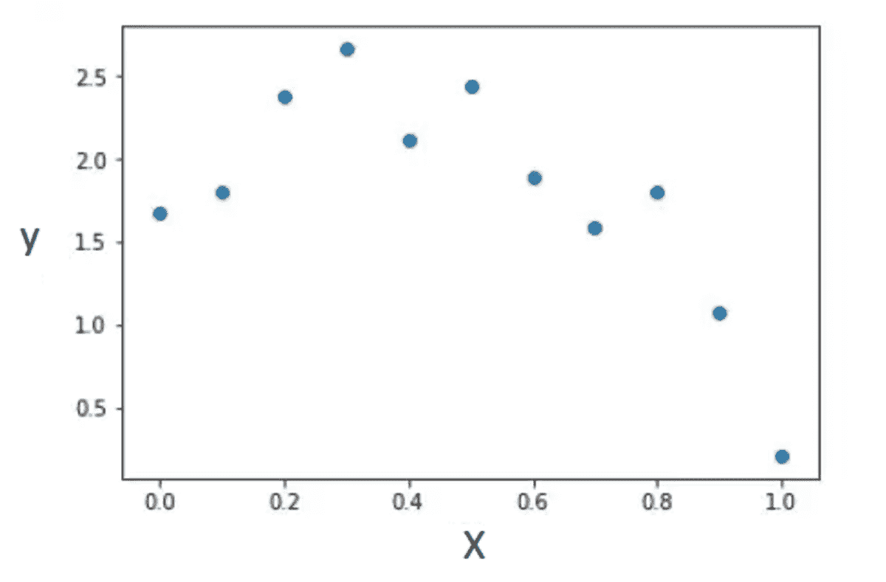
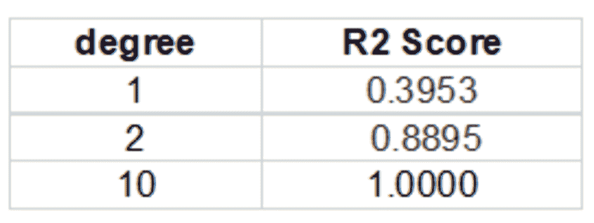

# 线性回归模型选择：平衡简洁性和复杂性

> 原文：[`www.kdnuggets.com/2023/02/linear-regression-model-selection-balancing-simplicity-complexity.html`](https://www.kdnuggets.com/2023/02/linear-regression-model-selection-balancing-simplicity-complexity.html)


图片来源：[freepik](https://www.freepik.com/)

简单线性回归是最古老的预测建模类型之一。在简单线性回归中，我们有一个特征 () 和一个连续目标变量 ()。目标是找到一个数学函数来描述 X 和 y 之间的关系。最简单的形式是尝试一个线性（度数 = 1）关系，形式为 ，其中  和 *a**1* 是需要确定的系数。一个二次模型（度数 = 2）的形式为 ，其中 ， 和  是需要确定的回归系数。

* * *

## 我们的前三名课程推荐

 1. [Google 网络安全证书](https://www.kdnuggets.com/google-cybersecurity) - 快速开启网络安全职业之路。

 2. [Google 数据分析专业证书](https://www.kdnuggets.com/google-data-analytics) - 提升你的数据分析能力

 3. [Google IT 支持专业证书](https://www.kdnuggets.com/google-itsupport) - 支持组织的 IT 需求

* * *

假设我们有一个下图所示的数据集。


图片作者

我们的目标是执行回归分析，以量化*X*和*y*之间的关系，即*y = f(X)*。一旦获得这一关系，我们就可以为任何给定的*X*值预测新的*y*值。

首先，我们生成一个散点图来显示*X*和*y*之间的关系。

```py
import pandas as pd
import pylab
import matplotlib.pyplot as plt
import numpy as np

data = pd.read_csv("file.csv")
X = data.X.values
y = data.y.values

plt.scatter(X, y)
plt.xlabel('X')
plt.ylabel('y')
plt.show()
```



要对数据执行一次多项式拟合（度数 = 1），我们可以使用以下代码：

```py
degree = 1
model=pylab.polyfit(X,y,degree)
y_pred=pylab.polyval(model,X)
#calculating R-squared value
R2 = 1 - ((y-y_pred)**2).sum()/((y-y.mean())**2).sum()
```

通过将度数值更改为度数 = 2 和度数 = 10，我们可以对数据执行更高阶的多项式拟合。

下图展示了针对不同多项式拟合的数据所获得的原始值和预测值的图示。


图片由作者提供

下表总结了不同模型的拟合优度得分（R2 分数）：

从上图中，我们观察到以下几点：



+   线性模型（度数 = 1）过于简单，因此对数据的拟合不足，导致高偏差误差。

+   更高的多项式模型（度数 = 10）过于复杂，因此对数据的拟合过度，导致高方差误差。

+   二次模型（度数 = 2）似乎在简洁性和复杂性之间提供了正确的平衡。

# 结论

总之，我们展示了如何使用 Python 进行简单的线性回归。通常，任何度数的多项式都可以用来拟合数据。然而，在选择最终模型时，重要的是要找到简洁性和复杂性之间的正确平衡。一个过于简单的模型对数据拟合不足，导致高偏差误差。类似地，一个过于复杂的模型则过度拟合数据，导致高方差误差。应选择一个在简洁性和复杂性之间达到适当平衡的模型，因为这种模型在应用于新数据时会产生更低的误差。

**[本杰明·O·泰约](https://www.linkedin.com/in/benjamin-o-tayo-ph-d-a2717511/)** 是物理学家、数据科学教育者和作家，也是 DataScienceHub 的所有者。此前，本杰明曾在中欧大学、 grand canyon 大学和匹兹堡州立大学教授工程学和物理学。

### 更多相关主题

+   [变压器的内存复杂度](https://www.kdnuggets.com/2022/12/memory-complexity-transformers.html)

+   [比较线性回归与逻辑回归](https://www.kdnuggets.com/2022/11/comparing-linear-logistic-regression.html)

+   [线性回归与逻辑回归：简明解释](https://www.kdnuggets.com/2022/03/linear-logistic-regression-succinct-explanation.html)

+   [KDnuggets 新闻 22:n12, 3 月 23 日：最佳数据科学书籍…](https://www.kdnuggets.com/2022/n12.html)

+   [预测制作：Python 中线性回归的初学者指南](https://www.kdnuggets.com/2023/06/making-predictions-beginner-guide-linear-regression-python.html)

+   [使用 NumPy 从头开始实现线性回归](https://www.kdnuggets.com/linear-regression-from-scratch-with-numpy)
