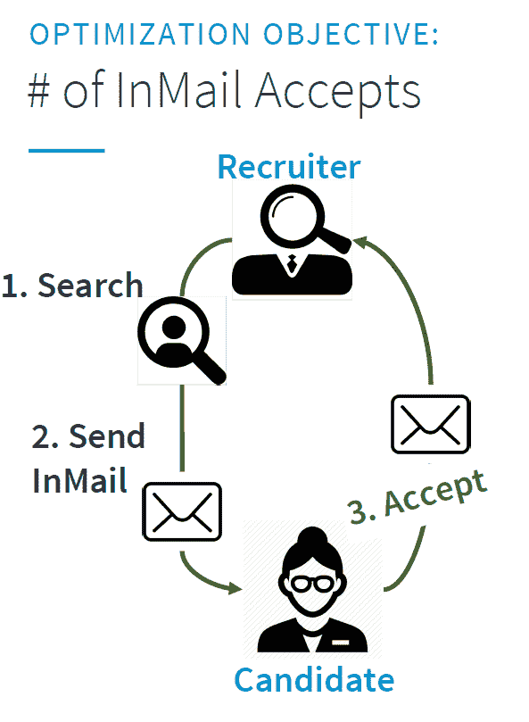
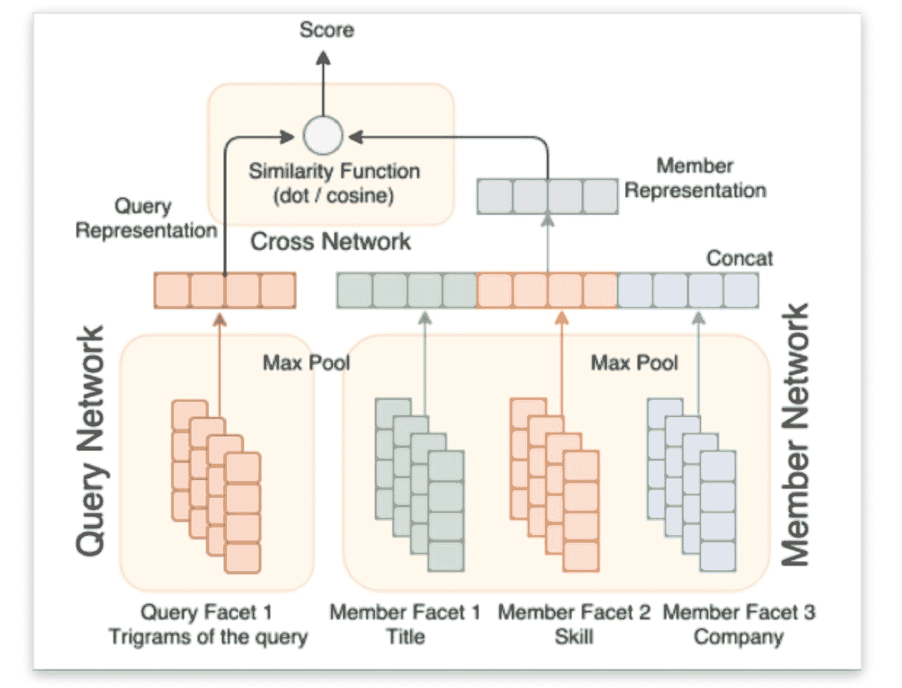
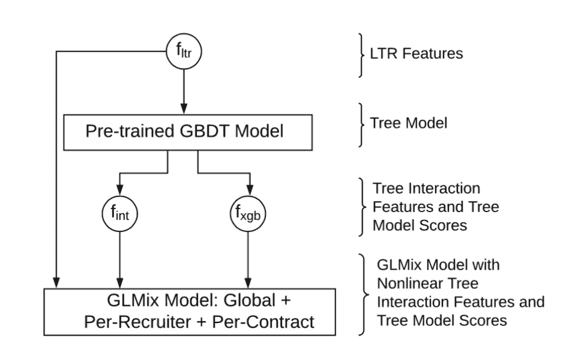
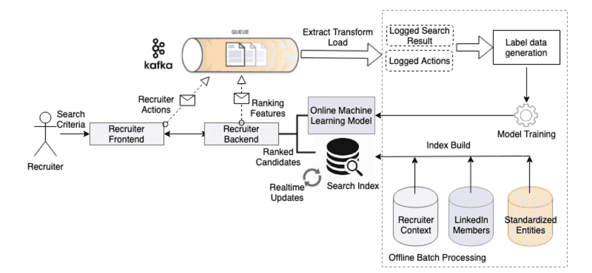
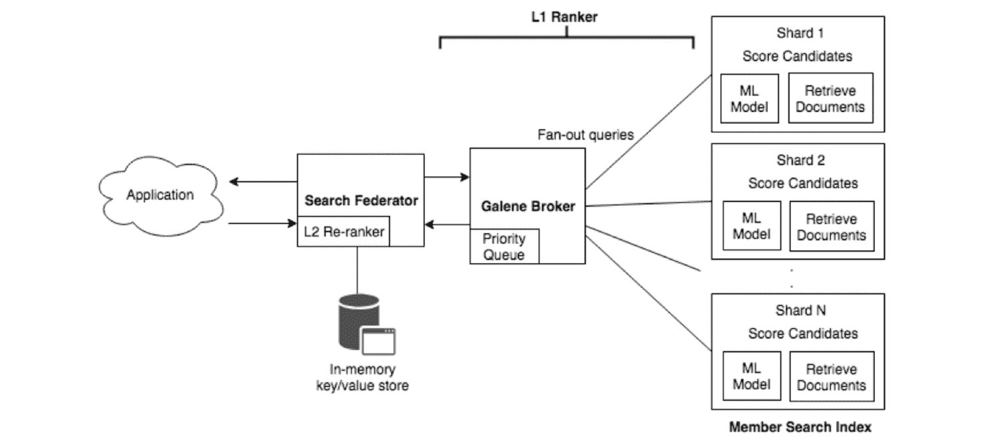

# LinkedIn 如何在其招聘推荐系统中使用机器学习

> 原文：[`www.kdnuggets.com/2020/10/linkedin-machine-learning-recruiter-recommendation-systems.html`](https://www.kdnuggets.com/2020/10/linkedin-machine-learning-recruiter-recommendation-systems.html)

评论

来源：[`solutionsreview.com/business-intelligence/machine-learning-linkedin-groups/`](https://solutionsreview.com/business-intelligence/machine-learning-linkedin-groups/)

> * * *
> 
> ## 我们的前三名课程推荐
> ## 
>  1\. [谷歌网络安全证书](https://www.kdnuggets.com/google-cybersecurity) - 快速进入网络安全职业生涯。
> 
>  2\. [谷歌数据分析专业证书](https://www.kdnuggets.com/google-data-analytics) - 提升你的数据分析技能
> 
>  3\. [谷歌 IT 支持专业证书](https://www.kdnuggets.com/google-itsupport) - 支持你的组织进行 IT 管理
> 
> * * *
> 
> 我最近开始了一份新的新闻通讯，专注于人工智能教育。TheSequence 是一份无废话（即无炒作、无新闻等）的人工智能专注型新闻通讯，阅读时间为 5 分钟。目标是让你跟上机器学习项目、研究论文和概念的最新动态。请通过下面的订阅尝试一下：

LinkedIn 是市场上最受欢迎的招聘平台之一。每天，来自世界各地的招聘人员依靠 LinkedIn 来寻找和筛选适合特定职业机会的候选人。特别是，[LinkedIn Recruiter](https://business.linkedin.com/talent-solutions/recruiter) 是帮助招聘人员建立和管理人才库的产品，优化成功招聘的机会。LinkedIn Recruiter 的有效性由一系列极其复杂的搜索和推荐算法驱动，这些算法结合了先进的机器学习架构与现实世界系统的实用性。

LinkedIn 一直是推动机器学习研究和发展的软件巨头之一，这并不是什么秘密。除了培养世界上最丰富的数据集之一外，LinkedIn 还不断尝试尖端的机器学习技术，以使人工智能（AI）成为 LinkedIn 体验的核心组成部分。其招聘产品中的推荐体验需要 LinkedIn 的全部机器学习专业知识，因为它成为了一个非常独特的挑战。除了处理一个极其庞大且不断增长的数据集外，LinkedIn 招聘需要处理任意复杂的查询和过滤，并提供符合特定标准的相关结果。搜索环境变化如此动态，以至于很难将结果建模为机器学习问题。在 Recruiter 的情况下，LinkedIn 使用了一个三因素标准来框定搜索和推荐模型的目标。

1) **相关性：** 搜索结果不仅需要返回相关的候选人，还要找出可能对目标职位感兴趣的候选人。

2) **查询智能：** 搜索结果不仅需要返回符合特定标准的候选人，还要返回符合类似标准的候选人。例如，搜索“机器学习”时，应该返回在其技能列表中包含数据科学的候选人。

3) **个性化：** 很多时候，为公司找到理想的候选人是基于匹配搜索标准之外的属性。有时，招聘人员不确定使用什么标准。个性化搜索结果是任何成功的搜索和推荐体验的关键要素。

LinkedIn 招聘和推荐体验中的一个关键标准是简单的度量标准，这一点不如之前提到的三个标准那么明显。为了简化推荐体验，LinkedIn 建立了一系列关键指标，这些指标是成功招聘的有形标志。例如，接受的 InMail 数量似乎是评估搜索和推荐过程有效性的一个明确指标。从这个角度来看，LinkedIn 将这些关键指标作为其机器学习算法的目标来最大化。

来源：[`engineering.linkedin.com/blog/2019/04/ai-behind-linkedin-recruiter-search-and-recommendation-systems`](https://engineering.linkedin.com/blog/2019/04/ai-behind-linkedin-recruiter-search-and-recommendation-systems)

### 科学：从线性回归到梯度提升决策树

LinkedIn Recruiter 中的初始搜索和推荐体验基于线性回归模型。虽然线性回归算法易于解释和调试，但它们在像 LinkedIn 这样的庞大数据集中难以发现非线性关联。为改进这一体验，LinkedIn 决定尝试 [梯度提升决策树 (GBDT)](https://en.wikipedia.org/wiki/Gradient_boosting#Gradient_tree_boosting)，将不同的模型结合在一个更复杂的树结构中。除了更大的假设空间外，GBDT 还有一些其他优势，比如对特征共线性处理良好、能够处理具有不同范围和缺失特征值的特征等。

GBDT 本身对比线性回归提供了一些实际的改进，但也未能解决搜索体验中的一些关键挑战。在一个著名的例子中，搜索牙医的结果却返回了具有软件工程职位的候选人，因为搜索模型优先考虑了求职候选人。为改进这一点，LinkedIn 添加了一系列基于称为对偶优化的技术的上下文感知特性。基本上，这种方法通过对偶排序目标扩展了 GBDT，以比较同一上下文中的候选人，并评估哪个候选人更适合当前的搜索上下文。

来源: [`engineering.linkedin.com/blog/2019/04/ai-behind-linkedin-recruiter-search-and-recommendation-systems`](https://engineering.linkedin.com/blog/2019/04/ai-behind-linkedin-recruiter-search-and-recommendation-systems)

LinkedIn Recruiter 体验中的另一个挑战是匹配具有相关职位的候选人，例如“数据科学家”和“机器学习工程师”。仅使用 GBDT 很难实现这种关联。为了解决这个问题，LinkedIn 引入了基于网络嵌入语义相似性特征的表示学习技术。在此模型中，搜索结果将补充具有类似标题的候选人，基于查询的相关性。

来源: [`engineering.linkedin.com/blog/2019/04/ai-behind-linkedin-recruiter-search-and-recommendation-systems`](https://engineering.linkedin.com/blog/2019/04/ai-behind-linkedin-recruiter-search-and-recommendation-systems)

可以说，LinkedIn 招聘体验中最困难的挑战是个性化。从概念上讲，个性化可以分为两个主要类别。实体级个性化关注于在招聘过程中融入不同实体的偏好，例如招聘人员、合同、公司和候选人。为了解决这个挑战，LinkedIn 依赖于一种知名的统计方法——[广义线性混合模型 (GLMix)](https://www.kdd.org/kdd2016/papers/files/adf0562-zhangA.pdf)，该方法利用推断来提高预测问题的结果。具体来说，LinkedIn 招聘人员使用了一种结合了学习排名特征、树交互特征和 GBDT 模型分数的架构。学习排名特征作为预训练的 GBDT 模型的输入，该模型生成的树集成被编码成树交互特征和每个数据点的 GBDT 模型分数。然后，利用原始的学习排名特征及其非线性变换形式的树交互特征和 GBDT 模型分数，GLMix 模型可以提供招聘人员级别和合同级别的个性化服务。

来源：[`engineering.linkedin.com/blog/2019/04/ai-behind-linkedin-recruiter-search-and-recommendation-systems`](https://engineering.linkedin.com/blog/2019/04/ai-behind-linkedin-recruiter-search-and-recommendation-systems)

另一种 LinkedIn 招聘体验所需的个性化模型则更注重会话中的体验。使用离线学习模型的一个缺点是，当招聘人员审查推荐的候选人并提供反馈时，这些反馈在当前搜索会话中未被考虑。为了解决这个问题，LinkedIn 招聘人员依赖于一种被称为[多臂强盗模型](https://en.wikipedia.org/wiki/Multi-armed_bandit)的技术，以改善在不同候选人群体中的推荐。该架构首先将潜在的候选人空间按技能分组。然后，使用多臂强盗模型来了解哪个组更符合招聘人员的当前意图，并根据反馈更新每个技能组内候选人的排名。

来源：[`engineering.linkedin.com/blog/2019/04/ai-behind-linkedin-recruiter-search-and-recommendation-systems`](https://engineering.linkedin.com/blog/2019/04/ai-behind-linkedin-recruiter-search-and-recommendation-systems)

### 架构

LinkedIn 招聘者的搜索和推荐体验基于一个名为[Galene](https://engineering.linkedin.com/search/did-you-mean-galene)的专有项目，该项目构建在 Lucene 搜索栈之上。上一节描述的机器学习模型有助于为搜索过程中的不同实体构建索引。

来源：[`engineering.linkedin.com/blog/2019/04/ai-behind-linkedin-recruiter-search-and-recommendation-systems`](https://engineering.linkedin.com/blog/2019/04/ai-behind-linkedin-recruiter-search-and-recommendation-systems)

招聘者搜索体验的排名模型基于两个基本层的架构。

+   **L1:** 深入挖掘人才池并对候选人进行评分/排名。在这一层，候选人检索和排名是以分布式方式进行的。

+   **L2:** 通过使用外部缓存来提炼短名单人才，以应用更多动态特征。

来源：[`engineering.linkedin.com/blog/2019/04/ai-behind-linkedin-recruiter-search-and-recommendation-systems`](https://engineering.linkedin.com/blog/2019/04/ai-behind-linkedin-recruiter-search-and-recommendation-systems)

在这种架构中，Galene 代理系统将搜索查询请求分发到多个搜索索引分区。每个分区检索匹配的文档，并对检索到的候选人应用机器学习模型。每个分区对候选人子集进行排名，然后代理将排名候选人收集起来，并将其返回给联邦器。联邦器使用额外的排名特征对检索到的候选人进行进一步排名，结果被交付给应用程序。

LinkedIn 是构建大规模机器学习系统的公司之一。LinkedIn 招聘者所使用的推荐和搜索技术的理念对于许多不同领域的类似系统具有极大的相关性。LinkedIn 工程团队[发布了一份详细的幻灯片演示文稿](https://www.slideshare.net/QiGuo19/talent-search-and-recommendation-systems-at-linkedin-practical-challenges-and-lessons-learned-127365935?from_action=save)，提供了更多关于他们构建世界级推荐系统的见解。

[原文](https://medium.com/@jrodthoughts/how-linkedin-uses-machine-learning-in-its-recruiter-recommendation-systems-1ada5d895cec)。经许可转载。

**相关：**

+   LinkedIn 开源一个小组件以简化 TensorFlow-Spark 互操作性

+   LinkedIn 新闻推送排名的多目标优化自动调优

+   LinkedIn 的 Pro-ML 架构总结了构建大规模机器学习的最佳实践

### 更多相关话题

+   [停止学习数据科学以寻找目标，并找到目标来…](https://www.kdnuggets.com/2021/12/stop-learning-data-science-find-purpose.html)

+   [学习数据科学统计学的最佳资源](https://www.kdnuggets.com/2021/12/springboard-top-resources-learn-data-science-statistics.html)

+   [一项价值 90 亿美元的 AI 失败，经过检视](https://www.kdnuggets.com/2021/12/9b-ai-failure-examined.html)

+   [成功数据科学家的 5 个特征](https://www.kdnuggets.com/2021/12/5-characteristics-successful-data-scientist.html)

+   [是什么让 Python 成为初创企业理想的编程语言](https://www.kdnuggets.com/2021/12/makes-python-ideal-programming-language-startups.html)

+   [每位数据科学家都应该知道的三个 R 库（即使你使用 Python）](https://www.kdnuggets.com/2021/12/three-r-libraries-every-data-scientist-know-even-python.html)
