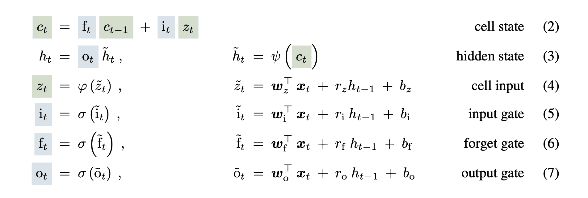
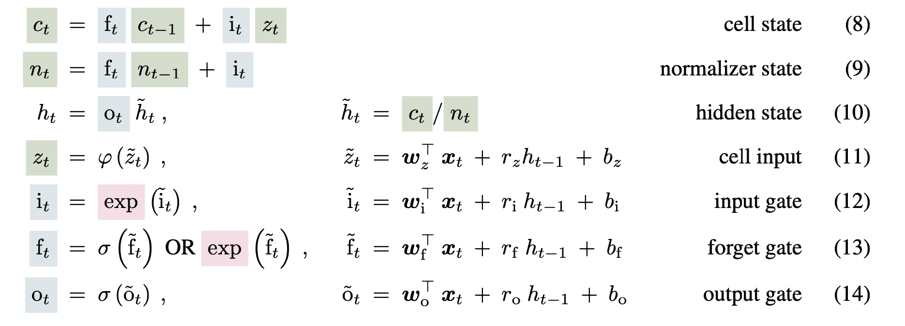
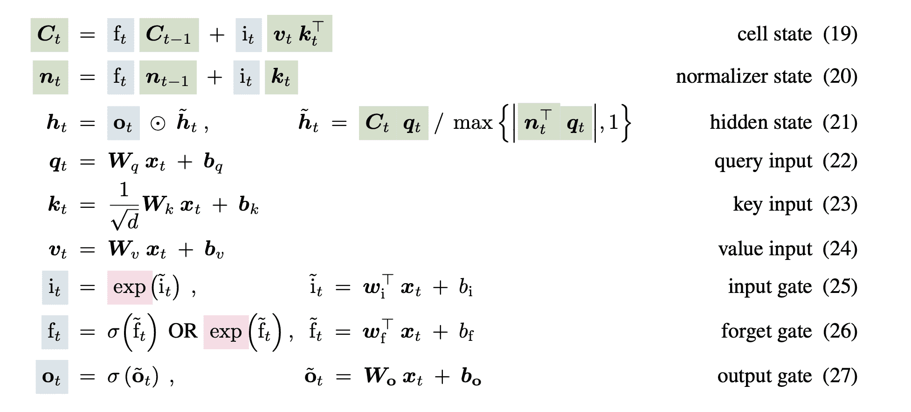
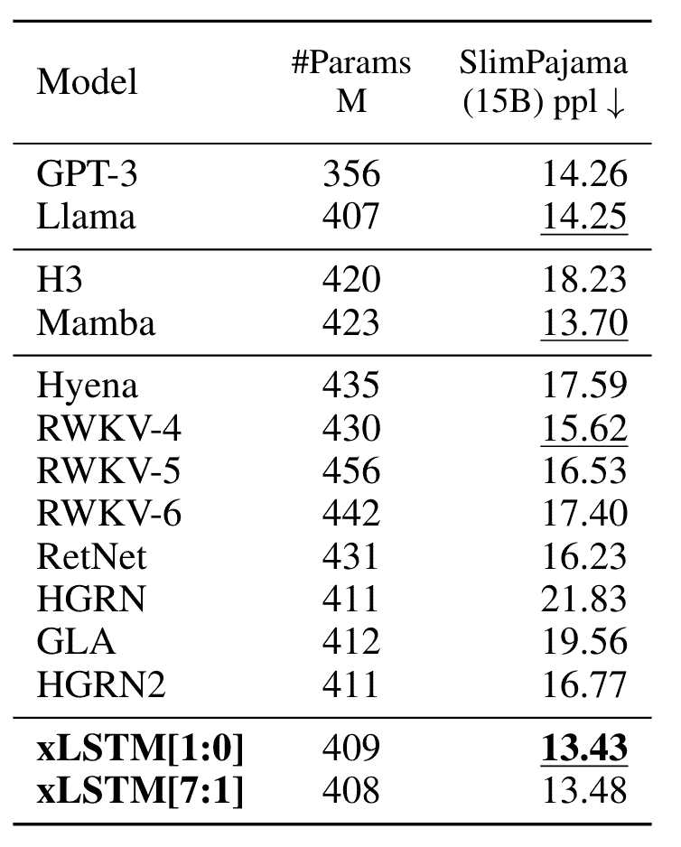
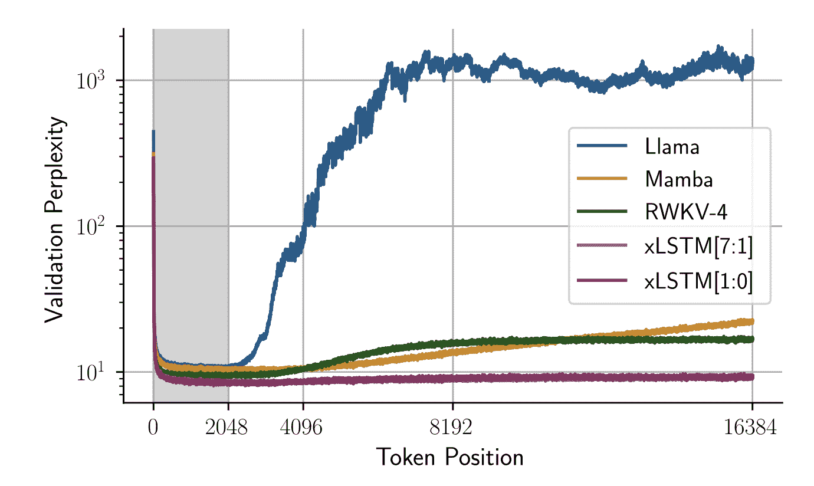

# LSTMs 再次崛起：扩展 LSTM 模型挑战变换器的优势

> 原文：[`www.kdnuggets.com/lstms-rise-again-extended-lstm-models-challenge-the-transformer-superiority`](https://www.kdnuggets.com/lstms-rise-again-extended-lstm-models-challenge-the-transformer-superiority)

作者提供的图片

LSTM 最初由[Sepp Hochreiter](https://scholar.google.at/citations?user=tvUH3WMAAAAJ&hl=en)和[Jurgen Schmidhuber](https://scholar.google.com/citations?user=gLnCTgIAAAAJ&hl=en)于 1990 年代初期引入。最初的模型计算成本极高，直到 2010 年代中期，RNN 和 LSTM 才受到关注。随着数据量的增加和更好的 GPU 的出现，LSTM 网络成为语言建模的标准方法，并成为第一个大型语言模型的基础。这种情况一直持续到 2017 年[基于注意力的变换器架构](https://arxiv.org/abs/1706.03762)的发布。LSTM 逐渐被变换器架构取代，后者现在是所有最近的大型语言模型，包括 ChatGPT、Mistral 和 Llama 的标准。

* * *

## 我们的前三个课程推荐

 1\. [谷歌网络安全证书](https://www.kdnuggets.com/google-cybersecurity) - 快速开启网络安全职业生涯。

 2\. [谷歌数据分析专业证书](https://www.kdnuggets.com/google-data-analytics) - 提升你的数据分析技能。

 3\. [谷歌 IT 支持专业证书](https://www.kdnuggets.com/google-itsupport) - 支持你所在组织的 IT 工作。

* * *

然而，由原始 LSTM 作者**[Sepp Hochreiter](https://arxiv.org/abs/2405.04517)** 最近发布的 xLSTM 论文在研究界引起了巨大轰动。结果显示其预训练结果与最新的 LLMs 进行了比较，并且提出了一个问题：LSTM 是否可以再次在自然语言处理领域取得突破。

## 高级架构概述

原始的 LSTM 网络有一些主要的局限性，这些局限性限制了它在更大上下文和更深层模型中的可用性。具体来说：

+   LSTM 是顺序模型，这使得训练和推理难以并行化。

+   他们的存储能力有限，所有信息必须压缩到一个单独的单元状态中。

最近发布的 xLSTM 网络引入了新的 sLSTM 和 mLSTM 模块，以解决这些不足之处。让我们从整体上了解一下模型架构，并看看作者采用了什么方法。

### 原始 LSTM 的简短评述

LSTM 网络使用了隐藏状态和单元状态来解决普通 RNN 网络中的梯度消失问题。他们还添加了忘记、输入和输出的 sigmoid 门来控制信息流动。方程如下：

图片来源于 [论文](https://arxiv.org/abs/2405.04517)

细胞状态（ct）经过 LSTM 单元时经过了微小的线性变换，帮助在较长的输入序列中保持梯度。

xLSTM 模型在新模块中修改了这些方程，以补救模型已知的局限性。

### sLSTM 模块

该模块修改了 sigmoid 门，并对输入门和遗忘门使用了指数函数。正如作者所引述的，这可以改善 LSTM 中的存储问题，并且仍然允许多个记忆单元在每个头内混合记忆，但不跨头。修改后的 sLSTM 模块方程如下：

图片来源于 [论文](https://arxiv.org/abs/2405.04517)

此外，由于指数函数可能导致大值，门值使用对数函数进行归一化和稳定。

### mLSTM 模块

为了解决 LSTM 网络中的并行性和存储问题，xLSTM 将细胞状态从 1 维向量修改为 2 维方阵。他们存储了作为键和值向量的分解版本，并使用与 sLSTM 模块相同的指数门控。方程如下：

图片来源于 [论文](https://arxiv.org/abs/2405.04517)

### 架构图

图片来源于 [论文](https://arxiv.org/abs/2405.04517)

整体 xLSTM 架构是 mLSTM 和 sLSTM 模块按不同比例顺序组合而成。如图所示，xLSTM 模块可以具有任意记忆单元。不同的模块通过层归一化堆叠在一起，形成深度残差网络。

## 评估结果与比较

作者在语言模型任务上训练 xLSTM 网络，并将训练模型的困惑度 *(越低越好)* 与当前的基于 Transformer 的 LLMs 进行比较。

作者首先在 SlimPajama 的 15B 令牌上训练模型。结果表明，xLSTM 在验证集上的困惑度得分最低，优于所有其他模型。

图片来源于 [论文](https://arxiv.org/abs/2405.04517)

### 序列长度外推

作者还分析了测试时序列长度超过模型训练时上下文长度的表现。他们在 2048 的序列长度上训练了所有模型，下面的图展示了随着令牌位置变化的验证困惑度：

图片来源于 [论文](https://arxiv.org/abs/2405.04517)

图表显示，即使对于更长的序列，xLSTM 网络仍能保持稳定的困惑度得分，并在更长的上下文长度中表现优于其他任何模型。

### 扩展 xLSTM 到更大模型尺寸

作者进一步在 300B 个来自 SlimPajama 数据集的标记上训练模型。结果表明，即使对于更大的模型，xLSTM 的扩展性也优于当前的 Transformer 和 Mamba 架构。

图片来源于[论文](https://arxiv.org/abs/2405.04517)

## 总结

这可能很难理解，不过没关系！尽管如此，你现在应该明白为什么这篇研究论文最近受到了如此关注。它的表现至少与近期的大型语言模型一样好，甚至更优。已证明它可以扩展到更大的模型，并且可以成为所有近期基于 Transformers 构建的 LLMs 的严肃竞争者。只有时间会证明 LSTMs 是否会重新获得辉煌，但现在我们知道 xLSTM 架构在挑战著名的 Transformers 架构的优势。

****[Kanwal Mehreen](https://www.linkedin.com/in/kanwal-mehreen1/)** Kanwal 是一位机器学习工程师和技术作家，对数据科学以及人工智能与医学的交叉领域充满深厚的热情。她共同撰写了电子书《利用 ChatGPT 最大化生产力》。作为 2022 年亚太地区 Google 一代学者，她倡导多样性和学术卓越。她还被誉为 Teradata 技术多样性学者、Mitacs 全球研究学者和哈佛 WeCode 学者。Kanwal 是变革的热心倡导者，创办了 FEMCodes 以赋能 STEM 领域的女性。

### 更多相关话题

+   [如果我必须重新开始学习数据科学，我会怎么做？](https://www.kdnuggets.com/2020/08/start-learning-data-science-again.html)

+   [R 与 Python（再次）：一个人因视角](https://www.kdnuggets.com/2022/01/r-python-human-factor-perspective.html)

+   [从那里和回来……一个 RAPIDS 故事](https://www.kdnuggets.com/2023/06/back-again-rapids-tale.html)

+   [为什么 Emily Ekdahl 选择 co:rise 来提升她作为…的工作表现](https://www.kdnuggets.com/2022/08/corise-emily-ekdahl-chose-corise-level-job-performance-machine-learning-engineer.html)

+   [拖拽、分析：无代码数据科学的崛起](https://www.kdnuggets.com/drag-drop-analyze-the-rise-of-nocode-data-science)

+   [提示工程的兴起与衰落：时尚还是未来？](https://www.kdnuggets.com/the-rise-and-fall-of-prompt-engineering-fad-or-future)
