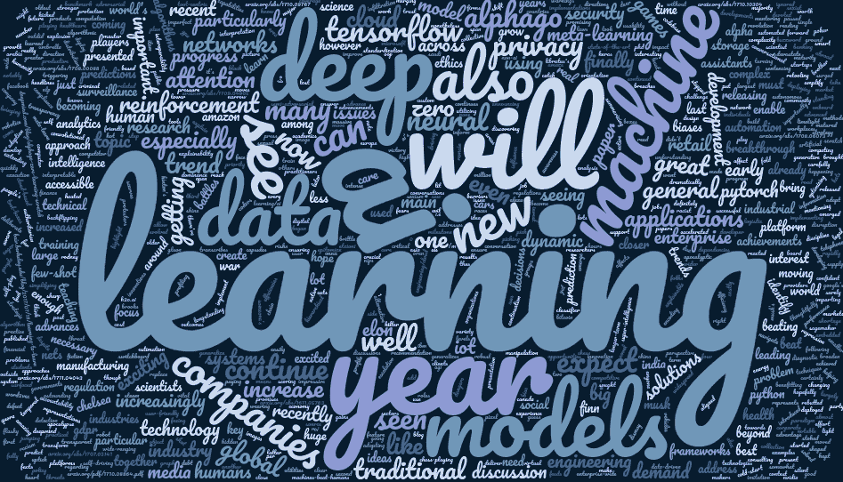

# 机器学习与人工智能：2017 年主要发展与 2018 年关键趋势

> 原文：[`www.kdnuggets.com/2017/12/machine-learning-ai-main-developments-2017-key-trends-2018.html`](https://www.kdnuggets.com/2017/12/machine-learning-ai-main-developments-2017-key-trends-2018.html)

 评论

在 KDnuggets，我们努力跟踪行业、学术界和技术领域的主要事件和发展。我们还尽力展望未来的关键趋势。

为了总结 2017 年，我们最近向一些大数据、数据科学、人工智能和机器学习领域的领先专家征询了他们对 2017 年最重要发展的看法以及他们对 2018 年的关键趋势的预测。本文考虑了今年机器学习与人工智能的发展情况，并展望了 2018 年的可能趋势。

具体来说，我们向该领域的专家提出了以下问题：

**“2017 年主要的机器学习与人工智能相关发展是什么？你认为 2018 年有哪些关键趋势？”**

我们征求了众多个人的回应，并要求他们将回答控制在大约 200 字以内，尽管我们没有过于严格，允许有趣的回答稍长一些。

快速回顾一下，去年的趋势和预测 主要集中在以下主题：

+   AlphaGo 的成功

+   深度学习热潮

+   自动驾驶汽车

+   TensorFlow 对神经网络技术商品化的影响

要了解哪些发展被认为是今年最重要的，以及我们的专家认为机器学习与人工智能在 2018 年将走向何方，请阅读下面的贡献。

**最后说明**：没有这些专家的慷慨参与，我们无法呈现这些帖子。虽然并非我们请求的每个人都能够参与，但我们对能够参与的人表示感激。希望你们喜欢他们的见解。

[**Xavier Amatriain**](https://www.linkedin.com/in/xamatriain) 是 Curai 的联合创始人兼首席技术官，曾担任 Quora 的工程副总裁和 Netflix 的研究/工程总监。

> 如果我要挑选今年的主要亮点，那一定是[AlphaGo Zero](https://deepmind.com/blog/alphago-zero-learning-scratch/) ([论文](https://www.gwern.net/docs/rl/2017-silver.pdf))。这种新方法不仅在一些最有前景的方向（如深度强化学习）中有所改进，而且还代表了一种范式转变，即这些模型可以在没有数据的情况下进行学习。我们最近还了解到，AlphaGo Zero 可以[泛化](https://arxiv.org/abs/1712.01815)到其他游戏如国际象棋。你可以在我的[Quora 回答](https://www.quora.com/What-is-the-significance-of-AlphaGo-Zero-in-AI-research/answer/Xavier-Amatriain)中了解更多关于我对这一进展的解读。
> 
> 如果我们从人工智能的工程角度来看，今年开始时，Pytorch 获得了越来越大的关注，成为了 Tensorflow 的真正挑战者，特别是在研究领域。Tensorflow 迅速作出反应，发布了动态网络功能，即[Tensorflow Fold](https://research.googleblog.com/2017/02/announcing-tensorflow-fold-deep.html)。然而，大公司之间的“人工智能战争”还有许多其他战役，其中最激烈的一场发生在云计算领域。所有主要的服务提供商都大幅提升了他们在云端的人工智能支持。亚马逊在他们的 AWS 中展示了大量创新，例如最近推出的[Sagemaker](https://aws.amazon.com/sagemaker/)用于构建和部署机器学习模型。值得一提的是，较小的公司也开始参与其中。Nvidia 最近推出了他们的[GPU 云](https://www.nvidia.com/en-us/gpu-cloud/)，这有望成为训练深度学习模型的另一个有趣选择。尽管这些战斗不断，但看到行业在必要时能够团结起来也是值得欣慰的。新的[ONNX](http://onnx.ai/)神经网络表示标准化是实现互操作性的重要且必要的一步。
> 
> 2017 年还见证了围绕人工智能的社会问题的持续（升级？）。埃隆·马斯克继续煽动我们离杀手机器人越来越近的想法，引起了许多人的不安。关于人工智能将在未来几年如何影响就业的问题也有了很多讨论。最后，我们还看到越来越多的关注集中在人工智能算法的透明度和偏见上。

*有关 Xavier 对今年主要趋势的看法以及他对明年的期待，请[查看他的年终总结](https://www.kdnuggets.com/2017/12/xavier-amatriain-machine-leanring-ai-year-end-roundup.html)。*

[**乔治娜·科斯马**](https://www.linkedin.com/in/georginacosma/) 是诺丁汉特伦特大学科学与技术学院的高级讲师。

> 机器学习模型，特别是深度学习模型，对健康护理、法律系统、工程和金融行业等关键领域产生了重大影响。然而，大多数机器学习模型不易解释。理解一个模型如何得出预测结果在分析和诊断模型中尤为重要，在这些模型中，人类必须对模型提供的预测结果有足够的信任。重要的是，一些机器学习模型的决策必须符合法律和规定。现在是时候创建足够透明以解释其预测结果的深度学习模型了，特别是当这些模型的结果被用于影响或告知人类决策时。

[**佩德罗·多明戈斯**](https://www.linkedin.com/in/pedro-domingos-77b183/)是华盛顿大学计算机科学与工程系的教授。

> +   Libratus 在扑克中的胜利，扩展了 AI 在不完全信息游戏中的主导地位 ([www.cmu.edu/news/stories/archives/2017/january/AI-beats-poker-pros.html](http://www.cmu.edu/news/stories/archives/2017/january/AI-beats-poker-pros.html))
> +   
> +   自驾车和虚拟助手的竞争日益激烈，其中 Alexa 在虚拟助手领域表现突出。
> +   
> +   谷歌、亚马逊、微软和 IBM 之间的云 AI 发展竞争。
> +   
> +   AlphaGo Zero 很出色，但并非突破性进展。自我对弈是机器学习中最古老的想法之一，人类在掌握围棋时需要的游戏数远远少于 500 万局。

[**阿吉特·贾奥卡**](https://www.linkedin.com/in/ajitjaokar/)是首席数据科学家，也是牛津大学物联网数据科学课程的创始人。

> 2017 年是 AI 的年头。2018 年将是 AI 成熟的年份。我们已经可以看到，AI 正在以更具“系统工程/云原生”的视角展现复杂性——如 h2o.ai 这样的公司简化了 AI 部署的复杂性。
> 
> 我看到 AI 在工业物联网、零售和医疗保健领域越来越多地被用于竞争优势，这将带来更大的颠覆。我还看到 AI 在企业各级别迅速部署（这同样带来了新机会，但也导致了更多岗位的流失）。因此，我们已经超越了讨论 Python 与 R 以及猫咪的阶段！
> 
> 我认为 AI 正在通过嵌入式 AI（即跨越企业和物联网的数据科学模型）融合传统企业和更广泛的供应链。
> 
> 最后，懂得 AI/深度学习技术的数据科学家短缺的问题将继续存在，尤其是在工业物联网等传统行业之外。

[**尼基塔·约翰逊**](https://www.linkedin.com/in/nikitaljohnson/)是 RE.WORK 的创始人。

> 2017 年在机器学习和 AI 方面取得了巨大进展，尤其是 DeepMind 最近的通用强化学习算法，在不到四小时的自我学习后击败了世界上最强的国际象棋程序。
> 
> 我预计在 2018 年，我们将看到智能自动化渗透到从传统制造组织到零售、再到公用事业的各种公司。随着数据收集和分析的持续增加，企业范围的自动化系统策略将变得至关重要。这将使公司能够投资于人工智能的长期计划，并确保它成为未来增长和效率的优先事项。
> 
> 我们还将看到自动化机器学习帮助让技术对非人工智能研究人员更加可及，并使更多公司能够将机器学习方法应用到他们的工作场所。

[**雨果·拉罗谢尔**](https://www.linkedin.com/in/hugo-larochelle-b11a7126/) 是谷歌的研究科学家，并且是加拿大高级研究院机器与大脑学习计划的副主任。

> 我最兴奋和关注的机器学习趋势之一是元学习。元学习是一个特别广泛的总称。但今年，对我而言，最令人兴奋的是在少样本学习问题上的进展，它解决了从极少的样本中发现能很好泛化的学习算法的问题。Chelsea Finn 在今年初通过这篇博客文章很出色地总结了这个主题的早期进展：[bair.berkeley.edu/blog/2017/07/18/learning-to-learn/](http://bair.berkeley.edu/blog/2017/07/18/learning-to-learn/)。值得注意的是，在目前许多令人惊叹的机器学习博士生中，Chelsea Finn 无疑是今年最有成效和令人印象深刻的之一。
> 
> 年底时，更多关于少样本学习的元学习研究成果被发布，涉及深度时间卷积网络（[arxiv.org/abs/1707.03141](https://arxiv.org/abs/1707.03141)）、图神经网络（[arxiv.org/abs/1711.04043](https://arxiv.org/abs/1711.04043)）等。我们还看到元学习方法应用于主动学习（[arxiv.org/abs/1708.00088](https://arxiv.org/abs/1708.00088)）、冷启动项目推荐（[papers.nips.cc/paper/7266-a-meta-learning-perspective-on-cold-start-recommendations-for-items](http://papers.nips.cc/paper/7266-a-meta-learning-perspective-on-cold-start-recommendations-for-items)）、少样本分布估计（[arxiv.org/abs/1710.10304](https://arxiv.org/abs/1710.10304)）、强化学习（[arxiv.org/abs/1611.05763](https://arxiv.org/abs/1611.05763)）、层级强化学习（[arxiv.org/abs/1710.09767](https://arxiv.org/abs/1710.09767)）、模仿学习（[arxiv.org/abs/1709.04905](https://arxiv.org/abs/1709.04905)）等等。
> 
> 这是一个激动人心的领域，我在 2018 年肯定会密切关注。

[**查尔斯·马丁**](https://www.linkedin.com/in/charlesmartin14/) 是一名数据科学家和机器学习人工智能顾问。

> 2017 年深度学习 AI 平台和应用出现了巨大的增长。年初，Facebook 发布了他们的 TensorFlow 竞争对手 PyTorch。Gluon、Alex、AlphaGo……进展不断。机器学习从特征工程和逻辑回归发展到阅读论文、实施神经网络和优化训练性能。在我的咨询实践中，客户寻求定制的物体检测、高级自然语言处理和强化学习。虽然市场和比特币上涨，人工智能却是一场静默的革命，零售末日引发了对人工智能将摧毁行业的真实担忧。公司希望转型。我们看到对人工智能指导的极大兴趣，包括技术和战略方面的指导。
> 
> 2018 年肯定会成为全球人工智能优先经济的突破年。我们从欧洲、亚洲、印度，甚至沙特阿拉伯都有需求。全球需求将继续增长，中国和加拿大的人工智能进步，以及印度等国家从 IT 转向 AI 的情况也将推动这种增长。美国及海外的企业培训需求也很大。人工智能将带来巨大的效率提升，传统行业如制造业、医疗保健和金融业都将受益。人工智能初创公司将推出新产品并全面提高投资回报率。新技术，从机器人到自动驾驶汽车，将以更令人惊叹的进步令人惊艳。
> 
> 这将是创新的伟大一年。如果你参与其中。

[**塞巴斯蒂安·拉施卡**](https://www.linkedin.com/in/sebastianraschka/) 是密歇根州立大学的应用机器学习和深度学习研究员、计算生物学家，同时也是 *《Python 机器学习》* 的作者。

> 在过去几年中，开源社区对新兴的深度学习框架进行了大量讨论。现在，这些工具已经有所成熟，我希望并期待看到一种不那么以工具为中心的方法，并且更多的精力会投入到开发和实施新颖的想法和应用上，特别是利用深度学习的应用。我期待看到更多令人兴奋的问题通过生成对抗神经网络和辛顿的胶囊网络来解决，这些都是今年的热门话题。
> 
> 此外，正如你可能从我们最近关于给面部图像添加隐私的半对抗神经网络论文中猜到的那样，用户隐私在深度学习应用中是我非常关心的问题，我希望并期待这个话题在 2018 年得到更多关注。

[**布兰登·罗赫尔**](https://www.linkedin.com/in/brohrer/) 是 Facebook 的数据科学家。

> 2017 年还因更多机器击败人类的成就而引人注目。去年，AlphaGo 通过击败世界顶尖的围棋选手，达到了智能发展的一个重要里程碑。今年，AlphaGo Zero 通过从零开始自我学习，超越了其前身。 ([deepmind.com/blog/alphago-zero-learning-scratch](https://deepmind.com/blog/alphago-zero-learning-scratch/)) 它不仅击败了一个人类，还击败了全人类的围棋经验。在更实际的方面，现在一台机器在 Switchboard 基准测试中能够像人类一样转录电话对话。 ([arxiv.org/abs/1708.06073](https://arxiv.org/abs/1708.06073))
> 
> 然而，AI 的成就仍然狭窄而脆弱。即使在图像中改变一个像素也可能击败最先进的分类器。 ([arxiv.org/pdf/1710.08864.pdf](https://arxiv.org/pdf/1710.08864.pdf)) 我预测 2018 年将会带来更具普遍性和鲁棒性的 AI 解决方案。几乎每个主要科技公司已经开始了人工通用智能的研究。这些团队及其早期成果将成为头条新闻。至少，“AGI”将取代“AI”成为年度流行词。

[**埃琳娜·沙罗娃**](https://codefying.com/)是某投资银行的数据科学家。

> **2017 年主要的机器学习/人工智能相关发展是什么？**
> 
> 我看到越来越多的公司和个人将他们的数据和分析转移到基于云的解决方案中，同时对数据安全重要性的认识也急剧增加。
> 
> 最大和最成功的科技公司一直在竞争，争取成为你的数据存储和分析平台。对数据科学家来说，这意味着他们开发的工具箱和解决方案正受到这些平台的交付能力和表现的影响。
> 
> 2017 年全球出现了大量引人注目的数据安全漏洞。这是一个不容忽视的发展趋势。随着越来越多的数据迁移到第三方存储，对能够适应新威胁的更强大安全措施的需求将持续增长。
> 
> **你在 2018 年看到哪些关键趋势？**
> 
> 确保遵守《全球数据保护条例》（GDPR）以及越来越多地需要应对机器学习系统的“隐藏”技术债务是我对 2018 年关键趋势的预测。GDPR 作为欧盟法规，具有全球影响力，所有数据科学家应该充分了解它如何影响他们的工作。根据谷歌的[《NIPS’16 论文》](https://papers.nips.cc/paper/5656-hidden-technical-debt-in-machine-learning-systems.pdf)，数据依赖性是昂贵的，随着公司创建复杂的数据驱动模型，他们将不得不仔细考虑如何解决这一成本。

[**塔玛拉·西佩斯**](https://www.linkedin.com/in/tamara-sipes-3699131/)是 Optum/UnitedHealth Group 的商业数据科学总监。

> **2017 年的主要发展和 2018 年的关键趋势：**
> 
> +   深度学习和集成建模方法的力量继续展示其价值和优越性，相比其他机器学习工具，2017 年表现尤为突出。特别是深度学习，在各种领域和行业中的应用越来越广泛。
> +   
> +   至于 2018 年的趋势，深度学习可能会用于从原始输入中生成新特征和新概念，取代手动创建或工程化新变量的需求。深度网络在检测数据中的特征和结构方面非常强大，数据科学家们也意识到无监督深度学习在这一方面可以释放的价值。
> +   
> +   有效的异常检测也可能是未来的重点。异常和其他类型的稀有事件在许多行业的数据科学工作中都受到关注：入侵检测、金融欺诈检测、欺诈、浪费、滥用、医疗保健中的错误以及设备故障只是一些例子。检测这些稀有事件使得在这些领域中获得竞争优势成为可能。跟上这些稀有事件不断变化的性质，将是这一领域一个引人入胜且艰难的挑战。

[**瑞秋·托马斯**](https://www.linkedin.com/in/rachel-thomas-942a7923/) 是 fast.ai 的创始人，也是 USF 的助理教授。

> 尽管没有像 Alpha Go 或翻转机器人那样引人注目，但我对 2017 年最兴奋的 AI 趋势是深度学习框架变得更加用户友好和易于使用。PyTorch（今年发布）对任何懂 Python 的人都很友好（主要由于其动态计算和面向对象设计）。即使是 TensorFlow 也朝着这个方向发展，通过将 Keras 集成到其核心代码库中，并宣布支持急切（动态）执行。使用深度学习的编码门槛在不断降低。我预计这种开发者可用性提高的趋势将在 2018 年继续。
> 
> 第二个趋势是媒体对专制政府利用 AI 进行监控能力的关注增加。这种隐私威胁在 2017 年之前就存在，但最近才开始获得广泛关注。有关使用深度学习识别佩戴围巾和帽子的抗议者，或通过照片识别某人的性取向的研究，今年引起了更多媒体对 AI 隐私风险的关注。希望在 2018 年，我们能继续扩展关于 AI 伦理的讨论，不仅仅是埃隆·马斯克对邪恶超智能的担忧，还包括对监控、隐私以及性别和种族偏见编码的讨论。

[**丹尼尔·图克朗**](https://www.linkedin.com/in/dtunkelang/) 是高级顾问。

> 2017 年是自动驾驶汽车和对话型数字助手的重要一年。这两种应用体现了深度学习如何将科幻变成现实。
> 
> 但今年对机器学习和人工智能最重要的发展是对伦理、问责和可解释性的关注。埃隆·马斯克用他关于人工智能引发世界大战的末日预言引起了媒体的关注，而奥伦·艾齐奥尼和罗德尼·布鲁克斯等人对此进行了深思熟虑的反驳。尽管如此，我们仍面临来自机器学习模型中的偏见的明显威胁，例如 word2vec 中的性别歧视、算法刑事判决中的种族歧视，以及社交媒体评分模型的故意操控。这些问题并不新鲜，但机器学习的加速采用——特别是深度学习——使这些问题浮出水面，暴露给了公众。
> 
> 我们终于看到可解释人工智能作为一个学科的出现，它将学术界、行业从业者和政策制定者聚集在一起。未来一年将加大对我们深度学习模型黑箱的揭示压力。

**相关：**

+   大数据：2017 年的主要进展及 2018 年的关键趋势

+   机器学习与人工智能：2016 年的主要进展及 2017 年的关键趋势

+   数据科学、机器学习：2017 年的主要进展及 2018 年的关键趋势

* * *

## 我们的前三大课程推荐

 1\. [谷歌网络安全证书](https://www.kdnuggets.com/google-cybersecurity) - 快速入门网络安全职业

 2\. [谷歌数据分析专业证书](https://www.kdnuggets.com/google-data-analytics) - 提升你的数据分析能力

 3\. [谷歌 IT 支持专业证书](https://www.kdnuggets.com/google-itsupport) - 支持你所在组织的 IT

* * *

### 更多相关话题

+   [人工智能、分析、机器学习、数据科学、深度学习…](https://www.kdnuggets.com/2021/12/developments-predictions-ai-machine-learning-data-science-research.html)

+   [2021 年主要进展及 2022 年人工智能、数据科学等领域的关键趋势](https://www.kdnuggets.com/2021/12/trends-ai-data-science-ml-technology.html)

+   [数据科学与分析行业 2021 年的主要进展及关键…](https://www.kdnuggets.com/2021/12/developments-predictions-data-science-analytics-industry.html)

+   [成为优秀数据科学家所需的 5 项关键技能](https://www.kdnuggets.com/2021/12/5-key-skills-needed-become-great-data-scientist.html)

+   [每位初学者数据科学家应掌握的 6 种预测模型](https://www.kdnuggets.com/2021/12/6-predictive-models-every-beginner-data-scientist-master.html)

+   [2021 年最佳 ETL 工具](https://www.kdnuggets.com/2021/12/mozart-best-etl-tools-2021.html)
