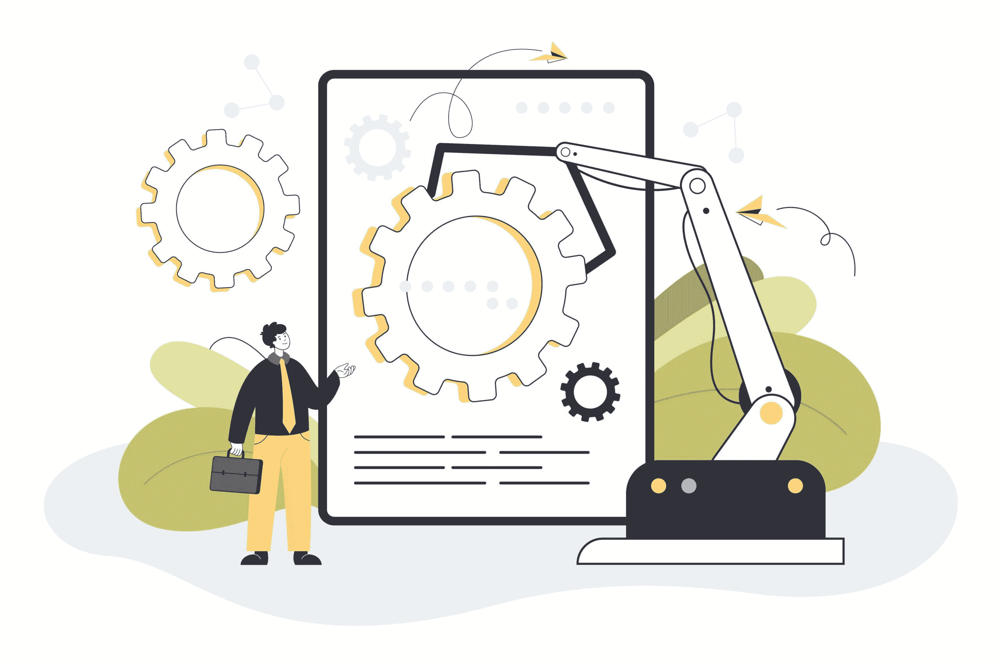

# 机器学习算法解释，少于 1 分钟

> 原文：[`www.kdnuggets.com/2022/07/machine-learning-algorithms-explained-less-1-minute.html`](https://www.kdnuggets.com/2022/07/machine-learning-algorithms-explained-less-1-minute.html)

图片由 [pch.vector](https://www.freepik.com/free-vector/man-digital-era-algorithm-ai-social-system-21st-century-workforce-challenge-flat-vector-illustration-smart-business-process-human-resources-automation-artificial-intelligence-concept_22343897.htm#query=Algorithms&position=23&from_view=search&track=sph) 在 Freepik 提供

这篇文章将在不到一分钟的时间里解释一些最著名的机器学习算法——帮助每个人理解它们！

* * *

## 我们的前三名课程推荐

 1\. [谷歌网络安全证书](https://www.kdnuggets.com/google-cybersecurity) - 快速进入网络安全职业生涯。

 2\. [谷歌数据分析专业证书](https://www.kdnuggets.com/google-data-analytics) - 提升你的数据分析能力

 3\. [谷歌 IT 支持专业证书](https://www.kdnuggets.com/google-itsupport) - 支持你的组织的 IT

* * *

# 线性回归

线性回归是最简单的机器学习算法之一，用于对连续的因变量进行预测，基于对自变量的知识。因变量是效果，其值取决于自变量的变化。

你可能还记得学校中的最佳拟合线——这就是线性回归所产生的。一个简单的例子是根据身高预测体重。

# 逻辑回归

逻辑回归与线性回归类似，用于对分类因变量进行预测，基于自变量的知识。分类变量有两个或更多类别。逻辑回归将输出分类为只能在 0 和 1 之间的值。

例如，你可以使用逻辑回归来确定学生是否会被某个特定大学录取，取决于他们的成绩——结果可以是“是”或“否”，或者是 0 或 1。

# 决策树

决策树（DTs）是一种树状结构的概率模型，它不断分裂数据，以根据先前回答的问题进行分类或预测。该模型学习数据的特征并回答问题，以帮助你做出更好的决策。

例如，你可以使用决策树，通过“是”或“否”来确定某种特定鸟类，使用的特征数据包括羽毛、飞行或游泳能力、喙的类型等。

# 随机森林

类似于决策树，随机森林也是一种基于树的算法。决策树由一棵树组成，而随机森林使用多棵决策树进行决策——即一片树木的森林。

它结合了多个模型来进行预测，可用于分类和回归任务。

# K-最近邻

K-最近邻利用数据点之间的距离来决定这些数据点是否可以分组。数据点之间的接近度反映了它们之间的相似性。

例如，如果我们有一个图表，其中有一组彼此靠近的数据点称为组 A，另一组彼此靠近的数据点称为组 B。当输入一个新的数据点时，根据新数据点更接近哪个组——这将是它的新分类组。

# 支持向量机

类似于最近邻，支持向量机执行分类、回归和异常值检测任务。它通过绘制一个超平面（直线）来分隔类别。位于直线一侧的数据点将被标记为组 A，而另一侧的数据点将被标记为组 B。

例如，当输入一个新的数据点时，依据该数据点位于超平面哪一侧及其在边界内的位置——这将决定数据点属于哪个类别。

# 朴素贝叶斯

朴素贝叶斯基于贝叶斯定理，这是一种用于计算条件概率的数学公式。条件概率是指在另一个事件发生的情况下，某一结果发生的机会。

它预测每个类别的概率，归属于某个特定类别，概率最高的类别被认为是最可能的类别。

# k 均值聚类

K 均值聚类，类似于最近邻，但使用聚类的方法将相似的项/数据点分组在簇中。簇的数量被称为 K。你通过选择 k 值、初始化质心，然后选择组并计算平均值来完成这一过程。

例如，如果存在 3 个簇，且输入一个新的数据点，根据它属于哪个簇——这就是它所属的簇。

# 袋装

袋装也被称为自助聚合（Bootstrap aggregating），是一种集成学习技术。袋装用于回归和分类模型，旨在避免数据的过拟合，并减少预测中的方差。

过拟合是指模型对训练数据的拟合过于精确——基本上没有提供新的信息，这可能由各种原因造成。随机森林是袋装（Bagging）的一个例子。

# 提升

Boosting 的总体目标是将弱学习者转化为强学习者。弱学习者是通过应用基本学习算法找到的，这些算法生成新的弱预测规则。数据的随机样本被输入到模型中，然后进行顺序训练，旨在训练弱学习者并尝试纠正其前身。

XGBoost，代表极端梯度提升，被用于 Boosting。

# 降维

降维用于减少训练数据中输入变量的数量，通过降低特征集的维度。当模型具有大量特征时，模型自然更复杂，这导致过拟合的机会增加和准确性的下降。

例如，如果你有一个包含一百列的数据集，降维将把列数减少到二十。然而，你还需要特征选择来选择相关特征，并需要特征工程从现有特征中生成新的特征。

主成分分析（PCA）技术是一种降维方法。

# 结论

本文的目的是帮助你以最简单的术语理解机器学习算法。如果你想更深入地了解每一个算法，可以阅读这个流行的机器学习算法。

**[Nisha Arya](https://www.linkedin.com/in/nisha-arya-ahmed/)** 是一名数据科学家和自由技术撰稿人。她特别感兴趣于提供数据科学职业建议或教程以及数据科学的理论知识。她还希望探索人工智能如何能促进人类寿命的不同方式。作为一个热衷学习者，她寻求拓宽自己的技术知识和写作技能，同时帮助指导他人。

### 更多相关内容

+   [KDnuggets 新闻，7 月 20 日：机器学习算法的解释…](https://www.kdnuggets.com/2022/n29.html)

+   [在少于 15 行代码中进行多模态深度学习](https://www.kdnuggets.com/2023/01/predibase-multi-modal-deep-learning-less-15-lines-code.html)

+   [在不到 6 个月的时间内成为商业智能分析师](https://www.kdnuggets.com/become-a-business-intelligence-analyst-in-less-than-6-months)

+   [与 Andrej Karpathy 一起在 60 分钟内解锁 LLM 的秘密](https://www.kdnuggets.com/unlock-the-secrets-of-llms-in-a-60-minute-with-andrej-karpathy)

+   [NLP 应用在现实世界中的范围：不同的解决方案…](https://www.kdnuggets.com/2022/03/different-solution-problem-range-nlp-applications-real-world.html)

+   [黑色星期五特惠 - 通过 DataCamp 以更低的价格掌握机器学习](https://www.kdnuggets.com/2022/11/datacamp-black-friday-deal-master-machine-learning-less-datacamp.html)
