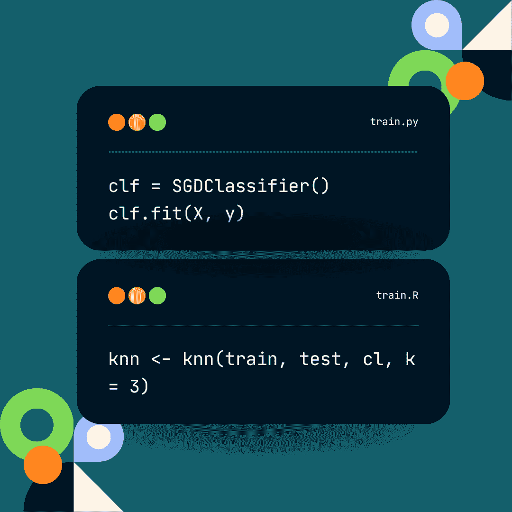
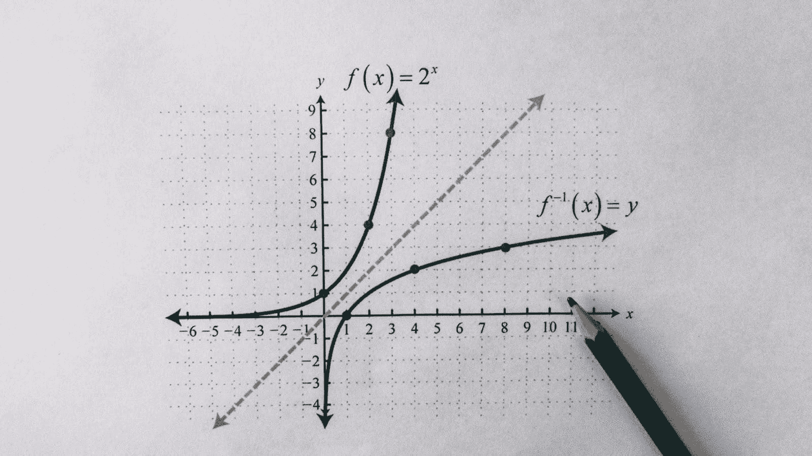

# 《Python 和 R 中机器学习算法的比较》

> 原文：[`www.kdnuggets.com/2023/06/machine-learning-algorithms-python-r.html`](https://www.kdnuggets.com/2023/06/machine-learning-algorithms-python-r.html)

编辑器提供的图像

Python 和 R 是机器学习中最常用的两种编程语言。它们都是开源且高度可访问的，但 Python 是通用编程语言，而 R 是统计编程语言。这使得 R 非常适合各种数据角色和应用，如数据挖掘。

这两种编程语言也鼓励代码的重用，这意味着新手机器学习工程师和爱好者不必从头编写代码。使用它们构建项目的关键在于集成合适的模块和算法——你只需要知道在哪里寻找。为了帮助你，我们整理了一些 Python 和 R 中最常用的机器学习算法列表。确保收藏此指南，并在遇到困难时参考它。

# 1. K-Means 聚类算法

顾名思义，机器学习的最终目的是教会计算机系统使其能够自主运行。这可以通过监督学习或无监督学习来实现。

执行后者的一种方法是使用[k-means 聚类算法](https://www.javatpoint.com/k-means-clustering-algorithm-in-machine-learning)，该算法通过对相似数据点进行分组（聚类）来寻找数据集中的模式。

在 R 编程语言中，k-means 聚类通常使用 *k-means* 函数来执行。不幸的是，Python 似乎没有提供一个像样的现成解决方案。Python 中的 K-means 聚类通常使用 sci-kit-learn 库的 sklearn.cluster.KMeans 类，并结合 [matplotlib.pyplot](https://matplotlib.org/3.5.3/api/_as_gen/matplotlib.pyplot.html) 库来进行。

K-means 聚类算法是最广泛使用的无监督机器学习算法之一，你可能迟早会遇到它或需要使用它。因此，它是你应该首先学习和掌握的算法之一。

# 2. 决策树

决策树算法因其易用性和实用性而受到青睐。它是一种监督学习的机器学习算法，主要用于分类。例如，公司可以利用它通过聊天机器人来处理难缠的客户。

决策树教会机器如何根据之前的经验做出选择。它之所以在新手机器学习工程师中如此受欢迎，是因为它可以被建模并以图表或图解的形式可视化。这一特点使它对具有传统编程技能的人具有吸引力。

决策树主要有两种类型：

+   连续变量决策树：指的是具有无限目标变量的 决策树。

+   分类变量决策树：指的是具有分组有限目标变量的决策树。

在 R 编程中，最关注决策树的包和类包括：

+   数据集

+   caTools

+   party

+   dplyr

+   magrittr

再次，你将不得不寻找 Python 模块来实现这个算法。与 k-means 聚类算法一样，sci-kit-learn 包含了许多决策树的模块，其中 sklearn.tree 最为相关。你还可以使用 [Graphviz 模块](https://pypi.org/project/graphviz/) 以编程方式呈现决策树的图形表示。

# 3\. 线性回归分析

线性回归是另一种广泛使用的监督机器学习算法。线性回归分析的目标是基于一个或一组变量推断结果或值。

与大多数算法一样，最佳的可视化方式是使用具有两个坐标轴的图形。Y 轴表示因变量，而 X 轴表示自变量。线性回归分析的目标是 形成或找到一个关系。

如果自变量的增加导致因变量的增加（类似于指数增长），这被称为正关系。另一方面，如果因变量的值在自变量的值增加时减少（类似于指数衰减），这被称为负关系。

我们使用 [最佳拟合线](https://www.investopedia.com/terms/l/line-of-best-fit.asp) 来确定关系，这可以通过斜率-截距线性方程 *y=mx+b* 表示。

那么我们如何在 R 和 Python 中实现线性回归呢？R 编程语言中最关注线性回归分析的包包括：

+   ggplot2

+   dplyr

+   broom

+   ggpubr

*gg* 包用于创建和绘制图形，而 *dplyr* 和 *broom* 用于操控和展示数据。*sklearn.linear_model* 可用于 在 Python 中构建线性回归模型。你还可以添加 NumPY 来处理大矩阵和数组。

图片由 [Pexels](https://www.pexels.com/photo/math-equation-printed-on-paper-8482062/) 提供

# 4\. 逻辑回归

与线性回归类似，逻辑回归允许我们基于其他（集合的）变量来预测一个变量的值。然而，线性回归使用度量值，而逻辑回归使用离散变量。这些是只能具有两个值之一（是或否，0 或 1，真或假等）的二分变量。

在现实世界中，这可以[用于确定一个人购买产品（零售）或携带疾病（医疗保健）的可能性](https://www.techtarget.com/searchbusinessanalytics/definition/logistic-regression)。例如，我们可以使用年龄、身高和体重作为自变量（x）。二元结果将是因变量（y）。因此，x 是实数域，而 y 包含离散值。

逻辑回归的目标是估计（预测）一个结果或事件的概率。由于 y 值是二元的，我们不能使用线性方程，而必须使用激活函数。

Sigmoid 函数用于表示逻辑回归：

*f(x) = L / 1+e^(-x)*

或

*y = 1/(1+e^-(a+b1x1+b2x2+b3x3+...))*

与逻辑回归最相关的 Python 包和模块有：

+   matplotlib.pyplot

+   sklearn.linear_model

+   sklearn.metrics

使用 R 生成逻辑回归的过程要简单得多，可以使用 glm() 函数来完成。

# 5\. 支持向量机

支持向量机 (SVM) 算法 主要用于分类，但也可以用于基于回归的任务。SVM 是分类问题中最简单的方法之一。

在 SVM 中，必须分类的对象被表示为 n 维空间中的一个点。该点的每个坐标称为其特征。SVM 通过首先绘制一个超平面，使得每个类别的所有点都位于超平面的两侧，来尝试对对象进行分类。

虽然可能存在多个超平面，但 SVM 尝试找到一个最能分离两个类别的超平面。它主要通过找到两个类别之间的最大距离，即边距，来实现。触及或直接落在边距上的点称为支持向量。

由于 SVM 是一种监督机器学习方法，它需要训练数据。你可以使用 sklearn 的专用 SVM 模块在 Python 中实现这个机器学习算法。在 R 中，SVM 通常通过轮廓和绘图函数来处理。

# 结论

这些算法中的许多都是机器学习在概率和统计上高度依赖的见证。尽管 R 在现代机器学习工程之前就存在，但它与机器学习相关，因为它是一种统计编程语言。因此，许多算法可以很容易地从头开始构建或实现。

Python 是一种多范式通用编程语言，因此它具有更广泛的应用场景。Sci-kit-learn 是最受信赖的 Python 机器学习模块库。如果你想要[了解更多关于上述算法](https://scikit-learn.org/stable/)及其他内容，请访问该库的官方网站。

**[Nahla Davies](http://nahlawrites.com/)** 是一名软件开发人员和技术作家。在将她的工作全职转向技术写作之前，她曾担任 Inc. 5,000 创意品牌组织的首席程序员，该组织的客户包括三星、时代华纳、Netflix 和索尼。

* * *

## 我们的前三名课程推荐

 1\. [Google 网络安全证书](https://www.kdnuggets.com/google-cybersecurity) - 快速进入网络安全职业

 2\. [Google 数据分析专业证书](https://www.kdnuggets.com/google-data-analytics) - 提升你的数据分析能力

 3\. [Google IT 支持专业证书](https://www.kdnuggets.com/google-itsupport) - 支持组织的 IT 需求

* * *

### 更多相关话题

+   [使用 Python 的自动化机器学习：不同方法的比较](https://www.kdnuggets.com/2023/03/automated-machine-learning-python-comparison-different-approaches.html)

+   [ChatGPT 与 Google Bard：技术差异比较](https://www.kdnuggets.com/2023/03/chatgpt-google-bard-comparison-technical-differences.html)

+   [深入了解 GPT 模型：演变与性能比较](https://www.kdnuggets.com/2023/05/deep-dive-gpt-models.html)

+   [开源向量数据库的诚实比较](https://www.kdnuggets.com/an-honest-comparison-of-open-source-vector-databases)

+   [KDnuggets 新闻，7 月 20 日：机器学习算法解释](https://www.kdnuggets.com/2022/n29.html)

+   [机器学习算法 - 什么、为什么和如何？](https://www.kdnuggets.com/2022/09/machine-learning-algorithms.html)
