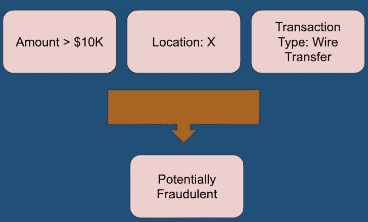

# 机器学习算法 – 什么、为什么以及如何？

> 原文：[`www.kdnuggets.com/2022/09/machine-learning-algorithms.html`](https://www.kdnuggets.com/2022/09/machine-learning-algorithms.html)

图片由编辑提供

# 识别机器学习可解决的问题

机器学习是一个通过数据学习模式的领域，无需明确编程或手写规则。它是人工智能（AI）和计算机科学的一个子领域。

在机器学习成为主流之前，程序员编写的规则来源于他们的领域知识、观察到的一些精选实例以及业务需求来执行特定任务。但这种传统的交付业务结果的方式存在一些明显的限制。

+   手写规则受限于程序员能够覆盖的边缘情况的知识。这一概念在心理学领域中一篇被广泛引用的论文中有很好的解释，[“魔法数字七，加或减二：我们处理信息的能力的某些限制。”](https://en.wikipedia.org/wiki/The_Magical_Number_Seven,_Plus_or_Minus_Two)

+   通常被称为米勒定律，论文描述了一个普通大脑能够容纳的有限信息量，以及随着变量和维度数量的增加，信息处理变得如何难以管理。

+   数据本质上是动态的，并且在过去十年中随着技术的普及变得更加动态。静态的预编写规则对业务采取有意义的行动帮助甚微。这就是机器学习算法的模式挖掘能力发挥最大作用的地方。

以一个欺诈检测案例为例。程序员会编写规则，例如如果交易金额超过$10K，交易地点是 X，且是某种类型，即电汇，那么它将被标记为潜在的欺诈交易。

来源：作者

这可能会有效一段时间，直到不法分子找到一种智能化的欺诈手段。传统的硬编码规则在检测欺诈方面已不再有效。随着他们操作方式的演变，我们的欺诈检测系统也需要随之发展。

此外，所有的软件开发过程都是高度协作的？—？如果编写初始规则的开发人员不再参与欺诈检测项目，新开发人员负责升级逻辑，但对之前的系统没有了解，并对最近的更改是否具有向后兼容性持怀疑态度。总而言之，更新基于规则的系统不仅是一个繁琐的过程，而且也不可扩展。

这就是机器学习算法为我们提供帮助的地方。如果指标定义明确且与业务目标一致，它会继续从新的训练数据中学习，并演变成一个复杂的机器学习系统。

# 如何选择合适的算法

到现在为止，我们了解了机器学习算法最适合解决什么类型的业务问题以及在给定用例的统计公式方面的广泛类别。

所以，下一步是确定哪种特定算法最适合解决机器学习问题。没有规则书或指南可以给你一个即时的答案，但我们将讨论经验丰富的数据科学家在选择候选算法集时考虑的因素。

Sci-kit learn 发布了一个流程图，这是一个很好的起点，用于了解哪些算法适用于什么类型的数据和给定问题。

来源：[`scikit-learn.org/stable/tutorial/machine_learning_map/index.html`](https://scikit-learn.org/stable/tutorial/machine_learning_map/index.html)

很容易被大量高级算法压倒，开始通过试错方法实施它们以找到合适的模型。但时间至关重要，你需要将算法选择缩小到少量候选集，例如 2 到 3 个。

我们已经将算法搜索空间缩小到一个小集，现在将列出优缺点、限制和约束。

许多因素决定了合适的冠军模型：

+   **准确性**：它是否符合在阈值之上表现的资格标准？

+   **数据可用性**：你有多少数据？

+   **资源**：模型训练需要多长时间？是否计算开销大？

+   **延迟**：实时推断的时间

+   **可解释性**：预测结果是否可以解释？

+   **对异常值的鲁棒性**：对异常行为是否敏感？

+   **非线性关联**：如果数据遵循非线性模式，则排除线性模型

+   **缺失值**：你的算法是否能够处理缺失值？

上述列出的因素为你的选择提供了快速而简单的基础。进一步，我将通过引用[**“没有免费的午餐”定理**](https://chemicalstatistician.wordpress.com/2014/01/24/machine-learning-lesson-of-the-day-the-no-free-lunch-theorem/)**，**来总结这一部分，该定理指出：

> “*没有一个模型适用于所有问题。一种情况的优秀模型的假设可能在另一种情况下不成立，因此在机器学习中尝试多个模型并找到最适合特定情况的模型是很常见的*”

要理解这个定理，我们首先必须确定模型的作用。模型试图通过在一些假设下将真实世界现象进行归纳。这些假设有助于简化建模环境，并仅关注相关细节。因此，一个适用于某个问题的模型可能不适用于另一个问题。

现在我们了解了选择机器学习算法的关键因素，你可以参考这个优秀的[备忘单](https://docs.microsoft.com/en-us/azure/machine-learning/algorithm-cheat-sheet)来了解算法的全貌。

# 摘要

文章的关键亮点在于理解机器学习算法的重要性。此外，它解释了不同的模型选择标准，以帮助你找到适合你业务问题的机器学习算法。值得注意的是，没有一个通用的算法能够适用于多个使用案例。文章最后分享了备忘单，以帮助理解数据类型和业务问题与算法之间的映射。

**[Vidhi Chugh](https://vidhi-chugh.medium.com/)** 是一位获奖的 AI/ML 创新领袖和 AI 伦理学家。她在数据科学、产品和研究的交汇处工作，以提供业务价值和洞察。她是数据中心科学的倡导者，并在数据治理方面是领先专家，致力于构建可信的 AI 解决方案。

* * *

## 我们的三大课程推荐

 1\. [谷歌网络安全证书](https://www.kdnuggets.com/google-cybersecurity) - 快速进入网络安全职业生涯。

 2\. [谷歌数据分析专业证书](https://www.kdnuggets.com/google-data-analytics) - 提升你的数据分析能力

 3\. [谷歌 IT 支持专业证书](https://www.kdnuggets.com/google-itsupport) - 支持你所在组织的 IT 工作

* * *

### 更多相关主题

+   [Python 和 R 中的机器学习算法比较](https://www.kdnuggets.com/2023/06/machine-learning-algorithms-python-r.html)

+   [使用基础和现代方法解决计算机科学问题…](https://www.kdnuggets.com/2023/11/packt-tackle-computer-science-problems-fundamental-modern-algorithms-machine-learning)

+   [机器学习中使用的主要监督学习算法](https://www.kdnuggets.com/2022/06/primary-supervised-learning-algorithms-used-machine-learning.html)

+   [KDnuggets 新闻，6 月 22 日：主要监督学习算法…](https://www.kdnuggets.com/2022/n25.html)

+   [分类的机器学习算法](https://www.kdnuggets.com/2022/03/machine-learning-algorithms-classification.html)

+   [流行的机器学习算法](https://www.kdnuggets.com/2022/05/popular-machine-learning-algorithms.html)
