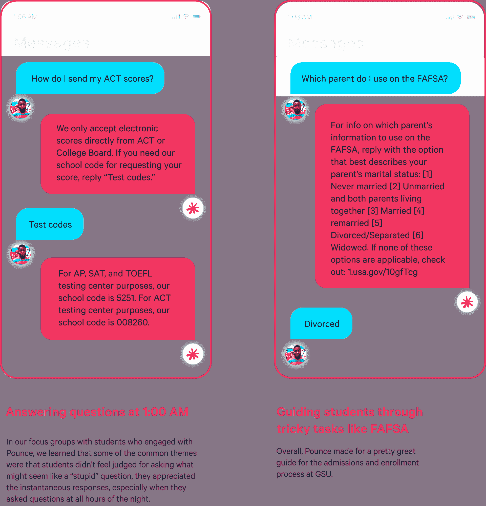

# 机器学习如何使在线学习受益

> 原文：[`www.kdnuggets.com/2022/12/machine-learning-benefit-online-learning.html`](https://www.kdnuggets.com/2022/12/machine-learning-benefit-online-learning.html)

从手机到手表再到电视，我们周围的一切都变得越来越[‘智能’](https://www.forbes.com/sites/forbestechcouncil/2022/01/12/smart-everything-industries-will-be-more-intelligent-than-ever-in-2022/?sh=5eac79cf7878)。教育也不落后。

‘智能’的教育方法通常是将机器学习（ML）融入学习和发展中。机器学习利用人工智能方法来教系统如何在没有任何人工干预的情况下做出明智的决策。这是通过向机器学习算法提供数据来实现的，算法能够处理数据并对未来事件做出推断。

这与教育有什么关系？电子学习涉及使用我们周围的数字设备来提供引人入胜的学习体验。如果我们利用这些设备的数据来创建一种人工智能学习方法，会发生什么呢？我们无需过多寻找答案，因为这已经在进行中！

继续阅读以了解我们如何充分利用机器学习为在线学习带来的好处。

# 创建个性化学习体验

个人在学习模式、学习节奏甚至兴趣领域方面可以非常独特。机器学习可以以一种物理上无法实现的方式来满足每个学习者的个性化需求。

机器学习算法可以考虑学生的兴趣领域、过去的课程和评分报告，以提供公正、数据驱动的建议，告诉他们可能感兴趣的学习学科和可以追求的学习路径。为每个学习者创建这样的流畅学习旅程在传统学习方法中是无法做到的。

另一个让学习个性化的重要方式是根据每个学习者的能力调整课程内容。如果学生发现自己在评估中得分很高，人工智能算法可以呈现逐渐更难的问题。同样，有些学习者选择比其他人慢一点的节奏，这也是机器学习可以满足的需求。

# 帮助评估技能和知识差距

想象一下你能够客观地查看你所知道的每一个事实和你所拥有的每项技能，包括能力水平、专业知识和改进领域。这就是机器学习算法对每个学习者的观察方式。

基于所有过去的评分数据、课程历史和能力水平，机器学习可以帮助为每位学习者制定个性化报告。这些报告概述了每位学生的能力所在领域，以及他们需要改进的领域。通过这种方式，算法以公平和无偏见的方式评估学习者的知识差距。一旦识别出这些差距，学生就可以着手弥补它们。

利用机器学习理解技能差距和识别风险学习者，可以帮助机构以及其学生。一份[Mckinsey 报告](https://www.mckinsey.com/industries/education/our-insights/using-machine-learning-to-improve-student-success-in-higher-education)研究了一所在线大学在疫情期间应用机器学习模型来降低流失率的结果。这涉及分析十年的数据，以了解决定学生继续学习可能性的关键特征。

一旦验证初始模型在预测流失率方面比基准模型更成功，该模型被修改并应用于当前学生。结果模型提供了五种特征类别的学生详细见解，这些学生可能会中断学习。这五种类型中只有两种可以通过线性规则识别。这项研究证明了在高等教育中利用机器学习的价值，结果可以在下面的图像中看到：

处于流失风险中的学生：麦肯锡

# 自动化评分与反馈

机器学习技术不仅为学习者提供各种评估格式，还可以智能地对其进行评分。这不涉及将每位学生的答案逐字匹配到一个预设的正确答案。

相反，机器学习算法可以解析陈述，以极高的准确度确定某个答案所写的上下文，并在一个尺度上进行评分，而不是简单的正确或错误。对于每个回答，算法还可以检测可能的改进方法，并向学习者提供个性化的反馈。

这对那些时间紧迫、无法逐一照顾每位学生的教师来说，可能是一个巨大的解脱。就像自动评分通过答题卡和电子学习简化了多项选择题的评估一样，机器学习技术可以评估各种回答类型的细微差别。

# 聊天机器人实现不间断学习

学生通过提问学到最多的东西。在在线学习的场景中，讲师并不总是能回答问题，讲座材料也不可能预见到所有学习者可能提出的问题。解决这个问题的一个好方法是使用[聊天机器人](https://mayfaireren.ngontinh24.com/article/8-benefits-of-chatbots-in-education-industry-botsify)来帮助学习者。

聊天机器人是智能软件，可以对学生提出的问题给出即时答案。在某些情况下，这些聊天机器人被编程为回答讲师已预见的问题，或者可以用来向学生推荐与他们问题相关的有用链接。

聊天机器人作为随时可用的个人导师，是融入互动学习的一个非常有用的工具。在线学习有时可能会令人感到孤立，而拥有一个 AI 聊天机器人可以带来显著的变化。

聊天机器人还在指导潜在学生和引导他们寻找相关资源方面发挥了重要作用。许多新生对直接联系教职员工犹豫不决，或者不知道联系哪个部门。在许多情况下，这些是没有正确指导的第一代大学生。

虚拟聊天助手可以帮助打破困惑和不确定性，正如 Pounce，乔治亚州立大学的聊天机器人所证明的那样，它于 2016 年首次部署。该大学以前在夏季期间会失去多达 20%的新生，这种现象被称为“夏季融化”。这主要是由于对财政援助的缺乏了解。Pounce 帮助[减少了 20%的夏季融化](https://files.eric.ed.gov/fulltext/EJ1224780.pdf) 。

Pounce: 乔治亚州立大学的聊天机器人

# 提升你的在线学习投资回报率

将当前的在线学习系统完全改造以融入机器学习原则，最开始可能看起来是一种资源浪费。然而，如果你花时间考虑机器学习如何简化、自动化和个性化在线学习，它将最终成为一个具有成本效益的解决方案。

首先，所有电子学习平台都在朝着人工智能、高度个性化的学习方法发展，如果你选择不在学习方法中融入创新和灵活性，将会错过良机。毕竟，学习者倾向于选择提供最多资源的学习平台。

除此之外，尽管这可能看起来是一项昂贵的投资，但结合机器学习的学习解决方案所带来的回报远远超过以前采用的在线学习方法。这是因为有了虚拟助手可以随时指导、评分、反馈，甚至只是与学习者聊天时，可以做的事情要多得多。

# 接下来我们该如何前进？

正如你所见，机器学习具有改善学习体验的潜力。现代教育方法理解学习者，把他们置于学习体验的中心，并且赋予他们塑造自己学习旅程的权力。机器学习提供了这一切及更多。

尽管这仍处于早期阶段，但在学习与发展（L&D）中实施机器学习是值得探索的，无论你是 K12 教育机构、高等教育机构，还是寻求简化员工培训过程的公司。机器学习不仅对学习者、讲师和管理员都有好处，而且也是一种出色的投资，未来还可能证明其具有成本效益。

**[Maira Afzal](https://www.linkedin.com/in/maira-afzal-78034b108)** 是 [Edly](https://edly.io?utm_source=utm-link-generator&utm_medium=kd nuggets&utm_campaign=) 的内容写作专家，该公司是一家教育技术解决方案提供商及 Open edX 合作伙伴。如需联系，请发送邮件至 hello@edly.io。

* * *

## 我们的前三大课程推荐

 1\. [谷歌网络安全证书](https://www.kdnuggets.com/google-cybersecurity) - 快速通道进入网络安全职业生涯。

 2\. [谷歌数据分析专业证书](https://www.kdnuggets.com/google-data-analytics) - 提升你的数据分析能力

 3\. [谷歌 IT 支持专业证书](https://www.kdnuggets.com/google-itsupport) - 支持你的组织的 IT 需求

* * *

### 更多相关话题

+   [企业如何从机器学习中获益的 6 种方式](https://www.kdnuggets.com/2022/08/6-ways-businesses-benefit-machine-learning.html)

+   [如何利用机器学习自动标注数据](https://www.kdnuggets.com/2022/02/machine-learning-automatically-label-data.html)

+   [每位工程师都应该且可以学习机器学习](https://www.kdnuggets.com/2022/06/corise-every-engineer-learn-machine-learning.html)

+   [机器学习与大脑的不同 第五部分：生物神经元…](https://www.kdnuggets.com/2022/07/machine-learning-like-brain-part-5-biological-neurons-cant-summation-inputs.html)

+   [7 种你不能错过的机器学习算法](https://www.kdnuggets.com/7-machine-learning-algorithms-you-cant-miss)

+   [2024 年你可以参加的 5 个顶级机器学习课程](https://www.kdnuggets.com/5-top-machine-learning-courses-you-can-take-in-2024)
