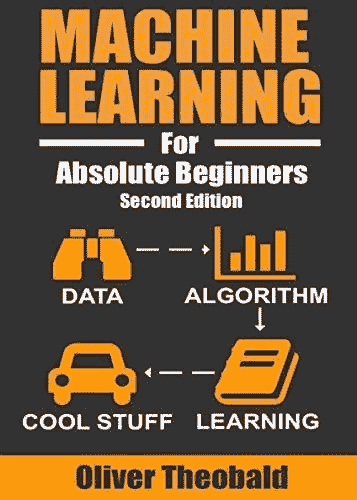
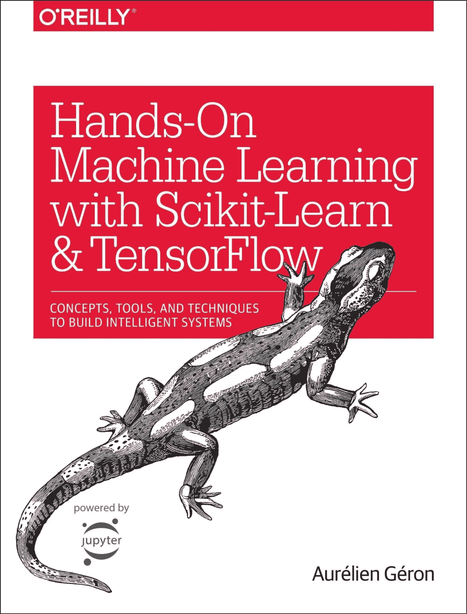
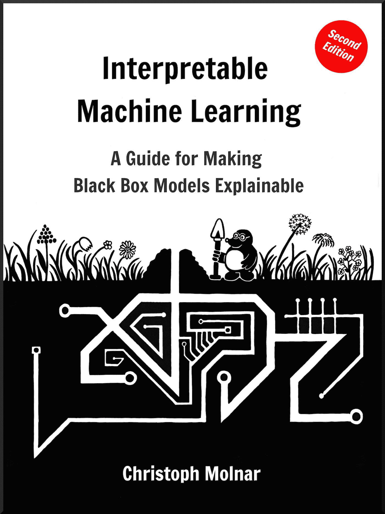
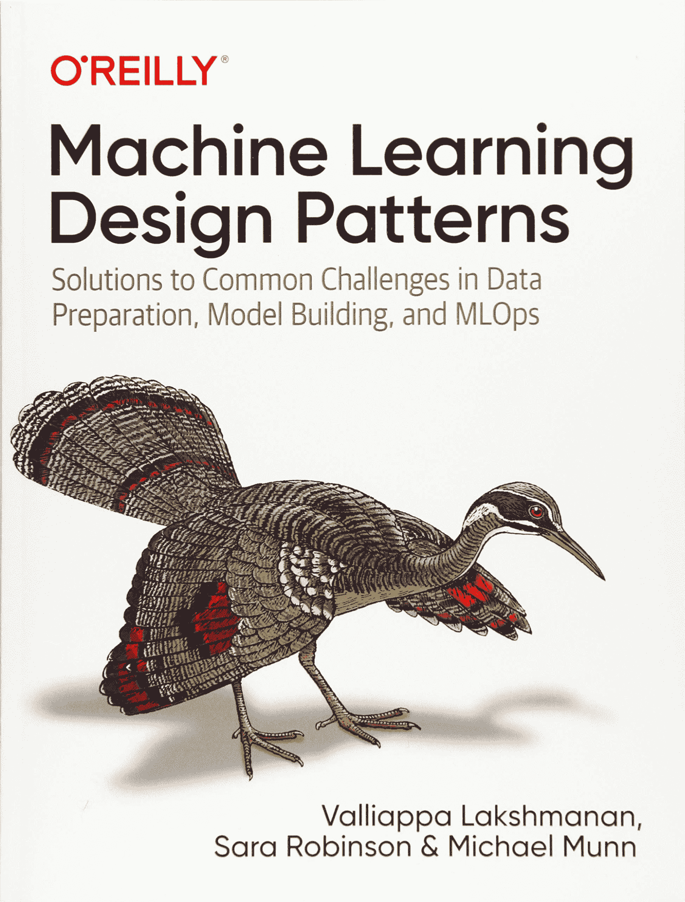
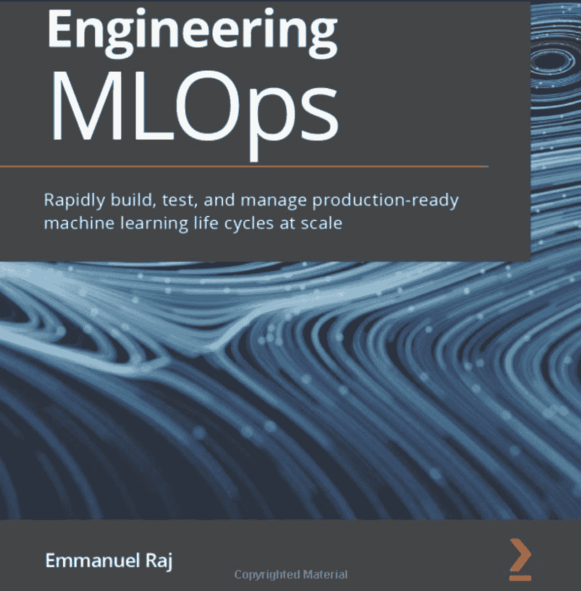
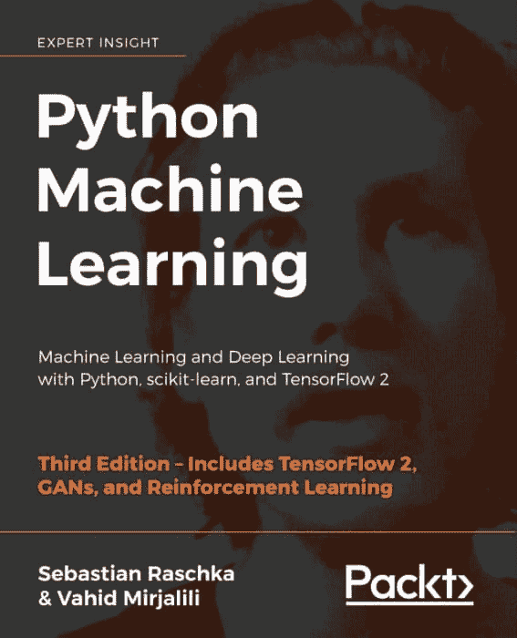
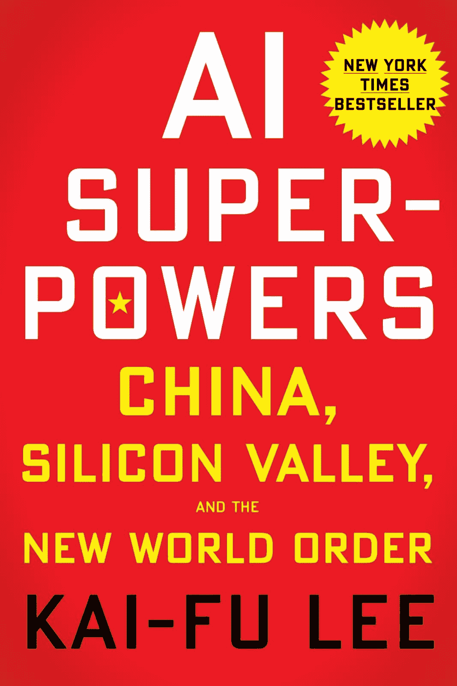

# 2022 年你需要阅读的机器学习书籍

> 原文：[`www.kdnuggets.com/2022/04/machine-learning-books-need-read-2022.html`](https://www.kdnuggets.com/2022/04/machine-learning-books-need-read-2022.html)

[Susan Q Yin](https://unsplash.com/@syinq) via Unsplash

越来越多的企业正在采用机器学习，从预测分析到改善组织的整体工作流程。近年来，机器学习已经成为商业功能中的一个关键元素。

* * *

## 我们的前 3 个课程推荐

 1\. [Google 网络安全证书](https://www.kdnuggets.com/google-cybersecurity) - 快速进入网络安全职业生涯。

 2\. [Google 数据分析专业证书](https://www.kdnuggets.com/google-data-analytics) - 提升你的数据分析技能

 3\. [Google IT 支持专业证书](https://www.kdnuggets.com/google-itsupport) - 支持你在 IT 领域的组织

* * *

企业对如何实施技术以获得好处感到好奇，而机器学习专业人士则渴望了解机器学习能将我们带到何处。

为了让这项工作成功，幕后操作需要熟练理解机器学习的概念，能够分析数据、调整算法、解决问题等。

这看起来是一项庞大的工作，但都集中在一个主题下。如果你有兴趣学习机器学习或想要提升现有技能；我有一份 2022 年需要阅读的机器学习书单；包括初学者、中级、专家及所有人。

# 1\. [机器学习入门](https://www.amazon.in/dp/B06VXKBLNG?tag=hackr0df-21)

**作者：** 奥利弗·西奥博德

**难度等级：** 初级

如标题所述，如果你是数据科学和机器学习的绝对初学者，这本书非常适合你。尤其适合那些几乎没有编程经验的人，能够迅速引导你理解机器学习的概念。

你将接触到核心算法，配有清晰的解释和可视化示例。如果你没有数学知识或经验，也没关系，因为书的后半部分深入讲解了统计概念和应用于机器学习的具体算法。

# 2\. [动手实践机器学习与 Scikit-Learn、Keras 和 TensorFlow](https://www.amazon.in/dp/1491962291?tag=hackr0df-21)

**作者：** 奥雷利安·热龙

**难度等级：** 初级

本书要求您具有先前的 Python 知识，深入探讨了流行的库，如 Scikit-Learn、Keras 和 TensorFlow 2。此书使用具体示例、最小理论和生产就绪的 Python 框架，以帮助您最大限度地学习和应用机器学习。

本书深入探讨了支持向量机、决策树、随机森林和集成方法等其他方面。您将能够应用实际的代码示例，而不需要先前过多的机器学习理论或算法知识。

# 3\. [可解释的机器学习](https://christophm.github.io/interpretable-ml-book/)

**作者：** 克里斯托夫·莫尔纳

**难度级别：** 初级

这本由克里斯托夫·莫尔纳编写的书最初是一个副项目，因缺乏与机器学习成功和可解释性重要性相关的资源。

对于一些机器学习模型来说，模型可解释性可能是一个困难的任务。有些模型非常复杂，生成的输出不可读，这使得决策过程变得困难。

本书探讨了模型可解释性的重要性，人们认为一个好的解释是什么，深入探讨了如回归和决策树等可解释的模型，以及对模型无关的可解释性方法的重点关注。模型无关意味着这些方法可以应用于任何机器学习模型。

# 4\. [机器学习设计模式：数据准备、模型构建和 MLOps 中的常见挑战解决方案](https://www.amazon.co.uk/Machine-Learning-Design-Patterns-Preparation/dp/1098115783)

**作者：** 瓦利亚帕·拉克什曼南、萨拉·罗宾逊和迈克尔·芒

**难度级别：** 中级

理解如何解决问题和数据中的常见挑战可能会很困难。这本书由三位谷歌工程师编写，进一步探讨了用于解决机器学习中重复问题的最佳实践和解决方案。

本书包括了 30 种数据和问题表示模式，其中包括问题的描述、解决问题的各种潜在解决方案，以及为您的情况选择最佳技术的建议。

> 我强烈推荐这本书给任何机器学习从业者，尤其是那些专注于开发生产就绪的机器学习系统的人。 - 亚马逊评论

# 5\. [工程化 MLOps](https://www.amazon.co.uk/Engineering-MLOps-Rapidly-production-ready-learning/dp/1800562888/ref=asc_df_1800562888/?tag=googshopuk-21&linkCode=df0&hvadid=500841572122&hvpos=&hvnetw=g&hvrand=14060399299061576001&hvpone=&hvptwo=&hvqmt=&hvdev=c&hvdvcmdl=&hvlocint=&hvlocphy=9044970&hvtargid=pla-1219613871310&psc=1&th=1&psc=1)

**作者：** 埃曼纽尔·拉杰

**难度级别：** 中级

本书为你提供了 MLOps 生命周期的全面概述。它从熟悉 MLOps 工作流程开始，探索模型打包选项，直到部署模型。帮助你更好地了解如何促进机器学习推理、模型互操作性以及端到端的模型可追溯性。

你将学习如何构建 ML 管道、持续集成和持续交付（CI/CD）管道，以及如何监控这些管道以管理企业和工业的 ML 解决方案。

在本书结束时，你将知道如何将所学知识应用于构建现实世界的项目，并对 MLOps 有 360 度的全面了解。

# 6\. [Python 机器学习](https://www.amazon.com/Python-Machine-Learning-scikit-learn-TensorFlow/dp/1787125939)

**作者：** 塞巴斯蒂安·拉施卡和瓦希德·米尔贾利

**难度等级：** 专家

本书假设你已经熟练掌握 Python 和机器学习的应用。它将直接进入概念的实际应用，包括 NumPy、Scikit-learn、TensorFlow2 等。

直接进入实际案例可以帮助你准备和理解如何应对机器学习中的现实挑战，这些挑战你在行业中会遇到。

你将掌握不同的框架、模型和技术，这些技术使机器能够从数据中“学习”。你将把机器学习知识应用于图像分类、情感分析等任务，并发现评估和调整模型的最佳实践。

主题包括降维、集成学习、聚类分析、神经网络等。

# 7\. [人工智能超级大国：中国、硅谷与新世界秩序](https://www.amazon.com/AI-Superpowers-China-Silicon-Valley/dp/132854639X/ref=pd_sim_sccl_6/130-3248652-8969061?pd_rd_w=clO59&pf_rd_p=b2bd2b3a-dfe3-42d5-bde0-cc027c349493&pf_rd_r=BQE3NBT4XCDBMQ6VCJZT&pd_rd_r=2cbb401d-a1fa-4e2e-b92b-10ebf7e6c1dc&pd_rd_wg=Kh99M&pd_rd_i=132854639X&psc=1)

**作者：** 李开复

**难度等级：** 所有人

尽管这本书几乎没有理论性的机器学习知识，但我认为这是一本每一个从事数据科学领域或对该领域感兴趣的人都应该阅读的好书。

与其不断关注如何更多地了解机器学习、MLOps 等，不如理解这一切将把我们带到哪里。未来会发生什么，人工智能将如何改变世界。

李开复通过他在中国和硅谷的生活经验，讲解了人工智能将如何显著影响劳动力，并提出了一些应对这些变化的实际解决方案。

**[尼莎·阿亚](https://www.linkedin.com/in/nisha-arya-ahmed/)** 是一位数据科学家和自由职业技术作家。她特别关注提供数据科学职业建议或教程以及基于理论的知识。她还希望探索人工智能在提升人类寿命方面的不同方式。作为一个热衷学习的人，她寻求拓宽自己的技术知识和写作技能，同时帮助指导他人。

### 更多相关话题

+   [KDnuggets 新闻，4 月 27 日：关于 Papers With Code 的简要介绍；…](https://www.kdnuggets.com/2022/n17.html)

+   [KDnuggets 新闻，6 月 1 日：数据科学的完整合集…](https://www.kdnuggets.com/2022/n22.html)

+   [2023 年你必须阅读的 5 本免费数据科学书籍](https://www.kdnuggets.com/2023/01/5-free-data-science-books-must-read-2023.html)

+   [为什么你需要在 2022 年学习 Python](https://www.kdnuggets.com/2022/04/need-learn-python-2022.html)

+   [KDnuggets 新闻，4 月 13 日：数据科学家应了解的 Python 库…](https://www.kdnuggets.com/2022/n15.html)

+   [成为数据工程师所需的必备书籍](https://www.kdnuggets.com/2022/10/essential-books-need-become-data-engineer.html)
