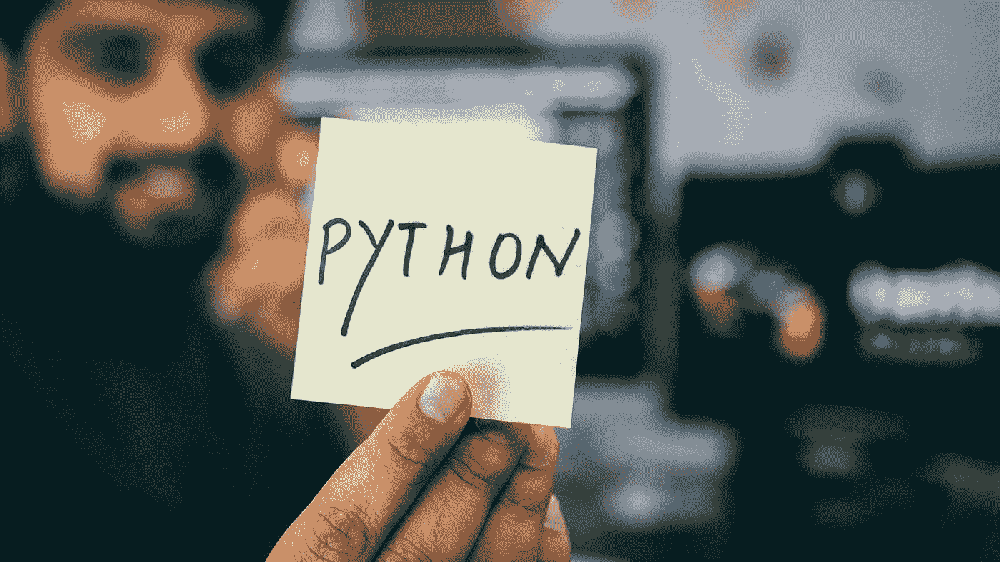
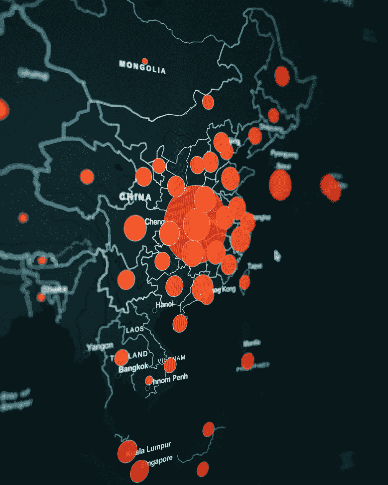

# 在隔离期间开始你的机器学习职业生涯

> 原文：[`www.kdnuggets.com/2020/05/machine-learning-career-quarantine.html`](https://www.kdnuggets.com/2020/05/machine-learning-career-quarantine.html)

评论

*照片由 [Alex Knight](https://unsplash.com/@agkdesign?utm_source=medium&utm_medium=referral) 提供，来源于 [Unsplash](https://unsplash.com/?utm_source=medium&utm_medium=referral)。*

* * *

## 我们的三大课程推荐

 1\. [Google 网络安全证书](https://www.kdnuggets.com/google-cybersecurity) - 快速进入网络安全职业生涯。

 2\. [Google 数据分析专业证书](https://www.kdnuggets.com/google-data-analytics) - 提升你的数据分析技能

 3\. [Google IT 支持专业证书](https://www.kdnuggets.com/google-itsupport) - 支持你的组织的 IT 需求

* * *

在这篇文章中，我概述了一个完整的机器学习课程计划，考虑到这次隔离至少会持续 2 个月。

### Python（第 0 天 — 第 10 天）

*照片由 [Hitesh Choudhary](https://unsplash.com/@hiteshchoudhary?utm_source=medium&utm_medium=referral) 提供，来源于 [Unsplash](https://unsplash.com/?utm_source=medium&utm_medium=referral)。*

从 Python 开始。它是机器学习/数据科学中最常用的语言。你可以在 3 天内轻松学习其基础知识。跟随这个 [Youtube 系列](https://www.youtube.com/watch?v=eXBD2bB9-RA&list=PLQVvvaa0QuDeAams7fkdcwOGBpGdHpXln) 由 Sentdex 提供。你将学习 Python 中的所有函数式编程。

现在学习 [面向对象编程](https://www.youtube.com/watch?v=qiSCMNBIP2g)、 [列表推导式](https://www.youtube.com/watch?v=ZoWgzG_r2qo&list=PLQVvvaa0QuDfju7ADVp5W1GF9jVhjbX-_&index=4)和 [Lambda 函数](https://www.youtube.com/watch?v=hYzwCsKGRrg) ，以便你可以轻松开始机器学习。

现在我假设你已经掌握了 Python 编程的基础，因此你可以阅读、编写和理解 Python 代码。

### 重要库（第 10 天 — 第 15 天）

*照片由 [Clay Banks](https://unsplash.com/@claybanks?utm_source=medium&utm_medium=referral) 提供，来源于 [Unsplash](https://unsplash.com/?utm_source=medium&utm_medium=referral)。*

对于数据科学家/机器学习工程师而言，最重要的 3 个库是

+   Numpy

+   Pandas

+   Matplotlib

现在，我不建议只从一个地方学习，因此这 2 个教程足以让你入门了解 Numpy、Pandas 和 Matplotlib。

+   [用 Python 进行数据分析](https://www.freecodecamp.org/news/learn-data-analysis-with-python-course/) — FreeCodeCamp

+   [用 Python 进行数据处理和可视化](https://www.hackerearth.com/practice/machine-learning/data-manipulation-visualisation-r-python/tutorial-data-manipulation-numpy-pandas-python/tutorial/)

现在，我相信你可以在 2 天内完成这两个教程，因此接下来的 3 天，下载一个数据集来自[Kaggle](https://kaggle.com/)，将你学到的所有知识应用到这个数据集上。即使在这个数据集上失败也是可以的，但你会有更好的理解。

### 数学（第 15 天 — 第 22 天）

*照片由[Antoine Dautry](https://unsplash.com/@antoine1003?utm_source=medium&utm_medium=referral)提供，来源于[Unsplash](https://unsplash.com/?utm_source=medium&utm_medium=referral)。*

现在，这是一个重要的部分。我希望你至少对线性代数、微积分和概率论有一个良好的掌握。给线性代数 2 天，微积分 2 天，概率论 3 天来学习这些基础知识。

+   [初学者线性代数 — 机器学习的线性代数](https://www.youtube.com/watch?v=kZwSqZuBMGg)

+   [机器学习数学全课程：微积分 || 第二部分 || 机器学习微积分](https://www.youtube.com/watch?v=lsmUiWvmruU&list=PLmAuaUS7wSOP-iTNDivR0ANKuTUhEzMe4&index=6&t=0s)

+   [数据科学统计](https://www.youtube.com/watch?v=Vfo5le26IhY&t=13464s)

### 机器学习算法基础（第 22 天 — 第 30 天）

*照片由[Clarisse Croset](https://unsplash.com/@herfrenchness?utm_source=medium&utm_medium=referral)提供，来源于[Unsplash](https://unsplash.com/?utm_source=medium&utm_medium=referral)。*

在这 8 天里，你需要学习机器学习算法的基础知识，一些数学知识，以及它们的直观理解。现在没有比斯坦福大学在[Coursera](https://coursera.org/)上的[Andrew NG 机器学习课程](https://coursera.org/learn/machine-learning)更好的课程了。

你不需要尝试完成整个课程，只需观看视频并做一些笔记，跳过 Matlab 和数学部分，以及所有编程作业。只需在这 13 天里观看视频，了解一些基础知识，以便理解机器学习在幕后是如何工作的。

我知道这个课程很长，在 8 天内完成很困难，但如果你每天花 3–4 小时，你可以轻松地在 8 天内完成它。

### 应用这些算法（第 30 天 — 第 40 天）

*照片由[Tommy Lisbin](https://unsplash.com/@tlisbin?utm_source=medium&utm_medium=referral)提供，来源于[Unsplash](https://unsplash.com/?utm_source=medium&utm_medium=referral)。*

由行业大咖、Udacity 创始人兼总裁 Sebastian Thrun 主讲的[这门免费课程](https://www.udacity.com/course/intro-to-machine-learning--ud120)非常适合应用机器学习算法。你将学习一些新算法，如朴素贝叶斯和决策树。你将学习如何使用 Sci-kit Learn，一个用于应用机器学习算法的 Python 框架，这将使你的生活更轻松。

### 深度学习基础（第 40 天 — 第 45 天）

完成 [Deep Learning Specialization](https://www.coursera.org/learn/neural-networks-deep-learning?specialization=deep-learning) 课程中的第 1 门课程，由 [deeplearning.ai](http://deeplearning.ai/) 提供，通过 [Coursera](https://coursera.org/)。你将学习神经网络的所有基本原理，并能够使用 Numpy 创建一个神经网络。你将学习前向传播和反向传播等基本概念。

### TensorFlow 实践（第 45 天 — 第 60 天）

*照片由 [Mitchell Luo](https://unsplash.com/@mitchel3uo?utm_source=medium&utm_medium=referral) 提供，来源于 [Unsplash](https://unsplash.com/?utm_source=medium&utm_medium=referral)。*

[Tensorflow](http://tensorflow.org/) 是由 [Google](https://google.com/) 开发的深度学习框架，在市场上享有很高的声誉和职业价值。

完成 [Tensorflow](https://www.coursera.org/specializations/tensorflow-in-practice) 由 [deeplearning.ai](http://deeplearning.ai/) 提供的 Coursera 专项课程，深入学习 TensorFlow 这一现代深度学习框架。完成这项专项课程的平均时间为 1 个月，每周 16 小时，但如果你每天投入 4 小时，你可以轻松在 15 天内完成。你将对计算机视觉问题、自然语言处理问题以及时间序列和序列问题有很好的掌握。简而言之，你将学到很多。

如果你在第 60 天之前完成了这些课程，这里有一些其他建议供你参考。

+   [Fast.ai](http://fast.ai/) 提供了一个非常实用的课程

+   [深度学习书籍](https://www.deeplearningbook.org/)

+   [CS231n](http://cs231n.stanford.edu/) 深入学习卷积神经网络，以提升计算机视觉能力

+   [CS224n](http://web.stanford.edu/class/cs224n/) 自然语言处理

现在你已经了解了很多机器学习和深度学习的知识，尝试与人建立联系并争取实习机会，也可以去 [kaggle.com](https://kaggle.com/) 在他们的数据集上练习，以提高技能。

**相关：**

+   [如何利用冠状病毒危机启动你的数据科学职业](https://www.kdnuggets.com/2020/05/coronavirus-kickstart-data-science-career.html)

+   [数据科学自学课程](https://www.kdnuggets.com/2020/02/data-science-curriculum-self-study.html)

+   [如何自学数据科学：实用指南](https://www.kdnuggets.com/2020/02/learn-data-science-guide.html)

### 更多相关内容

+   [成为一名优秀数据科学家所需的 5 项关键技能](https://www.kdnuggets.com/2021/12/5-key-skills-needed-become-great-data-scientist.html)

+   [每个初学者数据科学家应该掌握的 6 种预测模型](https://www.kdnuggets.com/2021/12/6-predictive-models-every-beginner-data-scientist-master.html)

+   [2021 年最佳 ETL 工具](https://www.kdnuggets.com/2021/12/mozart-best-etl-tools-2021.html)

+   [停止学习数据科学以找到目标，然后找目标去…](https://www.kdnuggets.com/2021/12/stop-learning-data-science-find-purpose.html)

+   [数据科学学习统计的顶级资源](https://www.kdnuggets.com/2021/12/springboard-top-resources-learn-data-science-statistics.html)

+   [成功数据科学家的 5 个特征](https://www.kdnuggets.com/2021/12/5-characteristics-successful-data-scientist.html)
