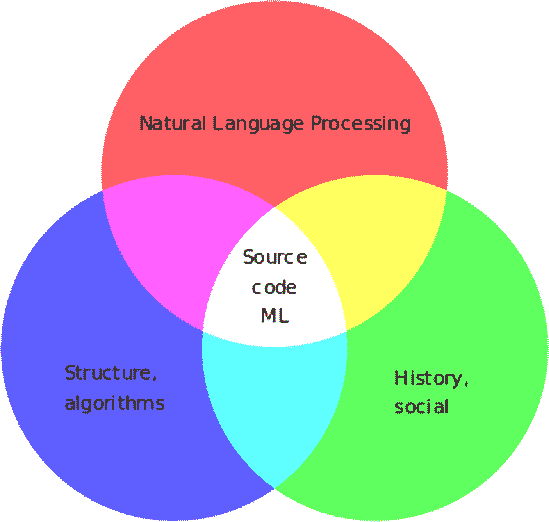
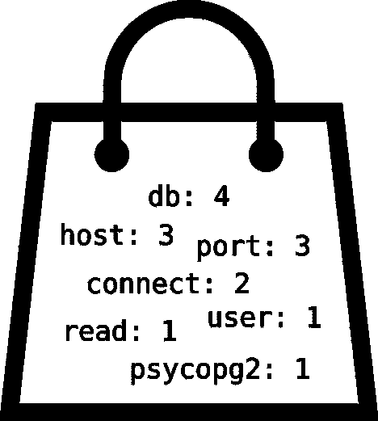
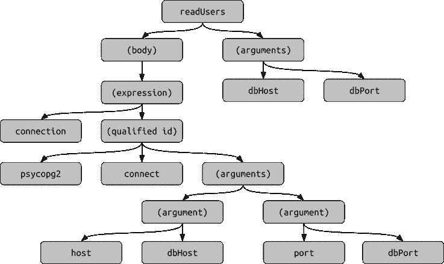
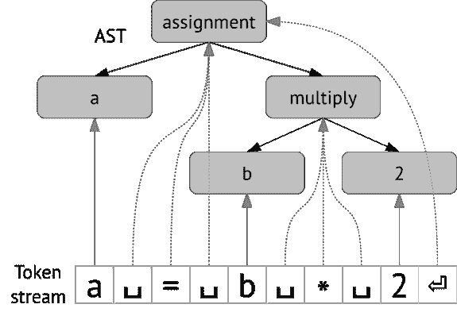

# 什么是代码上的机器学习？

> 原文：[`www.kdnuggets.com/2019/11/machine-learning-code-mloncode.html`](https://www.kdnuggets.com/2019/11/machine-learning-code-mloncode.html)

评论

**作者 [Vadim Markovtsev](https://www.linkedin.com/in/vmarkovtsev/)，[source{d}](https://sourced.tech/) 的首席机器学习工程师**

随着 IT 组织的发展，它们的代码库和不断变化的开发工具链的复杂性也在增加。工程领导者对他们的代码库、软件开发过程和团队的状态几乎没有可见性。通过将现代数据科学和机器学习技术应用于软件开发，大型企业有机会显著提高软件交付性能和工程效能。

* * *

## 我们的前三大课程推荐

 1\. [谷歌网络安全证书](https://www.kdnuggets.com/google-cybersecurity) - 快速进入网络安全职业生涯。

 2\. [谷歌数据分析专业证书](https://www.kdnuggets.com/google-data-analytics) - 提升你的数据分析技能

 3\. [谷歌 IT 支持专业证书](https://www.kdnuggets.com/google-itsupport) - 支持你的组织进行 IT

* * *

在过去几年中，包括谷歌、微软、Facebook 等大型公司以及 Jetbrains 和 source{d} 等小型公司，已经与学术研究人员合作，为代码上的机器学习奠定基础。

### 什么是代码上的机器学习？

代码上的机器学习（MLonCode）是一个新的跨学科研究领域，涉及自然语言处理、编程语言结构以及社会和历史分析，如贡献图和提交时间序列。MLonCode 旨在从大规模源代码数据集中学习，以自动执行软件工程任务，如辅助代码审查、代码去重、软件专业评估等。

什么是源代码上的机器学习？

### 为什么 MLonCode 很难？

一些 MLonCode 问题需要零错误率，例如与代码生成相关的问题；自动程序修复就是一个特定的例子。一个微小的单次预测错误可能导致整个程序的编译失败。

在其他情况下，错误率必须足够低。理想的模型应尽可能少出错，以确保用户——软件开发人员——的信号与噪声比保持可接受和可靠。因此，该模型可以像传统静态代码分析工具一样使用。最佳实践挖掘就是一个很好的例子。

最后，大多数 MLonCode 问题都是无监督的，或者最多是弱监督的。手动标注数据集可能非常昂贵，因此研究人员通常需要开发相关的启发式方法。例如，有许多相似性分组任务，比如展示相似的开发者或根据专业领域帮助组建团队。我们在这个主题上的经验在于[挖掘代码格式化规则并应用于修复故障](https://github.com/src-d/style-analyzer)，类似于 linters 的工作，但完全无监督。还有一个相关的学术竞赛用于预测格式化问题，称为 [CodRep](https://github.com/KTH/codrep-2019)。

MLonCode 问题包括各种数据挖掘任务，这些任务从理论上看可能是简单的，但由于规模或对细节的关注仍具有技术挑战性。例子包括代码克隆检测和相似开发者聚类。这些问题的解决方案会在年度学术会议[软件仓库挖掘](http://www.msrconf.org/)上展示。

软件仓库挖掘会议的标志。

在解决 MLonCode 问题时，通常有以下几种源代码表示方式：

频率词典（加权的词袋模型，BOW）。例如：函数内的标识符；文件中的图形片段；一个仓库的依赖项。频率可以通过 TF-IDF 加权。这种表示方式是最简单且最可扩展的。

一个序列化的标记流（TS），对应于源代码解析序列。该流通常会与相应的抽象语法树节点链接一起增强。这种表示对传统的自然语言处理算法友好，包括序列到序列的深度学习模型。

一棵树，源自抽象语法树。我们在之后进行各种变换，例如不可逆简化或标识符海报化。这是最强大的表示方式，同时也是最难处理的。相关的 ML 模型包括各种图嵌入和门控图神经网络。

许多处理 MLonCode 问题的方法基于所谓的自然性假设（[Hindle 等人](https://people.inf.ethz.ch/suz/publications/natural.pdf)）：

> “理论上，编程语言是复杂、灵活和强大的，但实际编写的程序大多简单且相当重复，因此它们具有有用的可预测统计特性，这些特性可以在统计语言模型中捕捉并用于软件工程任务。”

这一声明证明了大代码的有效性：源代码分析得越多，统计特性越强，训练后的机器学习模型的指标也越好。其基本关系与当前最先进的自然语言处理模型（例如 XLNet、ULMFiT 等）相同。同样，通用的 MLonCode 模型可以进行训练，并在下游任务中得到应用。

存在这样的大代码数据集。目前的终极来源是 GitHub 上的开源库。克隆数十万 Git 仓库可能会遇到技术问题，因此还有下游数据集，如 [Public Git Archive](https://github.com/src-d/datasets/tree/master/PublicGitArchive)、[GHTorrent](http://ghtorrent.org/) 和 [Software Heritage Graph](https://zenodo.org/record/2583978#.Xac1fuczb5Y)。

### **结论**

随着软件继续主宰世界，我们积累了数十亿行代码，数百万个由各种编程语言、框架和基础设施构建的应用程序。MLonCode 不仅能帮助公司简化代码库和软件交付流程，还能帮助组织更好地理解和管理工程人才。通过将软件制品视为数据，并将现代数据科学和机器学习技术应用于软件工程，组织有机会获得竞争优势。

**简历：[Vadim Markovtsev](https://www.linkedin.com/in/vmarkovtsev/)** ([**@vadimlearning**](https://twitter.com/vadimlearning)) 是一位谷歌机器学习领域的专家，同时也是**[source{d}](https://sourced.tech/)**的首席机器学习工程师，他处理“庞大”和“自然”的代码。他的学术背景是编译技术和系统编程。他是一个开源爱好者和开放数据的骑士。Vadim 是历史上分布式深度学习平台 Veles (https://velesnet.ml) 的创造者之一，曾在三星工作。之后，Vadim 负责 Mail.Ru（俄罗斯最大的电子邮件服务）中的机器学习项目，以对抗电子邮件垃圾。在此之前，Vadim 还曾担任莫斯科物理技术学院的访问副教授，教授新技术并进行 ACM 类的内部编码竞赛。

**相关内容：**

+   面向数据科学家的面向对象编程：构建你的 ML 估计器

+   10 个优秀的 Python 资源，助力有志的数据科学家

+   为什么机器学习部署如此困难？

### 更多相关内容

+   [宣布 PyCaret 3.0：开源、低代码的 Python 机器学习](https://www.kdnuggets.com/2023/03/announcing-pycaret-30-opensource-lowcode-machine-learning-python.html)

+   [KDnuggets 新闻，4 月 27 日：关于 Papers With Code 的简要介绍；…](https://www.kdnuggets.com/2022/n17.html)

+   [少于 15 行代码的多模态深度学习](https://www.kdnuggets.com/2023/01/predibase-multi-modal-deep-learning-less-15-lines-code.html)

+   [作为数据科学家管理你的可重用 Python 代码](https://www.kdnuggets.com/2021/06/managing-reusable-python-code-data-scientist.html)

+   [使用管道编写干净的 Python 代码](https://www.kdnuggets.com/2021/12/write-clean-python-code-pipes.html)

+   [跟踪和可视化 Python 代码执行的 3 个工具](https://www.kdnuggets.com/2021/12/3-tools-track-visualize-execution-python-code.html)
