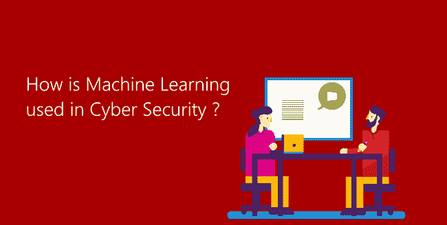

# 机器学习与网络安全资源

> 原文：[`www.kdnuggets.com/2017/01/machine-learning-cyber-security.html`](https://www.kdnuggets.com/2017/01/machine-learning-cyber-security.html)

评论

**作者：Faizan Ahmad，[Fsecurify](http://fsecurify.com/)**

[图片来源](http://www.superedge.net/2016/01/how-is-machine-learning-used-in-cyber.html)

### 机器学习与网络安全的数据：

* * *

## 我们的前三大课程推荐

 1\. [Google 网络安全证书](https://www.kdnuggets.com/google-cybersecurity) - 快速进入网络安全职业轨道。

 2\. [Google 数据分析专业证书](https://www.kdnuggets.com/google-data-analytics) - 提升你的数据分析技能

 3\. [Google IT 支持专业证书](https://www.kdnuggets.com/google-itsupport) - 支持你的组织的 IT

* * *

机器学习在网络安全中的一个重要数据来源是 [SecRepo](http://www.secrepo.com/)。这个网站包含了各种你可以使用的数据。我没有找到比这个网站更好的网络安全数据来源。

### 论文：

让我们看看一些很好的论文，这些论文展示了机器学习在网络安全中的应用。

+   [快速、精简且准确：使用神经网络建模密码猜测能力。](https://www.usenix.org/conference/usenixsecurity16/technical-sessions/presentation/melicher) 这是篇很棒的论文，作者使用神经网络破解密码。我已经阅读了这篇论文，真的很棒。

+   [超越封闭世界：使用机器学习进行网络入侵检测](http://ieeexplore.ieee.org/document/5504793/)。这篇论文讨论了使用机器学习进行网络入侵检测。这是另一篇很好的论文。

+   [基于异常载荷的网络入侵检测](http://link.springer.com/chapter/10.1007/978-3-540-30143-1_11)。另一篇被大量引用的论文。

+   [基于元数据和结构特征的恶意 PDF 检测](http://dl.acm.org/citation.cfm?id=2420987)。数据科学在网络安全中的独特应用。

+   [对抗性支持向量机学习。](http://dl.acm.org/citation.cfm?id=2339697)

+   [利用机器学习破坏你的垃圾邮件过滤器](http://dl.acm.org/citation.cfm?id=1387709.1387716)。另一本值得阅读的好书。

以下论文来自于 [covert.io](http://covert.io)。你可以查看他们的网站，那里有大量的论文，但数量太多，并且并非所有的论文都很易读和新颖。

+   [CAMP – 内容无关的恶意软件保护](http://www.covert.io/research-papers/security/CAMP%20-%20Content%20Agnostic%20Malware%20Protection.pdf)

+   [Notos – 为 DNS 构建动态声誉系统](http://www.covert.io/research-papers/security/Notos%20-%20Building%20a%20dynamic%20reputation%20system%20for%20dns.pdf)

+   [Kopis – 在 DNS 上层层次中检测恶意软件域名](http://www.covert.io/research-papers/security/Kopis%20-%20Detecting%20malware%20domains%20at%20the%20upper%20dns%20hierarchy.pdf)

+   [Pleiades – 从一次性流量到机器人 – 检测基于 DGA 的恶意软件的崛起](http://www.covert.io/research-papers/security/From%20throw-away%20traffic%20to%20bots%20-%20detecting%20the%20rise%20of%20dga-based%20malware.pdf)

+   [EXPOSURE – 使用被动 DNS 分析查找恶意域名](http://www.covert.io/research-papers/security/Exposure%20-%20Finding%20malicious%20domains%20using%20passive%20dns%20analysis.pdf)

+   [Polonium – 大规模图挖掘用于恶意软件检测](http://www.covert.io/research-papers/security/Polonium%20-%20Tera-Scale%20Graph%20Mining%20for%20Malware%20Detection.pdf)

+   [Nazca – 在大规模网络中检测恶意软件分发](http://www.covert.io/research-papers/security/Nazca%20-%20%20Detecting%20Malware%20Distribution%20in%20Large-Scale%20Networks.pdf)

+   [PAYL – 基于异常有效载荷的网络入侵检测](http://www.covert.io/research-papers/security/PAYL%20-%20Anomalous%20Payload-based%20Network%20Intrusion%20Detection.pdf)

+   [Anagram – 一种对抗模仿攻击的内容异常检测器](http://www.covert.io/research-papers/security/Anagram%20-%20A%20Content%20Anomaly%20Detector%20Resistant%20to%20Mimicry%20Attack.pdf)

### 书籍：

关于数据科学和机器学习在网络安全中的应用，市面上并没有很多书籍，但我找到了一些看起来相当有前途的书。我将在即将到来的假期中阅读这些书籍。

+   [网络安全中的数据挖掘和机器学习](https://www.crcpress.com/Data-Mining-and-Machine-Learning-in-Cybersecurity/Dua-Du/p/book/9781439839423)

+   [计算机安全中的机器学习和数据挖掘](http://www.springer.com/gp/book/9781846280290)

### 演讲：

关于这一主题有一些精彩的演讲。我也收集了它们。

+   [使用机器学习支持信息安全](https://www.youtube.com/watch?v=tukidI5vuBs)

+   [用不完整信息防御网络](https://www.youtube.com/watch?v=36IT9VgGr0g)

+   [将机器学习应用于网络安全监控](https://www.youtube.com/watch?v=vy-jpFpm1AU)

+   [衡量你的威胁情报源的智商](https://www.youtube.com/watch?v=yG6QlHOAWiE)

+   [数据驱动的威胁情报：指标传播和共享的度量](https://www.youtube.com/watch?v=6JMEKnes-w0)

+   [应用机器学习进行数据外泄及其他有趣的话题](https://www.youtube.com/watch?v=dGwH7m4N8DE)

+   [因为数学而安全：深入探讨基于机器学习的监控](https://www.youtube.com/watch?v=TYVCVzEJhhQ)

+   [机器欺骗 101：攻克深度学习系统](https://www.youtube.com/watch?v=JAGDpJFFM2A)

+   [Delta Zero, KingPhish3r – 武器化数据科学用于社会工程学。](https://www.youtube.com/watch?v=l7U0pDcsKLg)

+   [击败机器学习：你的安全供应商没有告诉你的。](https://www.youtube.com/watch?v=oiuS1DyFNd8)

+   [众包：众训机器学习模型用于恶意软件能力检测。](https://www.youtube.com/watch?v=u6a7afsD39A)

+   [击败机器学习：检测恶意软件的系统性缺陷。](https://www.youtube.com/watch?v=sPtbDUJjhbk)

+   [数据包捕获村 – 西奥多拉·提托尼斯 – 机器学习如何发现恶意软件。](https://www.youtube.com/watch?v=2cQRSPFSY-s)

+   [5 分钟内构建一个杀毒软件 – 新鲜的机器学习 #7](https://www.youtube.com/watch?v=iLNHVwSu9EA&t=245s)。一个有趣的视频。

+   [使用机器学习猎杀恶意软件。](https://www.youtube.com/watch?v=zT-4zdtvR30)

这些是我找到的不错的内容。我还没全部观看，但它们似乎都很不错。如果你找到更多的讲座，请在评论中告诉我。

### 教程：

我找到了一些与这个话题相关的很棒的教程。

+   [点击安全数据黑客项目](http://clicksecurity.github.io/data_hacking/)。该项目包含许多带有笔记本和代码的教程。这是每个对 ML 在信息安全中应用感兴趣的人必读的内容。

+   [使用神经网络生成可读密码。](http://fsecurify.com/using-neural-networks-to-generate-human-readable-passwords/)

+   [基于机器学习的密码强度分类。](http://fsecurify.com/machine-learning-based-password-strength-checking/)

+   [利用机器学习检测恶意网址。](http://fsecurify.com/using-machine-learning-detect-malicious-urls/)

+   大数据和数据科学用于安全与欺诈检测。 很不错的一篇。

+   [使用深度学习破解验证码系统。](https://deepmlblog.wordpress.com/2016/01/03/how-to-break-a-captcha-system/) 值得一读。

### 课程：

关于这个话题也有一些课程。不过这里是我找到的几个。

+   [斯坦福大学的网络安全数据挖掘。](http://web.stanford.edu/class/cs259d/) 这是使用数据进行网络安全的最佳课程之一。讲师在幻灯片中提供了很多应用和技术。课程页面上还有很多学生使用机器学习进行安全的项目。

### 杂项：

+   [系统通过人类专家的输入预测 85%的网络攻击。](http://news.mit.edu/2016/ai-system-predicts-85-percent-cyber-attacks-using-input-human-experts-0418) 必读文章。

+   在[mlsecproject](http://www.mlsecproject.org/#open-source-projects)上发布了一份使用机器学习的网络安全开源项目列表。

+   [网络安全和威胁猎杀的机器学习入门。](http://blog.sqrrl.com/an-introduction-to-machine-learning-for-cybersecurity-and-threat-hunting)

就这些了。这些是我能找到的一些与此主题相关的非常好的资源。如果你知道其他资源，请在下方评论，我会添加进去。

**简介: [Faizan Ahmad](https://www.linkedin.com/in/faizan-ahmad-015964118)** 是一名富布赖特本科生，目前在 NUCES FAST 学习，同时担任巴基斯坦拉合尔管理科学大学的研究助理。

**相关:**

+   **使用机器学习检测恶意网址**

+   **数据科学家如何缓解敏感数据暴露的脆弱性？**

+   **大数据安全的 5 个最佳实践**

### 更多相关话题

+   [学习数据科学统计的顶级资源](https://www.kdnuggets.com/2021/12/springboard-top-resources-learn-data-science-statistics.html)

+   [停止学习数据科学以寻找目标，并通过寻找目标来…](https://www.kdnuggets.com/2021/12/stop-learning-data-science-find-purpose.html)

+   [一个 90 亿美元的人工智能失败案例分析](https://www.kdnuggets.com/2021/12/9b-ai-failure-examined.html)

+   [成功的数据科学家的 5 个特征](https://www.kdnuggets.com/2021/12/5-characteristics-successful-data-scientist.html)

+   [是什么使得 Python 成为初创公司的理想编程语言](https://www.kdnuggets.com/2021/12/makes-python-ideal-programming-language-startups.html)

+   [每个数据科学家都应该知道的三个 R 库（即使你使用 Python）](https://www.kdnuggets.com/2021/12/three-r-libraries-every-data-scientist-know-even-python.html)
