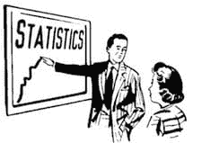

# 7 个做机器学习时常见的错误

> 原文：[`www.kdnuggets.com/2015/03/machine-learning-data-science-common-mistakes.html`](https://www.kdnuggets.com/2015/03/machine-learning-data-science-common-mistakes.html)

作者：程涛（[@chengtao_chu](https://twitter.com/chengtao_chu)）。

统计建模很像工程学。

 在工程学中，有多种方法可以构建键值存储，每种设计对使用模式做出不同的假设。在统计建模中，有各种算法可以构建分类器，每种算法对数据做出不同的假设。

当处理少量数据时，尝试尽可能多的算法并选择最佳算法是合理的，因为实验成本较低。但当面对“大数据”时，提前分析数据并据此设计建模流程（预处理、建模、优化算法、评估、生产化）是值得的。

正如我在之前的[帖子](http://ml.posthaven.com/why-building-a-data-science-team-is-hard)中指出的，有许多方法可以解决给定的建模问题。每种模型假设的情况不同，如何判断这些假设是否合理并不明显。在行业中，大多数从业者选择他们最熟悉的建模算法，而不是选择最适合数据的算法。在这篇文章中，我想分享一些常见的错误（即“不要做”的事）。一些最佳实践（即“要做”的事）我会在未来的文章中分享。

**1\. 以为默认损失函数是正确的**

许多从业者使用默认的损失函数（例如，平方误差）训练并选择最佳模型。实际上，现成的损失函数很少与业务目标一致。以欺诈检测为例。当尝试检测欺诈交易时，业务目标是最小化欺诈损失。现成的二分类器损失函数对假阳性和假阴性给予相同的权重。为了与业务目标对齐，损失函数不仅应对假阴性施加比假阳性更大的惩罚，还应根据金额对每个假阴性施加惩罚。此外，欺诈检测中的数据集通常包含高度不平衡的标签。在这些情况下，应通过上采样/下采样来倾斜损失函数，偏向于稀有情况。

**2\. 对非线性交互使用简单线性模型**

在构建二元分类器时，许多从业者会立刻选择逻辑回归，因为它简单。然而，许多人也会忘记逻辑回归是线性模型，并且预测变量之间的非线性交互需要手动编码。回到欺诈检测，高阶交互特征如“账单地址 = 送货地址且交易金额 < $50”对模型性能至关重要。因此，应优先选择像带有核的 SVM 或树基分类器等非线性模型，它们可以内置高阶交互特征。

**3\. 忘记异常值**

异常值很有趣。根据上下文，它们可能值得特别关注，或者应该完全忽略。例如，在收入预测中，如果观察到收入的异常峰值，可能应该额外关注一下，找出峰值的原因。但如果异常值是由于机械故障、测量误差或其他无法普遍化的原因造成的，那么在将数据输入建模算法之前，最好过滤掉这些异常值。

 一些模型对异常值比其他模型更敏感。例如，AdaBoost 可能会将这些异常值视为“困难”案例，并对异常值施加巨大权重，而决策树可能只是将每个异常值计为一个错误分类。如果数据集中包含大量异常值，那么要么使用对异常值具有鲁棒性的建模算法，要么在建模之前过滤掉异常值。

* * *

## 我们的三大课程推荐

 1\. [谷歌网络安全证书](https://www.kdnuggets.com/google-cybersecurity) - 快速进入网络安全职业

 2\. [谷歌数据分析专业证书](https://www.kdnuggets.com/google-data-analytics) - 提升你的数据分析技能

 3\. [谷歌 IT 支持专业证书](https://www.kdnuggets.com/google-itsupport) - 支持你所在组织的 IT 需求

* * *

### 更多相关话题

+   [每个 AI 新手都会犯的 5 个常见错误](https://www.kdnuggets.com/avoid-these-5-common-mistakes-every-novice-in-ai-makes)

+   [5 个常见的数据科学错误及如何避免](https://www.kdnuggets.com/5-common-data-science-mistakes-and-how-to-avoid-them)

+   [如何应对 3 个常见的机器学习挑战](https://www.kdnuggets.com/2022/09/comet-tackle-3-common-machine-learning-challenges.html)

+   [新手数据科学家应该避免的错误](https://www.kdnuggets.com/2022/06/mistakes-newbie-data-scientists-avoid.html)

+   [3 个可能影响数据分析准确性的错误](https://www.kdnuggets.com/2023/03/3-mistakes-could-affecting-accuracy-data-analytics.html)

+   [《软件错误与权衡：Tomasz Lelek 等新书》](https://www.kdnuggets.com/2021/12/manning-software-mistakes-tradeoffs-book.html)
