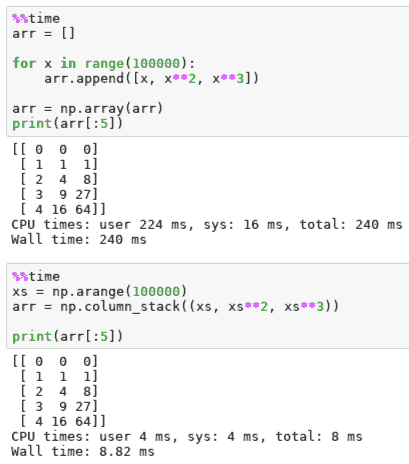

# 如何高效进行机器学习

> 原文：[`www.kdnuggets.com/2018/03/machine-learning-efficiently.html`](https://www.kdnuggets.com/2018/03/machine-learning-efficiently.html)

 评论

**[Radek Osmulski](https://twitter.com/radekosmulski)，自学开发者**

我刚刚完成一个项目，在项目进行到 80%时，我觉得几乎没有任何进展。我投入了大量时间，但最后完全失败了。

我知道或不知道的数学，我编写代码的能力——这些都是次要的。我处理项目的方式才是问题所在。

我现在相信，构建机器学习工作的结构是有艺术性的，或说是工艺性的，而我曾经喜欢的数学重的书籍似乎都没有提到这一点。

我做了一些自我反思，回到了[Jeremy Howard](https://medium.com/@jeremyphoward)在[Practical Deep Learning for Coders MOOC](http://course.fast.ai/)中提到的内容，这就是这篇文章的来源。

**10 秒规则**

我们坐在电脑前做事。对宇宙产生影响。降低预测成本或减少模型运行时间。

这里的关键词是做。这包括移动代码。重命名变量。可视化数据。疯狂地敲击键盘。

但盯着计算机屏幕空白地看两分钟，让它进行计算，以便我们可以一次次地运行它们，尽管参数稍作修改，这并不是在做事。

这也使我们面临机器学习工作的最大祸根——额外浏览器标签的诅咒。按下 ctrl+t 是如此容易，跟踪我们在做什么也变得如此困难。

这个解决方案可能听起来很荒谬，但它有效。不要让计算超过 10 秒钟，当你在处理一个问题时。

那我怎么调整我的参数呢？我怎么能对问题有任何有意义的了解？

所需的只是以一种能创建代表性样本的方式来子集你的数据。这可以用于任何领域，在大多数情况下，只需随机选择一些示例进行处理即可。

一旦你对数据进行子集划分，工作就变得互动起来。你进入了一个专注的流状态。你不断进行实验，找出什么有效，什么无效。你的手指从键盘上永远不会离开。

时间被拉长了，你所做的工作时间与如果你让自己分心时所做的工作时间不相等，甚至不如你所做的 5 小时工作。

如何构建代码以促进这种工作流程？使其非常简单地切换到在完整数据集上运行。

当你快要结束编码会话时，取消注释该单元格并运行所有代码。

### 成为时间浪费者

这补充了上述内容。但它还远不止这些。

根据你如何结构化代码，性能的提升可以有几个数量级的差距。了解某个操作的运行时间以及如果你做了某些更改它将运行多长时间是很有益的。你可以尝试弄清楚差异的原因，这会立即让你成为一个更好的程序员。

更重要的是，这与承诺不运行任何超过 10 秒钟的代码是密切相关的。

**测试自己**

一旦你在数据处理管道中犯了错误且未被发现，几乎是不可能恢复的。在很大程度上，这同样适用于模型构建（尤其是当你开发自己的组件如层等时）。

关键是随着进展不断检查数据。在转换前后查看数据。总结它。如果你知道合并后不应该有 NAs，就检查确实没有。

测试一切。

长期保持理智的唯一方法是短期内保持警惕。

**急于成功**

在解决问题时你应该关注的第二件事是什么（我会马上谈到第一件事）？创建一个比随机机会更好的模型，任何端到端的数据处理管道。

这可以且应该是你能想到的最简单的模型。通常这意味着线性组合。但你需要开始感受问题的本质。你需要开始建立一个可能性的基准。

比如你花了 3 天时间构建一个非常复杂的模型，但它完全没有效果，或者效果远不如你预期的那样好。你会怎么做？

在这个阶段，你一无所知。你不知道是否在处理数据时犯了错误，也不知道数据是否无用。你没有线索是否模型中可能存在问题。祝你好运，希望在没有可靠组件的情况下解开这些混乱。

此外，建立一个简单的模型可以让你从整体上看待情况。也许有缺失数据？也许类别不平衡？也许数据标签不正确？

在开始处理更复杂的模型之前，了解这些信息是很有用的。否则，你可能会构建出一个非常复杂的模型，虽然客观上可能很棒，但却完全不适合当前的问题。

**不要调整参数，调整架构**

“哦，如果我再加一层线性层，我相信模型会表现得更好”

“也许再增加 0.00000001 的 dropout 会有帮助，看起来我们对训练集的拟合有点过度了”

尤其是在早期，调整超参数是绝对适得其反的。但这确实非常诱人。

这几乎不需要任何工作，而且很有趣。你可以看到计算机屏幕上的数字变化，感觉像是你在学习一些东西并取得进展。

这只是一种幻象。更糟糕的是，你可能会过拟合你的验证集。每次你运行模型并根据验证损失进行更改时，你都会使模型的泛化能力受到惩罚。

你更好地投资时间于探索架构。你会学到更多。突然间，集成变得可能。

**解放小鼠**

你计划使用电脑多长时间？即使我偶然变得富有到不再需要工作一天，我仍会每天使用电脑。

如果你打网球，你会练习每一个动作。你甚至可能会花钱请人告诉你如何在特定击球时调整手腕的位置！

但现实是，你最多只会打这么多小时的网球。为什么不对使用电脑也同样认真呢？

使用鼠标是不自然的。它很慢。需要复杂且精确的动作。从任何上下文中，你只能访问有限的操作集合。

使用键盘让你感到自由。老实说，我也不知道为什么它会有如此大的差别。但确实如此。

一个人在用电脑时没有使用鼠标。

**最后但同样重要的是**

除非你有一个好的验证集，否则你做的任何事情都没有意义。

我可以推荐给你最终的资源。这是一篇直言不讳且基于实践的文章。

[如何（以及为什么）创建一个好的验证集](http://www.fast.ai/2017/11/13/validation-sets/) 由 [Rachel Thomas](https://medium.com/@racheltho) 撰写。

*如果你觉得这篇文章有趣并且想保持联系，你可以在 Twitter 上* [*这里*](https://twitter.com/radekosmulski) *找到我。*

**简介： [Radek Osmulski](https://twitter.com/radekosmulski)** 是一位自学成才的开发者，对机器学习充满热情。他是 [Fast.ai](http://www.fast.ai/) 国际研究员，并且是该领域的积极学生。你可以在 Twitter 上 [这里](https://twitter.com/radekosmulski) 与他联系。

[原文](https://hackernoon.com/doing-machine-learning-efficiently-8ba9d9bc679d)。经许可转载。

**相关：**

+   关于机器学习你需要知道的 5 件事

+   机器学习新手的十大算法导览

+   用 Python 精通机器学习的 7 个步骤

* * *

## 我们的三大课程推荐

 1\. [谷歌网络安全证书](https://www.kdnuggets.com/google-cybersecurity) - 快速进入网络安全职业道路。

 2\. [谷歌数据分析专业证书](https://www.kdnuggets.com/google-data-analytics) - 提升你的数据分析技能。

 3\. [谷歌 IT 支持专业证书](https://www.kdnuggets.com/google-itsupport) - 支持组织的 IT 需求

* * *

### 更多相关内容

+   [如何高效扩展云计算中的数据科学项目](https://www.kdnuggets.com/2023/05/efficiently-scale-data-science-projects-cloud-computing.html)

+   [如何高效地使用 Pandas 合并大型 DataFrames](https://www.kdnuggets.com/how-to-merge-large-dataframes-efficiently-with-pandas)

+   [每个机器学习工程师应该具备的 5 项机器学习技能……](https://www.kdnuggets.com/2023/03/5-machine-learning-skills-every-machine-learning-engineer-know-2023.html)

+   [KDnuggets 新闻，12 月 14 日：3 个免费的机器学习课程……](https://www.kdnuggets.com/2022/n48.html)

+   [学习数据科学、机器学习和深度学习的可靠计划](https://www.kdnuggets.com/2023/01/mwiti-solid-plan-learning-data-science-machine-learning-deep-learning.html)

+   [人工智能、分析、机器学习、数据科学、深度学习……](https://www.kdnuggets.com/2021/12/developments-predictions-ai-machine-learning-data-science-research.html)
