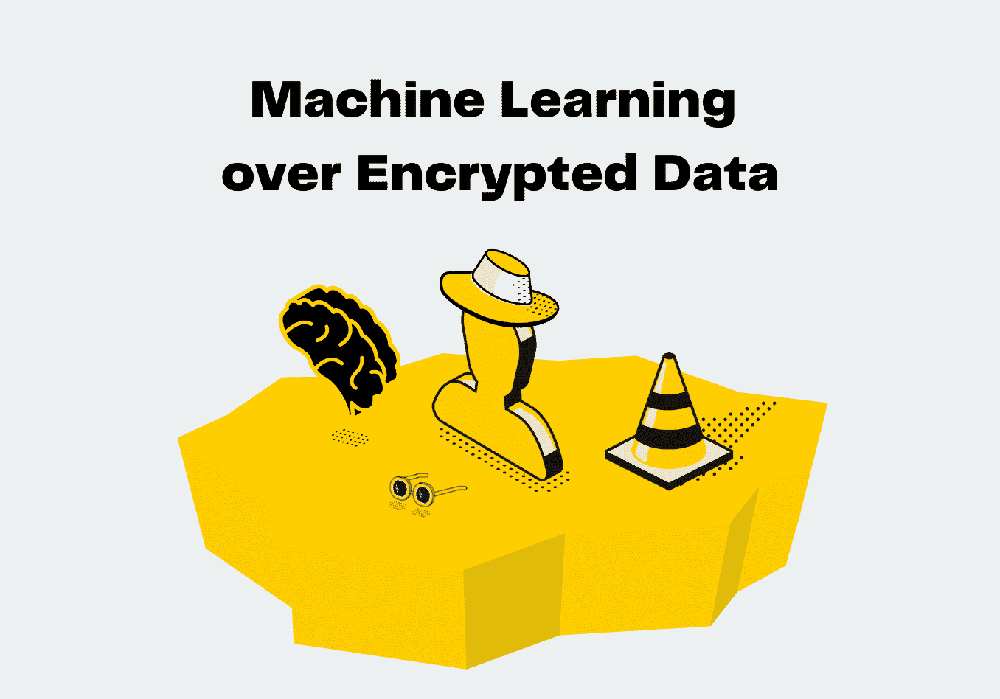

# 在加密数据上进行机器学习

> 原文：[`www.kdnuggets.com/2022/08/machine-learning-encrypted-data.html`](https://www.kdnuggets.com/2022/08/machine-learning-encrypted-data.html)



本博客介绍了一种隐私保护机器学习（PPML）解决方案，用于 Kaggle 上的泰坦尼克挑战，使用[Concrete-ML](https://docs.zama.ai/concrete-ml)开源工具包。其主要目标是展示[全同态加密](https://en.wikipedia.org/wiki/Homomorphic_encryption)（FHE）如何用于保护数据，同时使用机器学习模型进行预测而不降低其性能。在这个例子中，将考虑[XGBoost](https://xgboost.readthedocs.io/en/stable/)分类器模型，因为它实现了接近最先进的准确度。

* * *

## 我们的前 3 名课程推荐

 1\. [谷歌网络安全证书](https://www.kdnuggets.com/google-cybersecurity) - 快速进入网络安全职业生涯。

 2\. [谷歌数据分析专业证书](https://www.kdnuggets.com/google-data-analytics) - 提升你的数据分析技能

 3\. [谷歌 IT 支持专业证书](https://www.kdnuggets.com/google-itsupport) - 支持组织中的 IT 工作

* * *

# 竞赛

[Kaggle](https://www.kaggle.com/)是一个在线社区，让任何人都可以围绕机器学习和数据科学构建和分享项目。它提供数据集、课程、示例和竞赛，任何愿意发现或提升自己领域知识的数据科学家都可以免费使用。其简易性使其成为 ML 社区中最受欢迎的平台之一。

此外，Kaggle 提供了几个难度不同的教程，供新手开始在真实例子中操作基本数据科学工具。在这些教程中可以找到[Titanic 竞赛](https://www.kaggle.com/competitions/titanic)。它通过使用一组简单的乘客数据来介绍一个二分类问题，这些乘客在悲惨的泰坦尼克号船难中旅行。

Concrete-ML 团队为本次竞赛发送的 Jupyter Notebook 可以在[此处](https://www.kaggle.com/code/concretemlteam/titanic-with-privacy-preserving-machine-learning)找到。它是借助几个其他公开可用的笔记本创建的，以提供清晰的指南和高效的结果。

# 准备工作

在能够构建模型之前，需要进行一些准备步骤。

## 包要求

Concrete-ML 是一个 Python 包，因此代码使用这种编程语言编写。还需要一些额外的包，包括用于数据预处理的 [Pandas](https://pandas.pydata.org/) 框架以及一些 [scikit-learn](https://scikit-learn.org/stable/) 交叉验证工具。

```py
import numpy as np
import pandas as pd
from sklearn.model_selection import GridSearchCV, ShuffleSplit
from xgboost import XGBClassifier
from concrete.ml.sklearn import XGBClassifier as ConcreteXGBClassifier
```

## 清洗数据

Kaggle 平台提供了训练数据集和测试数据集。完成这些后，让我们加载数据并提取目标 ID。

```py
train_data = pd.read_csv("./local_datasets/titanic/train.csv")
test_data = pd.read_csv("./local_datasets/titanic/test.csv")
datasets = [train_data, test_data]
test_ids = test_data["PassengerId"]
```

数据的样子如下：


可以做出以下几项陈述：

- 目标变量是 Survived 变量。

- 一些变量是数值型的，如 PassengerID、Pclass、SbSp、Parch 或 Fare。

- 一些变量是类别型的（非数值型的），如 Name、Sex、Ticket、Cabin 或 Embarked。

第一步预处理是删除 PassengerId 和 Ticket 变量，因为它们似乎是随机标识符，对生存没有影响。此外，我们注意到 Cabin 变量中有些值缺失。因此，我们必须通过打印每个变量缺失值的总数来进一步调查这一观察结果。

```py
print(train_data.isnull().sum())
print(test_data.isnull().sum())
```

这将输出以下结果。


似乎有四个变量是不完整的，即 Cabin、Age、Embarked 和 Fare。然而，Cabin 变量似乎缺失的数据最多：

```py
for incomp_var in train_data.columns:

  missing_val = pd.concat(datasets)[incomp_var].isnull().sum()

  if missing_val > 0 and incomp_var != "Survived":

      total_val = pd.concat(datasets).shape[0]

      print(

         f"Percentage of missing values in {incomp_var}: "

   f"{missing_val/total_val*100:.1f}%"

      )

```

```py
Percentage of missing values in Cabin: 77.5%
Percentage of missing values in Age: 20.1%
Percentage of missing values in Embarked: 0.2%
Percentage of missing values in Fare: 0.1%
```

由于 Cabin 变量缺失了超过 2/3 的值，因此保留它也可能不合适。因此，我们从两个数据集中删除这些变量。

```py
drop_column = ["PassengerId", "Ticket", “Cabin”]
for dataset in datasets:
  dataset.drop(drop_column, axis=1, inplace=True)
```

关于其他三个存在缺失值的变量，删除它们可能会丢失大量可能帮助模型预测乘客生存的相关信息。对于年龄变量尤其如此，因为其值中有超过 20% 缺失。因此，可以使用其他技术来填补这些不完整的变量。由于年龄和票价都是数值型的，缺失值可以用现有数据的中位数来替代。对于类别变量 Embarked，我们使用最常见的值作为替代。

```py
for dataset in datasets:

  dataset.Age.fillna(dataset.Age.median(), inplace=True)

  dataset.Embarked.fillna(dataset.Embarked.mode()[0], inplace=True)

  dataset.Fare.fillna(dataset.Fare.median(), inplace=True)
```

## 工程新特征

此外，我们还可以从已有的变量中手动创建新变量，以帮助模型更好地解释一些行为，从而提高预测准确性。在所有可用的选项中，选择了四个新特征：

+   **家庭规模**：个人旅行时所陪伴的家庭成员数，1 表示单独旅行。

+   **IsAlone**：一个布尔变量，表示个人是否单独旅行（1）或非单独旅行（0）。这可能帮助模型强调旅行时是否与亲属同行。

+   **标题**：个人的称谓（如先生、女士等），通常表示某种社会地位。

+   **Farebin** 和 **AgeBin**：Fare 和 Age 变量的分箱版本。它将值分组在一起，通常减少了轻微观察误差的影响。

我们为两个数据集创建这些新变量。

```py
# Function that helps generating proper bin names 
def get_bin_labels(bin_name, number_of_bins):

  labels = []

  for i in range(number_of_bins):

      labels.append(bin_name + f"_{i}")

  return labels

for dataset in datasets:

  dataset["FamilySize"] = dataset.SibSp + dataset.Parch + 1

  dataset["IsAlone"] = 1

  dataset.IsAlone[dataset.FamilySize > 1] = 0

  dataset["Title"] = dataset.Name.str.extract(
r" ([A-Za-z]+)\.", expand=False

  )

  dataset["FareBin"] = pd.qcut(
dataset.Fare, 4, labels=get_bin_labels("FareBin", 4)

  )

  dataset["AgeBin"] = pd.cut(
dataset.Age.astype(int), 5, labels=get_bin_labels("AgeBin", 5)

  )

  # Removing outdated variables

  drop_column = ["Name", "SibSp", "Parch", "Fare", "Age"]

  dataset.drop(drop_column, axis=1, inplace=True)
```

此外，打印数据集中的不同标题显示，只有少数几个标题代表了大多数个体。

```py
data = pd.concat(datasets)
titles = data.Title.value_counts()
print(titles)
```


为了防止模型变得过于特定，将所有“少见”的标题归为一个新的“Rare”变量。

```py
uncommon_titles = titles[titles < 10].index
for dataset in datasets:
  dataset.Title.replace(uncommon_titles, "Rare", inplace=True)
```

## 应用虚拟化

最后，我们可以对剩余的分类变量进行“虚拟化”。虚拟化是一种将分类（非数值）数据转换为数值数据的常见技术，无需映射值或考虑它们之间的任何顺序。其思想是提取变量中所有不同的值，并创建一个新的相关的二进制变量。

例如，“Embarked”变量有三个分类值，“S”、“C”和“Q”。虚拟化数据将创建三个新变量，“Embarked_S”、“Embarked_C”和“Embarked_Q”。然后，“Embarked_S”（或“Embarked_C”和“Embarked_Q”）的值对于在“Embarked”变量中最初标记为“S”（或“C”和“Q”）的每个数据点设置为 1，否则设置为 0。

```py
categorical_features = train_data.select_dtypes(exclude=np.number).columns
x_train = pd.get_dummies(train_data, prefix=categorical_features)
x_test = pd.get_dummies(test_data, prefix=categorical_features)
x_test = x_test.to_numpy()
```

然后，我们将目标变量与其他变量分开，这是训练之前的必要步骤。

```py
target = "Survived"
x_train = x_train.drop(columns=[target])
x_train = x_train.to_numpy()
y_train = train_data[target].to_numpy()
```

# 构建模型

## 使用 XGBoost 进行训练

首先，使用 XGBoost 构建一个分类模型。由于需要事先固定几个参数，我们使用 scikit-learn 的 GridSearchCV 方法进行交叉验证，以最大化找到最佳参数的机会。给定的范围故意较小，以保持每次推理的 FHE 执行时间相对较低（低于 10 秒）。实际上，我们发现，在这个特定的 Titanic 示例中，具有更多估算器或最大深度的模型并没有显著提高准确率。然后，我们使用训练集来拟合这个模型。

```py
cv = ShuffleSplit(n_splits=5, test_size=0.3, random_state=0)
param_grid = {

  "max_depth": list(range(1, 5)),

  "n_estimators": list(range(1, 5)),

  "learning_rate": [0.01, 0.1, 1],
}
model = GridSearchCV(

  XGBClassifier(), param_grid, cv=cv, scoring="roc_auc"
)
model.fit(x_train, y_train)
```

## 使用 Concrete-ML 进行训练

现在，让我们使用 Concrete-ML 的 XGBClassifier 方法进行相同的操作。

为了做到这一点，我们需要指定输入、输出和权重将被量化的位数。这个值会影响模型的精度及其推理运行时间，因此可能导致网格搜索交叉验证找到不同的参数集。在我们的例子中，将该值设置为 2 位可以在更快的运行速度下获得出色的准确度评分。

```py
param_grid["n_bits"] = [2]
x_train = x_train.astype(np.float32)
concrete_model = GridSearchCV(

  ConcreteXGBClassifier(), param_grid, cv=cv, scoring="roc_auc"
)
concrete_model.fit(x_train, y_train)
```

Concrete-ML API 设计得尽可能接近最常见的机器学习和深度学习 Python 库，以使其使用尽可能简单。此外，它使任何数据科学家可以在没有加密知识的情况下使用 Zama 的技术。因此，构建和拟合 FHE 兼容的模型对任何习惯于使用 scikit-learn 工具等常见数据科学工作流程的人来说，都变得非常直观和方便。实际上，这些观察对于预测过程仍然有效，只需考虑几个额外的步骤。

# 预测结果

首先，我们使用 XGBoost 模型在清晰的环境中计算预测结果。

```py
clear_predictions = model.predict(x_test)
```

此外，也可以使用 Concrete-ML 模型在清晰的环境中计算预测。这将本质上执行库的 XGBoost 版本的模型，并考虑量化过程。这里不涉及任何 FHE 相关的计算。

```py
clear_quantized_predictions = concrete_model.predict(x_test)
```

为了使用 FHE 实现相同的功能，需要额外的编译步骤。通过提供一个用于表示可达值范围的输入数据子集，编译方法构建一个适当的 FHE 电路，该电路将在预测过程中执行。请注意，execute_in_fhe 参数也需要设置为 True。

```py
fhe_circuit = concrete_model.best_estimator_.compile(x_train[:100])
fhe_predictions = concrete_model.best_estimator_.predict(

  x_test, execute_in_fhe=True
)

```

使用配备 8 个 11 代 Intel® Core™ i5-1135G7 处理器（2.40GHz，4 核心，每个核心 2 线程）的机器，每次推理的平均执行时间在 2 到 3 秒之间。这不包括密钥生成时间，密钥生成仅在所有预测之前发生一次，时间不超过 12 秒。

此外，FHE 计算预计是准确的。这意味着 FHE 中执行的模型会产生与 Concrete-ML 模型相同的预测，后者在清晰的环境中执行并仅考虑量化。

```py
number_of_equal_preds = np.sum(

  fhe_predictions == clear_quantized_predictions
)
pred_similarity = number_of_equal_preds / len(clear_predictions) * 100
print(

  "Prediction similarity between both Concrete-ML models" 

  f"(quantized clear and FHE): {pred_similarity:.2f}%"
)
```

Concrete-ML 模型（量化清晰和 FHE）之间的预测相似度：100.00%

然而，正如之前所见，网格搜索交叉验证是在 XGBoost 模型和 Concrete-ML 模型之间分别进行的。因此，这两个模型没有共享相同的超参数集合，使它们的决策边界不同。

因此，逐一比较它们的预测结果的相似性是不相关的，应该仅考虑 Kaggle 平台给出的最终准确性分数来评估它们的表现。

因此，我们将 XGBoost 和 Concrete-ML 模型的预测结果保存为 csv 文件。然后，可以使用这个 [链接](https://www.kaggle.com/competitions/titanic/submit) 在 Kaggle 平台上提交这些文件。FHE 模型的准确率约为 78%，可在公开的 [排行榜](https://www.kaggle.com/competitions/titanic/leaderboard?search=concrete) 上查看。相比之下，XGBoost 清晰模型的得分为 77%。

实际上，使用给定的数据集，大多数提交的笔记本似乎都没有超过 79% 的准确率。因此，额外的预处理和特征工程可能有助于提高我们当前的分数，但可能不会提高太多。

```py
submission = pd.DataFrame(

      {

          "PassengerId": test_ids,

          "Survived": fhe_predictions,

      }

  )

submission.to_csv("titanic_submission_fhe.csv", index=False)

submission = pd.DataFrame(

      {

          "PassengerId": test_ids,

          "Survived": clear_predictions,

      }

  )

submission.to_csv("titanic_submission_xgb_clear.csv", index=False)
```

感谢阅读！我们的主要目标不仅是建立一个预测模型来回答“哪些人更可能生存？”这个问题，还要在加密数据上实现这一点。

这一切得益于我们的 Python 包：[Concrete-ML](https://github.com/zama-ai/concrete-ml)，旨在简化数据科学家对全同态加密（FHE）的使用。

[**Roman Bredehoft**](https://www.linkedin.com/in/roman-bredehoft/?originalSubdomain=fr) 是 Zama 的机器学习工程师。

### 更多相关信息

+   [使用同态加密对加密数据进行情感分析](https://www.kdnuggets.com/2022/12/zama-sentiment-analysis-encrypted-data-homomorphic-encryption.html)

+   [学术界是否在过度关注方法论，而忽视了真正的见解？](https://www.kdnuggets.com/is-academia-obsessing-over-methodology-at-the-cost-of-true-insights)

+   [如何将 Python Pandas 的速度提升超过 300 倍](https://www.kdnuggets.com/how-to-speed-up-python-pandas-by-over-300x)

+   [每个机器学习工程师都应该掌握的 5 项机器学习技能](https://www.kdnuggets.com/2023/03/5-machine-learning-skills-every-machine-learning-engineer-know-2023.html)

+   [KDnuggets 新闻，12 月 14 日：3 个免费的机器学习课程](https://www.kdnuggets.com/2022/n48.html)

+   [学习数据科学、机器学习和深度学习的可靠计划](https://www.kdnuggets.com/2023/01/mwiti-solid-plan-learning-data-science-machine-learning-deep-learning.html)
