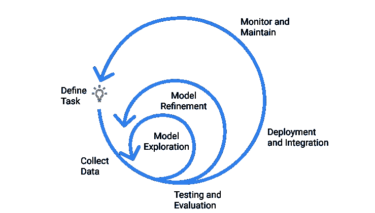
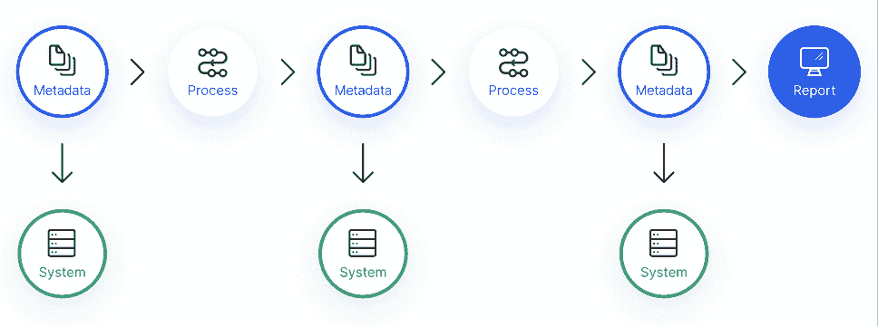
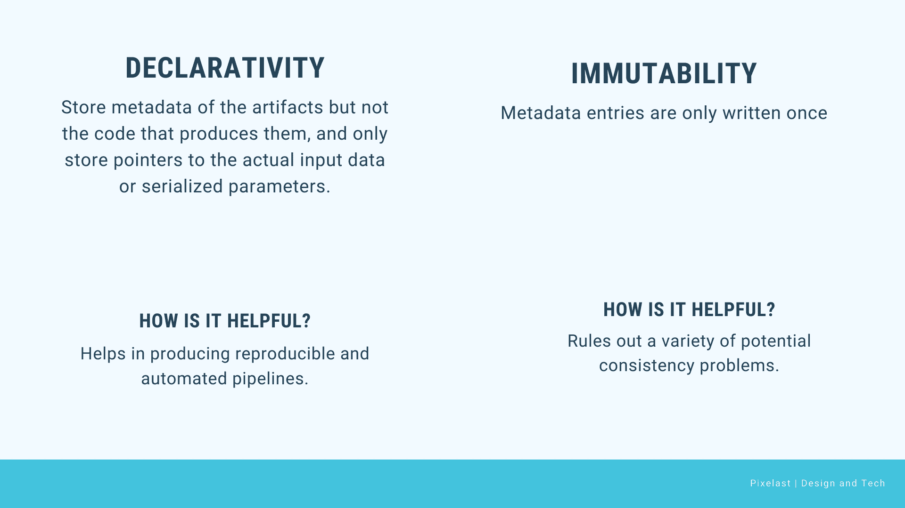
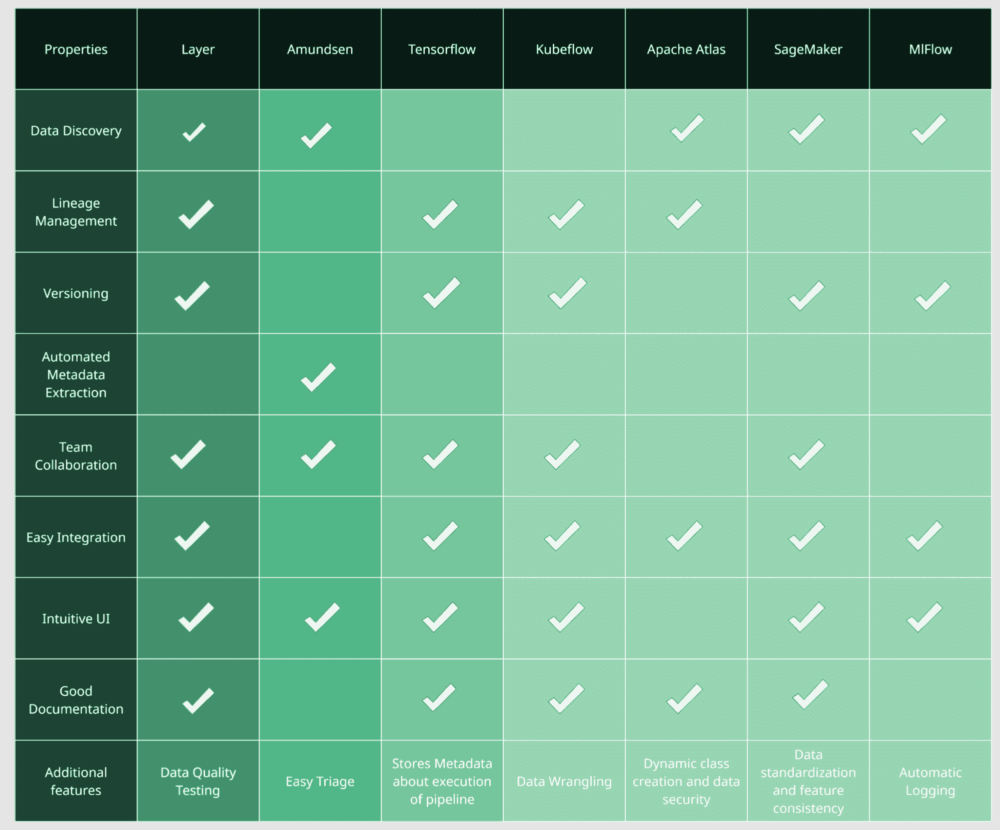

# 机器学习元数据存储

> 原文：[`www.kdnuggets.com/2022/08/machine-learning-metadata-store.html`](https://www.kdnuggets.com/2022/08/machine-learning-metadata-store.html)

图片由 [Manuel Geissinger](https://www.pexels.com/photo/black-server-racks-on-a-room-325229/) 提供

机器学习主要是数据驱动的，涉及大量的原始和中间数据。目标通常是在生产环境中创建并部署一个模型，以供他人使用以实现更大的利益。要理解模型，必须在不同阶段检索和分析我们机器学习模型的输出及其创建所用的数据集。关于这些数据的数据称为**元数据**。[元数据](https://en.wikipedia.org/wiki/Metadata)就是关于数据的数据。

* * *

## 我们的前三个课程推荐

 1\. [Google 网络安全证书](https://www.kdnuggets.com/google-cybersecurity) - 快速进入网络安全职业生涯。

 2\. [Google 数据分析专业证书](https://www.kdnuggets.com/google-data-analytics) - 提升你的数据分析能力

 3\. [Google IT 支持专业证书](https://www.kdnuggets.com/google-itsupport) - 支持你的组织的 IT 工作

* * *

**在本文中，我们将学习：**

+   元数据存储，

+   元数据存储的组成部分，

+   元数据存储的需求

+   元数据存储的选择标准

+   元数据管理，

+   元数据管理的架构和组件

+   声明式元数据管理

+   流行的元数据存储及其特点

+   文章末尾有这些存储的 TL;DR 对比表。

# 为什么我们需要一个元数据存储？

构建机器学习模型的过程与从理论上进行科学实验有些相似。你从一个假设开始，设计一个模型来测试你的假设，测试并改进你的设计以适应你的假设，然后根据你的数据选择最佳方法。在机器学习中，你从一个关于哪些输入数据可能产生期望结果的假设开始，训练模型，并调整超参数，直到你构建出产生所需结果的模型。

图：机器学习开发生命周期。 [[来源](https://www.jeremyjordan.me/ml-projects-guide/)]

存储这些实验数据有助于**可比性**和**可重复性**。如果实验模型的参数不可比，那么迭代的模型构建过程将是徒劳的。如果需要重现之前的结果，可重复性也是至关重要的。鉴于机器学习实验的动态和随机性质，实现可重复性是复杂的。

存储元数据将有助于重新训练相同的模型并获得相同的结果。由于大量实验数据在管道中流动，必须将每个实验模型的元数据与输入数据分开。因此，需要有一个**元数据存储库**，即一个包含元数据的数据库。

# 元数据类型

既然我们已经讨论了存储元数据的重要性，那么让我们来看一下不同类型的元数据。

## 数据

用于模型训练和评估的数据在可比性和可重复性方面起着主导作用。除了数据外，你还可以存储以下内容：

+   数据位置的指针

+   数据集的名称和版本

+   列名和数据类型

+   数据集的统计信息

## 模型

实验通常是为了锁定一个适合我们业务需求的模型。在实验结束之前，很难确定选择哪个模型。因此，如果所有实验模型都是可重复的，这将非常有用并节省大量时间。需要注意的是，我们关注的是模型的可重复性，而不是可检索性。为了检索一个模型，必须存储所有模型，这会占用太多空间。这是可以避免的，因为以下参数有助于在需要时重复模型。

### 特征预处理步骤

原始数据已经被记录并保存以便检索。但这些原始数据并不总是被喂给模型进行训练。在大多数情况下，模型所需的关键数据，即特征，是从原始数据中提取的，并成为模型的输入。

由于我们追求可重复性，因此需要保证所选特征处理方式的一致性，因此特征预处理步骤需要被保存。一些预处理步骤的示例包括特征增强、处理缺失值、将其转换为模型所需的不同格式等。

### 模型类型

为了重建模型，存储使用的模型类型，如 [AlexNet](https://papers.nips.cc/paper/2012/file/c399862d3b9d6b76c8436e924a68c45b-Paper.pdf)、[YoloV4](https://github.com/AlexeyAB/darknet)、[Random Forest](https://towardsdatascience.com/understanding-random-forest-58381e0602d2)、[SVM](https://youtu.be/efR1C6CvhmE)、[等](https://github.com/onnx/models)，及其版本和框架，如 [PyTorch](https://pytorch.org/)、[Tensorflow](https://www.tensorflow.org/)、[Scikit-learn](https://scikit-learn.org/stable/)。这确保了在重复模型时没有选择上的模糊性。

### 超参数

机器学习模型通常有一个损失函数或成本函数。为了创建一个强健且高效的模型，我们的目标是最小化损失函数。损失函数最小化时模型的权重和偏差是需要保存的超参数，以便重复之前创建的高效模型。这可以节省寻找正确超参数的处理时间，并加快模型选择过程。

### 评价指标

模型评估的结果对理解你如何构建模型非常重要。它们有助于找出：

+   如果模型对训练集过拟合，

+   不同的超参数如何影响输出，以及评估指标或

+   进行全面的错误分析。

存储这些数据有助于在任何给定时间进行模型评估。

## 上下文

模型上下文是关于机器学习实验环境的信息，这可能会或不会影响实验的结果，但可能是结果变化的因素。

模型上下文包括：

+   源代码

+   依赖项，如任何包及其版本

+   编程语言及其版本

+   主机信息，如环境变量、系统包等。

# 元数据存储的用例

现在，我们了解了元数据、其需求以及元数据存储的组成部分。让我们看看元数据存储的一些用例以及如何在机器学习工作流中使用它们：

+   **搜索和发现。** 数据搜索和数据发现涉及从各种来源收集和评估数据。它通常用于了解元数据中的趋势和模式。你可以获取有关数据架构、字段、标签和使用情况的信息。

+   **访问控制** 确保所有团队成员可以访问相同的元数据，并在团队协作中发挥重要作用。它确保元数据由控制组访问，并遵循组织的政策。

+   **数据溯源** 是数据旅程的地图，包括数据的来源、沿途的每一站，以及数据随时间移动的原因和解释。它有助于跟踪管道执行、查询、API 日志和 API 架构。

+   **数据合规性** 是确保组织遵循一套法规以保护 [敏感数据](https://cloud.google.com/architecture/sensitive-data-and-ml-datasets) 防止滥用的实践。它规定了应保护的数据类型、保护方式以及未能达标的处罚。将元数据整理、存储和管理在一个地方，有助于根据这些法规管理数据。

+   **数据管理。** 元数据存储有助于配置数据源、数据摄取和数据保留。它有助于遵循数据清理政策和数据导出政策。

+   **机器学习的可解释性和可重复性。** 理想的元数据存储包含重现机器学习模型所需的所有信息。这些信息可以用来证明模型的用途是否符合业务需求。

+   **数据运营。** 数据运营是一种为端到端数据管道（从收集到交付）带来速度和灵活性的实践。由于元数据存储包含有关数据流动的所有必要信息，它在实践数据运营时发挥了重要作用。

+   **数据质量。** 顾名思义，拥有所有数据的元数据有助于评估数据质量，并确保数据质量，这对任何成功的机器学习模型开发至关重要。

# 我们为什么需要元数据管理？

仅存储元数据而没有任何管理就像把成千上万本书随意堆放。我们存储这些数据是为了提升模型构建。如果没有管理，检索数据变得更加困难，并且影响其可复现性。元数据管理确保数据治理。

以下是元数据管理必要性的全面列表：

+   统一和管理来自不同模型和系统的数据。

+   观察数据合规性，确保数据根据 [SR-11](https://www.federalreserve.gov/supervisionreg/srletters/sr1107a1.pdf)、[GDPR](https://en.wikipedia.org/wiki/General_Data_Protection_Regulation) 和 [加州隐私权利法](https://iapp.org/resources/article/the-california-privacy-rights-act-of-2020/) 等法规进行管理，以高效控制和保护数据。

+   关于整个机器学习工作流程的管理信息在调试和根本原因分析中非常有帮助。

+   大规模的数据治理需要一定程度的自动化，尤其是在使用不同工具时。

+   数据发现对生产力至关重要。及时找到所需的数据可以节省大量时间。

## 元数据管理架构

Assaf Araki 和 Ben Lorica 在[元数据管理的崛起](https://thedataexchange.media/the-rise-of-metadata-management-systems/)播客中精彩地解释了元数据管理系统的三个构建块。

图：元数据堆栈。 [[来源](https://thedataexchange.media/the-rise-of-metadata-management-systems/)]

### 统一模式

需要从所有系统中收集元数据。这一层中的三个组件完成这项工作：

+   **提取、加载、转换 -** ELT 是从一个或多个来源提取数据并将其加载到数据仓库中的过程。它是传统 ETL（提取、转换、加载）的替代方案。

由于它利用了数据存储基础设施中已经构建的处理能力，ELT 减少了数据在传输中的时间，并提高了效率。

+   **精炼和存储** - 精炼和以一种格式存储有助于数据的轻松检索。

+   **访问** - 用于从元数据系统中提取数据的 API 或特定领域语言，用于构建后续层。

### 数据目录

现在我们已经在上一层收集了数据，数据需要被分类到目录中，以使其具有信息性和可靠性。它的四个组件有助于完成这一任务：

+   **数据描述** - 对所有数据元素的详细描述和总结。

+   **数据血缘** - 数据从创建到经过时间的转化的全过程记录。这是理解、记录和可视化数据流动的过程。

图：数据血缘过程 [[来源](https://www.imperva.com/learn/data-security/data-lineage/)]

+   **版本控制** - 数据版本控制确保跟踪数据集随时间变化的情况。

+   **数据使用** 跟踪用户或应用程序、系统的数据消耗。这有助于观察数据流并帮助构建成本管理解决方案。

## 治理

正如其名称所示，这一层共同工作以治理数据，确保数据的一致性和安全性。这是组织用于管理、利用和保护企业系统中的数据的过程。

图：数据治理的支柱。[[来源](https://searchdatamanagement.techtarget.com/definition/data-governance)]

了解更多关于[数据治理指南](https://learn.layer.co/data-governance-and-observability/)的信息。

关于确保数据治理的组件：

+   **数据发现** 检测所有平台上的敏感数据，节省时间并减少手动错误的风险。

+   **数据保护** 减少敏感数据的暴露和不必要的传播，同时保持可用性。

+   **数据访问管理** 确保数据符合组织的政策和法规。

+   **数据质量** 帮助评估数据的质量，确保准确性、完整性、一致性和相关性。

# 声明式元数据管理

声明式元数据管理是一个轻量级系统，跟踪在机器学习工作流中生成的工件的血统。它自动提取诸如模型的超参数、数据集的模式和深度神经网络的架构等元数据。

声明式元数据系统可用于实现各种功能，例如：

+   **定期自动比较** 模型与旧版本的差异，

+   **量化准确性改进** 团队在特定目标上随着时间的推移所取得的进展，例如，通过**存储和比较模型的输出**，并且

+   显示排行榜中的差异。

在这里，实验元数据和机器学习管道，构成了一种定义复杂特征转换链的方式，会自动提取，从而简化其元数据跟踪系统。这通过一个[模式](https://github.com/awslabs/ml-experiments-schema)实现，该模式旨在存储血统信息和机器学习特定属性。下图展示了声明式元数据管理的重要原则。

图：声明式元数据管理的重要原则。来源：[DMM](https://mlsys.org/Conferences/doc/2018/23.pdf) 中讨论的原则的图形表示 - 图片由作者创建

系统采用三层架构来使用上述讨论的原则。

+   **第 1 层** 是一个文档数据库存储，存储实际的实验数据。

+   **第 2 层** 是一个集中式数据存储，向外界开放，允许用户显式地存储特定工件的元数据并查询现有数据。

+   **第 3 层：** 这一最上层，也称为高级客户端，旨在与流行的 ML 库（如 [SparkML](https://spark.apache.org/docs/1.2.2/ml-guide.html)、[scikit-learn](https://scikit-learn.org/stable/)、[MXNet](https://mxnet.apache.org/versions/1.8.0/)）兼容。

第三层的高级客户端可以**自动化元数据提取**，从流行 ML 框架的内部数据结构中提取元数据。

让我们通过一些这些框架的例子来获得更清晰的理解。

+   [**SparkML**](https://spark.apache.org/docs/1.2.2/ml-guide.htm)**：** SparkML 中的 ML 工作负载包含 DataFrames。SparkML 管道的架构允许 DMM 系统自动**跟踪所有模式转换**（如读取、添加、删除列）以及运算符的参数化。

+   [**MXNet**](https://arxiv.org/abs/1512.01274)**：** MXNet 框架提供了细粒度的抽象，通过将数学运算符（如卷积、激活函数）组合到网络布局中进行声明性定义。第 3 层提取并存储结果计算图、参数化以及运算符的维度和相应的超参数。

# 声明式元数据管理的有用性

现在我们对声明式元数据管理有了一个初步的了解，让我们看看这些属性如何改善你的机器学习工作流程：

+   **自动回归测试：** DMM 不存储任意的键值标签、ML 代码或实际数据，而是存储指向实际数据的指针。这严格解耦了参数和工作流程。此外，它还赋予我们自动化查询、解释和分析元数据及其来源的特权。这种自动化分析使模型的回归测试成为可能。

+   **自动化元数据提取：** DMM 架构强制存储工件和指向 ML 特定属性及其来源信息的指针。由于它严格关注元数据，因此查询或元数据提取支持过程的自动化。

+   **加速实验：** 在实验过程中自动比较模型与其他模型，使团队能够轻松量化改进，从而加快实验过程。

+   **增加自动化：** 整个模型构建的目标是使其可扩展并准备投入生产。工作流程中许多步骤的自动化简化了操作并有助于避免大规模的错误。测试和元数据提取的自动化减少了人工劳动，并减轻了团队的负担。

如果有人希望将声明式元数据管理提升到一个新的水平，而不是自动提取元数据，那么可以启用[元学习](https://lilianweng.github.io/lil-log/2018/11/30/meta-learning.html)，它将推荐特征、算法或新数据集的超参数设置。这再次需要实现[元特征](https://cran.r-project.org/web/packages/mfe/vignettes/mfe-vignette.html)的自动计算，并进行相似性查询，以根据这些元特征找到与新数据最相似的数据集。

# 元数据存储的选择标准

在更详细地讨论元数据存储之前，让我们先看看一些有助于你选择合适的元数据存储的重要特性。

***   **易于集成** - 由于你使用它来简化和加速你的机器学习开发，你应该考虑它与当前流程和工具的集成难易程度。

+   **数据追溯管理 -** 数据追溯跟踪数据流动。如果你处理实验中流动的各种数据，你应该考虑数据追溯管理的能力。

+   **允许数据整理 -** 如果你期望数据类型有很大的多样性，那么[数据整理](https://en.wikipedia.org/wiki/Data_wrangling)将清理和结构化元数据，以便于访问和分析。这确保了数据的质量。另一个需要记住的方面是它还允许直观的查询界面。

+   **跟踪特性 -** 如果平台允许数据跟踪、代码版本控制、笔记本版本控制和环境版本控制，它将使你可以访问更广泛的元数据，并确保易于重现。

+   **可扩展性 -** 如果你正在构建你的机器学习模型以投入生产，那么元数据存储的可扩展性成为需要考虑的一个因素。

+   **团队协作** **-** 如果你将与一个大型团队合作，拥有这个功能将变得必要。

+   **用户界面 -** 最后，拥有一个用户友好的界面确保实验管理的清晰，并被所有团队成员无缝采纳。

# 元数据存储列表

元数据需要存储以确保实验机器学习模型的可比性和可重复性。常见的元数据包括超参数、特征预处理步骤、模型信息和模型上下文。数据也需要管理。

之前，我们还考虑了选择合适元数据存储时可能考虑的品质。考虑到这些，让我们看看一些广泛使用的元数据存储。

## 层数据目录

[Layer](http://layer.co)提供了一个集中存储数据集和特征的库，便于系统化构建、监控和评估。Layer 与其他元数据存储的不同之处在于它是一个**声明式工具，赋予**它提供自动化实体提取和自动化管道的能力。此外，它还提供数据管理、监控和搜索工具等功能。

它的一些功能包括：

### **数据发现**

Layer 提供了强大的搜索功能，方便在遵守授权和治理规则的同时发现数据。它有两个主要的存储库，一个用于数据，另一个用于模型。**数据目录**管理和版本化数据及功能。

**模型目录**将所有 ML 模型组织和版本化在集中存储空间中，使得在实验中使用的模型容易回忆。

### 自动版本控制

随着数据集、模式的变化、文件的删除和管道的中断，自动版本控制帮助创建**可重现的 ML 管道**。这种实体之间的自动化血统跟踪简化了 ML 工作流，有助于重现实验。

### 特性存储

特性存储是 Layer 的独特功能。特性被分组到 `featuresets` 中，使特性更易于访问。这些 `featuresets` 可以被**动态**创建、删除、作为值传递或存储。你可以简单地构建特性，Layer 赋予你在线或离线服务它们的权限。

### 数据质量测试

[Layer](http://layer.co) 通过执行自动化测试确保数据质量。它帮助你**创建响应式或自动化管道**，使用声明性元数据管理（如前所述）来自动构建、测试和部署数据及 ML 模型。这不仅确保了数据的质量测试，还实现了持续交付和部署。

### 数据血统

数据由 Layer 严格跟踪和管理。跟踪在版本化和不可变的实体（数据、模型、特性等）之间自动进行。任何时候，都可以重现实验。Layer 还提供了对以前实验的更好理解。

### 可扩展性

Layer 数据目录的大多数属性与自动化紧密配合。数据集、特性集和 ML 模型也是**一流实体**，使其在大规模管理生命周期变得容易。Layer 还具有与基础设施无关的管道，支持资源的可扩展性。

### 简单协作

除了在实验期间通过其功能增强数据团队的能力外，它还可以用于监控实体在生产后的生命周期。其广泛的用户界面支持跟踪漂移、监控变化、版本对比等。

## Amundsen

[Amundsen](https://github.com/amundsen-io/amundsen) 是一个元数据和数据发现引擎。它的一些功能包括：

+   发现可信的数据 - 在组织内部搜索数据非常简单。

+   自动化和策划的元数据 - 通过自动化和策划的元数据建立对数据的信任。也允许预览数据。

+   简单集成和**元数据自动化**。

+   通过链接生成数据的 ETL 作业和代码，进行简易分类。

+   团队协作 - 你可以轻松与同事分享上下文，并查看他们经常关注的数据或拥有的数据或查找常见查询。

## Tensorflow Extended ML Metadata

[ML Metadata](https://www.tensorflow.org/tfx/guide/mlmd)或 MLMD 是一个库，其唯一目的就是作为元数据存储。它存储并记录元数据，并在需要时通过 API 从存储后端检索。

其一些特性包括：

+   数据沿袭管理 - 与管道组件相关的沿袭信息被存储，并在需要时可以追踪。

+   除了通常存储管道生成的工件的元数据外，它还存储管道执行的元数据。

+   它可以轻松地集成到你的机器学习工作流中。

## Kubeflow

[Kubeflow](https://github.com/kubeflow/kubeflow)不仅提供了元数据存储，还提供了整个企业机器学习工作流的解决方案。

我们现在感兴趣的是 KubeFlow Metadata。它的一些特性包括：

+   **易于扩展** - 作为企业机器学习解决方案的 Kubeflow，扩展性扮演了重要角色。

+   **版本控制** - 所有元数据和其他工件都受到版本控制。

+   它内置了 Jupyter notebook 服务器，帮助进行**数据清理**。

+   它可以轻松集成到你的机器学习工作流中。

+   可以[在笔记本上记录元数据](https://blog.kubeflow.org/jupyter/2020/10/01/lineage.html)并进行沿袭跟踪。

## Apache Atlas

[Apache Atlas](https://atlas.apache.org/)的元数据存储提供了一些功能，允许组织管理和治理元数据。它的一些特性包括：

+   **数据发现** - 通过类型、分类、属性值或纯文本在直观的用户界面中搜索实体。

+   **查看数据沿袭** - 在数据流经管道组件的过程中查看其沿袭信息。

+   你可以**动态创建分类**，如 SENSITIVE_DATA、EXPIRES_ON 等，并通过沿袭传播这些分类。它会自动确保分类在数据流经组件时保持一致。

+   细粒度**元数据安全**访问，允许对实体实例进行控制。

## Sagemaker

[Amazon SageMaker](https://aws.amazon.com/sagemaker/feature-store/)特征存储是一个完全托管的仓库，用于存储、更新、检索和共享机器学习特征。它跟踪存储特征的元数据。

所以如果你希望存储特征的元数据而不是整个管道的元数据，Sagemaker 特征存储是适合你的选择。它的一些其他特性包括：

+   **从多个来源摄取数据** - 你可以使用像[Amazon SageMaker Data Wrangler](https://aws.amazon.com/sagemaker/data-wrangler/)这样的数据准备工具创建数据，或者使用像[Amazon Kinesis Data Firehose](https://aws.amazon.com/kinesis/data-firehose/)这样的流数据源。

+   **数据发现** - 它通过[在 SageMaker Studio](https://aws.amazon.com/sagemaker/studio/)的可视化界面对元数据进行标记和索引，方便发现。它还允许浏览数据目录。

+   **确保功能一致性** - 它允许模型访问相同的元数据和特性集，无论是离线批量训练还是实时推理。

+   **标准化** 通过将元数据定义存储在一个单一的存储库中消除团队之间的混淆，使每个元数据的定义更加明确。拥有明确定义的数据使得在不同应用中重用元数据变得更容易。

## MLflow

[MLflow](https://www.mlflow.org)中的元数据存储被称为[MLflow Tracking](https://www.mlflow.org/docs/latest/tracking.html)。它记录和查询来自实验的代码、数据、配置和结果。

MLflow 在运行机器学习代码时记录参数、代码版本、指标、键值输入参数等，之后 API 和 UI 也帮助可视化结果。它的一些功能包括：

+   它允许你使用多种语言记录和查询实验，例如 [Python](https://www.mlflow.org/docs/latest/python_api/index.html#python-api)、[REST](https://www.mlflow.org/docs/latest/rest-api.html#rest-api)、[R API](https://www.mlflow.org/docs/latest/R-api.html#r-api) 和 [Java API](https://www.mlflow.org/docs/latest/java_api/index.html#java-api)。

+   输出文件可以以任何格式保存。例如，你可以将图像（PNG）、模型（Pickled sci-kit-learn 模型）和数据文件（Parquet 文件）记录为工件。

+   它可以将运行组织和记录到实验中，这些实验将特定任务的运行分组在一起。

+   你可以选择记录运行的位置。它可以被记录在本地（默认）、数据库或 [HTTP 服务器](https://www.mlflow.org/docs/latest/tracking.html#tracking-server)。

+   MLflow 提供自动记录功能。这个特性通过不依赖显式的记录语句来简化记录指标、参数和模型等元数据。

# 最后的思考

不可否认的是，数据在机器学习领域的重要性。一个拥有所有必要数据的元数据存储无疑是重要的。根据不同的业务需求，合适的元数据存储可能因组织而异。

我已经总结了我们之前讨论的七个元数据存储。我希望这能给你一个关于一些著名元数据存储的概述，并促使你找到合适的存储。这个结论纯粹基于元数据存储文档中的信息。

## 进一步阅读

+   [Tensorflow 的 ML 元数据演练](https://towardsdatascience.com/a-comprehensive-ml-metadata-walkthrough-for-tensorflow-extended-953230770867)

+   [Kubeflow for machine learning](https://www.oreilly.com/library/view/kubeflow-for-machine/9781492050117/)

+   [从数据到机器学习平台的元数据](https://insidebigdata.com/2020/05/15/from-data-to-metadata-for-machine-learning-platforms/)

+   [机器学习元数据：机器学习的版本控制](https://blog.tensorflow.org/2021/01/ml-metadata-version-control-for-ml.html)

+   [关于机器学习元数据需求的视频](https://youtu.be/cc1-eocgm1E)

+   [数据治理中的元数据管理全景](https://www.youtube.com/watch?v=Zg9BNGV_DAg)

+   [关于元数据生命周期的讲座](https://www.coursera.org/lecture/machine-learning-data-lifecycle-in-production/introduction-to-ml-metadata-Zd6fp)

**[Akruti Acharya](https://www.linkedin.com/in/akruti-acharya/)** 是伯明翰大学的技术内容撰稿人和研究生

### 更多相关话题

+   [用于生产机器学习的元数据存储！](https://www.kdnuggets.com/2022/05/layer-metadata-store-production-ml.html)

+   [元数据如何提高安全性、质量和透明度](https://www.kdnuggets.com/2022/04/metadata-improves-security-quality-transparency.html)

+   [Feature Store Summit 2022：关于特征工程的免费会议](https://www.kdnuggets.com/2022/10/hopsworks-feature-store-summit-2022-free-conference-feature-engineering.html)

+   [Feature Store Summit 2023：部署机器学习的实用策略…](https://www.kdnuggets.com/2023/09/hopsworks-feature-store-summit-2023-practical-strategies-deploying-ml-models-production-environments)

+   [每个机器学习工程师应该具备的 5 项机器学习技能…](https://www.kdnuggets.com/2023/03/5-machine-learning-skills-every-machine-learning-engineer-know-2023.html)

+   [KDnuggets 新闻，12 月 14 日：3 个免费的机器学习课程…](https://www.kdnuggets.com/2022/n48.html)**
