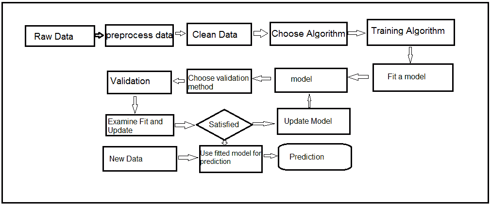
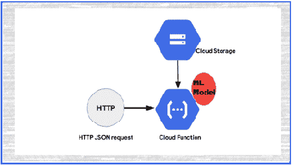
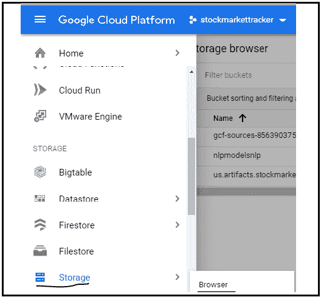
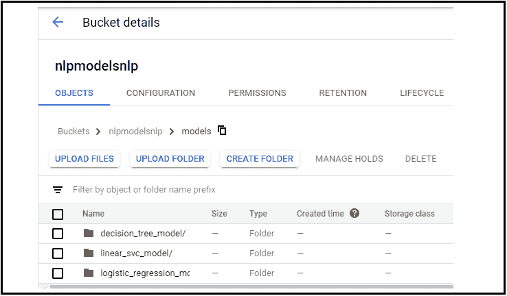
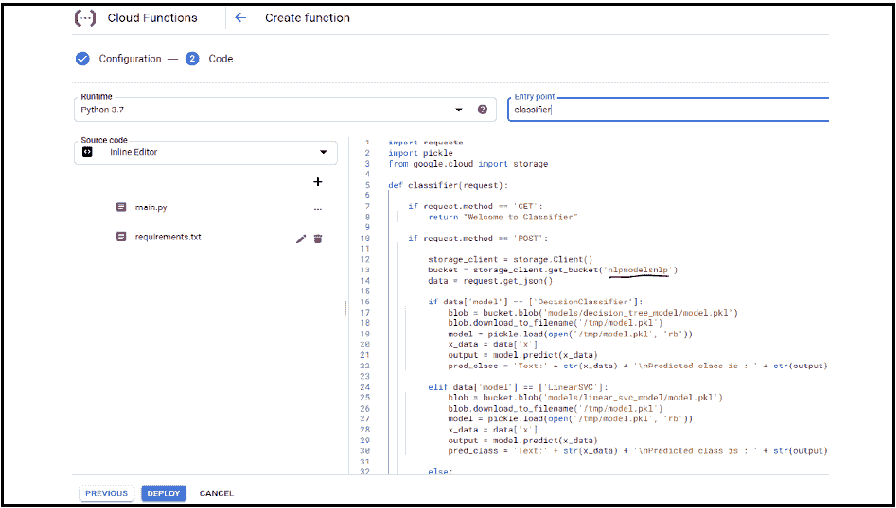
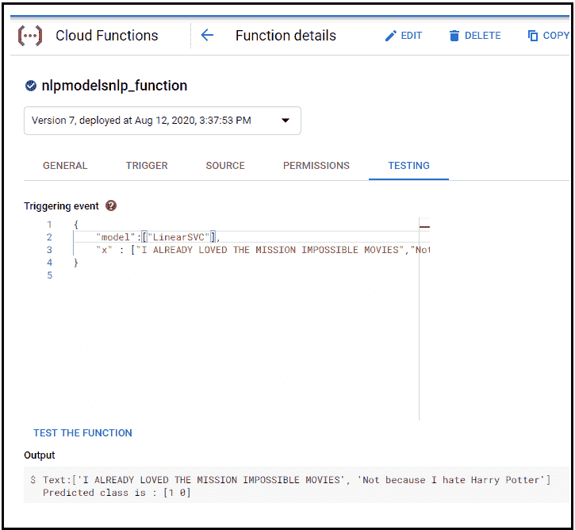

# 机器学习模型部署

> 原文：[`www.kdnuggets.com/2020/09/machine-learning-model-deployment.html`](https://www.kdnuggets.com/2020/09/machine-learning-model-deployment.html)

评论

**由 Asha Ganesh，数据科学家**

机器学习模型无服务器部署

### 什么是无服务器部署

无服务器计算是云计算的下一步。这意味着服务器在画面中被隐藏了。在无服务器计算中，服务器和应用程序的分离是通过使用平台来管理的。平台或无服务器提供者的责任是管理应用程序的所有需求和配置。这些平台在幕后管理服务器的配置。这就是在无服务器计算中，用户可以简单地专注于构建或部署的应用程序或代码本身的方式。

机器学习模型部署与软件开发不完全相同。在机器学习模型中，需要不断输入新数据以保持模型的良好性能。模型需要在现实世界中进行调整，因为有各种原因，如添加新类别、新级别等。部署模型只是开始，因为模型往往需要重新训练并检查其性能。因此，使用无服务器部署可以节省时间和精力，并且每次重新训练模型，这很酷！

机器学习工作流

模型在生产环境中的表现比在开发环境中差，需要在部署中寻找解决方案。因此，通过无服务器部署部署机器学习模型是很简单的。

### 理解无服务器部署的先决条件

+   对云计算的基本理解

+   对云函数的基本理解

+   机器学习

### 预测的部署模型

我们可以通过三种方式部署我们的机器学习模型：

+   像 Flask 和 Django 这样的网页托管框架等

+   无服务器计算 AWS Lambda、Google Cloud Functions、Azure Functions

+   特定于云平台的框架，如 AWS Sagemaker、Google AI Platform、Azure Functions

以各种方式部署模型

### 无服务器部署架构概述

图片来源并修改自 Google Cloud

将模型存储在 Google Cloud Storage 存储桶中，然后编写 Google Cloud Functions。使用 Python 从存储桶中检索模型，通过 HTTP JSON 请求，我们可以在 Google Cloud Function 的帮助下获得给定输入的预测值。

### **开始模型部署的步骤**

**1\. 关于数据、代码和模型**

以电影评论数据集进行情感分析，解决方案见[**这里**](https://github.com/Asha-ai/ServerlessDeployment/blob/65037f323cd5d32e52d9bae90f271ed1a59a2f6d/ServerlessDeployment.ipynb)在我的 GitHub 代码库中，**数据**也可以在同一代码库中找到。

**2\. 创建存储桶**

通过执行“**ServerlessDeployment.ipynb**”文件，你将获得 3 个 ML 模型：DecisionClassifier、LinearSVC 和 Logistic Regression。

点击 Storage 选项中的浏览器，创建新桶，如图所示：

创建存储桶

**3\. 创建新函数**

创建一个新桶，然后创建一个文件夹，并通过创建 3 个子文件夹将 3 个模型上传到该文件夹中，如图所示。

这里**models**是我的主文件夹名，我的子文件夹有：

+   **decision_tree_model**

+   **linear_svc_model**

+   **logistic_regression_model**

在 Google 存储中将模型存储在 3 个文件夹中

**4\. 创建函数**

然后前往 Google Cloud Functions 并创建一个函数，选择触发器类型为 HTTP，选择语言为 Python（你可以选择任何语言）：

创建云函数

**5\. 在编辑器中编写云函数**

在我的代码库中检查云函数。在这里，我已经导入了从 Google Cloud Bucket 调用模型所需的库，以及用于 HTTP 请求的其他库。

+   GET 方法用于测试 URL 响应，POST 方法

+   删除默认模板并粘贴我们的代码，然后**pickle**用于反序列化我们的模型

+   google.cloud — 访问我们的云存储功能。

+   如果传入请求是**GET**，我们仅返回“欢迎使用分类器”

+   如果传入请求是**POST**，则访问请求体中的 JSON 数据

+   GET JSON 实例化存储客户端对象并从存储桶中访问模型；在这里，我们的存储桶中有 3 个分类模型

+   如果用户指定“DecisionClassifier”，我们会从相应的文件夹中访问该模型，与其他模型类似

+   如果用户未指定任何模型，默认模型为 Logistic Regression

+   blob 变量包含对 model.pkl 文件的引用，以获取正确的模型

+   我们将 .pkl 文件下载到运行该云函数的本地机器上。现在每次调用可能在不同的虚拟机上运行，我们只能访问虚拟机上的 /temp 文件夹，这就是我们保存 model.pkl 文件的原因

+   我们通过调用 pkl.load 反序列化模型，以访问传入请求中的预测实例，并在预测数据上调用 model.predict

+   从无服务器函数返回的响应是原始文本，即我们要分类的评论和我们的预测类

+   在 main.py 后编写 requirement.txt，包含所需的库和版本

[谷歌云函数](https://github.com/Asha-ai/ServerlessDeployment/blob/master/cloud%20function)（图像不清晰，但为了理解目的在此提及）

**6\. 部署模型**

绿色勾选表示模型部署成功

**7\. 测试模型**

提供模型名称和测试的评价

用其他模型测试功能。

将为你提供该模型部署的完整 UI 细节。

### 代码参考：

我的 GitHub 仓库：[`github.com/Asha-ai/ServerlessDeployment`](https://github.com/Asha-ai/ServerlessDeployment)

不要犹豫，尽情点赞 :)

**简介：[Asha Ganesh](https://medium.com/@ashaicy99)** 是一名数据科学家。

[原文](https://medium.com/@ashaicy99/machine-learning-model-deployment-748e0c2437b8)。经授权转载。

**相关：**

+   使用 Python 和 Heroku 创建并部署你的第一个 Flask 应用

+   为什么要将 Scikit-learn 放入浏览器？

+   停止训练更多模型，开始部署它们

* * *

## 我们的三大课程推荐

 1\. [谷歌网络安全证书](https://www.kdnuggets.com/google-cybersecurity) - 快速进入网络安全职业生涯。

 2\. [谷歌数据分析专业证书](https://www.kdnuggets.com/google-data-analytics) - 提升你的数据分析技能

 3\. [谷歌 IT 支持专业证书](https://www.kdnuggets.com/google-itsupport) - 为你的组织提供 IT 支持

* * *

### 更多相关话题

+   [从数据收集到模型部署：数据科学项目的 6 个阶段](https://www.kdnuggets.com/2023/01/data-collection-model-deployment-6-stages-data-science-project.html)

+   [前 7 名模型部署和服务工具](https://www.kdnuggets.com/top-7-model-deployment-and-serving-tools)

+   [将机器学习算法全面部署到…](https://www.kdnuggets.com/2021/12/deployment-machine-learning-algorithm-live-production-environment.html)

+   [基础回顾第 4 周：高级主题与部署](https://www.kdnuggets.com/back-to-basics-week-4-advanced-topics-and-deployment)

+   [Segment Anything Model：图像分割的基础模型](https://www.kdnuggets.com/2023/07/segment-anything-model-foundation-model-image-segmentation.html)

+   [数据质量在成功机器学习模型中的重要性…](https://www.kdnuggets.com/2022/03/significance-data-quality-making-successful-machine-learning-model.html)
