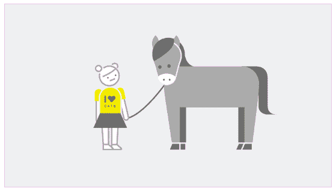

# 我的机器学习模型无法学习。我该怎么办？

> 原文：[`www.kdnuggets.com/2021/02/machine-learning-model-not-learn.html`](https://www.kdnuggets.com/2021/02/machine-learning-model-not-learn.html)

comments

**由 [Rosaria Silipo](https://www.linkedin.com/in/rosaria/)、KNIME 和 [Diego Arenas](https://www.linkedin.com/in/darenasc/)、圣安德鲁斯大学，英国**

* * *

## 我们的三大课程推荐

 1\. [谷歌网络安全证书](https://www.kdnuggets.com/google-cybersecurity) - 快速进入网络安全职业生涯。

 2\. [谷歌数据分析专业证书](https://www.kdnuggets.com/google-data-analytics) - 提升你的数据分析技能

 3\. [谷歌 IT 支持专业证书](https://www.kdnuggets.com/google-itsupport) - 支持你的组织在 IT 方面

* * *

如果你一般处理数据，特别是机器学习算法，你可能会对模型真的不愿意学习当前任务感到沮丧。你已经尝试了所有方法，但准确性指标就是无法提高。接下来怎么办？问题出在哪里？这是一个无法解决的任务还是有你未意识到的解决方案？

首先，不要担心。这种迷茫和不知道如何继续的感觉曾经发生过——并且仍然会发生——在所有人身上，即使是最有经验的机器学习专家也是如此。人工智能（AI）、数据科学或预测分析——无论名称如何——都比一系列预定义的步骤要复杂得多。选择合适的模型、成功的架构、最佳的超参数，强烈依赖于任务、数据领域和可用数据集。获得一个可行的 AI 模型仍然需要大量的手工调整，这部分解释了为什么一些数据科学家对许多宣称能够训练成功数据科学模型的自动化应用感到反感。

现在我们希望让你冷静下来，让我们看看你可以做些什么来解决这个困境。我们在这里提出了一些我们在模型训练似乎失控时使用的技巧。

在释放你的创造力之前，请进行一些尽职调查，确保你的训练过程没有明显的错误。这里有一个你可以使用的检查清单，以确保：

+   项目的目标清晰且定义明确，并与所有相关方一致。这意味着你的项目将回答一个明确的问题。

+   你的数据质量足够。

+   训练集的规模适合你尝试训练的模型架构。

+   你的训练过程并不太慢。如果你的训练集太大，你可以提取一个较小的样本进行训练

+   对于分类问题：所有类别在训练集中都有充分的描述。如果你有几个类别的表现非常低，你可以将它们合并为“其他”。如果你有太多类别，你可以尝试通过先进行聚类来减少它们的数量。

+   训练集和测试集之间没有数据泄露。

+   数据集中没有噪声/空属性、过多的缺失值或过多的异常值。

+   如果模型需要标准化，则数据已被标准化。

+   所有超参数已正确设置和优化，这意味着你了解算法。在使用技术之前总是要学习基础知识，你需要能够向利益相关者解释过程和结果。

+   评估指标对当前问题具有意义。

+   模型已经训练得足够长时间，以避免欠拟合。

+   模型不会对数据进行过拟合。

+   性能不好。对那些准确率为 100%或误差为 0%的模型要保持怀疑：这可能是模型存在问题的红旗，很可能数据集中包含了与你试图预测的目标变量同义的变量。

+   最后，你确定自己真的卡住了吗？有时，模型表现得很好，或者至少表现得相当好，而我们缺少的只是下一步。

如果出现了之前的任何错误，应迅速识别问题并实施解决方案。我们在这里提供了一些想法，以帮助你完成尽职调查列表，并在当前实现看似无望时提供创意灵感。

### 检查与业务目的的一致性。

大家都说这一点，我们也重复了。在继续进行之前，像推土机一样编写代码，确保你了解业务项目是什么。不同部门之间的语言不同。确保我们在开始之前了解所需内容。

例如，确保我们没有计划构建一个交通预测应用程序，而利益相关者期望的是一个自动驾驶汽车。显然，根据分配的时间和预算，交通预测应用程序更可能实现，而不是自动驾驶汽车。但正如我们所说，我们说着不同的语言。确保我们的目标一致。

一旦开始，我们就要定期寻求对中间里程碑的反馈。在未完成的应用程序中加入更改比在展示最终产品时看到利益相关者失望的表情要少得多。这种情况发生的频率比你想象的要高。

对原型的首个版本进行快速迭代，并尽早展示结果以获得及时反馈。

### 检查数据质量

如果你确信自己正在实施正确的应用程序，符合利益相关者的期望要求，那么问题可能出在数据上。因此，下一步是检查数据质量。对于任何数据科学任务，你需要足够的数据。

首先，数据必须具有代表性。如果是分类问题，则所有类别必须在其所有细微差别中得到充分表示。如果是数值预测问题，则数据集必须足够通用，以涵盖所有可预见的情况。如果数据质量不足（数据集太小或不够通用），以至于无法训练你正在尝试的模型，那么只有两个选项：你可以修订业务规格或收集更多、更通用的数据。

其次，数据领域的所有维度必须得到表示。所有必要的信息必须出现在某些输入属性中。确保你导入并预处理了所有属性。

探索使用特征工程技术添加特征。评估特征的有用性，并集中精力在这些特征上。你能否创建对模型影响更大的新特征？

接下来，确保删除错误过多、噪声过多或缺失值过多的列。这些列有可能影响算法并产生不令人满意的结果。在大数据时代，有一种观点认为数据越多越好，但这并不总是正确的。

还要确保训练集中的数据不会泄漏到评估集中。寻找重复记录；对时间序列分析执行严格的时间划分；确保数据收集的逻辑得到遵守。有些字段通常在目标变量之后记录。包括这些字段会泄露目标变量的值，从而导致对性能的度量不现实，并使部署应用不可行。我们记得有一个关于预测车祸死亡率的项目，其中“种族”字段仅在一些种族中填写，并且仅在死亡发生后填写。算法开始将较高的死亡可能性仅与某些种族相关联。嗯……确保你在数据收集过程的限制范围内操作。

### 探索模型大小和超参数

数据很好。业务目标很明确。我的算法仍然没有表现好。哪里出错了？现在是时候深入研究算法并调整一些超参数了。

+   机器学习模型的大小是一个重要的超参数。模型过小会导致欠拟合，但模型过大会导致过拟合。我们如何找到正确的中间点？为了自动完成这项任务，你可以使用正则化项、剪枝、丢弃技术和/或仅使用经典的验证集来监控进展。

+   如果你在项目中采用了深度学习神经网络，那么可以使用多种不同的单元，每种单元在处理特定类型的问题时都有所专长。如果你处理的是时间序列，并且需要算法记住过去的信息，那么递归神经单元、LSTM 单元或 GRU 可能比经典的前馈单元更合适。如果你处理的是图像，那么一系列卷积层可能有助于神经网络处理更好提取的图像特征。如果你处理的是异常情况，那么自编码器架构可能是一个有趣的替代方案，等等。

+   对于深度学习神经网络，激活函数的数量至少与神经单元的数量一样多。明智地选择。一些激活函数在某些情况下表现良好，而一些则不然。例如，我们通过实践了解到，虽然 ReLU 激活函数在深度学习社区中很受欢迎，但在自编码器中表现并不好。自编码器似乎更倾向于传统的 sigmoid 函数。

+   脱离神经网络，决策树和随机森林中的信息/熵度量是一个有趣的超参数，值得探索。

+   聚类算法中的簇的数量可以发现数据中的不同组。

还有许多其他机器学习算法也是如此。当然，调优模型的超参数的能力假设我们对算法及其控制参数有充分的了解。这就引出了下一个问题：我们是否理解我们正在使用的算法？

### 理解算法

随着易于使用的数据科学工具界面的普及，滥用算法也变得更容易了。然而，不要被迷惑！简单的图形用户界面并没有减少其背后的算法复杂性。我们已经看到在不够理解的算法中设置参数时出现了大量随机选择。有时候，最好的做法是坐下来深入学习核心算法或其变体背后的数学知识。

互联网充满了学习资料，包括课程、视频和博客文章。尽量利用这些资源！不时停下来，花些时间深入了解，个人或团队都可以。

从项目的规划阶段开始，考虑测试或尝试新的事物（例如软件、技术、算法等）。利用项目的空间来获得一些额外的经验。通过这种方式，组织内部的知识可以得到扩展，并推动创新。这将是对未来的投资。保留一个想法的待办清单，记录下如果有更多时间你会做什么。当项目顺利时，这个待办清单可以帮助你在利益相关者希望了解更多实施细节时，或者当项目效果不佳时，你需要一个潜在活动的清单以便在之后开展。

这里有一个提示。在进行项目的同时，要关注组织文化。项目中的相关因素往往是参与人员，而这些人创造了公司的内部文化。因此，请确保你为组织创建了正确的文化，并在项目中找到了合适的人。

### 搜索现有解决方案

要成功训练机器学习模型，你需要理解算法，这当然很重要。你还需要应用所有那些选择的算法所需或避免的技巧和技巧：规范化、洗牌、编码和其他类似操作。其他数据科学家可能已经实现了类似的解决方案，因此：

不要重新发明轮子！搜索现有的类似任务解决方案并将其适应于你的项目。搜索不仅限于书籍和科学文章，还要查阅博客和代码库，并与同事交流。确保你采用和重用先前项目中的成功想法。特别是同事们是获取材料、提示和想法的极佳来源。愿意回报并分享你的工作，接受有意义的反馈。甚至可以组织审查会议，让你的同事利用他们的经验和创造力来帮助你。

不要将自己局限于相同领域中类似任务的解决方案。跨领域的知识交流具有很大优势。实际上，机械引擎中的异常检测和信用卡交易中的欺诈检测往往共享相同的技术。阅读不同领域的成果。如果你在进行欺诈检测，不要害怕参加化学领域的网络研讨会。你永远不知道你会从中获得什么灵感。

### 接下来做什么？

数据科学项目不仅仅是训练一个算法。确保所有部分能够组合成成功的解决方案，还有更多工作。在训练算法之前，我们需要适当地准备数据。即使在训练和测试算法之后，我们也需要根据算法的响应触发一些操作。项目往往在获得结果后不知道该怎么办而陷入困境。

如果我们建立一个流失预测器，我们需要实施行动，例如对高风险流失客户的活动或呼叫中心的回应。如果我们分析社交媒体上的影响者及其帖子，我们需要制定策略来接触他们。如果我们构建一个聊天机器人，我们需要知道将其集成到最终应用程序中的位置。如果我们建立一个自动翻译器，我们需要在对话中的另一方听到之前插入它。如果我们建立一个异常检测器，我们需要安排它定期运行，以及时发现机械链中的问题。

当我们达到这一部分时，需要做好准备。我们需要考虑基于项目洞察的行动和决策，并为采取下一步做好准备。

### 停下来，深呼吸

如果你尝试了所有这些方法，模型仍然无法学习到可接受的错误水平，那么就停下来，休息一天，与工作保持一定距离，然后以清新的心态重新回到工作中。这在许多情况下对我们有效。

不要放弃！

机器学习模型在工作时很出色，但使它们工作并不是一项简单的任务。与机器学习问题本身类似，找出具体问题所在并改进是一个多维的问题。我们希望我们为你提供了一些想法，以帮助你摆脱模型无法改进的困境。

然而，如果你确定模型架构已正确实施，训练集足够通用，评估指标合适，模型训练时间充足且没有过拟合数据，如果你已经对应用进行了尽职调查并未发现任何问题，那么问题可能更为普遍。也许模型不合适，也许预处理不适合那种数据，或者其他基本缺陷影响了你的过程。是时候深入阅读和探索了！

我们给你的总体建议是不断尝试，不要因为模型第一次不工作就放弃。在实施几个模型和经过几次试验与错误后，你将成为专家，届时我们也希望听到你的经验。

**相关：**

+   生产机器学习监控：异常值、漂移、解释器和统计性能

+   2021 年你应该了解的所有机器学习算法

+   MLOps：模型监控基础

### 更多主题

+   [机器学习为什么不能为我的业务创造价值？](https://www.kdnuggets.com/2021/12/machine-learning-produce-value-business.html)

+   [学习数据科学基础需要多长时间？](https://www.kdnuggets.com/2022/03/long-take-learn-data-science-fundamentals.html)

+   [为什么不应该过度使用 Python 中的列表推导式](https://www.kdnuggets.com/why-you-should-not-overuse-list-comprehensions-in-python)

+   [ETL 与机器学习有什么关系？](https://www.kdnuggets.com/2022/08/etl-machine-learning.html)

+   [每位工程师都应该也可以学习机器学习](https://www.kdnuggets.com/2022/06/corise-every-engineer-learn-machine-learning.html)

+   [数据科学家做什么？](https://www.kdnuggets.com/2021/12/what-does-a-data-scientist-do.html)
