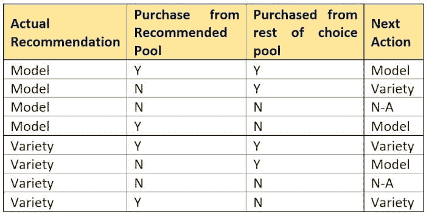

# 通过多样性增强机器学习个性化

> 原文：[`www.kdnuggets.com/2021/08/machine-learning-personalization-variety.html`](https://www.kdnuggets.com/2021/08/machine-learning-personalization-variety.html)

评论

**作者：[Raghavan Kirthivasan](https://www.linkedin.com/in/raghavankirthivasan/)，Epsilon India 数据科学总监，以及 [Anuj Chaturvedi](https://www.linkedin.com/in/a-chaturvedi/)，Epsilon India 领先数据科学家**。

*[来源](https://medium.com/fiverr-engineering/personalizing-fiverr-from-machine-learning-to-user-experience-2279ee777040)*

企业通常会运行持续 8 到 10 周的营销活动，每周向可达的客户群发送电子邮件。由于客户的购买模式取决于产品目录中的产品性质，到下一次购买的时间通常为一个月或更长，具体取决于类别。因此，对于大多数客户来说，每周活动中发送的内容通常是相同的，因为基于历史数据的模型推荐不会每周变化。因此，3 到 4 周的推荐停滞可能导致糟糕的客户体验。

另一方面，基于购买频率，发送内容类似的电子邮件也可以作为提醒，以防客户错过了之前的邮件。因此，发送重复的电子邮件并提供相同的推荐也可能导致收入增加。

本文探讨了通过电子邮件发送的内容个性化，例如 SKU、产品、类别等的优惠，并概述了如何利用多样性的概念。

## 期望状态和限制

理想的情况是，我们可以在每周级别而非每月级别向客户展示更多选项，通过机器学习模型的推荐来改善整体客户体验，而不牺牲投资回报率。我们还将讨论在活动中引入这种策略的理想阶段。

这个想法是设计一种策略，在可能的情况下引入推荐的多样性，以便模型推荐不变，活动提升不会受到影响。

如前所述，由于机器学习模型的推荐通常不会频繁变化，想法是识别出机器学习模型推荐的前 3 或 4 个类别之外的类别，这些类别客户最有可能购买，同时不牺牲投资回报率。

## 提议解决方案

假设有 50 个类别被指定用于活动。这些类别是客户希望向他们的客户发送电子邮件并告知他们有关这些类别的折扣的类别。我们称这组类别为“***选择池***”。

数据科学团队的期望是识别出客户最有可能在“***选择池***”中购买的前 3 或 4 个类别。在构建模型时，模型将对选择池中的所有类别进行排序，从中选择前 3 或 4 个类别，我们将通过电子邮件发送这些类别。

多样性不是针对客户即将购买的商品进行优化，而是建议客户可能购买的额外产品。

## 引入多样性

根据我们在解决问题的阶段，关于引入多样性可以采取各种行动。将问题进一步拆解成以下问题更为合理：

+   何处引入多样性？

+   何时引入多样性？

+   如何引入多样性？

我们将尝试单独讨论并找出这些问题的潜在答案。

### 何处引入多样性？

这将帮助我们识别哪些客户可能需要在推荐中提供多样性。根据模型生命周期的不同阶段，回答这个问题的策略可能会有所变化。

**部署前**

在模型投入生产之前，有一系列维度可以帮助我们识别在推荐中混合多样性的良好策略。

1.  **选择推荐的模型强度：** 这可以通过分析模型对池中不同选择的概率差异来理解。差异越大，模型在识别客户相关选择集时越自信。

1.  **客户的历史选择池：** 客户已购买的选择集合或客户的历史记录

下表结合了这两个方面，并尝试基于不同组合识别一系列行动：

上述策略可以在模型投入生产前进行探索。但在此之后，我们需要关注模型上线后如何做出决策。

**部署后**

一旦模型投入生产，我们将拥有一个重要的额外信息，即客户的实际选择如何与模型推荐相比。这些新信息在进一步细化哪些客户更可能通过多样性推荐受到积极影响时可能非常重要。

可能有不同的方法来使用这些信息和做出决策。以下是一种利用客户实际购买行为识别可能从多样性推荐中受益的客户集的方法。

### 何时引入多样性？

由于将多样性融入推荐在所有场景中可能不起作用，我们尝试寻找引入多样性似乎合乎逻辑的活动标准。

1.  **广告长度：** 在处理长时间的广告时，引入推荐的多样性似乎很合适，因为客户会多次接触广告，从而有机会在多个邮件中看到相同的推荐。

1.  **广告运行时间在引入多样性之前：** 在引入推荐的多样性之前，需要给广告一些时间成熟，因为初始结果可能无法提供准确的反馈。大约 2 到 3 周的时间似乎是一个好的选择，这样可以让广告成熟后再引入多样性，并使我们能做出更明智的决策。

1.  **选择池大小：** 选择池中的选择数量在多样性相关决策中扮演着重要角色。在选择池非常小的情况下，多样性的决策变得不重要，因为可以尝试的选项很少。选择池有 20 个选项似乎是一个不错的起点。我们也可以从剩余选项的百分比来考虑，例如，我们需要从 20 个选项池中推荐 4 个选项，这样在第一次推荐周期后，我们还剩下 80%的选项。

### 如何引入多样性？

在模型推荐由于某些原因未随时间变化的情况下，有许多方法可以将多样性融入推荐中。我们将探讨一些技术和基于启发式的方法。

**市场篮子分析**

这是引入多样性的技术方法之一，基于关联规则挖掘。关联规则挖掘是一种识别一起购买的产品对之间关联强度的技术，并识别共现模式。共现是指两个或更多事物同时发生。关联规则不是提取个人偏好，而是寻找每个独立交易中元素集之间的关系。

通俗来说，市场篮子分析（MBA）识别通常一起购买的产品组合。

一种方法是利用模型找到购买概率最高的选择，然后使用 MBA 识别与模型推荐选择关联度最高的产品组合，并将这些选择作为推荐选择。

我们现在将看一些基于启发式的方法来增加推荐的多样性。

**基于价格的多样性**

一种基于规则的方法是将价格作为将选择分组的基础。这种分类方法使我们能够从整个价格范围内向客户提供推荐。

我们可以选择每个价格组中模型购买概率最高的选项，并提供尚未呈现给相应客户的选项，从而提供多样性。这种方法还可以帮助理解提供不同价格选项的多样性是否与客户群体相契合。

**基于产品类别的多样性**

另一种可以遵循的基于规则的方法是使用业务定义的选择类别作为选择的基础，并在不同类别之间提供多样性。类似于最后的策略，我们可以从尚未呈现给相应客户的每个选择类别中展示模型预测概率最高的选项。

## 结论与未来展望

通过本文，我们尝试探讨了目前推荐模型中遇到的一个非常实际的问题。

可以在个性化推荐由于各种原因在每次发送时不会变化的情况下引入多样性。我们已经讨论了在不牺牲广告效果的情况下引入多样性的方法。

上述讨论的策略是基于分析和启发式方法的混合，应该作为企业在个性化推荐时遇到的任何类似问题的起点。下一步可能因项目而异，具体取决于在利用这一方法后所获得的初步结果。

**参考文献**

[市场篮子模型的解释](https://webfocusinfocenter.informationbuilders.com/wfappent/TLs/TL_rstat/source/marketbasket49.htm)，信息构建者。

**个人简介：** [拉贾凡·基尔提瓦桑](https://www.linkedin.com/in/raghavankirthivasan/) 是 Epsilon India 的数据科学总监。他在数据科学/分析方面拥有 18 年的经验，具备市场营销/风险管理和欺诈分析的职能专长，涵盖多个地区（美国、英国、亚太地区）。在他之前的 WNS、AIG 和 Epsilon Agency 的职位中，拉贾凡培养了数据科学团队。

[阿努杰·查图尔维迪](https://www.linkedin.com/in/a-chaturvedi/) 是 Epsilon India 的首席数据科学家。他在数据科学领域拥有近 9 年的经验，利用各种数据资产支持包括数字体验、客户、营销和定价在内的不同业务领域。他目前在 Epsilon 担任首席数据科学家，开发旨在提升数字空间客户体验的机器学习解决方案。

**相关：**

+   [分析个性化结果](https://www.kdnuggets.com/2018/06/analyzing-personalization-results.html)

+   [一种不妥协的隐私保护个性化服务方法](https://www.kdnuggets.com/2019/01/privacy-preserving-personalized-services.html)

+   [概述推荐系统](https://www.kdnuggets.com/2020/07/recommender-systems-nutshell.html)

* * *

## 我们的前三个课程推荐

 1\. [谷歌网络安全证书](https://www.kdnuggets.com/google-cybersecurity) - 快速进入网络安全职业生涯

 2\. [谷歌数据分析专业证书](https://www.kdnuggets.com/google-data-analytics) - 提升你的数据分析技能

 3\. [谷歌 IT 支持专业证书](https://www.kdnuggets.com/google-itsupport) - 支持你的组织进行 IT 管理

* * *

### 了解更多此话题

+   [增强 LLM 推理：揭示代码链提示](https://www.kdnuggets.com/enhancing-llm-reasoning-unveiling-chain-of-code-prompting)

+   [通过 Apache Gobblin 扩展数据管理](https://www.kdnuggets.com/2023/01/scaling-data-management-apache-gobblin.html)

+   [探索思维树提示：AI 如何通过搜索学习推理…](https://www.kdnuggets.com/2023/07/exploring-tree-of-thought-prompting-ai-learn-reason-through-search.html)

+   [数据讲述 - 通过数据讲述故事的艺术](https://www.kdnuggets.com/2023/07/manning-data-storytelling-the-art-telling-stories-data.html)

+   [通过链式验证解锁可靠生成：一种…](https://www.kdnuggets.com/unlocking-reliable-generations-through-chain-of-verification)

+   [每个机器学习工程师应具备的 5 项机器学习技能…](https://www.kdnuggets.com/2023/03/5-machine-learning-skills-every-machine-learning-engineer-know-2023.html)
