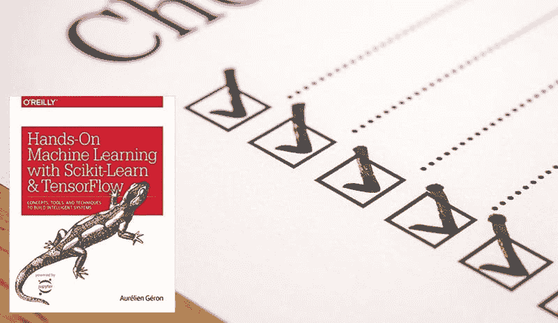

# 机器学习项目检查清单

> 原文：[`www.kdnuggets.com/2018/12/machine-learning-project-checklist.html`](https://www.kdnuggets.com/2018/12/machine-learning-project-checklist.html)

 评论

我认为将各种对特定过程的解释进行编纂和比较，以加强自己对该过程的解释是一项值得的活动。我以前曾对我们可以称之为机器学习过程的替代解释进行过类似的操作（这些过程可以在一定程度上与数据科学或数据挖掘过程密切相关），你可以在这里、这里 和这里找到例子。

* * *

## 我们的三大课程推荐

 1\. [Google 网络安全证书](https://www.kdnuggets.com/google-cybersecurity) - 快速开启网络安全职业生涯。

 2\. [Google 数据分析专业证书](https://www.kdnuggets.com/google-data-analytics) - 提升你的数据分析能力

 3\. [Google IT 支持专业证书](https://www.kdnuggets.com/google-itsupport) - 支持你在 IT 方面的组织

* * *

之前的帖子讨论了经典的 CRISP-DM 模型、KDD 过程、Francois Chollet 的 4 步模型（虽然针对 Keras，但可以推广）、Yufeng Guo 的 7 步机器学习方法，甚至还包括专门针对更窄学科的修改，例如基于文本的数据科学任务框架。为了进一步完善我们的内部模型，本文将概述 Aurélien Géron 的《机器学习项目检查清单》，如他畅销书《[动手学机器学习：Scikit-Learn 和 TensorFlow](https://www.amazon.com/Hands-Machine-Learning-Scikit-Learn-TensorFlow/dp/1491962291/)》中所见。它类似于 Guo 的 7 步过程，但在细微的更高层次上呈现；它被展示为一个处理项目的检查清单，因此感觉更具描述性而非规定性，提醒你在做的过程中该做什么，而不是一些宏大的解释说明你为何这样做。这是一个没有判断的观察。

以下是 Géron 检查清单的简要概述。我谦逊地建议尚未阅读 Géron 书籍的任何人查看一下，以获取更多针对初学者和从业者的有用信息。

**1\. 确定问题**

这第一步是定义目标的地方。Géron 用商业术语来描述目标，但这并不是严格必要的。然而，理解机器学习系统解决方案最终将如何使用是很重要的。这一步也是讨论可比场景和当前问题的权宜之计的地方，同时还要考虑假设，并确定对人类专业知识的需求程度。在这一阶段需要框定的其他关键技术项目包括确定适用的机器学习问题类型（有监督、无监督等），以及采用适当的性能指标。

**2. 获取数据**

这一步以数据为中心：确定需要多少数据，什么类型的数据，数据从哪里获取，评估获取数据的法律义务……然后获取数据。一旦你获得了数据，确保它经过适当的匿名化，确保你知道它实际是什么类型的数据（时间序列、观察、图像等），将数据转换为你所需的格式，并根据需要创建训练集、验证集和测试集。

**3. 探索数据**

检查清单中的这一步类似于通常所说的探索性数据分析（EDA）。目标是尝试在建模之前从数据中获得洞察。回想一下，在第一步中需要识别和探索关于数据的假设；这是更深入调查这些假设的好时机。在这一步中，人类专家可以特别有用，他们可以回答关于相关性的问题，这些问题可能对于机器学习从业者来说并不明显。在这里进行特征及其特征的研究，同时也进行特征及其值的总体可视化（例如，通过箱线图比通过数值查询更容易快速识别异常值）。记录你探索的发现以备后用是一种良好的做法。

**4. 准备数据**

现在是应用你在上一步中识别出的值得进行的数据转换的时候了。这一步还包括你将执行的任何数据清理，以及特征选择和工程。任何用于值标准化和/或归一化的特征缩放也将在此进行。

**5. 建模数据**

是时候对数据建模，并将初始模型集缩减到看似最有前景的那一批。（这类似于 Chollet 过程中的第一个建模步骤：好的模型→“过于优秀”的模型，你可以在这里阅读更多）这些尝试可能涉及使用完整数据集的样本来促进初步模型的训练，这些模型应涵盖广泛的类别（树模型、神经网络、线性模型等）。应构建、测量和比较模型，调查每个模型所犯的错误类型，以及每种算法使用的最重要特征。应将表现最佳的模型入围，然后可以进行进一步微调。

**6\. 微调模型**

入围的模型现在应该对其超参数进行微调，并且在此阶段应调查集成方法。如果在前一建模阶段使用了数据集样本，则在此步骤中应使用完整数据集；没有经过全部训练数据或与其他同样经过全部训练数据的模型比较的微调模型不应被选为“优胜者”。另外，你没有过度拟合，对吧？

**7\. 提出解决方案**

现在是展示的时候了，因此希望你的可视化技能（或实施团队中某个人的技能）达到标准！这是一个技术含量较低的步骤，但此时确保系统技术方面的适当文档记录也很重要。回答相关方的问题：*相关方是否理解整体情况？解决方案是否达到了目标？你是否传达了假设和局限性？* 这本质上是一个销售推介，因此要确保其收获是对系统的信心。如果结果不被理解和采纳，那为什么要做这些工作呢？

**8\. 启动机器学习系统**

使机器学习系统准备好投入生产；它需要被接入某个更广泛的生产系统或战略中。作为一个软件解决方案，它在投入运行前需要进行单元测试，并且一旦启动后应该得到适当的监控。在这个过程中，基于新数据或更新数据对模型进行再训练也是其中的一部分，即使在早期步骤中已经考虑过这一点，也应予以重视。

**相关**：

+   接近机器学习过程的框架

+   Keras 四步工作流程

+   数据科学过程的重新发现

### 更多相关话题

+   [成为优秀数据科学家所需的 5 项关键技能](https://www.kdnuggets.com/2021/12/5-key-skills-needed-become-great-data-scientist.html)

+   [每个初学者数据科学家应该掌握的 6 种预测模型](https://www.kdnuggets.com/2021/12/6-predictive-models-every-beginner-data-scientist-master.html)

+   [2021 年最佳 ETL 工具](https://www.kdnuggets.com/2021/12/mozart-best-etl-tools-2021.html)

+   [停止学习数据科学以寻找目标，然后找目标来…](https://www.kdnuggets.com/2021/12/stop-learning-data-science-find-purpose.html)

+   [学习数据科学统计的顶级资源](https://www.kdnuggets.com/2021/12/springboard-top-resources-learn-data-science-statistics.html)

+   [成功数据科学家的 5 大特征](https://www.kdnuggets.com/2021/12/5-characteristics-successful-data-scientist.html)
