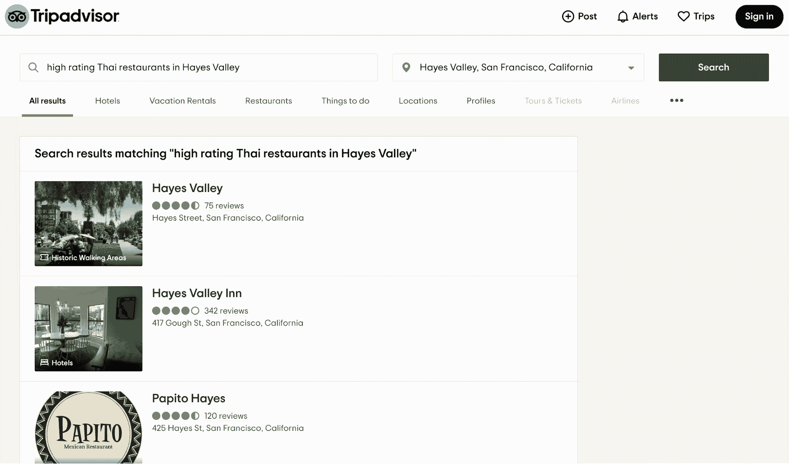
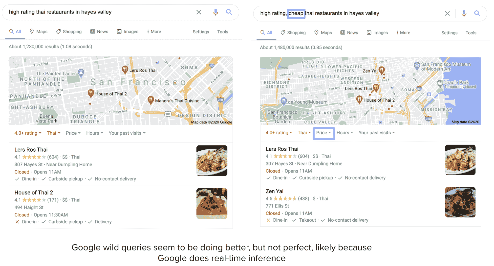
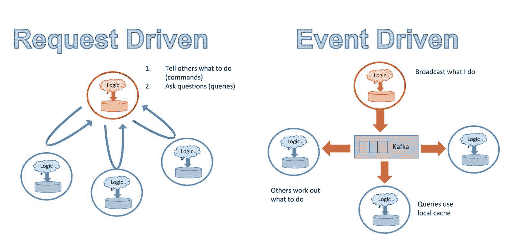
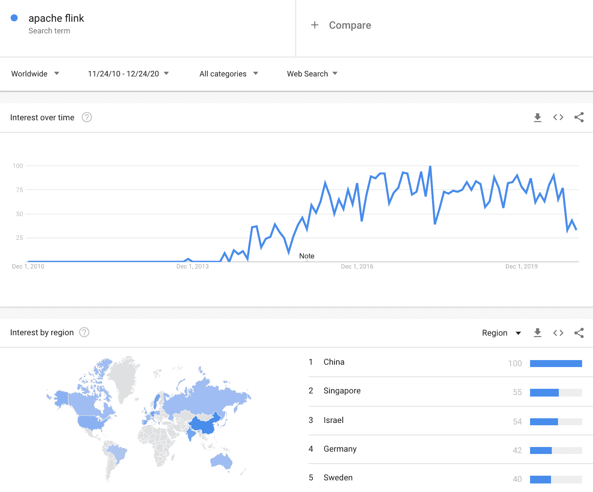
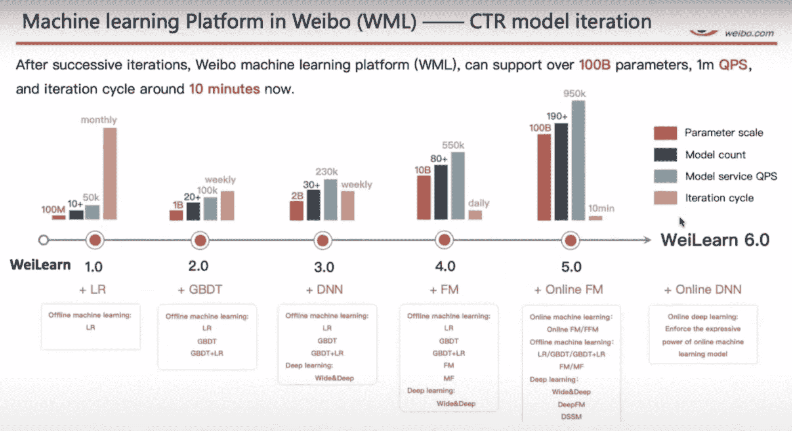

# 机器学习正在走向实时

> 原文：[`www.kdnuggets.com/2021/01/machine-learning-real-time.html`](https://www.kdnuggets.com/2021/01/machine-learning-real-time.html)

评论

**由[Chip Huyen](https://huyenchip.com/)撰写，Snorkel AI 的 ML 生产，斯坦福大学讲师**。

在与来自美国、欧洲和中国主要互联网公司的机器学习和基础设施工程师交流后，我注意到两个公司群体。一个群体在基础设施上投入了大量资金（数亿美元），以实现实时机器学习，并且已经看到了投资回报。另一个群体仍在怀疑实时机器学习是否有价值。

对于实时机器学习的定义似乎没有一致的看法，也没有很多关于它在行业中如何实现的深入讨论。在这篇文章中，我想分享一下在与大约十家公司交流后，我学到的东西。

本文将介绍两个实时机器学习的级别。

+   Level 1：你的机器学习系统实时进行预测（在线预测）。

+   Level 2：你的系统可以实时地（在线学习）纳入新数据并更新模型。

我使用“模型”来指代机器学习模型，使用“系统”来指代围绕它的基础设施，包括数据管道和监控系统。

### Level 1：在线预测——你的系统可以实时进行预测

> ***实时***在这里定义为在毫秒到秒的范围内。

**用例**

延迟很重要，特别是对于用户面向的应用程序。在 2009 年，谷歌的实验表明，[将网页搜索延迟增加 100 到 400 毫秒会使用户每天的搜索次数减少 0.2%到 0.6%](https://services.google.com/fh/files/blogs/google_delayexp.pdf)。在 2019 年，[Booking.com 发现延迟增加 30%大约会导致 0.5%的转化率下降——“这是对我们业务的一个相关成本。”](https://blog.acolyer.org/2019/10/07/150-successful-machine-learning-models/)

无论你的机器学习模型多么出色，如果它们在预测时仅仅多花费了几毫秒，用户就会去点击其他东西。

**批量预测的问题**

一种非解决方案是避免在线进行预测。你可以离线批量生成预测，存储它们（例如，存储在 SQL 表中），并在需要时提取预先计算好的预测结果。

当输入空间是有限的时，这种方法可以奏效——你确切知道有多少个可能的输入需要进行预测。一个例子是当你需要为用户生成电影推荐时——你确切知道有多少用户。因此，你可以定期（例如每几小时）为每个用户预测一组推荐结果。

为了使用户输入空间有限，许多应用程序要求用户从类别中选择，而不是输入任意查询。例如，如果你访问 TripAdvisor，你首先必须选择一个预定义的大都市区域，而不能直接输入任何位置。

这种方法有许多限制。TripAdvisor 的结果在其预定义类别中还不错，如**“餐厅”**在**“旧金山”**，但当你尝试输入诸如**“海斯谷高评分泰国餐厅”**这样的任意查询时，效果就很差。

批量预测所造成的限制即使在像 Netflix 这样的技术进步公司中也存在。比如你最近看了很多恐怖片，所以当你第一次登录 Netflix 时，恐怖片占据了推荐列表。但今天你心情不错，于是你搜索“喜剧”并开始浏览喜剧分类。Netflix 应该学习并在你的推荐列表中显示更多喜剧内容，对吗？但它不能在下一次生成批量推荐之前更新列表。

在上述两个例子中，批量预测导致用户体验下降（这与用户参与度/保留度密切相关），而非灾难性失败。其他例子包括广告排名、Twitter 的热门话题排名、Facebook 的新闻动态排名、到达时间估算等。

还有许多应用程序如果没有在线预测，将导致灾难性的失败或根本无法正常工作。例如，高频交易、自动驾驶汽车、语音助手、使用面部/指纹解锁手机、老年人跌倒检测、欺诈检测等。能够检测到三小时前发生的欺诈交易总比根本无法检测到要好，但能够实时检测到可以防止欺诈交易的发生。

从批量预测切换到实时预测可以让你使用动态特征来做出更相关的预测。静态特征是变化缓慢或很少变化的信息——如年龄、性别、职业、邻里等。动态特征是基于当前发生的事情——如你正在观看的内容、你刚刚点赞的内容等。了解用户现在的兴趣将使你的系统能够做出更相关的推荐。

**解决方案**

为了使你的系统能够进行在线预测，它必须具备两个组件：

1.  快速推断：一个能够以毫秒级别做出预测的模型。

1.  实时管道：一个可以实时处理数据、输入模型并返回预测结果的管道。

+   **快速推断**

当一个模型过于庞大并且预测时间过长时，有三种方法可以解决：

1.  **加快模型速度（推断优化）**

例如，融合操作、分布计算、内存占用优化、编写针对特定硬件的高性能内核等。

1.  **使模型更小（模型压缩）**

起初，这一系列技术旨在使模型更小，以便适应边缘设备。使模型更小通常会使其运行更快。模型压缩的最常见通用技术是量化，例如，使用 16 位浮点数（半精度）或 8 位整数（定点）代替 32 位浮点数（全精度）来表示模型权重。在极端情况下，有些人尝试了 1 位表示（二进制权重神经网络），例如，[BinaryConnect](https://arxiv.org/abs/1511.00363)和[Xnor-Net](https://arxiv.org/abs/1603.05279)。Xnor-Net 的作者创办了 Xnor.ai，这是一家专注于模型压缩的初创公司，该公司已被[苹果以 2 亿美元的价格收购](https://www.geekwire.com/2020/exclusive-apple-acquires-xnor-ai-edge-ai-spin-paul-allens-ai2-price-200m-range/)。

另一种流行的技术是[知识蒸馏](https://arxiv.org/abs/1503.02531)——一个小模型（学生）被训练以模仿一个较大的模型或模型集合（教师）。尽管学生通常是通过预训练的教师进行训练，但两者也可以同时训练。一个在生产中使用的蒸馏网络的例子是[DistilBERT](https://arxiv.org/abs/1910.01108)，它将 BERT 模型的大小减少了 40%，同时保留了 97%的语言理解能力，并且运行速度快了 60%。

其他技术包括剪枝（找出对预测最不重要的参数并将其设置为 0）和低秩分解（用紧凑的块替换过度参数化的卷积滤波器，以减少参数数量并提高速度）。详见[A Survey of Model Compression and Acceleration for Deep Neural Networks](https://arxiv.org/abs/1710.09282)（Cheng et al. 2017）。

关于模型压缩的研究论文数量正在增长。现成的工具也在不断增加。Awesome Open Source 有一个列表，[前 40 名模型压缩开源项目](https://awesomeopensource.com/projects/model-compression)。

1.  **使硬件更快**

这是另一个蓬勃发展的研究领域。大型公司和初创公司都在竞相开发硬件，以使大型机器学习模型在云端以及尤其在设备上更快地进行推理，甚至训练。IDC 预测，到 2020 年，边缘和移动设备进行推理的总量将[达到 37 亿台，而进一步有 1.16 亿台进行训练](https://www.arm.com/-/media/global/solutions/artificial-intelligence/ai-ml-on-cpu-whitepaper.pdf?revision=17a2b30b-0f5a-4a42-8681-3d9f3f94e513)。

+   **实时管道**

假设你有一个共享打车应用，并且想要检测欺诈交易，例如使用被盗信用卡进行的支付。当真正的信用卡持有者发现未经授权的支付时，他们会与银行争议，你需要退款。为了最大化利润，欺诈者可能会连续打车或者使用多个账户进行打车。2019 年，商家估计欺诈交易占其年度在线销售的平均[27%](https://network.americanexpress.com/globalnetwork/dam/jcr:09c34553-b4a2-43ca-bf3e-47cbc911ea51/American%20Express%202019%20Digital%20Payments%20Survey_Insights%20Paper.pdf)。你检测到被盗信用卡的时间越长，损失的钱就越多。

要检测交易是否欺诈，仅仅查看该交易是不够的。你需要至少查看涉及该交易的用户的近期历史、他们在应用内的最近行程和活动、信用卡的近期交易以及其他同时发生的交易。

为了快速访问这些信息，你需要尽可能将它们保存在内存中。每当发生你关心的事件——用户选择位置、预订行程、联系司机、取消行程、添加信用卡、删除信用卡等——这些事件的信息会进入你的内存存储。信息会保留在内存中直到它们仍然有用（通常为几天），然后要么进入永久存储（例如 S3），要么被丢弃。最常用的工具是[Apache Kafka](https://github.com/apache/kafka)，还有如 Amazon Kinesis 这样的替代品。Kafka 是一个流存储：它存储数据的同时流入。

流数据与静态数据不同——静态数据是指已经存在于某个地方的完整数据，如 CSV 文件。当读取 CSV 文件时，你知道何时任务完成。而数据流是不会结束的。

一旦你有了处理流数据的方法，你就需要提取特征以输入到你的机器学习模型中。在流数据的特征基础上，你可能还需要静态数据的特征（例如账户创建时间、用户评分等）。你需要一个工具，能够处理流数据和静态数据，并将它们从各种数据源中整合在一起。

**流处理与批处理**

人们通常使用“批处理”来指代静态数据处理，因为你可以将数据分批处理。这与“流处理”相对，后者处理每个到达的事件。批处理是**高效的**——你可以利用 MapReduce 等工具处理大量数据。流处理是**快速的**，因为你可以在数据到达时立即处理。Apache Flink 的 PMC 成员 Robert Metzger 争辩说流处理的效率可以和批处理一样高，因为[批处理是流处理的一个特殊情况](https://www.ververica.com/blog/batch-is-a-special-case-of-streaming)。

处理流数据更为困难，因为数据量是不受限的，而且数据以不同的速率和速度到达。让流处理器进行批处理要比让批处理器进行流处理容易。

Apache Kafka 具备一定的流处理能力，一些公司在其 Kafka 流存储之上利用这一能力，但 Kafka 的流处理在处理各种数据源方面能力有限。已有努力将 SQL 这一流行的用于静态数据表的查询语言扩展以处理数据流[[1](http://cs.brown.edu/~ugur/streamsql.pdf), [2](https://en.wikipedia.org/wiki/StreamSQL)]。然而，最流行的流处理工具是[Apache Flink](https://github.com/apache/flink)，它原生支持批处理。

在机器学习生产的早期阶段，许多公司在其现有的 MapReduce/Spark/Hadoop 数据管道上构建了 ML 系统。当这些公司需要进行实时推断时，他们需要为流数据建立一个独立的管道。

拥有两个不同的数据处理管道是机器学习生产中常见的错误原因，例如，一个管道中的变化没有在另一个管道中正确复制，导致两个管道提取出不同的特征集。如果两个管道由两个不同的团队维护，这种情况尤其常见，例如，开发团队维护用于训练的批处理管道，而部署团队维护用于推断的流处理管道。包括[Uber](https://www.infoq.com/presentations/sql-streaming-apache-flink/)和[微博](https://www.youtube.com/watch?v=WQ520rWgd9A&ab_channel=FlinkForward)在内的公司已经进行了重大基础设施改革，以通过 Flink 统一他们的批处理和流处理管道。

**事件驱动 vs. 请求驱动**

过去十年，软件世界已经转向了微服务架构。这个理念是将业务逻辑拆分成小组件——每个组件都是一个独立的服务——以便于独立维护。每个组件的拥有者可以快速更新和测试该组件，而无需咨询系统的其余部分。

微服务通常与 REST 密切相关，REST 是一组让这些微服务进行通信的方法。REST API 是请求驱动的。客户端（服务）通过 POST 和 GET 等方法发送请求，以告诉服务器确切要做什么，服务器则以结果回应。服务器必须监听请求才能使请求注册。

因为在请求驱动的世界里，数据通过对不同服务的请求来处理，没有人能够概览数据如何在整个系统中流动。考虑一个简单的有 3 个服务的系统：

+   A 管理司机的可用性

+   B 管理乘车需求

+   C 预测每次客户请求乘车时显示的最佳可能价格

由于价格依赖于可用性和需求，服务 C 的输出依赖于服务 A 和 B 的输出。首先，该系统需要服务间通信：C 需要向 A 和 B 请求预测，A 需要向 B 请求以了解是否需要调动更多司机，并向 C 请求以知道给他们什么价格激励。其次，没有简单的方法来监控 A 或 B 的逻辑变化如何影响服务 C 的性能，或映射数据流以调试如果服务 C 的性能突然下降。

仅有 3 个服务的情况下，事情已经变得复杂。试想一下，如果有像主要互联网公司那样的数百甚至上千个服务，服务间的通信将会变得非常庞大。通过 HTTP 发送 JSON 数据块——这是常见的 REST 请求方式——速度也很慢。服务间的数据传输可能成为瓶颈，减慢整个系统的速度。

与其让 20 个服务向服务 A 请求数据，不如在服务 A 内部发生事件时，将该事件广播到一个流中，任何需要 A 数据的服务可以订阅这个流并挑选所需的数据？如果有一个流，所有服务都可以广播它们的事件并进行订阅呢？这个模型称为 pub/sub：发布与订阅。这是像 Kafka 这样的解决方案所允许的。由于所有数据都流经一个流，你可以设置一个仪表板来监控数据及其在系统中的转换。因为它基于服务广播的事件，这种架构是事件驱动的。

*[超越微服务：流、状态与可扩展性](https://www.infoq.com/presentations/microservices-streams-state-scalability/) (Gwen Shapira, QCon 2019).*

请求驱动架构适用于依赖逻辑而非数据的系统。事件驱动架构则更适合数据密集型系统。

**挑战**

许多公司正在从批处理转向流处理，从请求驱动架构转向事件驱动架构。我从与美国和中国主要互联网公司的交谈中得到的印象是，这一变化在美国仍然很慢，但在中国则要快得多。流式架构的采用与 Kafka 和 Flink 的普及有关。Robert Metzger 告诉我，他观察到在亚洲，使用 Flink 进行机器学习工作负载的情况比在美国更多。关于“Apache Flink”的 Google 趋势数据与这一观察结果一致。

流处理不够普及有很多原因。

1.  **公司看不到流处理的好处**

    +   他们的系统规模还没有达到服务间通信成为瓶颈的程度。

    +   他们没有从在线预测中受益的应用程序。

    +   他们可能有应用程序可以从在线预测中受益，但由于他们从未进行过在线预测，所以还未意识到这一点。

1.  **基础设施的高初始投资**

    基础设施的更新费用昂贵，并可能危及现有应用。管理者可能不愿意投资于升级基础设施以支持在线预测。

1.  **思维方式的转变**

    从批处理转向流处理需要一种思维方式的转变。使用批处理时，你知道何时完成任务。使用流处理时，任务永远不会完成。你可以制定规则，比如获取过去 2 分钟内所有数据点的平均值，但如果一个发生在 2 分钟前的事件被延迟了，还没有进入流中怎么办？在批处理下，你可以有明确定义的表并进行联接，但在流处理下没有表可以联接，那么在两个流上进行联接操作意味着什么呢？

1.  **Python 不兼容**

    Python 是机器学习的通用语言，而 Kafka 和 Flink 运行在 Java 和 Scala 上。引入流处理可能会在工作流程中造成语言不兼容。Apache Beam 在 Flink 之上提供了一个 Python 接口用于与流进行通信，但你仍然需要能够使用 Java/Scala 的人。

1.  **更高的处理成本**

    批处理意味着你可以更高效地利用计算资源。如果你的硬件能够一次处理 1000 个数据点，那么一次只处理 1 个数据点就显得非常浪费。

### 级别 2：在线学习 - 你的系统可以实时地整合新数据并进行更新

> ***实时** 在这里被定义为分钟级别*

**定义“在线学习”**

我使用“在线学习”而不是“在线训练”，因为后者的定义有争议。按照定义，在线训练意味着从每一个进入的数据点中学习。实际上，很少有公司真正这样做，因为：

+   这种方法存在灾难性遗忘的问题——神经网络在学习新信息时会突然忘记之前学到的信息。

+   在只有一个数据点的情况下运行学习步骤可能比在批量数据上运行要昂贵（这可以通过拥有刚好足够处理一个数据点的硬件来缓解）。

即使一个模型在每个数据点到来时都在学习，这也并不意味着新的权重在每个数据点后都会被部署。由于我们对机器学习算法学习方式的理解仍然有限，更新的模型需要先进行评估，以查看其表现如何。

对于大多数所谓的在线培训公司，它们的模型在微批次中学习，并在一段时间后进行评估。只有在性能被评估为令人满意之后，模型才会被更广泛地部署。对于微博来说，他们从学习到部署模型更新的迭代周期是 10 分钟。

*[微博中的 Flink 机器学习](https://www.youtube.com/watch?v=WQ520rWgd9A)（钱宇，Flink Forward 2020）。*

**用例**

TikTok 非常令人上瘾。其秘密在于其 [推荐系统](https://newsroom.tiktok.com/en-us/how-tiktok-recommends-videos-for-you)，这些系统可以快速学习你的偏好，并建议你可能会观看的视频，为用户提供了令人难以置信的滚动体验。这得益于 TikTok 背后的公司 ByteDance 建立了一个成熟的基础设施，使他们的推荐系统能够实时学习用户偏好（他们术语中的“用户档案”）。

推荐系统是在线学习的完美候选者。它们有自然的标签——如果用户点击了推荐，这是一个正确的预测。并不是所有的推荐系统都需要在线学习。用户对房子、汽车、航班、酒店等物品的偏好不太可能在一分钟内发生变化，因此系统不断学习意义不大。然而，用户对在线内容——视频、文章、新闻、推文、帖子、表情包——的偏好可以迅速变化（“我刚刚读到章鱼有时会无缘无故地打鱼，现在我想看一段相关视频”）。随着在线内容偏好的实时变化，广告系统也需要实时更新以显示相关广告。

在线学习对于系统适应罕见事件至关重要。考虑一下黑色星期五的在线购物。由于黑色星期五一年只有一次，亚马逊或其他电子商务网站无法获得足够的历史数据来了解用户当天的行为，因此它们的系统需要在当天不断学习以适应变化。

或者考虑一下当某位名人发了一条愚蠢的推文时在 Twitter 上的搜索。例如，当“四季园艺”新闻上线时，许多人会去搜索“总园艺”。如果你的系统没有立即学会“总园艺”在这里指的是新闻发布会，你的用户就会收到很多园艺推荐。

在线学习也可以帮助解决冷启动问题。当用户刚加入你的应用时，你对他们一无所知。如果你没有进行任何形式的在线学习的能力，你将不得不为用户提供通用的推荐，直到下次你的模型离线训练时。

**解决方案**

由于在线学习仍然相对较新，并且大多数进行在线学习的公司尚未公开详细信息，因此没有标准解决方案。

在线学习并不意味着“没有批量训练。”那些最成功使用在线学习的公司通常也会并行进行离线训练，然后将在线版本与离线版本结合起来。

**挑战**

在线学习面临许多挑战，包括理论上的和实际的。

+   **理论上的**

在线学习颠覆了我们对机器学习的许多认知。在入门级的机器学习课程中，学生可能会学习到“用足够多的周期训练你的模型直到收敛”的不同版本。在在线学习中，没有周期——你的模型每次只见到一个数据点。也不存在收敛的概念。你的基础数据分布不断变化，没有固定的目标可以收敛。

在线学习的另一个理论挑战是模型评估。在传统的批量训练中，你会在固定的保留测试集上评估模型。如果一个新模型在相同的测试集上表现优于现有模型，我们会说新模型更好。然而，在线学习的目标是使你的模型适应不断变化的数据。如果你的更新模型已经适应了现在的数据，而我们知道现在的数据与过去的数据不同，那么用旧数据测试你的更新模型就没有意义了。

那么我们如何知道在过去 10 分钟的数据上训练的模型是否优于在 20 分钟前的数据上训练的模型呢？我们必须在当前数据上比较这两个模型。在线训练要求在线评估，但使用未经用户测试的模型似乎是灾难的开端。

许多公司仍然在进行在线学习。新模型首先会接受离线测试以确保它们不会造成灾难，然后通过复杂的 A/B 测试系统与现有模型进行在线评估。只有当一个模型在公司关心的某些指标上表现优于现有模型时，才会被更广泛地部署。（别让我谈论选择在线评估指标的问题。）

+   **实用性**

目前尚无标准化的在线训练基础设施。一些公司已经趋向于流式架构和[参数服务器](https://web.eecs.umich.edu/~mosharaf/Readings/Parameter-Server.pdf)，但除此之外，我所接触到的进行在线训练的公司需要在内部构建很多基础设施。我不愿意在线讨论这个问题，因为一些公司要求我保密这些信息，因为他们正在为他们构建解决方案——这是他们的竞争优势。

### 美国和中国的 MLOps 竞赛

我读了很多关于美国和中国在人工智能竞赛中的对比，但大多数比较似乎关注于[研究论文、专利、引用和资助](https://datainnovation.org/2019/08/who-is-winning-the-ai-race-china-the-eu-or-the-united-states/)。只有在我开始与美国和中国公司讨论实时机器学习后，我才注意到他们的 MLOps 基础设施存在惊人的差异。

很少有美国互联网公司尝试在线学习，即使在这些公司中，在线学习也仅用于简单的模型，如逻辑回归。我从直接与中国公司交流和与在两个国家工作过的人的交流中得到的印象是，在线学习在中国更为普遍，中国工程师更渴望进行尝试。你可以在[这里](https://twitter.com/chipro/status/1337077324936663040)和[这里](https://www.linkedin.com/posts/chiphuyen_mlops-machinelearning-activity-6742844916705177600-taRd)看到一些对话。

### 结论

机器学习正在变得实时，无论你是否准备好。虽然大多数公司仍在争论在线推断和在线学习是否有价值，但那些正确实施这些技术的公司已经看到了投资回报，他们的实时算法可能是帮助他们领先于竞争对手的主要因素。

我对实时机器学习还有很多想法，但这篇文章已经很长了。如果你对讨论这个话题感兴趣，可以给我发封邮件。

### 致谢

这篇文章综合了许多与以下优秀工程师和学者的对话。我要感谢 Robert Metzger、Neil Lawrence、Savin Goyal、Zhenzhong Xu、Ville Tuulos、Dat Tran、Han Xiao、Hien Luu、Ledio Ago、Peter Skomoroch、Piero Molino、Daniel Yao、Jason Sleight、Becket Qin、Tien Le、Abraham Starosta、Will Deaderick、Caleb Kaiser、Miguel Ramos。

[原文](https://huyenchip.com/2020/12/27/real-time-machine-learning.html)。经许可转载。

**个人简介：** [Chip Huyen](https://twitter.com/chipro) 是一位作家和计算机科学家。她致力于将最佳的工程实践应用于机器学习研究和生产。她写作关于文化、人和技术。

**相关：**

+   [流学习应用中的概念漂移的破坏及应对方法](https://www.kdnuggets.com/2019/12/ravages-concept-drift-stream-learning-applications.html)

+   [推荐引擎和实时个性化 – 下载指南](https://www.kdnuggets.com/2017/10/dataiku-recommendation-engines-real-time-personalization-download-guidebook.html)

+   [如何利用 MLOps 制定有效的人工智能策略](https://www.kdnuggets.com/2021/01/mlops-effective-ai-strategy.html)

* * *

## 我们的三大课程推荐

 1\. [谷歌网络安全证书](https://www.kdnuggets.com/google-cybersecurity) - 加速进入网络安全职业轨道

 2\. [谷歌数据分析专业证书](https://www.kdnuggets.com/google-data-analytics) - 提升你的数据分析技能

 3\. [谷歌 IT 支持专业证书](https://www.kdnuggets.com/google-itsupport) - 支持你的组织的 IT 工作

* * *

### 更多相关话题

+   [如何保持对人工智能世界动态的了解](https://www.kdnuggets.com/2022/03/stay-top-going-ai-world.html)

+   [Python 中的情感分析：超越词袋模型](https://www.kdnuggets.com/sentiment-analysis-in-python-going-beyond-bag-of-words)

+   [每个机器学习工程师都应该掌握的 5 项机器学习技能……](https://www.kdnuggets.com/2023/03/5-machine-learning-skills-every-machine-learning-engineer-know-2023.html)

+   [KDnuggets 新闻，12 月 14 日：3 门免费的机器学习课程……](https://www.kdnuggets.com/2022/n48.html)

+   [学习数据科学、机器学习和深度学习的稳固计划](https://www.kdnuggets.com/2023/01/mwiti-solid-plan-learning-data-science-machine-learning-deep-learning.html)

+   [人工智能、分析、机器学习、数据科学、深度学习……](https://www.kdnuggets.com/2021/12/developments-predictions-ai-machine-learning-data-science-research.html)
