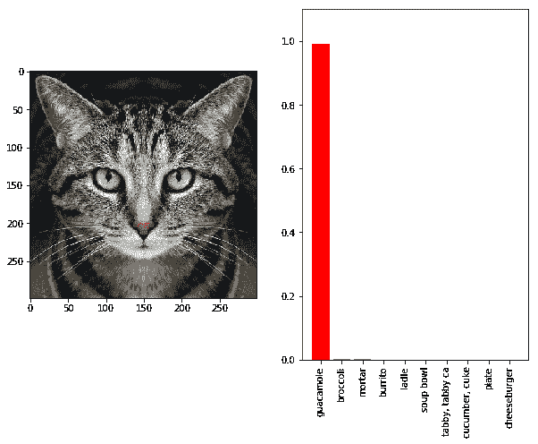

# 机器学习安全

> 原文：[`www.kdnuggets.com/2019/01/machine-learning-security.html`](https://www.kdnuggets.com/2019/01/machine-learning-security.html)

 评论

**作者：[Zak Jost](https://blog.zakjost.com)，亚马逊网络服务研究科学家**。

### 介绍

*随着越来越多的系统在其决策过程中利用机器学习模型，考虑恶意行为者如何利用这些模型以及如何设计防御措施将变得越来越重要。本文的目的是分享我在这一主题上的一些最新学习。*

### 机器学习无处不在

*可用数据、处理能力和机器学习领域创新的爆炸性增长导致了机器学习的普及。由于开源框架和数据的广泛存在，构建这些模型实际上相当简单（[这个教程](https://machinelearningmastery.com/machine-learning-in-python-step-by-step/)可以将一个零机器学习/编程知识的人带到 6 个机器学习模型中，时间约为 5-10 分钟）。此外，云服务提供商持续推出机器学习服务，使客户能够构建解决方案而无需编写代码或了解其底层工作原理。*

*Alexa 可以通过语音命令代我们进行购买。模型可以识别色情内容，并帮助使互联网平台对我们的孩子更安全。它们正在我们的道路上驾驶汽车，并保护我们免受诈骗和恶意软件的侵害。它们监控我们的信用卡交易和互联网使用，以寻找可疑的异常。*

### “Alexa，给我的猫买鳄梨酱”

*机器学习的好处是显而易见的——不可能让人类手动审查每一笔信用卡交易、每一张 Facebook 图片、每一个 YouTube 视频……等等。那么风险呢？*

*理解机器学习算法在自动驾驶汽车中出现错误可能带来的潜在危害并不需要过多的想象。常见的论点是，“只要它比人类犯的错误少，就是一种净收益”。*

*但当恶意行为者*主动试图欺骗模型*时情况又如何？来自 MIT 的学生小组 Labsix 3D 打印了一个在任何摄像角度下都被 Google 的 InceptionV3 图像分类器可靠地分类为“步枪”的乌龟^(1)。对于语音转文本系统，Carlini 和 Wagner 发现^(2)：*

> *给定任何音频波形，我们可以生成另一种与之 99.9%相似的波形，但可以转录成我们选择的任何短语……我们的攻击成功率为 100%，无论所需的转录内容或初始音频样本是什么。*

Papernot 等人表明，有针对性地向恶意软件添加一行代码可能会使最先进的恶意软件检测模型在超过 60%的情况下受到欺骗^(3)。*

通过使用相当简单的技术，一个坏演员可以让即使是最具性能和令人印象深刻的模型也以几乎任何他们想要的方式出错。例如，这张图片使谷歌模型几乎以 100%的置信度判断它是一张鳄梨酱的图片^(1)：

这是一张真实世界中交通标志的图片，该标志被操控，以致于在经过实验中计算机视觉模型被 100%地欺骗，误以为这是一个“限速 45 英里/小时”的标志^(4)：

### 怎么这么好，却*这么糟*？

*在所有这些例子中，基本的思想是以最大化模型输出变化的方式来扰动输入。这些被称为“对抗性示例”。利用这个框架，你可以找出如何最有效地调整猫的图像，使得模型认为它是鳄梨酱。这有点像让所有的小错误排列成一行并指向相同的方向，从而使雪花变成雪崩。从技术上讲，这等同于找到输出对输入的梯度——这是机器学习从业者很擅长的事情！*

值得强调的是，这些变化大多是难以察觉的。例如，听听 [这些音频样本](https://nicholas.carlini.com/code/audio_adversarial_examples/)。尽管听起来对我来说是相同的，但一个翻译为“没有数据集这篇文章就没用”，另一个翻译为“好的谷歌，浏览到 evil.com”。更值得强调的是，真正的恶意用户并不总是受限于做出难以察觉的变化，因此我们应该假设这是对安全漏洞的一个下限估计。

### 那么*我*需要担心吗？

*好吧，所以这些模型的鲁棒性存在问题，使得它们相对容易被利用。但是除非你是谷歌或脸书，你可能不会在生产系统中构建大型神经网络，所以你不必担心……对吧？* 对吧!？

错了。这个问题并不是神经网络所独有的。实际上，发现能欺骗一种模型的对抗性示例往往也能欺骗其他模型，即使它们使用了不同的架构、数据集，甚至算法。这意味着即使你组合了不同类型的模型，你*仍然不安全*^(5)。如果你将模型暴露给世界，即使是间接地，让别人能向它发送输入并得到响应，你就有风险。这个领域的历史从暴露*线性模型*的脆弱性开始，后来才在深度网络的背景下重新点燃^(6)。

### 我们怎么阻止它？

*攻击和防御之间存在持续的军备竞赛。最近的 [ICML 2018 的“最佳论文”](https://nicholas.carlini.com/papers/2018_icml_obfuscatedgradients.pdf) “击破”了同年会议论文中提出的 9 种防御中的 7 种。这个趋势不太可能在短期内停止。*

那么，普通的机器学习从业者该怎么办呢？他们可能没有时间跟进最新的机器学习安全文献，更不用说不断地将新防御措施整合到所有面向外部的生产模型中。在我看来，唯一理智的办法是设计多个信息来源的系统，以便单点故障不会破坏整个系统的效能。这意味着你假设单一模型可能会被攻破，并设计你的系统以抵御这种情况。

例如，完全由计算机视觉机器学习系统导航的无人驾驶汽车可能是一个非常危险的想法（原因不仅仅是安全问题）。使用激光雷达、GPS 和历史记录等正交信息的环境冗余测量可能有助于反驳对抗性视觉结果。这自然假设系统被设计成整合这些信号以做出最终判断。

更大的问题是，我们需要认识到模型安全是一个重大的、普遍存在的风险，随着机器学习越来越多地融入我们的生活，这一风险只会随着时间的推移而增加。因此，我们需要作为机器学习从业者培养思考这些风险和设计抗风险系统的能力。正如我们在网络应用中采取预防措施以保护系统免受恶意用户的攻击一样，我们也应该对模型安全风险采取积极措施。正如机构有应用安全审查小组进行例如渗透测试，我们也需要建立类似功能的模型安全审查小组。可以肯定的是：这个问题不会很快消失，而且可能会变得越来越重要。

***如果你想了解更多关于这个话题的信息，Biggio 和 Roli 的论文提供了对该领域的精彩回顾和历史，包括一些这里未提及的完全不同的攻击方法（例如数据中毒）。^(6)***

### 参考文献

*1. “在物理世界中欺骗神经网络。” Labsix，2017 年 10 月 31 日，[www.labsix.org/physical-objects-that-fool-neural-nets](https://www.labsix.org/physical-objects-that-fool-neural-nets/)。

    [^([返回])](#fnref:1)

1.  N. Carlini, D. Wagner. “音频对抗样本：对语音转文本的有针对性攻击。” arXiv 预印本 [arXiv:1801.01944](https://arxiv.org/abs/1801.01944)，2018。

    [^([返回])](#fnref:2)

1.  K. Grosse, N. Papernot, P. Manoharan, M. Backes, P. McDaniel (2017) [恶意软件检测中的对抗样本](http://www.patrickmcdaniel.org/pubs/esorics17.pdf)。在：Foley S., Gollmann D., Snekkenes E.（编辑）《计算机安全 – ESORICS 2017》。ESORICS 2017。计算机科学讲义，卷 10493。Springer，Cham。

    [^([返回])](#fnref:3)

1.  K. Eykhold, I. Evtimov 等。“对深度学习视觉分类的稳健物理世界攻击”。arXiv 预印本 [arXiv:1707.08945](https://arxiv.org/abs/1707.08945)，2017。

    [^([返回])](#fnref:4)

1.  N. Papernot, P. McDaniel, I.J. Goodfellow. “Transferability in Machine Learning: from Phenomena to Black-Box Attacks using Adversarial Samples”. arXiv 预印本 [arXiv:1605.07277](https://arxiv.org/abs/1605.07277), 2016.

    [^([返回])](#fnref:5)

1.  B. Biggio, F. Roli. “Wild Patterns: Ten Years After the Rise of Adversarial Machine Learning.” arXiv 预印本 [arXiv:1712.03141](https://arxiv.org/abs/1712.03141), 2018.

    [^([返回])](#fnref:6)

[原文](https://blog.zakjost.com/post/model-security/)。经许可转载。

**个人简介**: [Zak Jost](https://blog.zakjost.com) 是一名构建者和机器学习科学家。

**资源:**

+   [在线和基于网页的：分析、数据挖掘、数据科学、机器学习教育](https://www.kdnuggets.com/education/online.html)

+   [分析、数据科学、数据挖掘和机器学习的软件](https://www.kdnuggets.com/software/index.html)

**相关:**

+   [如何微调机器学习模型以提高预测准确性](https://www.kdnuggets.com/2019/01/fine-tune-machine-learning-models-forecasting.html)

+   [2018 年最重要的机器学习/AI 进展是什么？](https://www.kdnuggets.com/2019/01/machine-learning-ai-advances-2018.html)

+   [如何实时监控机器学习模型](https://www.kdnuggets.com/2019/01/monitor-machine-learning-real-time.html)

* * *

## 我们的前三课程推荐

 1\. [Google 网络安全证书](https://www.kdnuggets.com/google-cybersecurity) - 快速进入网络安全职业道路。

 2\. [Google 数据分析专业证书](https://www.kdnuggets.com/google-data-analytics) - 提升您的数据分析水平

 3\. [Google IT 支持专业证书](https://www.kdnuggets.com/google-itsupport) - 支持您的组织的 IT

* * *

### 更多相关话题

+   [元数据如何改善安全性、质量和透明度](https://www.kdnuggets.com/2022/04/metadata-improves-security-quality-transparency.html)

+   [世界需要更多的网络安全分析师！](https://www.kdnuggets.com/the-world-needs-more-cyber-security-analysts)

+   [每位机器学习工程师应掌握的 5 项机器学习技能…](https://www.kdnuggets.com/2023/03/5-machine-learning-skills-every-machine-learning-engineer-know-2023.html)

+   [KDnuggets 新闻，12 月 14 日：3 门免费机器学习课程…](https://www.kdnuggets.com/2022/n48.html)

+   [学习数据科学、机器学习和深度学习的可靠计划](https://www.kdnuggets.com/2023/01/mwiti-solid-plan-learning-data-science-machine-learning-deep-learning.html)

+   [KDnuggets 新闻，11 月 2 日：数据科学的现状…](https://www.kdnuggets.com/2022/n43.html)
