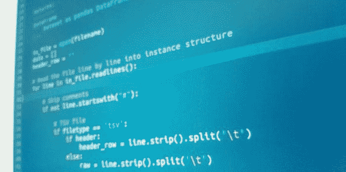
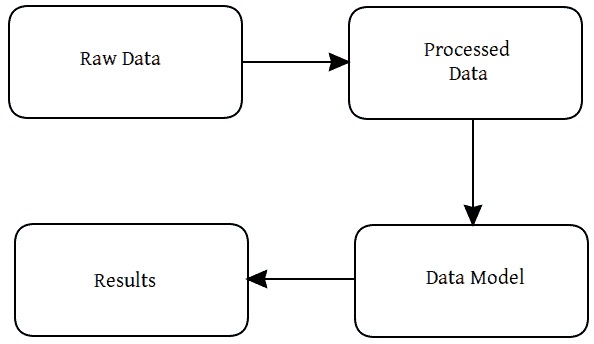
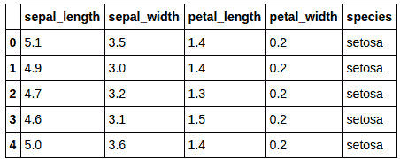
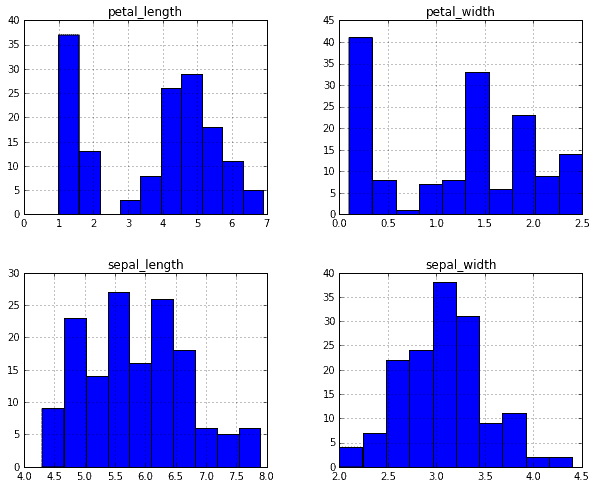

# 从头开始的 Python 机器学习工作流程 第一部分：数据准备

> 原文：[`www.kdnuggets.com/2017/05/machine-learning-workflows-python-scratch-part-1.html`](https://www.kdnuggets.com/2017/05/machine-learning-workflows-python-scratch-part-1.html)

现在，机器学习的认知似乎常常被简化为将一系列参数传递给越来越多的库和 API，期望得到魔法般的结果并等待输出。也许你对这些库的内部运作非常了解——从数据准备到模型构建，再到结果解释、可视化等——但你仍然依赖这些各种工具来完成任务。



从头开始的 Python 机器学习工作流程。

这没问题。使用经过良好测试和验证的工具实现常规任务是有意义的，有很多原因。重新发明不高效的轮子并不是最佳实践……这会限制你，而且花费时间不必要地长。无论你是使用开源工具还是专有工具来完成工作，这些实现都经过团队的精心打磨，确保你能获得最优质的工具来实现你的目标。

然而，自己动手做这些“肮脏的工作”往往是有价值的，即使只是作为一种教育尝试。我不会建议你从头开始编写自己的分布式深度学习训练框架——至少，通常情况下不建议这样做——但经历一次自己从头实现算法和支持工具的过程是一个好主意。我可能错了，但我不认为今天学习机器学习、数据科学、人工智能或*<< 插入相关流行词 >>*的绝大多数人实际上是在这样做的。

所以让我们从头开始构建一些 Python 机器学习工作流程。

### 我们所说的“从头开始”是什么意思？

首先，让我们澄清一下：当我说“从头开始”时，我的意思是尽可能少地借助帮助。这个定义是相对的，但为了我们的目的，我会在编写我们自己的矩阵、数据框和/或绘图库这方面画出界限，因此我们将分别依赖 numpy、pandas 和 matplotlib。在某些情况下，我们甚至不会使用这些库的所有可用功能，正如我们将很快看到的那样，我们会绕过它们以更好地理解。标准 Python 库中的任何东西也是可以使用的。然而，除此之外，我们将独立完成。

我们需要从某个地方开始，因此这篇文章将从一些简单的数据准备任务开始。我们将慢慢开始，但在对我们正在做的事情有了感觉之后，接下来的几篇文章中会迅速推进。除了数据准备之外，我们还需要额外的数据转换、结果解释和可视化工具——更不用说机器学习算法——来完成我们的旅程，我们会逐一讲解这些内容。

这个想法是手动拼凑出完成机器学习任务所需的任何非平凡功能。随着系列的展开，我们可以添加新的工具和算法，以及重新考虑我们之前的一些假设，使整个过程既具有迭代性又具有进步性。一步一步地，我们将关注我们的目标是什么，制定实现目标的策略，在 Python 中实现这些策略，然后测试它们是否有效。

最终结果，如目前设想，将是一组**简单**的 Python 模块，组织成我们自己的**简单**机器学习库。对于未接触过的人来说，我相信这将是理解机器学习过程、工作流和算法如何工作的宝贵经验。

### 我们所说的工作流是什么意思？

工作流对不同的人可能意味着不同的东西，但我们通常谈论的是被视为机器学习项目一部分的整个过程。有许多过程框架可以帮助我们跟踪我们正在做的事情，但现在我们简化为包括以下内容：

+   获取一些数据

+   处理和/或准备数据

+   构建模型

+   解释结果

我们可以随着进展对这些进行扩展，但这就是我们目前的简单机器学习过程框架。此外，“管道”意味着能够将工作流功能链在一起，因此我们在前进时也会记住这一点。



非常简单的机器学习过程框架。

### 获取我们的数据

在我们开始构建模型之前，我们需要一些数据，并确保这些数据符合一些合理的预期。为了测试目的（不是训练/测试的意义上，而是测试我们的基础设施），我们将使用鸢尾花数据集，[你可以在这里下载](https://raw.githubusercontent.com/uiuc-cse/data-fa14/gh-pages/data/iris.csv)。考虑到数据集的各种版本可以在网上找到，我建议我们都从相同的原始数据开始，以确保我们的所有准备步骤都能正常工作。

让我们来看看：



鉴于我们对这样一个简单数据集及其文件的了解，让我们首先考虑一下从原始数据到结果我们需要做什么：

+   数据存储在 CSV 文件中

+   实例主要由数值属性值组成

+   类别是分类文本

现在，上述内容并不适用于*所有*数据集，但也不特定于*这个*数据集。这使我们有机会编写可以在以后重复使用的代码。我们将在此关注的良好编码实践将包括重用性和模块化。

一些简单的探索性数据分析如下所示。




对鸢尾花数据集的非常简单的探索性数据分析：数据集描述（上），默认属性分布直方图（下）。

### 准备我们的数据

虽然在这个特定场景中我们所需的数据准备是最小的，但仍然是必需的。具体而言，我们需要确保考虑到标题行，移除 pandas 自动执行的任何索引，并将我们的类值从名义值转换为数值。由于我们将用于建模的特征中没有名义值，因此不需要更复杂的转换——至少目前不需要。

最终，我们还需要为我们的算法提供更好的数据表示方式，因此我们在继续之前将确保得到一个矩阵——或 numpy ndarray。我们的数据准备工作流程应该如下：


非常简单的数据准备过程。

另外，请注意，并非所有有趣的数据都存储在逗号分隔的文件中。我们可能会在某个时候从 SQL 数据库或直接从网络获取数据，届时我们会再次处理这个问题。

首先，让我们编写一个简单的函数，将 CSV 文件加载到 DataFrame 中；当然，这样做很简单，但考虑到未来，我们可能想要向数据集加载函数中添加一些额外的步骤。相信我。

这段代码非常简单。逐行读取数据文件可以轻松进行一些额外的预处理，比如忽略非数据行（我们暂时假设数据文件中的注释以‘#’开头，尽管这很荒谬）。我们可以指定数据集文件是否包括标题，并且支持 CSV 和 TSV 文件，默认是 CSV。

存在一些错误检查，但目前还不够健壮，因此我们可能想在以后再回来处理。此外，逐行读取文件并逐个决策这些行的处理方式会比使用内置功能直接将符合条件的 CSV 文件读取到 DataFrame 中要慢，但为了更多的灵活性，这个权衡在这个阶段是值得的（但在处理较大的文件时可能会花费相当长的时间）。不要忘记，如果这些内部操作似乎不是最佳方法，我们可以在以后随时进行更改。

在我们尝试运行代码之前，我们需要首先编写一个函数，将名义类值转换为数值。为了使函数更加通用，我们应该允许它用于数据集中任何属性，而不仅仅是类属性。我们还应跟踪属性名称与最终变为整数的映射。鉴于我们之前将 CSV 或 TSV 数据文件加载到 pandas DataFrame 中的步骤，这个函数应该接受 pandas DataFrame 以及要转换为数值的属性名称。

另请注意，我们暂时跳过了关于使用独热编码处理类别非类属性的讨论，但我怀疑我们会在之后回到这个话题。

上述函数虽然简单，但能完成我们想要的功能。我们本可以通过多种不同的方法来完成这项任务，包括使用 pandas 的内置功能，但从实际操作开始正是我们所要做的。

目前，我们可以从文件中加载数据集，并将类别属性值替换为数值（我们还会保留这些映射的字典以备后用）。如前所述，我们希望最终将数据集转换为 numpy ndarray，以便最方便地与我们的算法一起使用。再次，这是一项简单的任务，但将其做成函数会使我们在将来需要时能够继续扩展。

即使之前的函数看起来并不过于复杂，这个函数可能会显得有些过头。但请耐心等待；我们实际上是在遵循合理的 —— 尽管过于谨慎 —— 编程原则。随着我们前进，可能会对目前构建的函数进行更改或添加新的功能。在一个地方实施这些更改，并对其进行良好的文档记录，从长远来看是明智的。

### 测试我们的数据准备工作流程

我们目前的工作流程可能仍处于构建块形式，但让我们给代码做个测试。

```py
  sepal_length sepal_width petal_length petal_width species
0          5.1         3.5          1.4         0.2  setosa
1          4.9           3          1.4         0.2  setosa
2          4.7         3.2          1.3         0.2  setosa
3          4.6         3.1          1.5         0.2  setosa
4            5         3.6          1.4         0.2  setosa

  sepal_length sepal_width petal_length petal_width  species
0          5.1         3.5          1.4         0.2        0
1          4.9           3          1.4         0.2        0
2          4.7         3.2          1.3         0.2        0
3          4.6         3.1          1.5         0.2        0
4            5         3.6          1.4         0.2        0

{'setosa': 0, 'versicolor': 1, 'virginica': 2}

[['5.1' '3.5' '1.4' '0.2' 0]
 ['4.9' '3' '1.4' '0.2' 0]
 ['4.7' '3.2' '1.3' '0.2' 0]
 ['4.6' '3.1' '1.5' '0.2' 0]
 ['5' '3.6' '1.4' '0.2' 0]
 ['5.4' '3.9' '1.7' '0.4' 0]
 ['4.6' '3.4' '1.4' '0.3' 0]
 ['5' '3.4' '1.5' '0.2' 0]
 ['4.4' '2.9' '1.4' '0.2' 0]
 ['4.9' '3.1' '1.5' '0.1' 0]]
```

既然我们的代码按预期工作，让我们做一些快速的清理工作。我们会在后续工作中为我们的代码制定更全面的组织结构，但现在我们应该将[所有这些函数添加到一个文件](https://gist.github.com/mmmayo13/9859a457760db10ec4842be3aa1a2334)中，并将其保存为**dataset.py**。这将使重用更加方便，下一次我们会看到这一点。

### 展望未来

接下来，我们将关注更重要的内容，即 k-means 聚类算法的实现。然后我们将看看一个简单的分类算法，k-最近邻算法。我们将了解如何在简单的工作流程中构建分类和聚类模型。这无疑需要编写一些额外的工具来帮助我们的项目，并且我相信我们之前做的内容会需要进行一些修改。

但这没关系；*练习*机器学习是*理解*机器学习的最佳方法。实施我们工作流所需的算法和支持工具最终应当证明有用。希望你觉得这些内容足够有帮助，以至于去查看下一期。

**相关内容**：

+   数据准备技巧、窍门和工具：与业内人士的访谈

+   Pandas 备忘单：Python 中的数据科学与数据处理

+   通过 Python 和 Scikit-learn 简化决策树解释

* * *

## 我们的三大课程推荐

 1\. [谷歌网络安全证书](https://www.kdnuggets.com/google-cybersecurity) - 快速进入网络安全职业轨道

 2\. [谷歌数据分析专业证书](https://www.kdnuggets.com/google-data-analytics) - 提升你的数据分析技能

 3\. [谷歌 IT 支持专业证书](https://www.kdnuggets.com/google-itsupport) - 支持你的组织进行 IT 工作

* * *

### 更多相关话题

+   [每位数据科学家都应了解的三个 R 库（即使你使用 Python）](https://www.kdnuggets.com/2021/12/three-r-libraries-every-data-scientist-know-even-python.html)

+   [使用管道编写干净的 Python 代码](https://www.kdnuggets.com/2021/12/write-clean-python-code-pipes.html)

+   [是什么使 Python 成为初创公司的理想编程语言](https://www.kdnuggets.com/2021/12/makes-python-ideal-programming-language-startups.html)

+   [停止学习数据科学以寻找目的，并通过寻找目的来…](https://www.kdnuggets.com/2021/12/stop-learning-data-science-find-purpose.html)

+   [数据科学统计学习的顶级资源](https://www.kdnuggets.com/2021/12/springboard-top-resources-learn-data-science-statistics.html)

+   [建立一个坚实的数据团队](https://www.kdnuggets.com/2021/12/build-solid-data-team.html)
