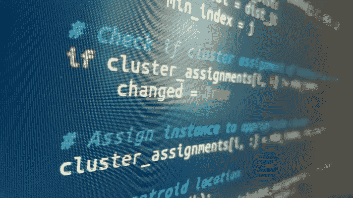
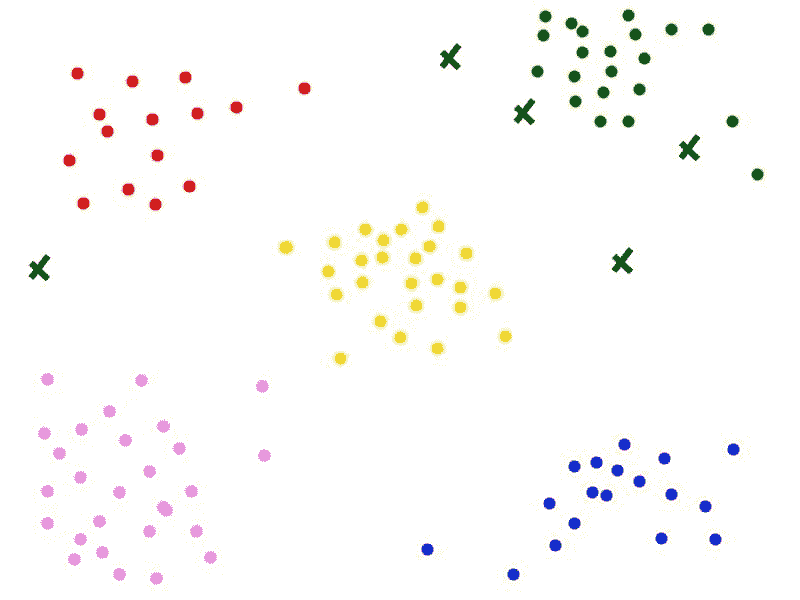
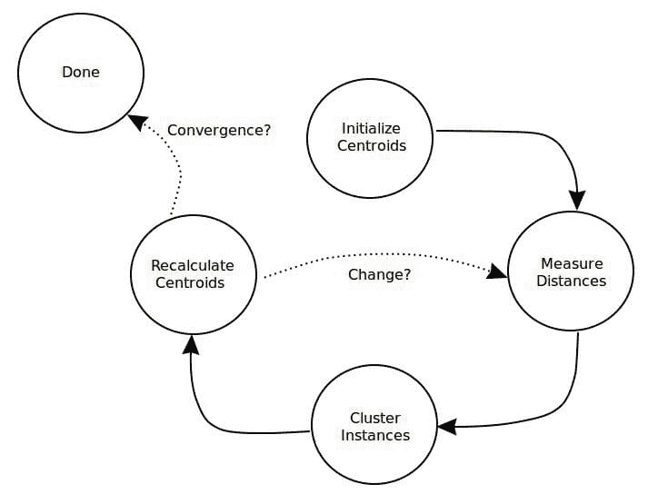

# 从零开始的 Python 机器学习工作流 第二部分：k-均值聚类

> 原文：[`www.kdnuggets.com/2017/06/machine-learning-workflows-python-scratch-part-2.html`](https://www.kdnuggets.com/2017/06/machine-learning-workflows-python-scratch-part-2.html)

在这一系列的第一部分，我们起步较慢但稳健。上一篇文章列出了我们的目标，并从一些机器学习工作流和管道的基本构建块开始。如果你还没有阅读这一系列的第一部分，建议你在继续之前先阅读它。

这一次我们加速前进，将通过实现 k-均值聚类算法来完成。我们将在编码过程中讨论 k-均值的具体方面，但如果你对该算法的概述以及它与其他聚类方法的关系感兴趣，你可以 查看这个。



Python 中的 k-均值聚类算法。从零开始。

继续前进的唯一真实先决条件是我们在第一篇文章中创建的 [dataset.py](https://gist.github.com/mmmayo13/9859a457760db10ec4842be3aa1a2334) 模块，以及原始的 [iris.csv](https://raw.githubusercontent.com/uiuc-cse/data-fa14/gh-pages/data/iris.csv) 文件，因此请确保你手头有这两者。

### k-均值聚类算法

k-均值是一种简单但常常有效的聚类方法。k 个点被随机选择作为簇中心或质心，所有训练实例被绘制并添加到最近的簇中。在所有实例都被添加到簇中之后，代表每个簇实例均值的质心被重新计算，这些重新计算的质心成为各自簇的新中心。

此时，所有的簇成员资格被重置，所有训练集实例被重新绘制并添加到它们最接近的、可能重新中心化的簇中。这个迭代过程会继续，直到质心或其成员资格没有变化为止，簇被认为已稳定。

就聚类方法而言，k-均值算法是最简单的之一——其概念上的简单性优雅得几乎如诗一般。它也是一个经过验证的有效工具，具有持久的表现力，常常能够产生有用的结果。

我们要做的，简而言之，就是编码一个简单的 k-均值实现，这将把相似的东西分到一起，把不相似的东西分开，至少在理论上是这样。足够简单。请记住，这里的“相似”被简化为“在欧几里得空间中相对接近”，或者类似这样非常非哲学的东西。

我们在这里需要几个函数。考虑算法中的步骤可以帮助我们确定这些函数的内容：

+   设置初始质心

+   测量数据实例与质心之间的距离

+   将数据实例添加为最近质心的成员

+   重新计算质心

+   如有必要，重新测量，重新聚类，重新计算

这就是算法的核心。但在我们到达那之前，先做一步（暂时的）后退。

### 数据准备……再次

在撰写这篇文章时，我突然意识到我们的数据准备工作流程中缺少了一个重要部分。在将我们的 pandas DataFrame 转换为 numpy ndarray（矩阵）之前，我们需要确保我们的数值确实是*数字*，而不是伪装成数字的字符串。由于我们上次从 CSV 文件中读取数据，即使是我们的数值也被存储为字符串（在之前的帖子底部明显可见，因为数字被单引号包围——例如 '5.7'）。

因此，处理此问题的最佳方法是创建另一个函数并将其添加到我们的 dataset.py 文件中，该函数将字符串转换为其数值表示（我们已经有一个函数用于将类名转换为数值，并跟踪这些更改）。该函数经历了 3 次具体的迭代，我在操作过程中即接受了：1）一个数据集和一个单一属性的名称，该属性对应的列中的所有值应从字符串转换为浮点数；2）一个数据集和属性名称列表……；以及 3）一个数据集和一个单一属性作为字符串，或一个属性列表作为**哎呀**列表。

最终的迭代（第三种，更灵活的选项）就是下面显示的那个。让我们将其添加到上次的 dataset.py 模块中。

好的，既然这些问题解决了，我们将能够加载数据集、清理数据，并创建一个（完全数值化的）矩阵表示，然后可以将其输入到我们的 k-means 聚类算法中，一旦我们有了算法。说到这一点……

### 初始化质心

我们的算法需要做的第一件事是创建一组 k 个初始质心。这里有多种方法可以实现，但我们将从最基本的开始：随机初始化。我们需要一个接受数据集和整数 k 的函数，并返回一个包含该数量随机生成质心的 ndarray。

你可能已经想象到随机初始化可能会出错。举个简单的例子，考虑在二维空间中有 5 个不同的、紧密聚集的类别，配有初始化不良的质心，如下所示。



显然是不理想的质心初始化。

即使没有数学支持直观感受，很明显这些质心的位置并不最优。然而，k-means 的一个强大特点是它能够从这种初始化中恢复，随着聚类的轮次逐步趋向最优位置，通过最小化簇实例成员与簇质心之间的均值距离。

虽然这可能发生得非常快，但在高维数据量大的情况下，较差的初始化可能会导致更多的聚类迭代。随机放置的初始数据空间调查本身也可能变得漫长。因此，存在替代的质心初始化方法，其中一些我们可能在未来会研究。

关于测试代码的简要说明：在我们进行的过程中用高度构造的场景进行测试似乎麻烦不堪，因此我们会等到最后再看看我们的整体表现。

### 测量距离

拥有数据集和一组初始化质心后，我们最终必须进行大量的测量计算。实际上，对于每次聚类迭代，我们需要测量每个数据点到每个质心的距离，以确定实例属于哪个簇（也许是暂时的）。因此，让我们为欧几里得空间编写一个测量函数。我们将使用 [Scipy](https://www.scipy.org/) 来完成繁重的工作；虽然编写一个距离测量函数并不难，[Scipy 包含一个函数](https://docs.scipy.org/doc/scipy-0.14.0/reference/generated/scipy.spatial.distance.euclidean.html) 来优化这种向量计算，方便的是，这正是我们要做的。

让我们将这个功能封装在我们自己的函数中，以便以后我们可以改变或实验距离计算的方法。

凭借初始化质心和进行测量的能力，我们现在可以编写一个函数来控制我们聚类算法的逻辑，并执行几个额外的必要步骤。

### 聚类实例

在查看代码之前，以下是我们的算法将遵循的过程的简单概述，考虑到上述和以下的几个函数。



我们的 k-means 聚类算法过程。

以下代码有很好的注释，但让我们逐步查看几个主要点。

首先，我们的函数接受一个作为 numpy ndarray 的数据集，以及我们希望在聚类过程中使用的簇数量。它返回几个东西：

+   聚类完成后的结果质心

+   聚类后的簇分配

+   聚类算法所需的迭代次数

+   原始质心

创建一个 ndarray 来存储实例簇分配及其误差，然后初始化质心，并保留一份副本以便稍后返回。

接下来，`while` 循环将继续运行，直到聚类分配没有发生变化，意味着已经达到了收敛——请注意，此时并不存在限制迭代次数的额外机制。计算实例到质心的距离，跟踪最小距离，并用其来确定聚类分配。然后记录最近的质心及两个实体之间的实际距离（误差），并检查特定实例的聚类分配是否发生变化。

在对每个实例执行完上述操作后，质心位置会被更新，仅仅是通过使用成员实例的均值作为质心坐标。同时记录迭代次数。当适当时，检查是否已经收敛，将控制权转出 `while` 循环，并返回上述项。

我想指出，部分代码以及额外的灵感来源于 Peter Harrington 的书籍《[机器学习实战](https://www.amazon.com/Machine-Learning-Action-Peter-Harrington/dp/1617290181/)》（MLIA）。我在这本书首次发布时购买了它，并且它在许多方面证明了其无价之处，尽管这本书常常受到批评，大部分批评集中在理论不足和/或代码问题上。然而，在我看来，这些恰恰是它的优势。如果你像我一样，在阅读这本书时有理论基础，并且愿意并能够调整需要优化的代码，或者可以自行修改代码，MLIA 对于任何希望初次涉足机器学习算法编码的人来说，都可以是一个有用的资源。

### 测试我们的 k-means 聚类算法

有一些典型任务我们将在这篇文章中跳过，稍后会再讨论，但我想在这里指出这些任务。

首先，在进行聚类时，特别是对于尺度不同的属性，通常最好至少考虑数据的缩放或归一化，以确保某个单一属性（或属性集合）的尺度远大于其他属性时，不会过多地影响结果。如果我们有 3 个属性，其中前两个在 [0, 1] 范围内，而第三个在 [0, 100] 范围内，那么很容易看出第三个变量将主导测量结果及后续的聚类成员分配。

其次，在聚类（就像许多机器学习任务一样）时，我们可以将数据集拆分为训练集和测试集，从而在一个数据子集上训练模型，然后在另一个（独立的）数据集上测试模型。虽然这并不总是特定聚类任务的目标，因为我们可能只是想构建一个聚类模型，而不关心用它来分类后续实例，但它通常是可行的。我们将在下面继续测试代码，而不考虑这些因素，但可能会在后续的文章中回顾。

在继续之前，确保你已经将上面提到的数据集相关函数添加到现有的 [dataset.py](https://gist.github.com/mmmayo13/935684dd226ef05f7d291e8cf5ed873a) 模块中，并创建了一个 [kmeans.py](https://gist.github.com/mmmayo13/956937ec1fc695163b8e052b55c09208) 模块来存放所有相关函数。

让我们尝试一下我们的代码：

```py
Number of iterations: 5

Final centroids:
[[ 6.62244898  2.98367347  5.57346939  2.03265306  2\.        ]
 [ 5.006       3.418       1.464       0.244       0\.        ]
 [ 5.91568627  2.76470588  4.26470588  1.33333333  1.01960784]]

Cluster membership and error of first 10 instances:
[[ 1\.        0.021592]
 [ 1\.        0.191992]
 [ 1\.        0.169992]
 [ 1\.        0.269192]
 [ 1\.        0.039192]
 [ 1\.        0.467592]
 [ 1\.        0.172392]
 [ 1\.        0.003592]
 [ 1\.        0.641592]
 [ 1\.        0.134392]]

Original centroids:
[[ 4.38924071  3.94546253  5.49200482  0.40216215  1.95277771]
 [ 5.43873792  3.58653594  2.73064731  0.79820023  0.97661014]
 [ 4.62570586  2.46497863  3.14311939  2.4121321   0.43495676]]
```

看起来不错！我们代码的这次测试结果如上，但你会发现后续迭代会返回不同的结果——至少是不同的迭代次数和原始质心的集合。

### 展望未来

尽管我们尚未评估我们的聚类结果，但现在就到这里……不过，话说回来，我敢打赌你可以猜到下一篇文章的内容。下次我们将专注于更多的聚类相关活动。我们有一个算法可以用来构建模型，但还需要一些机制来评估和可视化它们的结果。这就是我们接下来要做的。

深入思考之后，我计划将我们的注意力转向使用 k 最近邻算法进行分类，以及一些与分类相关的任务。希望你发现这些内容足够有用，以便查看下一篇文章。

**相关**：

+   从头开始的 Python 机器学习工作流 第一部分：数据准备

+   提高 k-means 聚类效率的朴素分片质心初始化方法

+   K-Means 和其他聚类算法：Python 快速入门

* * *

## 我们的前三个课程推荐

 1\. [谷歌网络安全证书](https://www.kdnuggets.com/google-cybersecurity) - 快速进入网络安全职业生涯。

 2\. [谷歌数据分析专业证书](https://www.kdnuggets.com/google-data-analytics) - 提升你的数据分析技能

 3\. [谷歌 IT 支持专业证书](https://www.kdnuggets.com/google-itsupport) - 支持你的组织 IT 工作

* * *

### 更多相关主题

+   [聚类释放：理解 K-Means 聚类](https://www.kdnuggets.com/2023/07/clustering-unleashed-understanding-kmeans-clustering.html)

+   [无监督学习实战：K-Means 聚类](https://www.kdnuggets.com/handson-with-unsupervised-learning-kmeans-clustering)

+   [k-means 聚类的质心初始化方法](https://www.kdnuggets.com/2020/06/centroid-initialization-k-means-clustering.html)

+   [什么是 K-Means 聚类及其算法如何运作？](https://www.kdnuggets.com/2023/05/kmeans-clustering-algorithm-work.html)

+   [机器学习中的 DBSCAN 聚类算法](https://www.kdnuggets.com/2020/04/dbscan-clustering-algorithm-machine-learning.html)

+   [PyCaret 中的 Python 聚类简介](https://www.kdnuggets.com/2021/12/introduction-clustering-python-pycaret.html)
