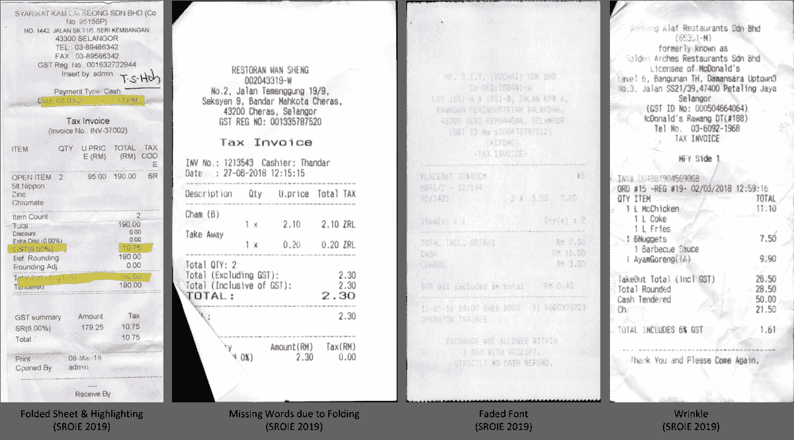
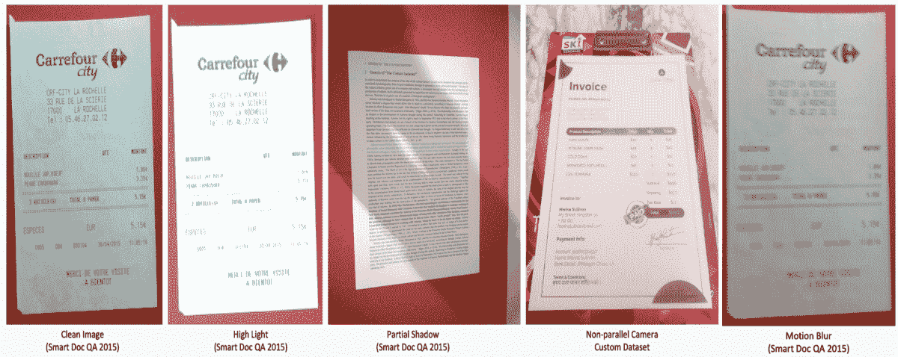
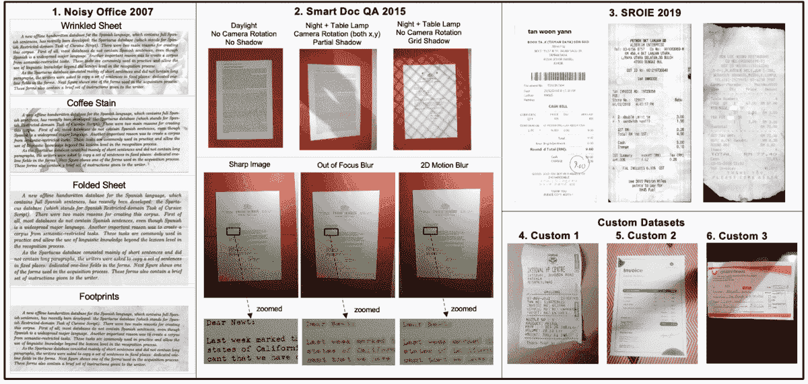
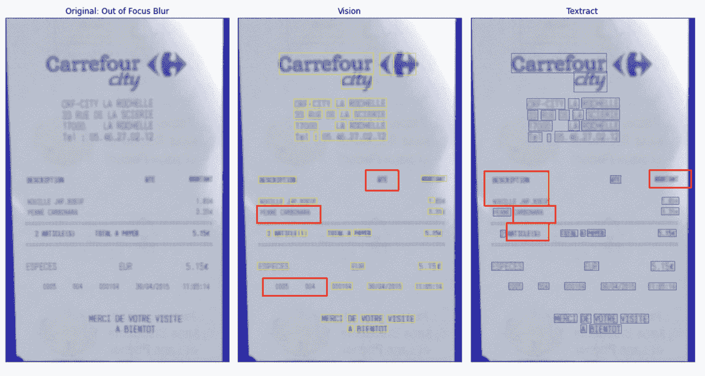
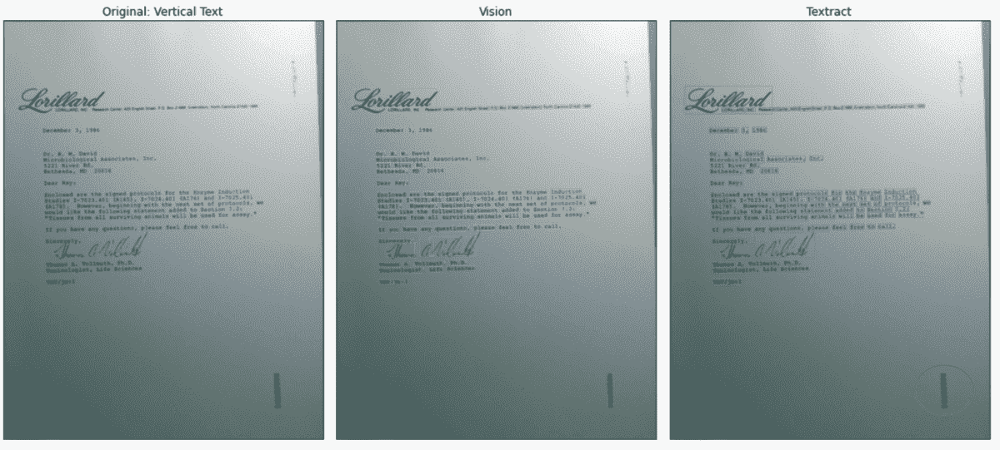

# 让智能文档处理更智能：第一部分

> 原文：[`www.kdnuggets.com/2023/02/making-intelligent-document-processing-smarter-part-1.html`](https://www.kdnuggets.com/2023/02/making-intelligent-document-processing-smarter-part-1.html)

**作者：阿克谢·库马尔与维坚德拉·贾因**

# 1. 引言

* * *

## 我们的前三个课程推荐

 1. [谷歌网络安全证书](https://www.kdnuggets.com/google-cybersecurity) - 快速进入网络安全职业。

 2. [谷歌数据分析专业证书](https://www.kdnuggets.com/google-data-analytics) - 提升你的数据分析技能

 3. [谷歌 IT 支持专业证书](https://www.kdnuggets.com/google-itsupport) - 支持你的组织的 IT 需求

* * *

迄今为止，大量的组织流程仍依赖纸质文档。比如发票处理和保险公司的客户入职流程。数据科学和数据工程的进步促成了智能文档处理（IDP）解决方案的发展。这些解决方案允许组织利用人工智能技术自动提取、分析和处理纸质文档，从而最小化人工干预。实际上，光学字符识别（OCR）领域有两个主要参与者：亚马逊的 API Textract 和谷歌的 Vision API，以及开源 API Tesseract。

根据 Forrester 的报告，80% 的组织数据是非结构化的，包括 PDF、图片等。这是 IDP 解决方案的真正考验。我们的假设是，由于扫描文档中存在的各种噪声，如模糊、水印、褪色的文字、变形等，这些 OCR API 的准确性可能会受到影响。本文旨在测量这些噪声对各种 API 性能的影响，以确定“是否有可能使智能文档处理更智能？”

# 2. 文档中的噪声类型

文档中存在各种噪声，这些噪声可能导致 OCR 准确性下降。这些

噪声可以分为两类：

由于文档质量引起的噪声：

+   纸张变形 - 纸张皱褶、纸张起皱、纸张撕裂

+   污点 - 咖啡渍、液体溢出、墨水溢出

+   水印、印章

+   背景文本

+   特殊字体

图 2.1 由于文档质量引起的噪声

图像捕捉过程中产生的噪声：

1.  偏斜 - 变形、非平行相机

1.  模糊 - 焦点模糊、运动模糊

1.  光照条件 - 低光（曝光不足）、强光（曝光过度）、部分阴影

图 2.2 与图像捕捉过程相关的噪声

由于存在这些噪声，图像在输入到 IDP/OCR 流程之前需要预处理/清理。一些 OCR 引擎具有内置的预处理工具，可以处理大多数这些噪声。我们的目标是用各种噪声测试 API，以确定 OCR API 能处理哪些噪声。

# 3\. 衡量 API 性能的指标

为了衡量 OCR 引擎的性能，需要将真实文本或实际文本与 OCR 输出或 API 检测到的文本进行比较。如果 API 检测到的文本与真实文本完全相同，则表示该文档的准确率为 100%。但这是一种非常理想的情况。在现实世界中，由于文档中存在噪声，检测到的文本会与真实文本有所不同。这种真实文本与检测到的文本之间的差异通过各种指标进行衡量。

下表列出了我们考虑用来衡量 API 性能的指标。除了第一个指标（平均置信度得分）外，其余所有指标都将检测到的文本与真实文本进行比较。

| **序号** | **指标** | **类型** | **简要描述** |
| --- | --- | --- | --- |
| 1 | 平均置信度得分 | 由 API 提供 | 置信度得分表示 OCR API 对识别文本组件正确性的确定程度。平均置信度得分是所有单词级别置信度得分的平均值。 |
| 2 | 字符错误率 (CER) | 错误率 | CER 比较真实文本中的字符总数（包括空格），与 OCR 输出中获得真实结果所需的最小插入、删除和替换字符的数量。CER = (替换 + 插入 + 删除) 在 OCR 输出中的字符数 / 真实文本中的字符数 |
| 3 | 字词错误率 (WER) | 错误率 | 它类似于 CER，但唯一的区别是 WER 在词级别操作，而不是字符级别。WER = (替换 + 插入 + 删除) 在 OCR 输出中的词数 / 真实文本中的词数 |
| 4 | 余弦相似度 | 相似度 | 如果 x 是真实文本的数学向量表示，y 是 OCR 输出的数学向量表示，则余弦相似度定义如下：Cos(x, y) = x . y / &#124;&#124;x&#124;&#124; * &#124;&#124;y&#124;&#124; |
| 5 | Jaccard 指数 | 相似度 | 如果 A 是真实文本中的所有词的集合，B 是 OCR 输出中的所有词的集合，则 Jaccard 指数定义如下： ????= &#124;????∩????&#124;/&#124;????∪????&#124; |

请注意，WER 和 CER 会受到文本顺序的影响，而余弦相似性、Jaccard 指数和平均置信度分数则不受文本顺序的影响。考虑这样一种情况：如果 OCR API 正确检测了所有单词，但检测到的单词顺序与真实顺序不同，则 WER/CER 将非常差（高错误即性能差），而余弦相似性将非常好（高相似性，即性能好）。因此，查看所有指标一起以获得 OCR API 性能的清晰概念是很重要的。

# 4\. 探索的数据集

我们探索了一些文献中提供的标准数据集，并且还创建了一些使用真实发票和虚拟发票的自定义数据集。在探索了约 5900 个文档，包括发票、账单、收据、文本文档和在各种噪声条件下扫描的虚拟发票后，这些噪声包括咖啡渍、折叠、皱纹、小字体、倾斜、模糊、水印等。

图 4.1 – 来自各种数据集的示例图像。左侧框：嘈杂办公室；中间框：智能文档问答；右上框：SROIE 数据集；右下框：自定义数据集。

# 5\. 结果总结

如前所述，我们在提到的数据集上测试了三种 API：Vision、Textract 和 Tesseract，并计算了性能指标。我们观察到，在几乎所有情况下，Tesseract 的表现明显逊色于 Vision 和 Textract，因此在结果总结中排除了 Tesseract。我们的结果总结分为两部分，一部分基于数据集，另一部分基于噪声类型。

## 结果总结（基于数据集）

我们将指标分为两组，第一组包括错误率（WER & CER），第二组包括相似性指标（余弦相似性 & Jaccard 指数）。使用这些指标的均值来比较 API 的性能。这个评分系统的范围从 1 到 10。这里，评分 1 表示该数据集的平均性能指标在 0-10% 之间（最差表现），而评分 10 表示在 91-100% 之间（最佳表现）。

| **序号** | **数据集** | **API 性能较差的主要噪声** | **API 性能相对评分（1: 最差, 10: 最佳）** |
| --- | --- | --- | --- |
| **基于错误率** | **基于相似性指标** |
| **视觉** | **Textract** | **视觉** | **Textract** | **视觉** | **Textract** |
| 1 | 嘈杂办公室 2007 | 两个 API 在嘈杂办公室数据集的所有噪声中表现良好 | 10 | 10 | 10 | 10 |
| 2 | 智能文档问答 2015 | 运动模糊、失焦模糊、发票类型文档 | 7 | 9 | 9 | 8 |
| 3 | SROIE 2019 | 点阵打印机字体、印章 | 6 | 9 | 10 | 10 |
| 4 | 自定义数据集 1 | 模糊和水印 | 6 | 9 | 10 | 9 |
| 5 | 自定义数据集 2（Alpha Foods） | 两个 API 在所有噪声中表现良好 | 5 | 7 | 10 | 9 |
| 6 | 自定义数据集 3 | 无实心背景（当两侧都有文本时） | 3 | 8 | 10 | 9 |

这里一个重要的点是，Vision 的 CER 和 WER 错误率通常高于 Textract。但是，两者的余弦相似度和 Jaccard 指数相似。这是因为 API 使用的单词顺序或排序方法不同。我们的发现是，尽管 Vision 和 Textract 检测文本的性能几乎相同，但由于 Vision 输出中的不同排序，其错误率高于 Textract。因此，Vision 基于错误率表现较差。

## 结果总结（基于噪声）

在这里，我们根据观察到的性能提供对 API 的主观评估。右勾 (✓) 表示 API 一般能处理该特定噪声，叉号 (X) 表示 API 在该特定噪声下表现较差。例如，我们观察到 Textract 无法检测文档中的垂直文本。

| 序号 | 噪声/变化 | Google Vision API | Amazon Textract API | 观察 |
| --- | --- | --- | --- | --- |
| 1 | 光线变化（白天光、夜晚光、局部阴影、网格阴影、低光） | ✓ | ✓ | Vision 和 Textract API 可以处理这些噪声 |
| 2 | 非平行相机 (x, y, x-y) | ✓ | ✓ |
| 3 | 不平整表面 | ✓ | ✓ |
| 4 | 2x 放大 | ✓ | ✓ |
| 5 | 垂直文本 | ✓ | X | 亚马逊 API 的限制 |
| 6 | 无实心背景 | X | X | Vision 和 Textract API 在这些噪声下表现较差 |
| 7 | 水印 | X | X |
| 8 | 模糊（失焦） | X | X |
| 9 | 模糊（运动模糊） | X | X |
| 10 | 点阵打印机字体 | X | X |

下面是一些示例：

图 5.2 (a): SmartDocQA - 焦点模糊：Vision 和 Textract 文本输出比较。左侧图像是输入，中间图像是 Vision 输出，黄色框为单词级别的边界框，右侧图像是 Textract 输出，蓝色框为单词级别的边界框。红框表示没有边界框的单词，即 API 没有检测到的单词。

图 5.2 (b): SmartDocQA - 2D 运动模糊：Vision 和 Textract 文本输出比较。红框表示 API 未识别的文本。

图 5.2 (c): SmartDocQA - 垂直文本：Vision 和 Textract 文本输出比较。红圈表示 Textract API 无法检测图像中的垂直文本。

# 6\. 文档去噪

现在已经确定，一些噪声确实会影响 API 的文本识别能力。

因此，我们尝试了多种方法来清理图像，然后输入 API，并检查了 API 的性能是否有所改善。我们在参考部分提供了这些方法的链接。以下是观察结果的总结：

| **序号** | **噪声 / 变异** | **清理方法** | **总样本数** | **观察结果** |
| --- | --- | --- | --- | --- |
| **视觉** | **Textract** |
| 1 | 模糊（焦点外） | 内核锐化 | 1 | 退化 | 无效 |
| 自定义预处理 | 3 | 1: 改进 1: 稍微改进 1: 稍微退化 | 1: 改进 2: 无效 |
| 2 | 模糊（2D 运动模糊） | 模糊（平均/中位数） | 2 | 2: 改进 | 1: 稍微退化 1: 改进 |
| 内核锐化 | 2 | 1: 无效 1: 退化 | 1: 退化 1: 改进 |
| 自定义预处理 | 1 | 无效 | 1: 无效 |
| 3 | 水平运动模糊 | 模糊（平均/中位数） | 2 | 1: 退化 1: 改进 | 1: 稍微改进 1: 退化 |
| 自定义预处理 | 1 | 稍微改进 | 无效 |
| 4 | 水印 | 形态学过滤 | 2 | 1: 改进 1: 退化 | 1: 改进 1: 退化 |

从表中可以看出，这些清理方法并不适用于所有图像，实际上，应用这些清理方法后，API 的性能有时会下降。因此，需要一种统一的解决方案，能够应对各种噪声。

# 结论

在测试了包括 Noisy Office、Smart Doc QA、SROIE 和自定义数据集在内的各种数据集，以比较和评估 Tesseract、Vision 和 Textract 的性能后，我们可以得出结论：OCR 输出受文档中噪声的影响。内置去噪器或预处理器不足以处理大多数噪声，包括运动模糊、水印等。如果对文档图像进行去噪，OCR 输出可以显著改善。文档中的噪声种类繁多，我们尝试了各种非模型方法来清理图像。不同的方法对不同种类的噪声有效。目前，还没有一种统一的选项能够处理所有种类的噪声，或者至少是主要噪声。因此，有必要使智能文档处理更加智能。需要一种统一的（“一个模型适用所有”）解决方案，在输入 OCR API 之前对文档进行去噪，以提高性能。在本博客系列的第二部分中，我们将探讨去噪方法以提升 API 的性能。

## 参考文献

1.  F. Zamora-Martinez, S. España-Boquera 和 M. J. Castro-Bleda，基于行为的神经网络聚类应用于文档增强，见：计算与环境智能，第 144-151 页，Springer，2007 年。

    UCI 机器学习库 [https://archive.ics.uci.edu/ml/datasets/NoisyOffice]

1.  Castro-Bleda, MJ.; España Boquera, S.; Pastor Pellicer, J.; Zamora Martínez, FJ. (2020). The NoisyOffice 数据库：用于训练监督式机器学习滤镜的语料库。计算机杂志。63(11):1658-1667。 https://doi.org/10.1093/comjnl/bxz098

1.  尼巴尔·纳耶夫、穆罕默德·穆扎米尔·卢克曼、索菲亚·普鲁姆、塞巴斯蒂安·埃斯克纳齐、约瑟夫·查扎隆、让-马克·奥吉耶：“SmartDoc-QA：用于智能手机捕获文档图像的质量评估数据集——单一和多重失真”，第六届基于相机的文档分析与识别国际研讨会（CBDAR）论文集，2015 年。

1.  郑黄、凯陈、简华赫、项白、迪莫斯特尼斯·卡拉察斯、舒简·卢、C.V.贾瓦哈尔，《ICDAR2019 扫描收据 OCR 和信息提取竞赛（SROIE）》，2021 [arXiv:2103.10213v1]

1.  [`cloud.google.com/vision`](https://cloud.google.com/vision)

1.  [`aws.amazon.com/textract/`](https://aws.amazon.com/textract/)

1.  [`docs.opencv.org/3.4/d4/d13/tutorial_py_filtering.html`](https://docs.opencv.org/3.4/d4/d13/tutorial_py_filtering.html)

1.  [`scikit-image.org/docs/stable/auto_examples/applications/plot_morphology.html`](https://scikit-image.org/docs/stable/auto_examples/applications/plot_morphology.html)

1.  [`pyimagesearch.com/2014/09/01/build-kick-ass-mobile-document-scanner-just-5-minutes/`](https://pyimagesearch.com/2014/09/01/build-kick-ass-mobile-document-scanner-just-5-minutes/)

**[阿克谢·库马尔](https://www.linkedin.com/in/akshay-kumar-datascience/)** 是 [Sigmoid](http://www.sigmoid.com/) 的首席数据科学家，拥有 12 年数据科学经验，专长于市场分析、推荐系统、时间序列预测、欺诈风险建模、图像处理和自然语言处理。他构建可扩展的数据科学解决方案和系统，以解决复杂的业务问题，同时以用户体验为核心。

**[维坚德拉·贾恩](https://www.linkedin.com/in/jainvijendra/)** 目前在 [Sigmoid](http://www.sigmoid.com/) 担任副首席数据科学家。拥有 7 年以上的数据科学经验，他主要从事市场混合建模、图像分类和分割以及推荐系统等领域的工作。

### 更多相关主题

+   [如何通过检索增强生成让大语言模型更聪明](https://www.kdnuggets.com/how-retrieval-augment-generation-makes-llms-smarter)

+   [机器学习的甜蜜点：NLP 和文档分析中的纯方法](https://www.kdnuggets.com/2022/05/machine-learning-sweet-spot-pure-approaches-nlp-document-analysis.html)

+   [评估计算文档相似性的方法](https://www.kdnuggets.com/evaluating-methods-for-calculating-document-similarity)

+   [人工智能伦理：引导智能机器的未来](https://www.kdnuggets.com/2023/04/ethics-ai-navigating-future-intelligent-machines.html)

+   [数据成熟度金字塔：从报告到主动…](https://www.kdnuggets.com/the-data-maturity-pyramid-from-reporting-to-a-proactive-intelligent-data-platform)

+   [Ploomber vs Kubeflow：简化 MLOps](https://www.kdnuggets.com/2022/02/ploomber-kubeflow-mlops-easier.html)
