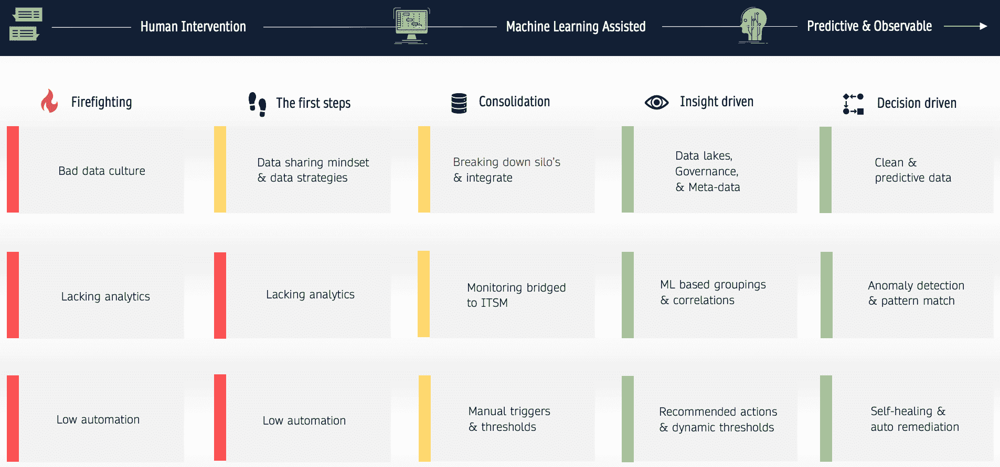
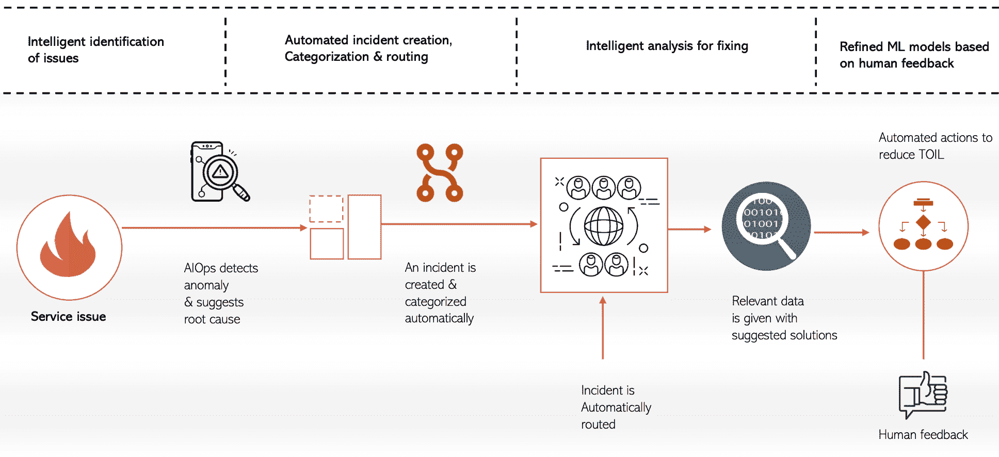

# 如何通过 AIOps 管理复杂的 IT 环境

> 原文：[`www.kdnuggets.com/2022/05/manage-complex-landscape-aiops.html`](https://www.kdnuggets.com/2022/05/manage-complex-landscape-aiops.html)

我们能否通过机器学习和人工智能来管理 IT 运维，通过预测重大干扰事件并在服务中断发生之前解决这些问题？还是说用算法来运行 IT 运维过于复杂？答案是谨慎的肯定，我们可以用算法来运行 IT 运维并做出预测。这是因为随着 AI 和机器学习（ML）技术在这一特定领域的进步，IT 复杂性增加了管理各种业务应用程序和 IT 基础设施的需求和压力。因此，解决这一需求的答案当然是人工智能结合机器学习，换句话说，就是人工智能驱动的 IT 运维（AIOps）。

在这篇关于 AIOps 的首篇博客中，我们将深入探讨 AIOps 是什么，它如何提供无缝的企业 IT 服务以保持系统正常运转，以及人工智能、机器学习和数据科学原理如何被运用来实现这些目标。本文仅是对 AIOps 的初步概述，接下来的博客文章将详细阐述这一方法背后的技术背景和细节。

[AIOps](https://research.einar.partners/servicenow-observability-guidebook/) 的主要支柱

# TOIL 正在消耗 IT 团队的精力

我们称之为 TOIL 的工作是指那些与运行生产服务相关的、手动的、重复的、可自动化的、战术性的、没有持久价值的工作，并且随着服务的增长而线性扩展 1。TOIL 会消耗 IT 团队的精力和时间，因为他们需要处理大量的数据、警报和任务。企业每天可能会有多达 1000 万个事件 2。因此，大量数据、流程和监控对业务的影响之间日益扩大的脱节，呼唤一种新的 IT 基础设施和服务管理与监控的方法。AIOps 就在这里发挥作用。

# 可观察性：对您的应用程序和服务进行深度可视化

在深入讨论 AIOps 之前，必须指出，对 IT 基础设施和系统状态进行良好的可观察性是必要的。能够将正确的数据输入到你的 AI 和机器学习模型中非常重要。可能需要一些基本的 IT 基础设施。我们将在下一篇关于领域专属和领域无关的 AIOps 平台的博客文章中详细讨论。这里的主要信息是：AIOps 需要对 IT 基础设施的每个方面以及所有连接的应用程序具有良好的可观察性和可视性，以捕获和监控整个 IT 环境中 IT 服务和应用程序之间的复杂互动。一旦某个组件缺失且未被监控或观察，当它停止正常工作时，找到根本原因将变得极其困难，因为你在那个部分没有“眼睛”和“耳朵”。话虽如此，让我们看看 AIOps 是如何工作的。

[IT 运维管理成熟度模型](https://research.einar.partners/servicenow-observability-guidebook/)

# 智能预测性 IT 运维管理

我们可以将 AIOps 定义为在 IT 运维中使用人工智能、机器学习和自动化，从而通过最小化人工操作干预来改变 IT 运维的管理方式。目标并不是将人类排除在外，相反，它是为了帮助人类操作员管理不断增加的 IT 运维复杂性。IT 复杂性有三个维度：

+   **体量**：IT 基础设施和业务应用程序生成的数据呈指数级增长。

+   **多样性**：不同类型的数据，如指标、日志、事件、跟踪、文档。

+   **速度**：数据生成的速度正在迅速增长。

为了在重大事件和大量警报面前保持领先，需要预测性、自动化的统计工具来应对 IT 复杂性三大维度所带来的挑战。仅凭人类能力无法提供合适的解决方案。

AIOps 解决方案旨在实现这些目标。我们可以将不同平台/供应商的 AIOps 解决方案概括为四项原则：

+   **高级数据处理和分析**：对大数据进行实时流分析和历史数据分析，以训练 AI 和机器学习模型。

+   **拓扑数据分析**：绘制和发现 IT 环境中的所有 IT 资产和应用程序。

+   **事件和其他相关数据的关联**：将时间和 IT 网络拓扑映射到集群相关事件。此外，通过不断学习数据的行为来发现模式和预测事件或事故。关联分析对于自动化有效、精准的根本原因分析在 IT 服务问题和事故中至关重要。

+   **自动修复：** 在通过 AI 和 ML 持续监控 IT 环境的同时，如果发生异常行为和 IT 问题，AIOps 会推荐人类操作员采取某些措施，或者在启用的情况下，触发自动修复以即时解决问题。

[AIOps 与异常检测系统的示例工作流程](https://research.einar.partners/servicenow-observability-guidebook/)

# 异常检测作为 AIOps 的核心

AIOps 的基本动态是，机器学习算法可以检测和预测可能导致 IT 服务问题的异常，如服务中断或重大干扰事件。此外，根据预测和高级数据处理，可以创建更准确的动态阈值、规则、统计基线、事件和警报。在后续的一系列博客文章中，我们将深入探讨这些先进复杂的过程是如何实现的。

# 总结我们对 AIOps 的全景视角

在这篇博客文章中，我简要概述了如何利用 AI 和机器学习算法管理 IT 运营。即将到来的博客系列将深入探讨我们在这里讨论的每一个概念，并提供更技术性的概述。请继续关注，加入我们的 AIOps 之旅！

**[Akif Baser](https://research.einar.partners/research-team/)** 是一位多学科工程师，对人工智能和计量经济学的研究与开发充满热情。

### 更多相关话题

+   [8 篇改变 NLP 全景的创新 BERT 知识蒸馏论文](https://www.kdnuggets.com/2022/09/eight-innovative-bert-knowledge-distillation-papers-changed-nlp-landscape.html)

+   [首个 ML 价值链全景](https://www.kdnuggets.com/2022/10/first-ml-value-chain-landscape-sequence.html)

+   [AI 驱动世界中的数据工程全景](https://www.kdnuggets.com/2023/05/data-engineering-landscape-aidriven-world.html)

+   [数据全景的发展](https://www.kdnuggets.com/2023/06/evolution-data-landscape.html)

+   [工作的未来：AI 如何改变工作环境](https://www.kdnuggets.com/2023/04/future-work-ai-changing-job-landscape.html)

+   [关于 AI 监管环境的一切](https://www.kdnuggets.com/all-about-the-ai-regulatory-landscape)
