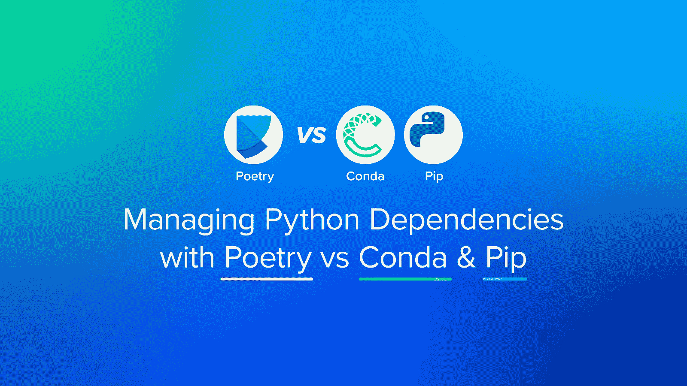

# 管理 Python 依赖项与 Poetry 对比 Conda 和 Pip

> 原文：[`www.kdnuggets.com/managing-python-dependencies-with-poetry-vs-conda-pip`](https://www.kdnuggets.com/managing-python-dependencies-with-poetry-vs-conda-pip)



有效地管理依赖项，包括对项目功能至关重要的库、函数和包，可以通过使用包管理器来实现。Pip 是一种被广泛采用的经典工具，为许多开发者提供了从 Python 包索引 (PyPI) 无缝安装 Python 包的能力。Conda 不仅作为包管理器被认可，还作为环境管理器，扩展了处理 Python 和非 Python 依赖项的能力，使其成为一个多功能的工具。就我们的目的而言，我们将主要关注用于纯 Python 环境。

Pip 和 Conda 是值得信赖的工具，在开发者社区中被广泛使用和信任。然而，随着项目的扩展，在不断增加的依赖项中保持组织变得具有挑战性。在这种背景下，Poetry 作为一种现代化和有序的依赖管理解决方案应运而生。

Poetry 基于 Pip 构建，提出了一种现代化的依赖管理方法。它不仅仅是 Pip 和虚拟环境的简单结合，而是一个涵盖依赖管理、项目打包和构建过程的全面工具。与 Conda 的比较则更为细致；Poetry 旨在简化 Python 项目的打包和分发，提供了一套独特的功能。

Pip 和 Conda 仍然是管理依赖项的宝贵选择，Conda 在处理多样化依赖项方面具有灵活性。另一方面，Poetry 提供了一种现代化且全面的解决方案，简化了 Python 项目及其依赖项的管理。选择合适的工具取决于项目的具体需求和开发者的偏好。

## 包管理

Poetry 使用 pyproject.toml 文件来指定项目的配置，并附带一个自动生成的锁定文件。pyproject.toml 文件的样子如下：

```py
[tool.poetry.dependencies]
python = "³.8"
pandas = "¹.5"
numpy = "¹.24.3"

[tool.poetry.dev.dependencies]
pytest = "⁷.3.2"
precomit = "³.3.3"
```

和其他依赖管理工具一样，Poetry 通过锁定文件认真跟踪当前环境中的包版本。这个锁定文件包含项目元数据、包版本参数等，确保在不同环境中的一致性。开发者可以在 toml 文件中智能地将依赖项分为 dev 和 prod 类别，从而简化部署环境并减少冲突的风险，尤其是在不同的操作系统上。

Poetry 的 `pyproject.toml` 文件旨在解决 Pip 的 `requirement.txt` 和 Conda 的 `environment.yaml` 文件中发现的某些限制。与常常生成冗长依赖列表而没有单独文件中的元数据的 Pip 和 Conda 不同，Poetry 追求更有组织且简洁的表现形式。

虽然 Pip 和 Conda 默认缺乏锁定功能，但需要注意的是，最近版本提供了通过像 `pip-tools` 和 `conda-lock` 这样的已安装库生成锁文件的选项。这种功能确保不同用户可以安装 `requirements.txt` 文件中指定的目标库版本，从而促进了可重复性。

Poetry 作为一个现代且有组织的 Python 依赖管理解决方案，相比于传统工具如 Pip 和 Conda，提供了改进的组织、版本控制和灵活性。

## 更新、安装和移除依赖

使用 Poetry 更新库非常简单，并会考虑其他依赖以确保它们也相应更新。Poetry 有一个批量更新命令，会根据你的 `toml` 文件更新依赖，同时保持所有依赖之间的兼容性，并维护锁文件中的包版本参数。这将同时更新你的锁文件。

至于安装，操作简单至极。要使用 Poetry 安装依赖，你可以使用 `poetry add` 函数，你可以指定版本，使用逻辑指定版本参数（大于、小于），或使用类似 `@latest` 的标志，它将从 PyPI 安装该包的最新版本。你甚至可以在同一个添加函数中组合多个包。任何新安装的包都会自动解决以维持正确的依赖关系。

```py
$poetry add requests pandas@latest
```

至于经典的依赖管理工具，我们来测试一下当尝试安装一个较旧的不兼容版本时会发生什么。Pip 安装的包将输出错误和冲突，但最终仍会安装该包，这可能导致开发情况不理想。Conda 确实有一个解决器来处理兼容性错误并会通知用户，但在找不到解决方案时会立即进入搜索模式，输出次级错误。

```py
(test-env) user:~$ pip install "numpy<1.18.5"
Collecting numpy<1.18.5
  Downloading numpy-1.18.4-cp38-cp38-manylinux1_x86_64.whl (20.7 MB)
     |████████████████████████████████| 20.7 MB 10.9 MB/s
Installing collected packages: numpy
  Attempting uninstall: numpy
    Found existing installation: numpy 1.22.3
    Uninstalling numpy-1.22.3:
      Successfully uninstalled numpy-1.22.3
ERROR: pip's dependency resolver does not currently take into account all the packages that are installed. This behaviour is the source of the following dependency conflicts.
pandas 1.4.2 requires numpy>=1.18.5; platform_machine != "aarch64" and platform_machine != "arm64" and python_version < "3.10", but you have numpy 1.18.4 which is incompatible.
Successfully installed numpy-1.18.4

(test-env) user:~$ pip list
Package         Version
--------------- -------
numpy           1.18.4
pandas          1.4.2
pip             21.1.1
python-dateutil 2.8.2
pytz            2022.1
six             1.16.0
```

Poetry 对依赖兼容性错误有即时响应，能快速并早期通知冲突。它拒绝继续安装，因此用户需要负责寻找不同版本的新包或现有包。我们认为这比 Conda 的即时行动提供了更多控制。

```py
user:~$ poetry add "numpy<1.18.5"

Updating dependencies
Resolving dependencies... (53.1s)
  SolverProblemError

  Because pandas (1.4.2) depends on numpy (>=1.18.5)
   and no versions of pandas match >1.4.2,<2.0.0, pandas (>=1.4.2,<2.0.0) requires numpy (>=1.18.5).
  So, because dependency-manager-test depends on both pandas (¹.4.2) and numpy (<1.18.5), version solving failed.
  ...
user:~$ poetry show
numpy           1.22.3 NumPy is the fundamental package for array computing with Python.
pandas          1.4.2  Powerful data structures for data analysis, time series, and statistics
python-dateutil 2.8.2  Extensions to the standard Python datetime module
pytz            2022.1 World timezone definitions, modern and historical
six             1.16.0 Python 2 and 3 compatibility utilities
```

最后但同样重要的是 Poetry 的包卸载。一些包需要更多的依赖项。对于 Pip，它的包卸载只会卸载定义的包，而不会影响其他包。Conda 会删除一些包，但不是所有的依赖项。另一方面，Poetry 会删除包及其所有依赖项，以保持依赖项列表的整洁。

## Poetry 是否兼容现有的 Pip 或 Conda 项目？

是的，Poetry 兼容现有的由 Pip 或 Conda 管理的项目。只需使用 Poetry 的 `Poetry.toml` 格式初始化你的代码并运行它，即可获取包库及其依赖项，实现无缝过渡。

如果你有一个使用 Pip 或 Conda 的现有项目，你可以毫不费力地将其迁移到 Poetry。Poetry 使用自己的 `pyproject.toml` 文件来管理项目的依赖项和设置。要在你的项目中开始使用 Poetry，你可以按照以下步骤进行：

1\. 通过 curl 和管道或者使用 Pip 安装 Poetry

```py
curl -sSL https://raw.githubusercontent.com/python-poetry/poetry/master/get-poetry.py | python -
```

2\. 导航到你现有项目的根目录。

3\. 在你的项目目录中初始化 Poetry：

```py
poetry init
```

这个命令将引导你通过一系列提示来设置你项目的初始配置。

4\. 初始化完成后，Poetry 会在你的项目目录中创建 `pyproject.toml` 文件。打开这个 toml 文件以添加或修改你的项目依赖项。

5\. 安装项目中的现有依赖项到

```py
poetry install
```

这将创建一个虚拟环境，并在其中安装项目的依赖项。

6\. 现在你可以使用 Poetry 的 run 命令来执行你项目的脚本，类似于你使用 Python 或 Conda 命令的方式。

```py
poetry run python my_script.py
```

Poetry 管理你的项目的虚拟环境和依赖项解析，使其兼容现有的 Pip 或 Conda 项目。它简化了依赖项管理，并允许在不同环境中进行一致的包安装。

注意：在对项目的配置或依赖项管理工具进行任何重大更改之前，备份项目始终是一个好习惯。

## 结束语

确保包的正确版本在你的代码环境中是至关重要的，以便每次都能获得正确的结果。代码后端的轻微变化可能会改变结果。同时，保持这些包和库的更新同样重要，以利用每个补丁提供的创新。

对于处理更多复杂和多样化项目、依赖项较多的情况，Poetry 是一个很好的工具来管理这些依赖项。虽然 Pip 和 Conda 仍然是可行的选项，但它们更适合较小的、不那么复杂的环境。不是每个人都可能使用 Poetry，但由于 Pip 存在已久，使用 Pip 的便利性可能值得考虑。

但如果你的项目和工作负载重视组织的重要性，并愿意探索新工具以改善你的流程，Poetry 是你应该考虑的工具。从 Pip 到 Poetry 的扩展功能确实带来了变化。我们鼓励你亲自试用 Poetry。

[原文](https://www.exxactcorp.com/blog/Deep-Learning/managing-python-dependencies-with-poetry-vs-conda-pip)。经许可转载。

**[Kevin Vu](https://blog.exxactcorp.com/)** 管理着 [Exxact Corp 博客](https://blog.exxactcorp.com/)，并与许多才华横溢的作者合作，他们撰写关于深度学习不同方面的内容。

### 更多相关内容

+   [忘掉 PIP、Conda 和 requirements.txt！改用 Poetry，感谢以后…](https://www.kdnuggets.com/2023/07/forget-pip-conda-requirementstxt-poetry-instead-thank-later.html)

+   [作为数据科学家的可重用 Python 代码管理](https://www.kdnuggets.com/2021/06/managing-reusable-python-code-data-scientist.html)

+   [管理深度学习数据集的新方法](https://www.kdnuggets.com/2022/03/new-way-managing-deep-learning-datasets.html)

+   [数据科学项目管理的 4 个步骤](https://www.kdnuggets.com/2022/05/4-steps-managing-data-science-project.html)

+   [在生产中管理模型漂移与 MLOps](https://www.kdnuggets.com/2023/05/managing-model-drift-production-mlops.html)

+   [金融科技中的人工智能：管理未来的金融](https://www.kdnuggets.com/2022/10/ai-fintech-managing-finance-future.html)
