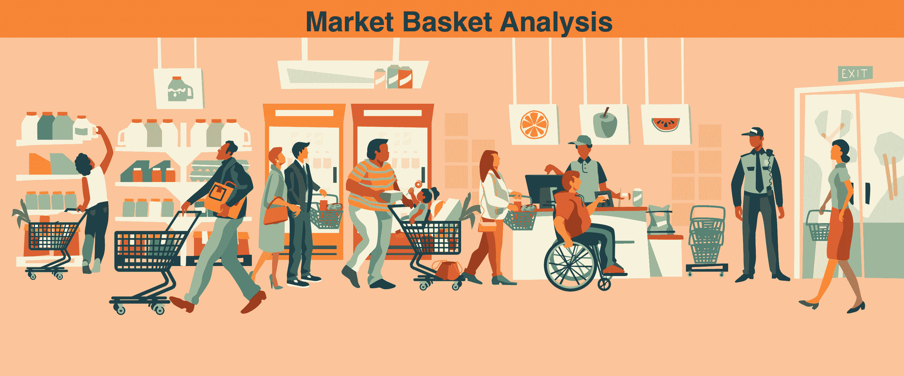
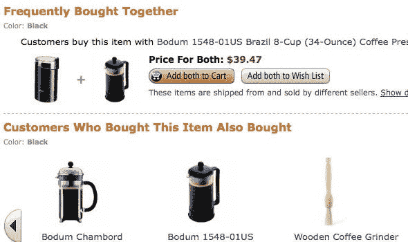
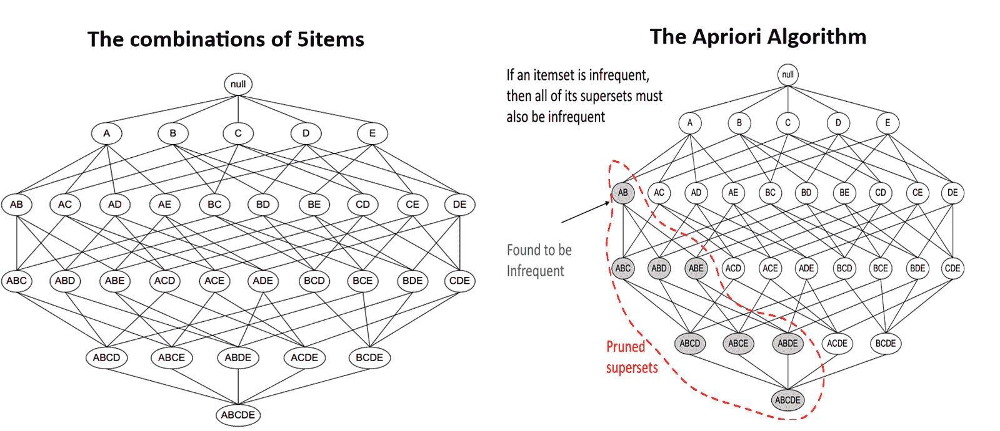

# 市场篮子分析：教程

> 原文：[`www.kdnuggets.com/2019/12/market-basket-analysis.html`](https://www.kdnuggets.com/2019/12/market-basket-analysis.html)

评论

来源：[oracle.com](https://blogs.oracle.com/datascience/overview-of-traditional-machine-learning-techniques)

* * *

## 我们的前三课程推荐

 1\. [Google 网络安全证书](https://www.kdnuggets.com/google-cybersecurity) - 快速进入网络安全职业的快车道。

 2\. [Google 数据分析专业证书](https://www.kdnuggets.com/google-data-analytics) - 提升你的数据分析技能

 3\. [Google IT 支持专业证书](https://www.kdnuggets.com/google-itsupport) - 支持你的组织在 IT 领域

* * *

零售业务的命脉一直是销售。零售商不能假设他的客户知道所有的产品。他必须努力以增加客户参与度和销售额的方式展示所有相关选项。

### **关联规则挖掘**

关联规则挖掘用于寻找集合中不同对象之间的关联，发现交易数据库、关系数据库或任何其他信息库中的频繁模式。关联规则挖掘的应用包括市场营销、零售中的篮子数据分析（或市场篮子分析）、聚类和分类。

寻找这些模式的最常见方法是市场篮子分析，这是一种由大型零售商如 Amazon、Flipkart 等使用的关键技术，通过发现顾客在“购物篮”中放置的不同商品之间的关联来分析顾客的购买习惯。发现这些关联可以帮助零售商通过洞察哪些商品经常一起购买来制定营销策略。这些策略可能包括：

+   根据趋势更改商店布局

+   客户行为分析

+   目录设计

+   在线商店的交叉营销

+   顾客购买的热门商品是什么

+   定制的电子邮件加上销售等

在线零售商和出版商可以使用这种分析来：

+   通知内容项在其媒体网站上的位置或产品在其目录中的位置

+   提供有针对性的营销（例如，向购买了特定产品的顾客发送有关其他产品及相关优惠的电子邮件，这些产品可能对他们感兴趣。）

### **关联与推荐的区别**

关联规则并不提取个人的偏好，而是寻找每个独立交易中元素集合之间的关系。这使得它们不同于用于推荐系统的**协同过滤**。

为了更好地理解，请查看下方来自 amazon.com 的快照，你会在每个产品的信息页面上看到两个标题：“常一起购买的商品”和“购买了此商品的顾客还购买了”。

**“常一起购买的商品” → 关联**

**“购买了此商品的顾客还购买了” → 推荐**



现在说实话，市场篮子分析是*非常*简单的。确实如此：你实际上只是在查看不同元素一起出现的可能性。虽然不仅仅是这样，但这就是这个技术的基础。我们真正感兴趣的是了解事物发生在一起的频率以及如何预测*何时*它们会一起发生。

### **Apriori 算法**

Apriori 算法假设任何频繁项集的子集也必须是频繁的。它是市场篮子分析背后的算法。

比如，一个包含 {葡萄，苹果，芒果} 的交易也包含 {葡萄，芒果}。因此，根据 Apriori 原则，如果 {葡萄，苹果，芒果} 是频繁的，那么 {葡萄，芒果} 也必须是频繁的。

这里是一个包含六个交易的数据集。每个交易是由 0 和 1 组合而成，其中 0 表示项的缺失，1 表示项的存在。


数据集

为了从这个小型商业场景中找出有趣的规则，我们将使用以下矩阵：

**1\. 支持度：** 这是项的默认流行度。从数学角度看，项**A** 的支持度就是涉及到**A** 的交易数与总交易数的比率。

支持度(葡萄) = (涉及到葡萄的交易数) / (总交易数)

支持度(葡萄) = 0.666

**2\. 置信度：** 顾客购买**A** 和 **B** 的可能性。它是涉及到**A** 和 **B** 的交易数与涉及到**B** 的交易数之比。

置信度(A => B) = (同时涉及 A 和 B 的交易数) / (仅涉及 A 的交易数)

置信度({葡萄，苹果} => {芒果}) = 支持度(葡萄，苹果，芒果) / 支持度(葡萄，苹果)

= 2/6 / 3/6

= 0.667

**3\. 提升度：** 当你销售**B**时，**A**的销售量增加。

提升度(A => B) = 置信度(A, B) / 支持度(B)

提升度 ({葡萄，苹果} => {芒果}) = 1

因此，顾客同时购买**A** 和 **B** 的可能性是单独购买的‘提升度’倍数。

+   **提升度 (A => B)** = 1 表示项集内没有相关性。

+   **提升度 (A => B)** > 1 表示项集内存在正相关，即项集中的产品**A** 和 *B* 更有可能被一起购买。

+   **提升度 (A => B)** < 1 表示项集内存在负相关，即项集中的产品**A** 和 *B* 不太可能被一起购买。

关联规则基础的算法被视为两步法：

1.  **频繁项集生成：** 查找所有支持度 >= 预设最小支持度的频繁项集

1.  **规则生成：** 列出所有从频繁项集中生成的关联规则。计算所有规则的支持度和置信度。修剪未通过最小支持度和最小置信度阈值的规则。

### **Apriori 算法的限制**

频繁项集生成是计算最耗时的步骤，因为算法扫描数据库的次数过多，从而降低了整体性能。因此，算法假设数据库是常驻内存的。

此外，该算法的时间和空间复杂度非常高：O(2^{|D|})，因此是指数级的，其中 |D| 是数据库中存在的水平宽度（项的总数）。

### **优化 Apriori 算法**



**交易减少**

我们可以通过以下方法优化现有的 Apriori 算法，从而减少时间消耗并且使用更少的内存：

+   **基于哈希的项集计数：** 其对应哈希桶计数低于阈值的 k-项集不能是频繁的。

+   **交易减少：** 不包含任何频繁 k-项集的交易在后续扫描中是无用的。

+   **划分：** 数据库中潜在频繁的项集必须在数据库的至少一个划分中是频繁的。

+   **抽样：** 在给定数据的子集上进行挖掘，较低的支持度阈值 + 确定完整性的方法。

+   **动态项集计数：** 仅当所有子集被估计为频繁时才添加新的候选项集。

### Apriori 算法的实现 — 使用 Python 进行市场篮子分析

一家零售商试图找出 20 件商品之间的关联规则，以确定哪些商品更常一起购买，从而可以将这些商品放在一起以增加销售。

你可以从 [这里](https://drive.google.com/open?id=1kP8SLP1dRKDWXVRInRwHRcW91LxowtTq) 下载数据集。

**环境设置：** Python 3.x

pip install apyori

加载所有所需的库和数据集。

```py
import numpy as np
import matplotlib.pyplot as plt
import pandas as pd
from apyori import aprioridataset = pd.read_csv('/Users/.../.../Market_Basket_Optimisation.csv', header = None)
```


数据集

现在，将 Pandas DataFrame 转换为列表列表。

```py
transactions = []
for i in range(0, 7501):
    transactions.append([str(dataset.values[i,j]) for j in range(0, 20)])
```

构建 Apriori 模型。

```py
rules = apriori(transactions, min_support = 0.003, min_confidence = 0.2, min_lift = 3, min_length = 2)
```

打印规则：

```py
print(list(rules))
```

让我们来看一个规则：

```py
RelationRecord(items=frozenset({'avocado', 'spaghetti', 'milk'}), support=0.003332888948140248, ordered_statistics=[OrderedStatistic(items_base=frozenset({'avocado', 'spaghetti'}), items_add=frozenset({'milk'}), confidence=0.41666666666666663, lift=3.215449245541838)]),
```

第一条规则的支持值为 0.003。这个数字是通过将包含‘牛油果’、‘意大利面’和‘牛奶’的交易数量除以总交易数量计算得出的。

该规则的置信度为 0.416，这表明在所有包含‘牛油果’和‘意大利面’的交易中，41.6% 的交易也包含‘牛奶’。

1.241 的提升度告诉我们，与‘牛奶’的默认销售概率相比，购买‘牛油果’和‘意大利面’的客户购买‘牛奶’的可能性高出 1.241 倍。

### 结论

除了作为零售商技术的流行性外，市场篮子分析还适用于许多其他领域：

+   在制造业中进行设备故障的预测性分析。

+   在制药/生物信息学中发现诊断和不同患者群体所用药物之间的共现关系。

+   在银行/犯罪学中基于信用卡使用数据进行欺诈检测。

+   通过将购买行为与人口统计和社会经济数据关联来分析客户行为。

越来越多的组织正在发现如何利用市场篮分析来获得对关联和隐藏关系的有用洞察。随着行业领导者继续探索这一技术的价值，市场篮分析的预测版本正在许多领域取得进展，以识别顺序购买行为。

恭喜你！你已经学习了 Apriori 算法，它是数据挖掘中最常用的算法之一。你已经了解了关联规则挖掘及其应用，以及在零售领域称为**市场篮分析**的应用。

好了，这篇文章就是这些内容了。希望你们喜欢阅读，请在评论区分享你的建议/观点/问题。

感谢阅读 !!!

**个人简介：[纳格什·辛格·乔汉](https://www.linkedin.com/in/nagesh-singh-chauhan-6936bb13b/)** 是一位数据科学爱好者。对大数据、Python 和机器学习感兴趣。

[原文](https://towardsdatascience.com/market-basket-analysis-978ac064d8c6)。经许可转载。

**相关：**

+   频繁模式挖掘与 Apriori 算法：简明技术概述

+   初学者的十大机器学习算法

+   友好的支持向量机介绍

### 相关话题

+   [市场数据与新闻：时间序列分析](https://www.kdnuggets.com/2022/06/market-data-news-time-series-analysis.html)

+   [KDnuggets 新闻，6 月 29 日：数据科学的 20 个基本 Linux 命令…](https://www.kdnuggets.com/2022/n26.html)

+   [通过 DataOps.live 解锁 DataOps 成功 - 在 Gartner 中的亮点…](https://www.kdnuggets.com/2023/07/dataopslive-unlock-dataops-success-featured-gartner-market-guide.html)

+   [通过 DataOps.live 解锁 DataOps 成功：在 Gartner 市场指南中的亮点！](https://www.kdnuggets.com/2023/07/dataopslive-unlock-dataops-success-featured-gartner-market-guide-2.html)

+   [机器学习的数据标注：市场概况、方法和工具](https://www.kdnuggets.com/2021/12/data-labeling-ml-overview-and-tools.html)

+   [4 个职业教训帮助我应对困难的就业市场](https://www.kdnuggets.com/2023/05/4-lessons-made-difference-navigating-current-job-market.html)
