# 市场数据与新闻：时间序列分析

> 原文：[`www.kdnuggets.com/2022/06/market-data-news-time-series-analysis.html`](https://www.kdnuggets.com/2022/06/market-data-news-time-series-analysis.html)

**作者：Parsa Ghaffari 和 Chris Hokamp**

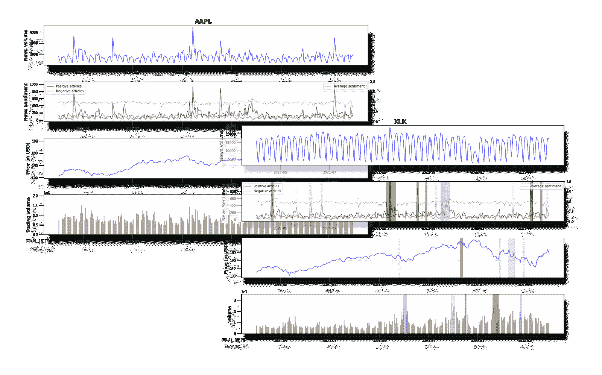

* * *

## 我们的前三大课程推荐

 1\. [谷歌网络安全证书](https://www.kdnuggets.com/google-cybersecurity) - 快速进入网络安全职业轨道。

 2\. [谷歌数据分析专业证书](https://www.kdnuggets.com/google-data-analytics) - 提升你的数据分析能力

 3\. [谷歌 IT 支持专业证书](https://www.kdnuggets.com/google-itsupport) - 支持你的组织进行 IT 工作

* * *

**总结** - 在本文中，我们介绍了一些用于研究股市与新闻之间关系的工具和技术。我们探讨了时间序列处理、异常检测和基于事件的新闻视角。我们还生成了直观的图表来演示这些概念，并在笔记本中分享了所有代码。

你可以在[这个笔记本](https://colab.research.google.com/drive/16--r_CHxnUA6nAka3ByCMMacfBtcKnLR?usp=sharing)中查看代码。

# 介绍

新闻对市场的影响一直是许多年来备受关注的领域，随着定量分析的出现，从学术界到量化分析师，许多人使用统计方法更好地理解新闻与市场数据（如股价或交易量）之间的关系。

在本文中，我们旨在提供一个简单的实用指南，用于探索新闻数据与市场之间的统计关系，为更深入和更有针对性的分析奠定基础。我们的目标是为读者提供一套工具，帮助他们探索和交叉参考金融及新闻数据。我们的目标不是预测股市或发现特定的相关性或因果关系。

# 将市场数据与新闻对齐

为了研究新闻与市场数据之间的关系，我们首先利用[Aylien 的新闻 API](https://aylien.com/product/news-api)，它允许用户使用全面的筛选器过滤全球新闻数据，包括实时和历史数据。我们使用这些筛选器创建与我们关注的证券（例如股票、ETF、加密货币等）相对应的新闻源。然后，我们使用 Yahoo! Finance 获取这些证券的市场数据（价格和成交量）。将两者结合起来，我们可以构建一个包含市场和新闻相关数据的联合数据集，适用于任何给定的证券，时间范围可选择。

下表总结了不同类型金融实体的[News API](https://aylien.com/product/news-api)筛选器：

| **证券/市场数据** | **对应的[新闻 API](https://aylien.com/product/news-api) 过滤器** | **过滤描述** |
| --- | --- | --- |
| 股票 | 实体 | 根据公司、产品、人物等过滤新闻。支持公司代码 |
| ETF | 行业（使用智能标签器） | 根据 1,500 个行业和子行业过滤新闻 |
| 事件 | 主题与事件（使用智能标签器） | 根据 2,900 个主题和事件的分类法过滤新闻 |

我们还可以利用[新闻 API](https://aylien.com/product/news-api)中提供的其他筛选选项，如来源和地区，来进一步细化我们的新闻源，这在具体任务中可能会很有用。

虽然我们在本文中主要使用市场的价格和交易量数据，但值得一提的是，我们在此文中探讨的许多技术可以扩展到其他类型的金融或经济数据。例如，为了研究裁员与新闻之间的关系，我们可以从统计局获取历史裁员数据，并使用[新闻 API](https://aylien.com/product/news-api)的事件过滤器将其与新闻对齐（例如，检索明确涉及裁员和劳动力相关公告的新闻文章）。

# 一些基本示例

为了更好地展示对齐的概念，让我们看几个基本示例。我们将研究两家科技公司，苹果和特斯拉，技术行业 ETF XLK，以及最后的标准普尔指数 (GSPC)。对于每个实体，我们将从 2021 年 4 月 1 日到 2022 年 4 月 1 日的 1 年期间内获取并绘制新闻和市场数据在一个图表上。我们可以使用多种参数来获取市场和新闻数据，例如：

| **市场数据参数** | **新闻数据参数** |
| --- | --- |
| 价格（调整后的收盘价）和衍生物（例如每日收益率） | 文章数量 - 使用时间序列端点检索 |
| 量 | 文章的平均情绪 - 作为时间序列数据检索，针对正面和负面标题的文章，然后取平均值 |

### 示例 1\. 苹果公司 (AAPL) 新闻量、情绪、股票价格和交易量

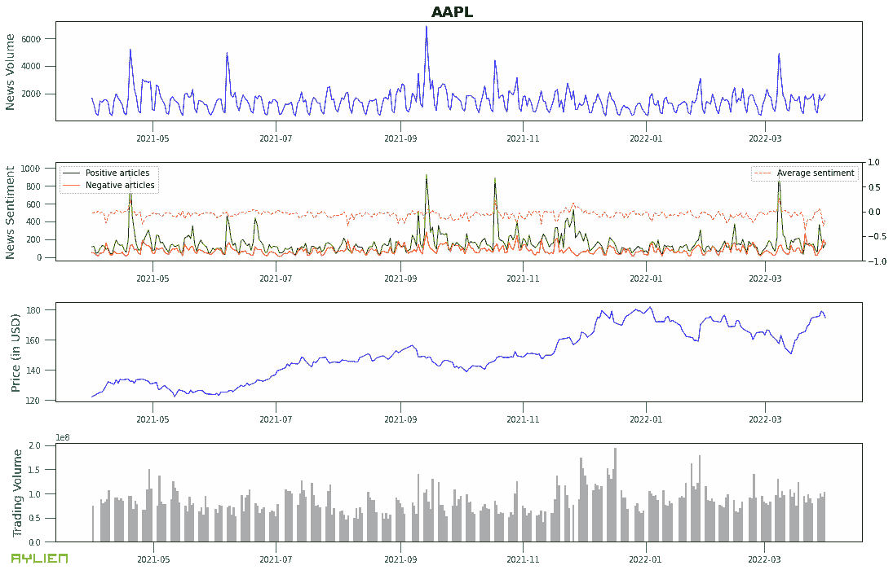

### 示例 2\. 特斯拉公司 (TSLA) 新闻量、情绪、股票价格和交易量

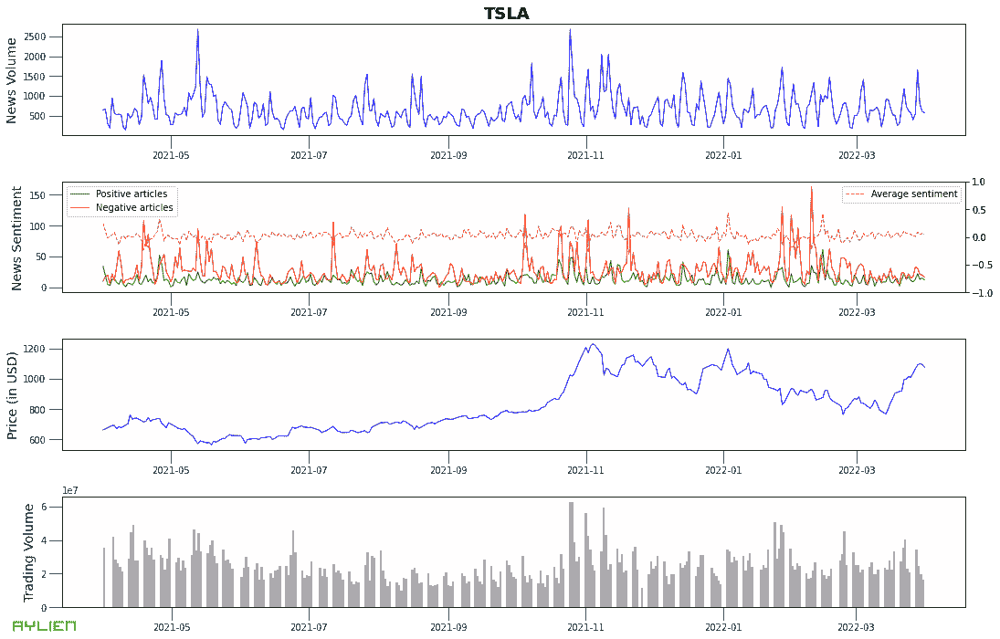

### 示例 3\. 技术行业 ETF (XLK) 新闻量、情绪、股票价格和交易量

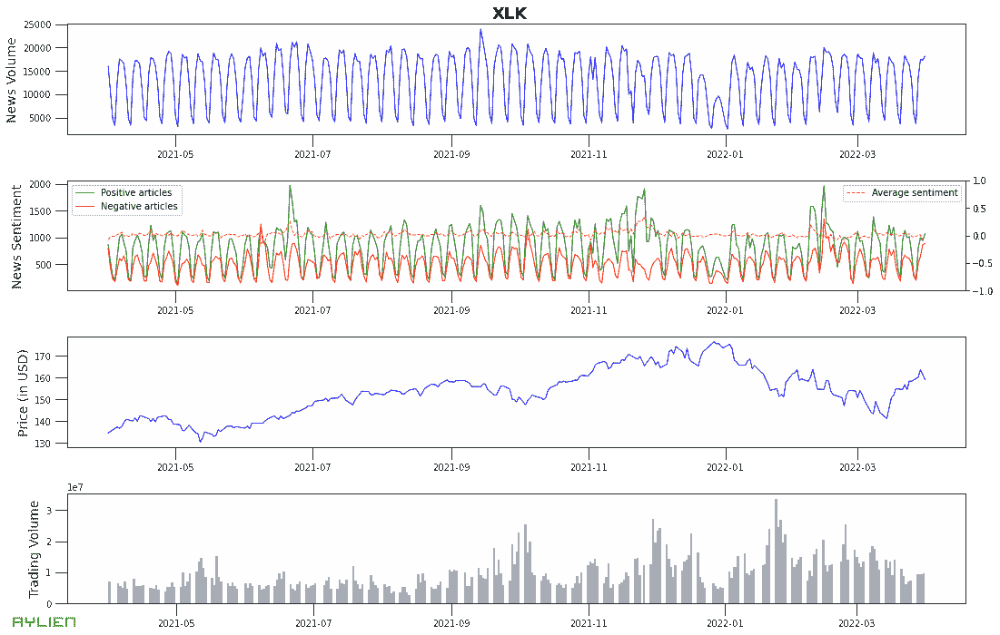

这是一种快速简便的方式，通过可视化比较各种时间序列之间的变化。在接下来的部分，我们将具体研究如何找到并比较这些时间序列上的有趣点，作为研究因果关系和相关关系的步骤。

# 深入研究关系

## 时间序列分析

到目前为止，我们已经以对齐的方式检索了反映新闻（文章数量、情感）和市场（股票价格、交易量）属性的时间序列数据。为了进一步分解和理解这些时间序列，我们将采用一些时间序列分析技术。我们将使用 Meta 的 [Kats](https://facebookresearch.github.io/Kats/) 库，它提供了一系列时间序列分析工具。

## 1\. 预处理

我们首先将对时间序列进行分解，以识别和标准化时间序列中的趋势和季节性。

我们将把 Kats 的分解工具以“加性”模式应用到我们的每个时间序列中。

### 示例 4\. 苹果公司 (AAPL) 的新闻量时间序列分解为趋势、季节性和残差

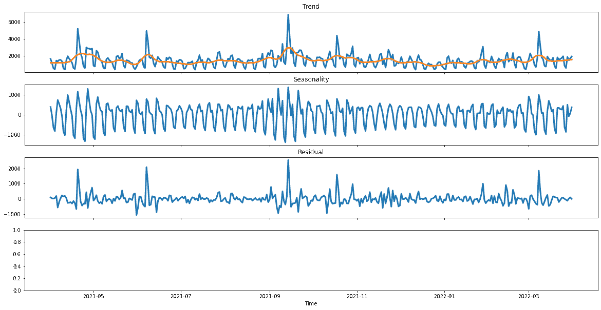

## 2\. 预测

Kats 包中的另一个有用工具是其预测模块。Kats 支持各种时间序列预测技术，包括 SARIMA、Prophet（Meta 的预测库）和 [Holt-Winters](https://medium.com/analytics-vidhya/a-thorough-introduction-to-holt-winters-forecasting-c21810b8c0e6)，以及集成预测模型。每种技术都有优缺点，并需要调整参数以在给定时间序列中实现最佳效果。你可以在 [这里](https://github.com/facebookresearch/Kats/blob/main/tutorials/kats_201_forecasting.ipynb) 阅读有关 Kats 预测模块的更多信息。

请注意，我们在这里引入预测作为时间序列分析技术。我们的目标不是预测未来的新闻量或股票价格。

### 示例 5\. 使用 Holt-Winters 对苹果公司 (AAPL) 新闻文章量进行的 1 个月预测

## 3\. 变点检测

变点检测试图识别随机过程或时间序列概率分布发生变化的时间，例如时间序列均值的变化。它是时间序列分析中最受欢迎的检测任务之一。

与预测类似，Kats 支持多种变点检测模型，包括：

+   CUSUM 作为一种检测时间序列均值上升/下降的方法

+   贝叶斯在线变点检测 (BOCPD)，作为检测时间序列中持续时间的突变的方法

+   RobustStatDetector，类似于 CUSUM，是一种变点检测算法，用于找到时间序列数据中的均值变化

为了更好地展示这个概念，我们将把 BOCPD 应用到苹果新闻量时间序列中，以识别有关苹果新闻覆盖的突然跳跃。

### 示例 6\. 贝叶斯在线变点检测 (BOCPD) 应用于有关苹果公司 (AAPL) 新闻文章的量

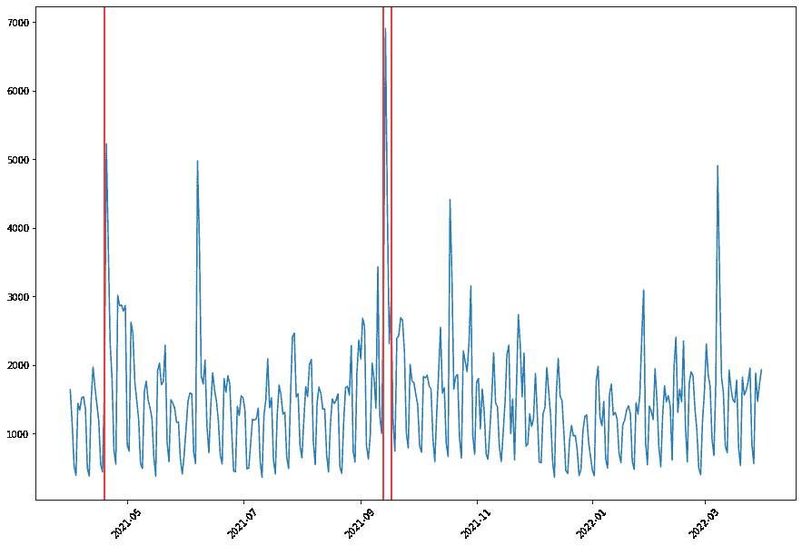

## 4\. 异常检测

异常是任何时间序列数据的重要方面，对于像苹果这样的大公司所撰写的新闻文章数量等相对稳定的活动，异常反映了基本输入的根本变化，而这些变化可能反映了诸如盈利公告或新产品发布等重要的现实世界变化。

我们实现了一个简单但强大的算法，通过在修正时间序列数据中的趋势和季节性之后，检测超出四分位数范围的点来识别异常。这个算法的输出是一系列一个或多个感兴趣的窗口。

一些[Aylien](https://aylien.com/)的客户目前正在使用类似的算法，旨在通知他们的交易员市场中可能与新闻头条相关的有趣变动。

### 示例 7\. 将异常检测应用于苹果公司（AAPL）的新闻量、新闻情绪、股票价格和交易量

每个异常的显著性通过从蓝色（弱）到红色（强）的颜色进行指示。对于情绪异常，我们使用绿色表示正面，红色表示负面。我们可以看到新闻量和新闻情绪中的一些异常之间有重叠。此外，正面情绪时间序列中的一些异常似乎先于异常的交易量。

## 5\. 相关性（Beta 和 R 平方）

在观察股票价格或交易量的变动时，理解这些变动是否独立发生或与市场相关非常重要。直观上，当证券的变动独立于市场时，或者在变动对市场的依赖性较小时，我们或许会期望看到新闻与市场活动之间有更显著的相关性。

为了研究这一假设，我们可以利用两个知名的金融指标：Beta 值和 R 平方值。

Beta 是一个派生统计量，用于衡量股票相对于整体市场或基准股票/指数的方差或波动性。从理论上讲，高 Beta 股票在市场上涨时表现出超额的表现，在市场下跌时表现出超额的低迷。为了计算股票的 Beta 值，我们可以绘制其变化与基准股票/指数（例如 S&P 500）的变化对比，并找到最适合数据的线性回归线。这条线的斜率代表 Beta 值。

R 平方衡量证券的表现可以归因于所选基准指数表现的程度。换句话说，R 平方旨在确定资产的变动有多少可以通过市场的变动来解释。

### 示例 8\. 新闻量/情绪，与苹果公司（AAPL）相对于 S&P 指数和科技部门 ETF（XLK）的 Beta 值和 R 平方值

## 6\. 新闻事件

[Aylien 新闻 API](https://aylien.com/product/news-api)的一个强大功能是其根据主题、事件和行业对文章进行分类的能力（这一功能称为[Smart Tagger](https://aylien.com/smart-tagger-aylien-news-api)）。[Aylien](https://aylien.com/)使用高度详细的分类法和 NLP 模型来识别与特定商业事件（例如并购或分析师评论）或行业（例如技术或制药）相关的语言片段。

我们可以利用这一能力将新闻量时间序列拆分为针对关键业务事件的单独时间序列，例如：

+   新产品 - 关于新产品发布的新闻

+   裁员 - 关于裁员的新闻

+   分析师评论 - 关于股票的分析师评论、财报公告等

+   股票 - 与股市相关的文章

+   企业收益 - 企业收益公告

+   并购 - 关于并购事件的新闻

+   店铺开业 - 消费品业务的新店开业

### 示例 9\. 新闻文章时间序列按事件类型划分，针对苹果公司 (AAPL)

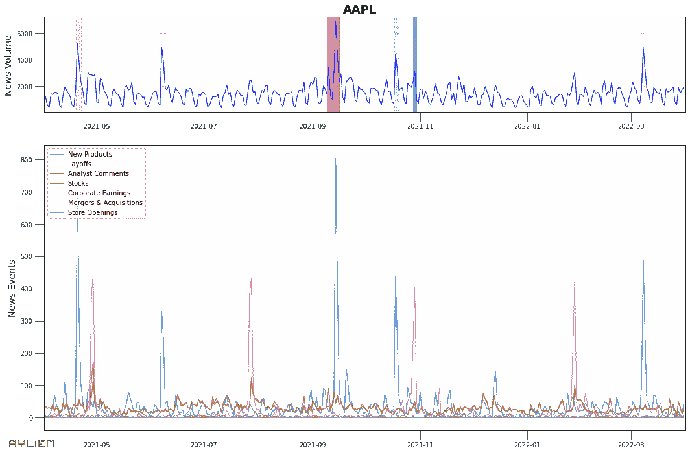

值得关注的是，关于苹果公司财报公告的新闻文章在量和频率（按季度）上的一致性，以及苹果公司宣布新产品时标记为“新产品”的文章激增。

将之前的所有图表整合在一起，我们得到了一个相当丰富和全面的时间序列数据集，用于进一步分析：

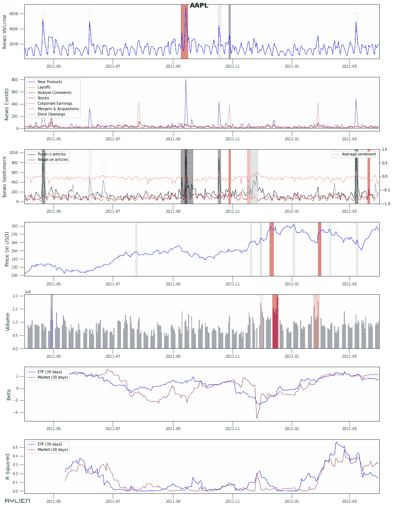

# 结论

在本文中，我们探讨了一些基础和高级概念，用于研究市场数据和新闻数据之间的关系，并介绍了一些构建模块，可以用来进行更详细的分析。

+   我们演示了如何检索和对齐市场和新闻数据，针对感兴趣的股票或 ETF；

+   我们引入了一些时间序列数据和分析的预处理步骤；

+   我们探索了几种不同的技术来识别和对齐不同时间序列数据中的异常；并且

+   我们研究了如何根据新闻文章的语义属性（如情感或类别）对新闻时间序列数据进行细分。

# 未来工作

在这项工作之后，一些有趣的探索方向如下：

+   多变量异常检测：检测多个时间序列中的异常，识别在多个时间序列中持续存在的小异常，分析新闻和市场数据之间的关系。

+   时间序列之间的相似性搜索：使用模式识别识别不同时间序列之间的相似性。

+   探索因果关系模型，例如格兰杰因果关系，以识别一个时间序列中的信号，这些信号可以很好地预测另一个时间序列。

+   将此工作扩展到其他类型的证券（如加密货币或商品）和市场信号（如宏观经济指标）。

# 附录

## 1\. 新闻量、新闻情感、股票价格和交易量图表：

+   苹果公司 (AAPL)

+   特斯拉公司 (TSLA)

+   XLF - 科技行业 ETF

+   辉瑞公司 (PFE)

+   Moderna 公司 (MRNA)

+   XPH - 制药行业 ETF

+   标准普尔指数

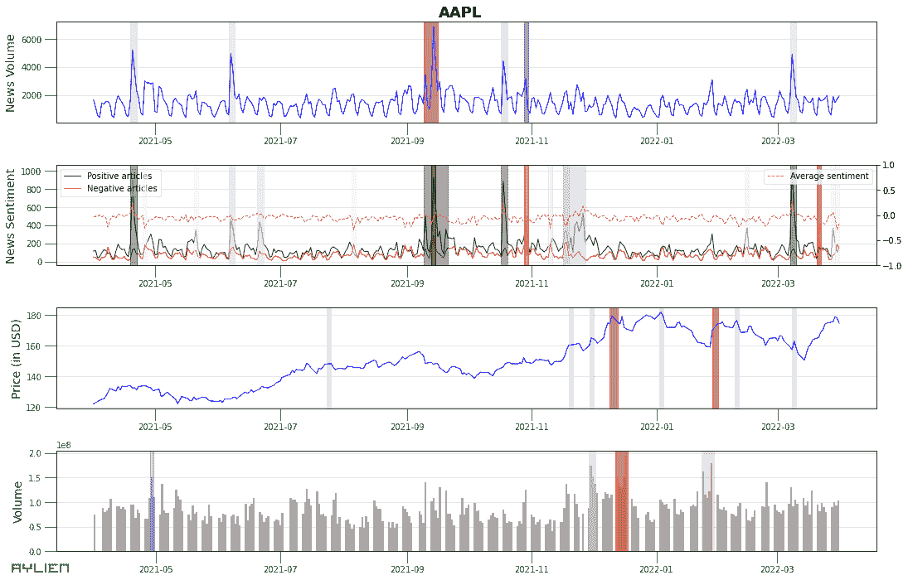

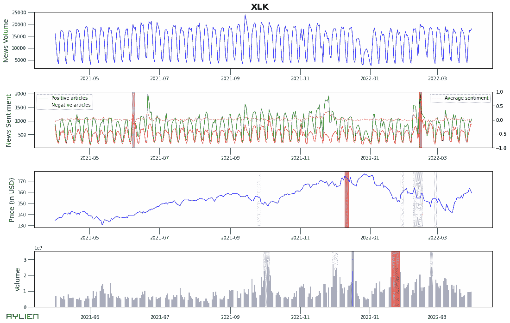

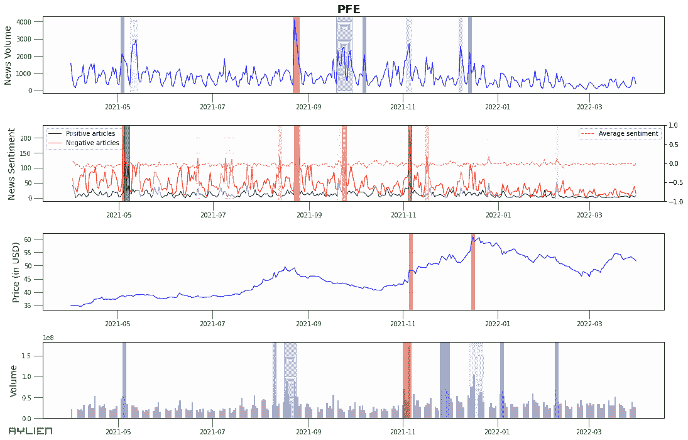

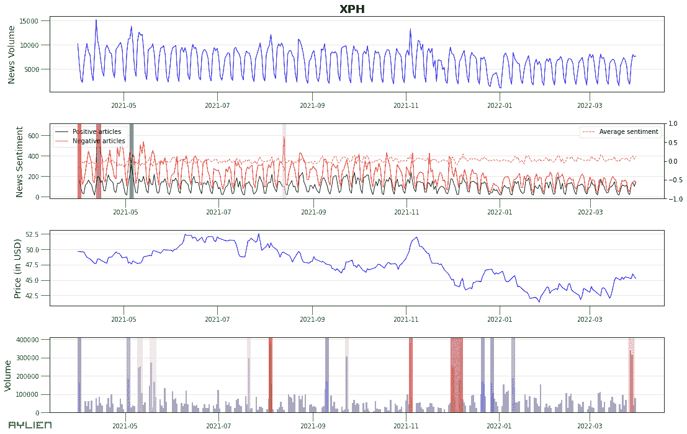

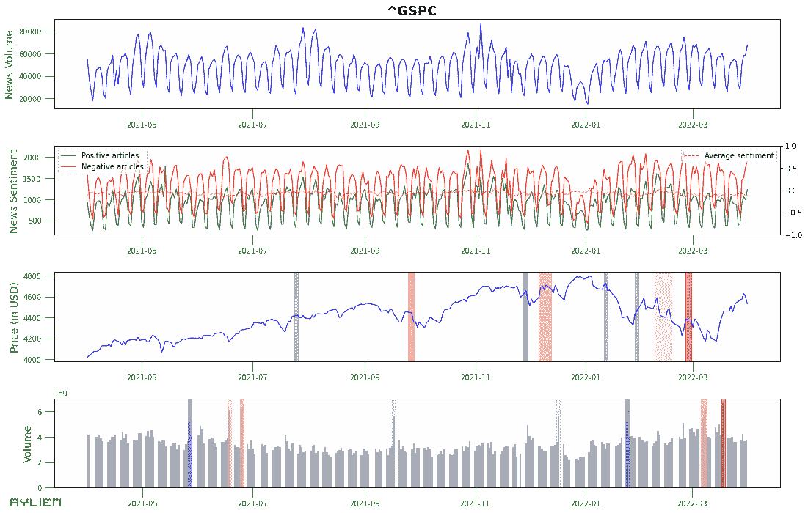

## 2\. 新闻量、新闻情感、β值和 R 平方值：

+   苹果公司 (AAPL)

+   特斯拉公司 (TSLA)

+   辉瑞公司 (PFE)

+   Moderna 公司 (MRNA)

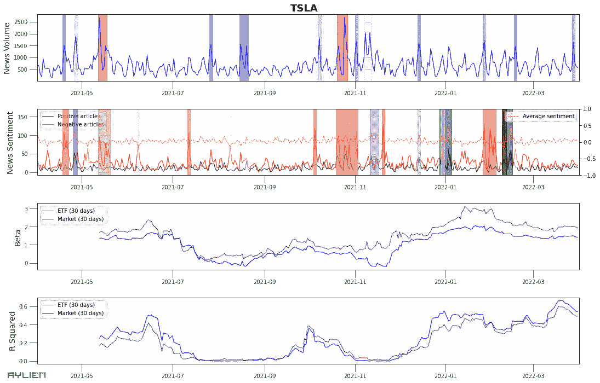

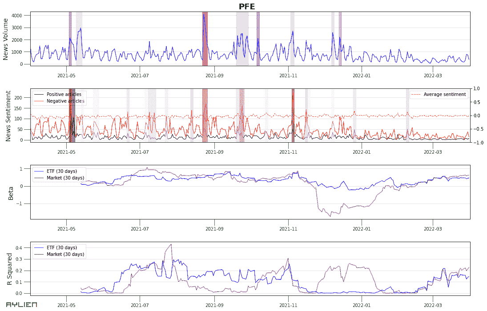

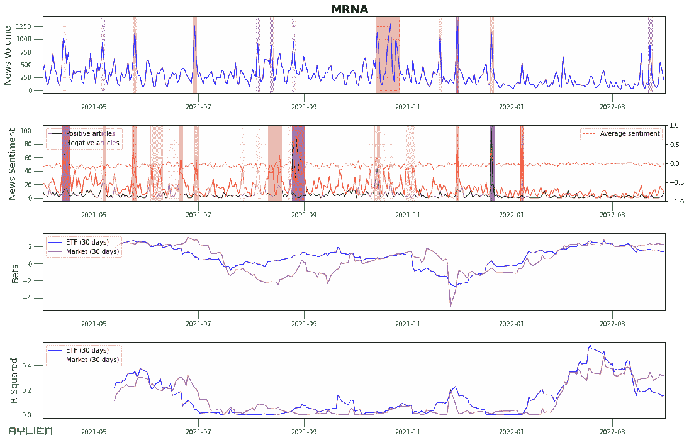

**[Parsa Ghaffari](https://ie.linkedin.com/in/parsa-ghaffari-a7300a24)** ([@parsaghaffari](https://twitter.com/parsaghaffari)) 是 [AYLIEN](https://aylien.com/) 的首席执行官和创始人。AYLIEN 是一家市场和风险智能金融科技公司，主要客户包括 Wells Fargo、IHS Markit、Revolut 和 Fidelity，这些客户依赖 AYLIEN 的平台将全球新闻数据转换为识别风险和机会的丰富、可靠且实时的信息源。Parsa 的背景是人工智能研究和开发，特别关注基于文本数据和自然语言处理的定量风险建模。

### 更多相关内容

+   [KDnuggets 新闻，6 月 29 日：数据科学的 20 个基本 Linux 命令…](https://www.kdnuggets.com/2022/n26.html)

+   [时间序列分析：Python 中的 ARIMA 模型](https://www.kdnuggets.com/2023/08/times-series-analysis-arima-models-python.html)

+   [无代码时间序列分析与 KNIME](https://www.kdnuggets.com/2022/10/packt-codeless-time-series-analysis-knime.html)

+   [创建时间序列比率分析仪表盘](https://www.kdnuggets.com/2023/06/wolfer-create-time-series-ratio-analysis-dashboard.html)

+   [如何在 R 中进行时间序列分析](https://www.kdnuggets.com/how-to-conduct-time-series-analysis-in-r)

+   [使用 Ploomber、Arima、Python 和 Slurm 进行时间序列预测](https://www.kdnuggets.com/2022/03/time-series-forecasting-ploomber-arima-python-slurm.html)
