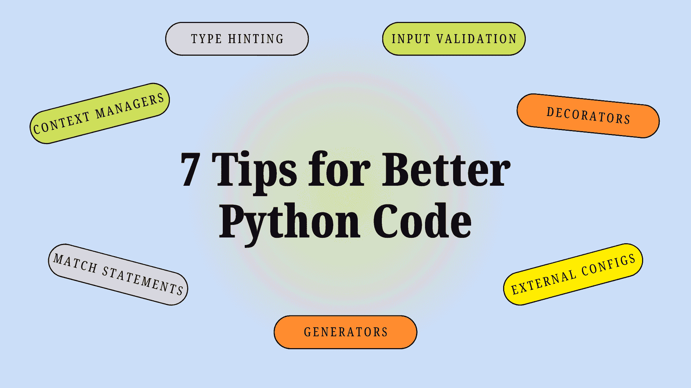

# 掌握 Python：编写清晰、有组织和高效代码的 7 种策略

> 原文：[`www.kdnuggets.com/mastering-python-7-strategies-for-writing-clear-organized-and-efficient-code`](https://www.kdnuggets.com/mastering-python-7-strategies-for-writing-clear-organized-and-efficient-code)

 作者提供的图片

您是否曾将自己的 Python 代码与经验丰富的开发者的代码进行比较，感到差异很大？尽管从在线资源中学习 Python，但初学者和专家级代码之间常常存在差距。这是因为经验丰富的开发者遵循了社区建立的最佳实践。这些实践在在线教程中经常被忽视，但对于大规模应用程序至关重要。在本文中，我将分享我在生产代码中使用的 7 个技巧，以编写更清晰、更有组织的代码。

* * *

## 我们的前三大课程推荐

 1\. [Google 网络安全证书](https://www.kdnuggets.com/google-cybersecurity) - 快速进入网络安全职业生涯

 2\. [Google 数据分析专业证书](https://www.kdnuggets.com/google-data-analytics) - 提升您的数据分析能力

 3\. [Google IT 支持专业证书](https://www.kdnuggets.com/google-itsupport) - 支持您的组织在 IT 方面

* * *

## 1\. 类型提示和注解

Python 是一种动态类型编程语言，变量类型在运行时推断。虽然它允许灵活性，但在协作环境中会显著降低代码的可读性和理解度。

Python 在函数声明中提供了类型提示支持，作为函数参数类型和返回类型的注解。尽管*Python 在运行时不会强制这些类型*，但它仍然有助于使您的代码更容易被其他人（以及您自己！）理解。

从一个简单的例子开始，这里是一个带有类型提示的简单函数声明：

```py
def sum(a: int, b: int) -> int:
	return a + b 
```

在这里，即使函数本身比较直观，我们仍然可以看到函数参数和返回值被标注为 int 类型。函数体可以是一行代码，如这里的例子，或者是数百行代码。然而，我们可以仅通过查看函数声明来理解前置条件和返回类型。

*了解这些注释仅用于清晰和指导非常重要；它们在执行过程中并不会强制类型。* 因此，即使你传入不同类型的值，如字符串而不是整数，函数仍然会运行。但要小心：如果你没有提供预期的类型，可能会导致运行时出现意外行为或错误。例如，在提供的示例中，函数**sum()**期望两个整数作为参数。但是，如果你尝试将字符串和整数相加，Python 会抛出运行时错误。为什么？因为它不知道如何将字符串和整数相加！这就像尝试将苹果和橙子相加——这根本没有意义。然而，如果两个参数都是字符串，它将毫无问题地连接它们。

下面是带有测试用例的澄清版本：

```py
print(sum(2,5)) # 7
# print(sum('hello', 2)) # TypeError: can only concatenate str (not "int") to str
# print(sum(3,'world')) # TypeError: unsupported operand type(s) for +: 'int' and 'str'
print(sum('hello', 'world')) # helloworld 
```

### 高级类型提示的类型库

对于高级注释，Python 包含了 typing 标准库。让我们以更有趣的方式来看看它的使用。

```py
from typing import Union, Tuple, List
import numpy as np

def sum(variable: Union[np.ndarray, List]) -> float:
	total = 0
	# function body to calculate the sum of values in iterable
	return total 
```

在这里，我们修改了相同的求和函数，使其现在接受一个 numpy 数组或列表可迭代对象。它计算并返回它们的和作为浮点值。我们利用 typing 库中的 Union 注释来指定变量参数可以接受的可能类型。

让我们进一步修改函数声明，以显示列表成员也应该是 float 类型。

```py
def sum(variable: Union[np.ndarray, List[float]]) -> float:
	total = 0
	# function body to calculate the sum of values in iterable
	return total 
```

这些只是一些初学者的示例，帮助理解 Python 中的类型提示。随着项目的增长，代码库变得更加模块化，类型注释显著提高了可读性和可维护性。typing 库提供了丰富的功能，包括 Optional、各种可迭代对象、Generics 和对自定义类型的支持，使开发人员能够以精确和清晰的方式表达复杂的数据结构和关系。

## 2\. 编写防御性函数和输入验证

即使类型提示看起来很有帮助，它仍然容易出错，因为这些注释并没有被强制执行。这些只是额外的文档供开发人员参考，但如果使用了不同的参数类型，函数仍然会被执行。因此，需要强制执行函数的前置条件，并以防御性方式编写代码。因此，我们手动检查这些类型，并在条件违反时引发适当的错误。

下面的函数展示了如何使用输入参数计算利息。

```py
def calculate_interest(principal, rate, years):
	return principal * rate * years 
```

这是一个简单的操作，但这个函数会适用于所有可能的解决方案吗？不，不适用于传递无效值作为输入的边界情况。我们需要确保输入值在函数正确执行所需的有效范围内。实质上，函数实现必须满足一些前置条件才能正确。

我们按照如下方式进行：

```py
from typing import Union

def calculate_interest(
	principal: Union[int, float],
	rate: float,
	years: int
) -> Union[int, float]:
	if not isinstance(principal, (int, float)):
    	    raise TypeError("Principal must be an integer or float")
	if not isinstance(rate, float):
    	    raise TypeError("Rate must be a float")
	if not isinstance(years, int):
    	    raise TypeError("Years must be an integer")
	if principal <= 0:
    	    raise ValueError("Principal must be positive")
	if rate <= 0:
    	    raise ValueError("Rate must be positive")
	if years <= 0:
    	    raise ValueError("Years must be positive")

	interest = principal * rate * years
	return interest 
```

注意，我们使用条件语句进行输入验证。Python 还有断言语句，有时也用于此目的。然而，*用于输入验证的断言不是最佳实践*，因为它们可以很容易地被禁用，并且会导致生产环境中的意外行为。显式的 Python 条件表达式更适用于输入验证以及强制执行前置条件、后置条件和代码不变式。

## 3\. 使用生成器和`yield`语句进行延迟加载

考虑这样一个场景，你被提供了一个大型文档数据集。你需要处理这些文档并对每个文档执行特定操作。然而，由于数据集的巨大规模，你不能将所有文档同时加载到内存中并进行预处理。

一种可能的解决方案是仅在需要时将文档加载到内存中，并且一次只处理一个文档，这也被称为延迟加载。即使我们知道需要哪些文档，我们也不会在需要之前加载资源。当文档在代码中不处于活动使用状态时，无需将大量文档保留在内存中。这正是生成器和`yield`语句处理问题的方式。

生成器允许延迟加载，从而提高了 Python 代码执行的内存效率。值在需要时动态生成，减少了内存占用并提高了执行速度。

```py
import os

def load_documents(directory):
	for document_path in os.listdir(directory):
    	    with open(document_path) as _file:
        	        yield _file

def preprocess_document(document):
	filtered_document = None
	# preprocessing code for the document stored in filtered_document
	return filtered_document

directory = "docs/"
for doc in load_documents(directory):
	preprocess_document(doc) 
```

在上述函数中，`load_documents`函数使用了`yield`关键字。该方法返回一个类型为<class generator>的对象。当我们迭代这个对象时，它会从上一个`yield`语句的位置继续执行。因此，单个文档被加载和处理，提高了 Python 代码的效率。

## 4\. 使用上下文管理器防止内存泄漏

对于任何语言，资源的高效使用是最重要的。我们只在需要时将资源加载到内存中，如上文通过生成器的使用所述。然而，当程序不再需要某个资源时，关闭该资源同样重要。我们需要防止内存泄漏，并执行适当的资源拆解以节省内存。

*上下文管理器简化了资源设置和拆解的常见用例*。当资源不再需要时，释放资源是重要的，即使在出现异常和故障的情况下也是如此。上下文管理器通过自动清理减少了内存泄漏的风险，同时保持代码简洁和可读。

资源可以有多种变体，如数据库连接、锁、线程、网络连接、内存访问和文件句柄。我们先关注最简单的情况：文件句柄。挑战在于确保每个打开的文件只关闭一次。未能关闭文件可能导致内存泄漏，而尝试关闭文件句柄两次会导致运行时错误。为了解决这个问题，文件句柄应放在**try-except-finally**块中。这确保了文件被正确关闭，无论执行过程中是否发生错误。以下是实现的可能方式：

```py
file_path = "example.txt"
file = None

try:
	file = open(file_path, 'r')

	contents = file.read()
	print("File contents:", contents)

finally:
	if file is not None:
    	file.close() 
```

然而，Python 提供了一个更优雅的解决方案，即使用上下文管理器，它自动处理资源管理。下面是如何使用文件上下文管理器简化上述代码：

```py
file_path = "example.txt"
with open(file_path, 'r') as file:
	contents = file.read()
	print("File contents:", contents) 
```

在这个版本中，我们不需要显式地关闭文件。上下文管理器会处理这个问题，防止潜在的内存泄漏。

虽然 Python 提供了用于文件处理的内置上下文管理器，我们也可以为自定义类和函数创建自己的上下文管理器。对于基于类的实现，我们定义**__enter__**和**__exit__**双下划线方法。下面是一个基本示例：

```py
class CustomContextManger:
	def __enter__(self):
    	    # Code to create instance of resource
    	    return self

	def __exit__(self, exc_type, exc_value, traceback):
    	    # Teardown code to close resource
     	    return None 
```

现在，我们可以在**‘with’**块中使用这个自定义上下文管理器：

```py
with CustomContextManger() as _cm:
	print("Custom Context Manager Resource can be accessed here")
```

这种方法保持了上下文管理器的简洁语法，同时允许我们根据需要处理资源。

## 5\. 使用装饰器分离关注点

我们经常看到多个函数具有相同的逻辑被显式实现。这是一种常见的代码异味，过多的代码重复使代码难以维护和不可扩展。装饰器用于将类似的功能封装在一个地方。当多个函数需要使用类似的功能时，我们可以通过在装饰器中实现公共功能来减少代码重复。这符合面向切面编程（AOP）和单一职责原则。

装饰器在 Python 网络框架中被广泛使用，如 Django、Flask 和 FastAPI。让我通过在 Python 中将装饰器作为日志记录中间件来解释装饰器的有效性。在生产环境中，我们需要知道服务请求所需的时间。这是一个常见的用例，并且会在所有端点之间共享。所以，让我们实现一个简单的基于装饰器的中间件，它将记录服务请求所需的时间。

下面的虚拟函数用于服务用户请求。

```py
def service_request():
	# Function body representing complex computation
	return True 
```

现在，我们需要记录这个函数执行所需的时间。一种方法是在这个函数中添加日志记录，如下所示：

```py
import time

def service_request():
	start_time = time.time()
	# Function body representing complex computation
	print(f"Time Taken: {time.time() - start_time}s")
	return True 
```

虽然这种方法有效，但会导致代码重复。如果我们添加更多的路由，就需要在每个函数中重复日志记录代码。这增加了代码重复，因为这个共享的日志记录功能需要在每个实现中添加。我们通过使用装饰器来解决这个问题。

日志记录中间件将如下实现：

```py
def request_logger(func):
	def wrapper(*args, **kwargs):
    	    start_time = time.time()
    	    res = func()
    	    print(f"Time Taken: {time.time() - start_time}s")
    	    return res
	return wrapper 
```

在这个实现中，外部函数是装饰器，它接受一个函数作为输入。内部函数实现日志记录功能，输入函数在包装器内部被调用。

现在，我们只需用我们的 **request_logger 装饰器** 装饰原始的 **service_request** 函数：

```py
@request_logger
def service_request():
	# Function body representing complex computation
	return True 
```

使用 `@` 符号将 `service_request` 函数传递给 `request_logger` 装饰器。它记录所花费的时间，并在不修改其代码的情况下调用原始函数。这种关注点分离使我们可以以类似的方式轻松地将日志记录添加到其他服务方法中。

```py
@request_logger
def service_request():
	# Function body representing complex computation
	return True

@request_logger
def service_another_request():
	# Function body
	return True 
```

## 6\. `match case` 语句

`match` 语句是在 Python3.10 中引入的，因此它是 Python 语法中相对较新的补充。它允许更简单、更可读的模式匹配，防止了典型的 `if-elif-else` 语句中过多的样板代码和分支。

对于模式匹配，`match case` 语句是更自然的写法，因为它们不需要像条件语句那样返回布尔值。以下来自 Python 文档的示例展示了 `match case` 语句如何相比条件语句提供更大的灵活性。

```py
def make_point_3d(pt):
	match pt:
    	    case (x, y):
        		return Point3d(x, y, 0)
    	    case (x, y, z):
        		return Point3d(x, y, z)
    	    case Point2d(x, y):
        		return Point3d(x, y, 0)
    	    case Point3d(_, _, _):
        		return pt
    	    case _:
        		raise TypeError("not a point we support") 
```

根据文档，没有模式匹配的情况下，这个函数的实现需要几个 *isinstance()* 检查，一两个 *len()* 调用，以及更复杂的控制流程。在内部，`match` 示例和传统的 Python 版本转化为类似的代码。然而，熟悉模式匹配后，`match case` 方法可能会更受欢迎，因为它提供了更清晰和自然的语法。

总体而言，`match case` 语句为模式匹配提供了一种改进的替代方案，这在较新的代码库中可能会变得更加普遍。

## 7\. 外部配置文件

在生产环境中，我们的大部分代码依赖于外部配置参数，如 API 密钥、密码和各种设置。将这些值直接硬编码到代码中被认为是不利于可扩展性和安全性的做法。相反，将配置与代码本身分开是至关重要的。我们通常使用配置文件，如 JSON 或 YAML，来存储这些参数，确保它们对代码易于访问，而不是直接嵌入其中。

一个日常使用的场景是数据库连接，它有多个连接参数。我们可以将这些参数保存在一个单独的 YAML 文件中。

```py
# config.yaml
database:
  host: localhost
  port: 5432
  username: myuser
  password: mypassword
  dbname: mydatabase 
```

为了处理这个配置，我们定义了一个名为**DatabaseConfig**的类：

```py
class DatabaseConfig:
	def __init__(self, host, port, username, password, dbname):
    	    self.host = host
    	    self.port = port
    	    self.username = username
    	    self.password = password
    	    self.dbname = dbname

	@classmethod
	def from_dict(cls, config_dict):
    	    return cls(**config_dict) 
```

在这里，**from_dict** 类方法作为 `DatabaseConfig` 类的构建器方法，使我们能够从字典创建数据库配置实例。

在我们的主要代码中，我们可以使用参数注入和构建器方法来创建数据库配置。通过读取外部 YAML 文件，我们提取数据库字典并用它来实例化配置类：

```py
import yaml

def load_config(filename):
	with open(filename, "r") as file:
    	return yaml.safe_load(file)

config = load_config("config.yaml")
db_config = DatabaseConfig.from_dict(config["database"]) 
```

这种方法消除了将数据库配置参数硬编码到代码中的需要。它比使用参数解析器有所改进，因为我们不再需要每次运行代码时传递多个参数。此外，通过通过参数解析器访问配置文件路径，我们可以确保代码保持灵活，并且不依赖于硬编码的路径。这种方法简化了配置参数的管理，可以随时修改，而无需更改代码库。

## 结束语

在这篇文章中，我们讨论了用于生产就绪代码的一些最佳实践。这些是行业中的常见实践，可以缓解在现实情况下可能遇到的多种问题。

尽管有所有这些最佳实践，但值得注意的是，文档、文档字符串和测试驱动开发仍然是最重要的实践。考虑一个函数应该做什么，然后记录所有设计决策和实现对未来非常重要，因为随着时间的推移，参与代码库的人会发生变化。如果你有任何见解或坚持的实践，请随时在下面的评论区告知我们。

**[](https://www.linkedin.com/in/kanwal-mehreen1/)**[Kanwal Mehreen](https://www.linkedin.com/in/kanwal-mehreen1/)** Kanwal 是一位机器学习工程师和技术作家，对数据科学以及人工智能与医学的交汇处有着深厚的热情。她共同撰写了电子书《用 ChatGPT 最大化生产力》。作为 2022 年 APAC 的 Google Generation Scholar，她倡导多样性和学术卓越。她还被认定为 Teradata 多样性技术学者、Mitacs Globalink 研究学者以及哈佛 WeCode 学者。Kanwal 是变革的热心倡导者，创办了 FEMCodes，以赋能 STEM 领域的女性。

### 更多相关内容

+   [如何编写高效的 Python 代码：初学者教程](https://www.kdnuggets.com/how-to-write-efficient-python-code-a-tutorial-for-beginners)

+   [提升 Python 函数编写的 5 个技巧](https://www.kdnuggets.com/5-tips-for-writing-better-python-functions)

+   [宣布博客写作竞赛，获胜者将获得 NVIDIA GPU！](https://www.kdnuggets.com/2022/11/blog-writing-contest-nvidia-gpu.html)

+   [免费 MIT 课程：TinyML 和高效的深度学习计算](https://www.kdnuggets.com/free-mit-course-tinyml-and-efficient-deep-learning-computing)

+   [数据掩码：确保 GDPR 和其他法规合规的核心](https://www.kdnuggets.com/2023/05/data-masking-core-ensuring-gdpr-regulatory-compliance-strategies.html)

+   [LLM 手册：从业者的策略和技术](https://www.kdnuggets.com/llm-handbook-strategies-and-techniques-for-practitioners)
